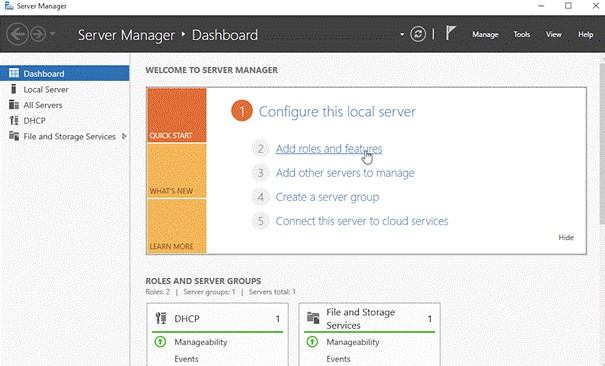
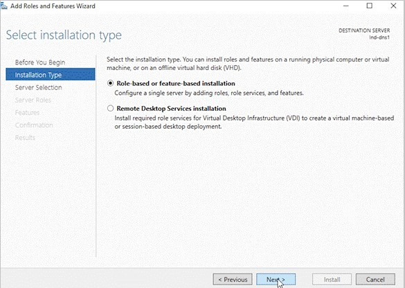
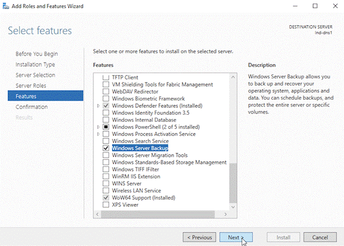
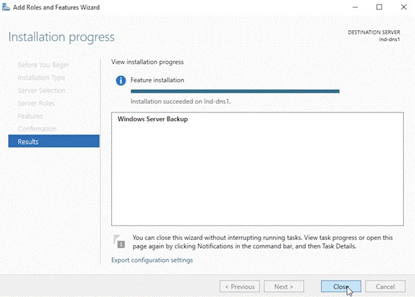

# Troubleshoot System State Backup

This article describes solutions for issues that you might encounter while using System State Backup.

## Basic troubleshooting
We recommend you perform the below validation, before you start troubleshooting System State backup:

- [Ensure Microsoft Azure Recovery Services (MARS) Agent is up to date](https://go.microsoft.com/fwlink/?linkid=229525&clcid=0x409)
- [Ensure there is network connectivity between MARS agent and Azure](https://aka.ms/AB-A4dp50)
- Ensure Microsoft Azure Recovery Services is running (in Service console). If required restart and retry the operation
- [Ensure 5-10% free volume space is available on scratch folder location](https://aka.ms/AB-AA4dwtt)
- [Check if another process or antivirus software is interfering with Azure Backup](https://aka.ms/AB-AA4dwtk)
- [Scheduled backup fails, but manual backup works](https://aka.ms/ScheduledBackupFailManualWorks)
- Ensure your OS has the latest updates
- [Ensure unsupported drives and files with unsupported attributes are excluded from backup](backup-support-matrix-mars-agent.md#supported-drives-or-volumes-for-backup)
- Ensure **System Clock** on the protected system is configured to correct time zone <br>
- [Ensure that the server has at least .Net Framework version 4.5.2 and higher](https://www.microsoft.com/download/details.aspx?id=30653)<br>
- If you are trying to **reregister your server** to a vault, then: <br>
  - Ensure the agent is uninstalled on the server and it is deleted from portal <br>
  - Use the same passphrase that was initially used for registering the server <br>
- In case of offline backup ensure that Azure PowerShell version 3.7.0 is installed on both source and copy computer before you begin offline backup operation
- [Consideration when Backup agent is running on an Azure virtual machine](https://aka.ms/AB-AA4dwtr)

### Limitation
- Recovering to different hardware using System State recovery is not recommended by Microsoft
- System State backup currently supports "on premise" Windows servers, this functionality is not available for Azure VMs.

## Pre-requisite

Before we troubleshoot System State Backup with Azure Backup, ensure you preform the below pre-requisites check.  

### Verify Windows Server Backup is installed

Ensure Windows Server Backup is installed and enabled in the server. To check the installation status, run the below PowerShell command:

 ```
 PS C:\> Get-WindowsFeature Windows-Server-Backup
 ```
If the output displays the **Install State** as **available**, then it means Windows Server backup feature is available for the installation but not installed on the server. However if Windows Server Backup is not installed, then use one of the below methods to install it.

**Method 1: Install Windows Server Backup using PowerShell**

To install Windows Server Backup using PowerShell, run the below command:

  ```
  PS C:\> Install-WindowsFeature -Name Windows-Server-Backup
  ```

**Method 2: Install Windows Server Backup using Server Manager**

To install Windows Server Backup using Server Manager, perform the below:

1. In the **Sever Manger** and click **Add roles and features**. The **Add roles and features wizard** appears.

    

2. Select **Installation Type** and click **Next**.

    

3. Select a server from the server pool and click **Next**. In the Server Role, leave the default selection and click **Next**.
4. Select **Windows Server Backup** in **Features** tab and click **Next**.

    

5. In the **Confirmation** tab, click **Install** to start the installation process.
6. In the **Results** tab, it will display the Windows Server Backup feature is successfully installed on your Windows Server.

    


### System Volume information permission

Ensure that the Local SYSTEM has full control on **System Volume Information** folder located in the volume where windows is installed. Usually this is **C:\System Volume Information**. Windows Server backup can fail if the above permissions are not set correctly

### Dependent services

Ensure the below services are in running state:

**Service Name** | **Startup Type**
--- | ---
Remote Procedure Call(RPC) | Automatic
COM+ Event System(EventSystem) | Automatic
System Event Notification Service(SENS) | Automatic
Volume Shadow Copy(VSS) | Manual
Microsoft Software Shadow Copy Provider(SWPRV) | Manual

### Validate Windows Server Backup status

To validate Windows Server Backup status, perform the below:

  * Ensure WSB PowerShell is running

    -	Run `Get-WBJob` from an elevated PowerShell and make sure it does not return the following error:

    > [!WARNING]
    > Get-WBJob: The term 'Get-WBJob' is not recognized as the name of a cmdlet, function, script file, or operable program. Check the spelling of the name, or if a path was included, verify that the path is correct and try again.

    -	If it fails with this error then re-install the Windows Server Backup feature on the server machine as mentioned in the step 1 prerequisites.

  * Ensure WSB backup is working properly, by running the below command from elevated command prompt:

      `wbadmin start systemstatebackup -backuptarget:X: -quiet`

      > [!NOTE]
      >Replace X with the drive letter of the volume where you want to store the system state back up image.

    - Periodically check the status of the job by running `Get-WBJob` command from elevated PowerShell        
    - After backup job completes check the final status of the job by running `Get-WBJob -Previous 1` command

If the job fails, it indicates a WSB issue which would result in MARS agent System State Backups failure.

## Common Errors

### VSS Writer timeout error

| Symptom | Cause | Resolution
| -- | -- | --
| -	MARS agent fails with error message: “WSB job failed with VSS errors. Check VSS event logs to resolve the failure”<br/><br/> -	Following error log is present in VSS Application event logs: “A VSS writer has rejected an event with error 0x800423f2, the writer's timeout expired between the Freeze and Thaw events.”| VSS writer is unable to complete in time due to lack of CPU and memory resources on the machine <br/><br/> Another backup software is already using the VSS writer, as a result snapshot operation could not complete for this backup | Wait for CPU/memory to be freed up on system or abort processes taking too much memory/CPU and try the operation again <br/><br/>  Wait for the ongoing backup to complete and try the operation at a later point when no backups are running on the machine


### Insufficient disk space to grow shadow copies

| Symptom | Resolution
| -- | --
| -	MARS agent fails with error message: Backup failed as the shadow copy volume could not grow due to insufficient disk space on volumes containing system files <br/><br/> -	Following error/warning log is present in volsnap system event logs: “There was insufficient disk space on volume C: to grow the shadow copy storage for shadow copies of C: due to this failure all shadow copies of volume C: are at risk of being deleted” | - Free up space in the highlighted volume in the event log so that there is sufficient space for shadow copies to grow while backup is in progress <br/><br/> -  While configuring shadow copy space we can restrict the amount of space used for shadow copy, for more information see this [article](https://docs.microsoft.com/previous-versions/windows/it-pro/windows-server-2012-r2-and-2012/cc788050(v=ws.11)#syntax)


### EFI partition locked

| Symptom | Resolution
| -- | --
| MARS agent fails with error message: “System state back up failed as the EFI system partition is locked. This can be due to system partition access by a third-party security or back up software” | -	If the issue is due to a third-party security software, then you need to contact the Anti Virus vendor so that they can allow MARS agent <br/><br/> -	If a third-party backup software is running, then wait for it to finish and then retry back up


## Next steps

- For more information about Windows system state in Resource Manager deployment, see [Back up Windows Server System State](backup-azure-system-state.md)
