# Back up Windows system state in Resource Manager deployment
This article explains how to back up your Windows Server system state to Azure. It's a tutorial intended to walk you through the basics.

If you want to know more about Azure Backup, read this [overview](backup-overview.md).

If you don't have an Azure subscription, create a [free account](https://azure.microsoft.com/free/) that lets you access any Azure service.

## Create a recovery services vault
To back up your Windows Server System State, you need to create a Recovery Services vault in the region where you want to store the data. You also need to determine how you want your storage replicated.

### To create a Recovery Services vault
1. If you haven't already done so, sign in to the [Azure Portal](https://portal.azure.com/) using your Azure subscription.
2. On the Hub menu, click **All services** and in the list of resources, type **Recovery Services** and click **Recovery Services vaults**.

    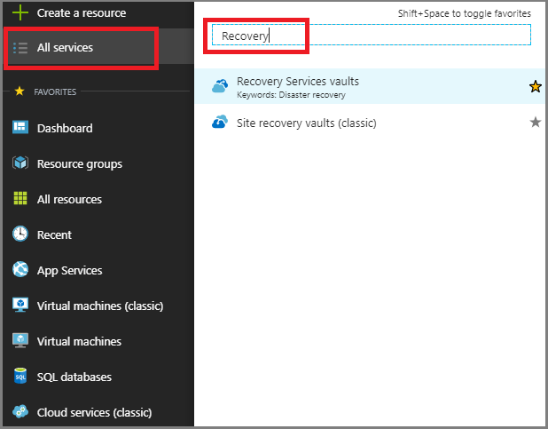  

    If there are recovery services vaults in the subscription, the vaults are listed.
3. On the **Recovery Services vaults** menu, click **Add**.

    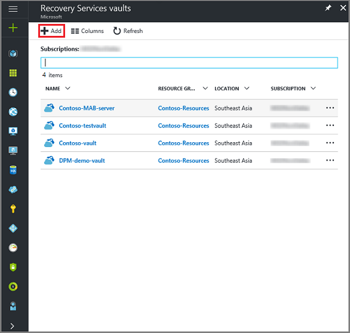

    The Recovery Services vault blade opens, prompting you to provide a **Name**, **Subscription**, **Resource group**, and **Location**.

    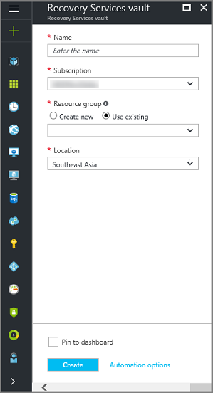

4. For **Name**, enter a friendly name to identify the vault. The name needs to be unique for the Azure subscription. Type a name that contains between 2 and 50 characters. It must start with a letter, and can contain only letters, numbers, and hyphens.

5. In the **Subscription** section, use the drop-down menu to choose the Azure subscription. If you use only one subscription, that subscription appears and you can skip to the next step. If you are not sure which subscription to use, use the default (or suggested) subscription. There are multiple choices only if your organizational account is associated with multiple Azure subscriptions.

6. In the **Resource group** section:

    * select **Create new** if you want to create a Resource group.
    Or
    * select **Use existing** and click the drop-down menu to see the available list of Resource groups.

   For complete information on Resource groups, see the [Azure Resource Manager overview](../azure-resource-manager/resource-group-overview.md).

7. Click **Location** to select the geographic region for the vault. This choice determines the geographic region where your backup data is sent.

8. At the bottom of the Recovery Services vault blade, click **Create**.

    It can take several minutes for the Recovery Services vault to be created. Monitor the status notifications in the upper right-hand area of the portal. Once your vault is created, it appears in the list of Recovery Services vaults. If after several minutes you don't see your vault, click **Refresh**.

    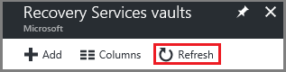 

    Once you see your vault in the list of Recovery Services vaults, you are ready to set the storage redundancy.

### Set storage redundancy for the vault
When you create a Recovery Services vault, make sure storage redundancy is configured the way you want.

1. From the **Recovery Services vaults** blade, click the new vault.

    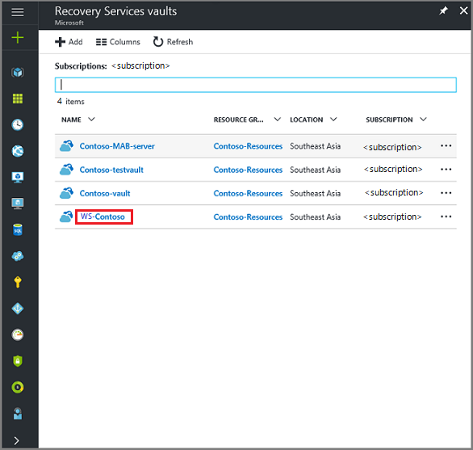

    When you select the vault, the **Recovery Services vault** blade narrows, and the Settings blade (*which has the name of the vault at the top*) and the vault details blade open.

    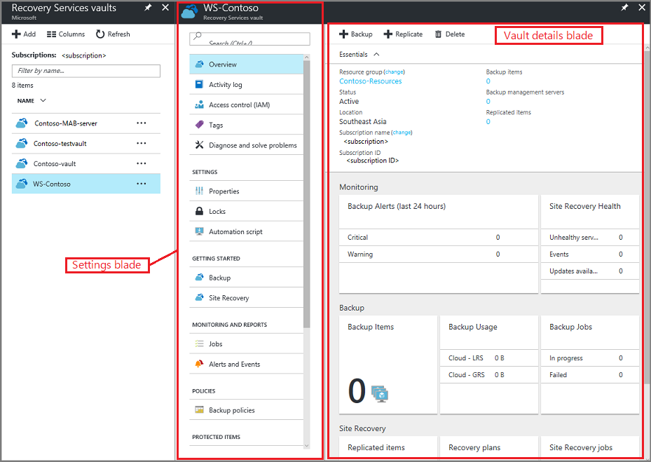
2. In the new vault's Settings blade, use the vertical slide to scroll down to the Manage section, and click **Backup Infrastructure**.
    The Backup Infrastructure blade opens.
3. In the Backup Infrastructure blade, click **Backup Configuration** to open the **Backup Configuration** blade.

    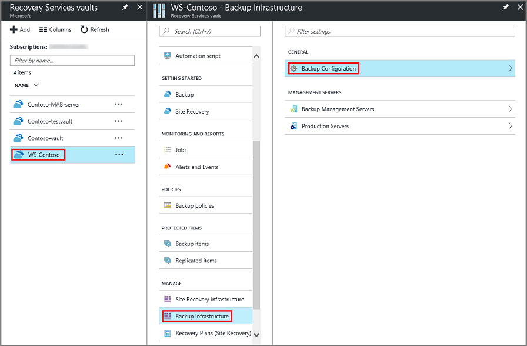
4. Choose the appropriate storage replication option for your vault.

    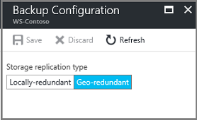

    By default, your vault has geo-redundant storage. If you use Azure as a primary backup storage endpoint, continue to use **Geo-redundant**. If you don't use Azure as a primary backup storage endpoint, then choose **Locally-redundant**, which reduces the Azure storage costs. Read more about [geo-redundant](../storage/common/storage-redundancy-grs.md) and [locally redundant](../storage/common/storage-redundancy-lrs.md) storage options in this [Storage redundancy overview](../storage/common/storage-redundancy.md).

Now that you've created a vault, configure it for backing up Windows System State.

## Configure the vault
1. On the Recovery Services vault blade (for the vault you just created), in the Getting Started section, click **Backup**, then on the **Getting Started with Backup** blade, select **Backup goal**.

    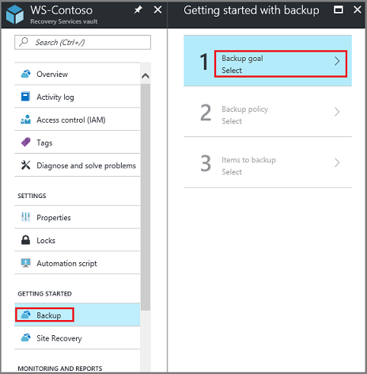

    The **Backup Goal** blade opens.

    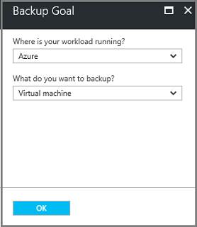

2. From the **Where is your workload running?** drop-down menu, select **On-premises**.

    You choose **On-premises** because your Windows Server or Windows computer is a physical machine that is not in Azure.

3. From the **What do you want to backup?** menu, select **System State**, and click **OK**.

    

    After clicking OK, a checkmark appears next to **Backup goal**, and the **Prepare infrastructure** blade opens.

    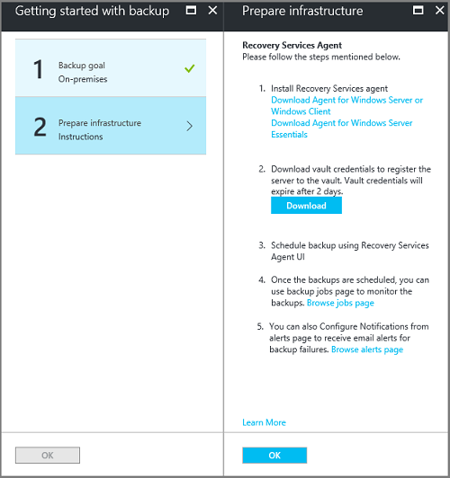

4. On the **Prepare infrastructure** blade, click **Download Agent for Windows Server or Windows Client**.

    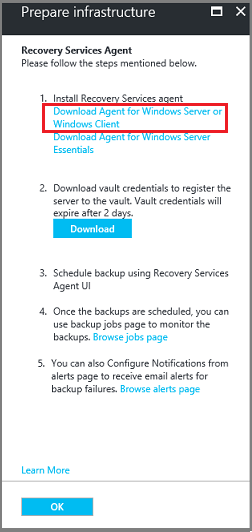

    If you are using Windows Server Essential, then choose to download the agent for Windows Server Essential. A pop-up menu prompts you to run or save MARSAgentInstaller.exe.

    

5. In the download pop-up menu, click **Save**.

    By default, the **MARSagentinstaller.exe** file is saved to your Downloads folder. When the installer completes, you will see a pop-up asking if you want to run the installer, or open the folder.

    

    You don't need to install the agent yet. You can install the agent after you have downloaded the vault credentials.

6. On the **Prepare infrastructure** blade, click **Download**.

    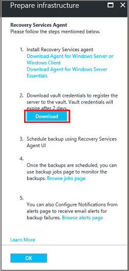

    The vault credentials download to your Downloads folder. After the vault credentials finish downloading, you see a pop-up asking if you want to open or save the credentials. Click **Save**. If you accidentally click **Open**, let the dialog that attempts to open the vault credentials, fail. You cannot open the vault credentials. Proceed to the next step. The vault credentials are in the Downloads folder.   

    
   > [!NOTE]
   > The vault credentials must be saved only to a location that is local to the Windows Server on which you intend to use the agent.
   >

[!INCLUDE [backup-upgrade-mars-agent.md](../../includes/backup-upgrade-mars-agent.md)]

## Install and register the agent

> [!NOTE]
> Enabling backup through the Azure portal is not available, yet. Use the Microsoft Azure Recovery Services Agent to back up Windows Server System State.
>

1. Locate and double-click the **MARSagentinstaller.exe** from the Downloads folder (or other saved location).

    The installer provides a series of messages as it extracts, installs, and registers the Recovery Services agent.

    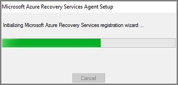

2. Complete the Microsoft Azure Recovery Services Agent Setup Wizard. To complete the wizard, you need to:

   * Choose a location for the installation and cache folder.
   * Provide your proxy server info if you use a proxy server to connect to the internet.
   * Provide your user name and password details if you use an authenticated proxy.
   * Provide the downloaded vault credentials
   * Save the encryption passphrase in a secure location.

     > [!NOTE]
     > If you lose or forget the passphrase, Microsoft cannot help recover the backup data. Save the file in a secure location. It is required to restore a backup.
     >
     >

The agent is now installed and your machine is registered to the vault. You're ready to configure and schedule your backup.

## Back up Windows Server System State
The initial backup includes two tasks:

* Schedule the backup
* Back up  System State for the first time

To complete the initial backup, use the Microsoft Azure Recovery Services agent.

> [!NOTE]
> You can back up System State on Windows Server 2008 R2 through Windows Server 2016. System State back up is not supported on client SKUs. System State is not shown as an option for Windows clients, or Windows Server 2008 SP2 machines.
>
>

### To schedule the backup job

1. Open the Microsoft Azure Recovery Services agent. You can find it by searching your machine for **Microsoft Azure Backup**.

    

2. In the Recovery Services agent, click **Schedule Backup**.

    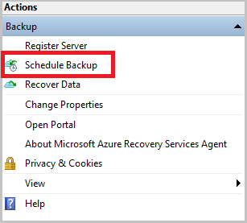

3. On the Getting started page of the Schedule Backup Wizard, click **Next**.

4. On the Select Items to Backup page, click **Add Items**.

5. Select **System State** and then click **OK**.

6. Click **Next**.

7. Select the required Backup frequency and the retention policy for your System State backups in the subsequent pages.

8. On the Confirmation page, review the information, and then click **Finish**.

9. After the wizard finishes creating the backup schedule, click **Close**.

### To back up Windows Server System State for the first time

1. Make sure there are no pending updates for Windows Server that require a reboot.

2. In the Recovery Services agent, click **Back Up Now** to complete the initial seeding over the network.

    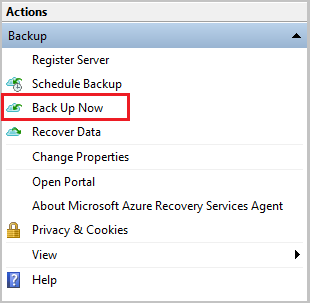

3. Select **System State** on the **Select Backup Item** screen that appears and click **Next**.

4. On the Confirmation page, review the settings that the Back Up Now Wizard will use to back up the machine. Then click **Back Up**.

4. Click **Close** to close the wizard. If you close the wizard before the backup process finishes, the wizard continues to run in the background.

After the initial backup is completed, the **Job completed** status appears in the Backup console.

  

## Questions?
If you have questions, or if there is any feature that you would like to see included, [send us feedback](https://aka.ms/azurebackup_feedback).

## Next steps
* Get more details about [backing up Windows machines](backup-configure-vault.md).
* Now that you've backed up your Windows Server System State, you can [manage your vaults and servers](backup-azure-manage-windows-server.md).
* If you need to restore a backup, use this article to [restore files to a Windows machine](backup-azure-restore-windows-server.md).
