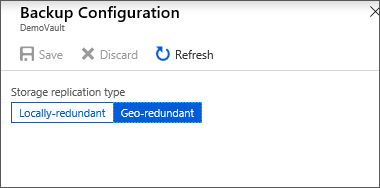

# Back up Windows system state to Azure

This article describes how to back up your Windows Server system state to Azure. It's intended to walk you through the basics.

For more information about Azure Backup, see the [overview article](backup-overview.md). If you don't have an Azure subscription, create a [free account](https://azure.microsoft.com/free/) that lets you access any Azure service.

[!INCLUDE [How to create a Recovery Services vault](../../includes/backup-create-rs-vault.md)]

## Set storage redundancy for the vault

When you create a Recovery Services vault, ensure that you configure the storage redundancy as per the organization requirements.

To set the storage redundancy for the vault, follow these steps:

1. From the **Recovery Services vaults** pane, select the new vault.

    

    When you select the vault, the **Recovery Services vault** pane narrows, and the Settings pane (*which has the name of the vault at the top*) and the vault details pane open.

    
2. On the new vault's **Settings** pane, use the vertical slide to scroll down to the Manage section, and select **Backup Infrastructure**.

3. On the **Backup Infrastructure** pane, select **Backup Configuration** to open the **Backup Configuration** pane.

    

4. Choose the appropriate storage replication option for your vault.

    

    By default, your vault has geo-redundant storage. If you use Azure as a primary backup storage endpoint, continue to use **Geo-redundant**. If you don't use Azure as a primary backup storage endpoint, then choose **Locally-redundant**, which reduces the Azure storage costs. Read more about [geo-redundant](../storage/common/storage-redundancy.md#geo-redundant-storage), [locally redundant](../storage/common/storage-redundancy.md#locally-redundant-storage) and [zone-redundant](../storage/common/storage-redundancy.md#zone-redundant-storage) storage options in this [Storage redundancy overview](../storage/common/storage-redundancy.md).

Now that you've created a vault, configure it for backing up Windows System State.

## Configure the vault

To configure the vault, follow these steps:

1. On the Recovery Services vault pane (for the vault you just created), in the Getting Started section, select **Backup**, then on the **Getting Started with Backup** pane, select **Backup goal**.

    

    The **Backup Goal** pane opens.

    

2. From the **Where is your workload running?** drop-down menu, select **On-premises**.

    You choose **On-premises** because your Windows Server or Windows computer is a physical machine that isn't in Azure.

3. From the **What do you want to back up?** menu, select **System State**, and select **OK**.

    

    After you select **OK**, a checkmark appears next to **Backup goal**, and the **Prepare infrastructure** pane opens.

    

4. On the **Prepare infrastructure** pane, select **Download Agent for Windows Server or Windows Client**.

    

    If you're using Windows Server Essential, then choose to download the agent for Windows Server Essential. A pop-up menu prompts you to run or save MARSAgentInstaller.exe.

    

5. In the download pop-up menu, select **Save**.

    By default, the **MARSagentinstaller.exe** file is saved to your Downloads folder. When the installer completes, you'll see a pop-up asking if you want to run the installer, or open the folder.

    

    You don't need to install the agent yet. You can install the agent after you've downloaded the vault credentials.

6. On the **Prepare infrastructure** pane, select **Download**.

    

    The vault credentials download to your **Downloads** folder. After the vault credentials finish downloading, you'll see a pop-up asking if you want to open or save the credentials. Select **Save**. If you accidentally select **Open**, let the dialog that attempts to open the vault credentials, fail. You won't be able to open the vault credentials. Continue to the next step. The vault credentials are in the **Downloads** folder.

    

   > [!NOTE]
   > The vault credentials must be saved only to a location that's local to the Windows Server on which you intend to use the agent.
   >

[!INCLUDE [backup-upgrade-mars-agent.md](../../includes/backup-upgrade-mars-agent.md)]

## Install and register the agent

To install and register the agent, follow these steps:

1. Locate and double-click the **MARSagentinstaller.exe** from the Downloads folder (or other saved location).

    The installer provides a series of messages as it extracts, installs, and registers the Recovery Services agent.

    

2. Complete the Microsoft Azure Recovery Services Agent Setup Wizard. To complete the wizard, you need to:

   * Choose a location for the installation and cache folder.
   * Provide your proxy server info if you use a proxy server to connect to the internet.
   * Provide your user name and password details if you use an authenticated proxy.
   * Provide the downloaded vault credentials
   * Save the encryption passphrase in a secure location.

     > [!NOTE]
     > If you lose or forget the passphrase, Microsoft can't help recover the backup data. Save the file in a secure location. It's required to restore a backup.
     >
     >

The agent is now installed and your machine is registered to the vault. You're ready to configure and schedule your backup.

> [!NOTE]
> Enabling backup through the Azure portal isn't available. Use the Microsoft Azure Recovery Services Agent to back up Windows Server System State.
>

## Back up Windows Server System State

The initial backup includes two tasks:

* Schedule the backup
* Back up  System State for the first time

To complete the initial backup, use the Microsoft Azure Recovery Services agent.

> [!NOTE]
> You can back up System State on Windows Server 2008 R2 through Windows Server 2016. System State back up isn't supported on client SKUs. System State isn't shown as an option for Windows clients, or Windows Server 2008 SP2 machines.
>
>

### Schedule the backup job

To schedule the backup job, follow these steps:

1. Open the Microsoft Azure Recovery Services agent. You can find it by searching your machine for **Microsoft Azure Backup**.

    

2. On the Recovery Services agent, select **Schedule Backup**.

    

3. On the **Getting started** page of the Schedule Backup Wizard, select **Next**.

4. On the **Select Items to Backup** page, select **Add Items**.

5. Select **System State** and then select **OK**.

6. Select **Next**.

7. Select the required Backup frequency and the retention policy for your System State backups in the subsequent pages.

8. On the Confirmation page, review the information, and then select **Finish**.

9. After the wizard finishes creating the backup schedule, select **Close**.

### Back up Windows Server System State for the first time

To back up Windows Server System State for the first time, follow these steps:

1. Ensure that there are no pending updates for Windows Server that require a reboot.

2. On the Recovery Services agent, select **Back Up Now** to complete the initial seeding over the network.

    

3. Select **System State** on the **Select Backup Item** screen that appears and select **Next**.

4. On the Confirmation page, review the settings that the Back Up Now Wizard will use to back up the machine. Then select **Back Up**.

5. Select **Close** to close the wizard. If you close the wizard before the backup process finishes, the wizard continues to run in the background.
    > [!NOTE]
    > The MARS Agent triggers `SFC /verifyonly` as part of the prechecks before every system state backup. This is to ensure that files backed up as part of System State have the correct versions corresponding to the Windows version. Learn more about System File Checker (SFC) in [this article](/windows-server/administration/windows-commands/sfc).
    >

After the initial backup is completed, the **Job completed** status appears in the Backup console.

  

## Next steps

* Get more details about [backing up Windows machines](backup-windows-with-mars-agent.md).
* Now that you've backed up your Windows Server System State, you can [manage your vaults and servers](backup-azure-manage-windows-server.md).
* If you need to restore a backup, use this article to [restore files to a Windows machine](backup-azure-restore-windows-server.md).
