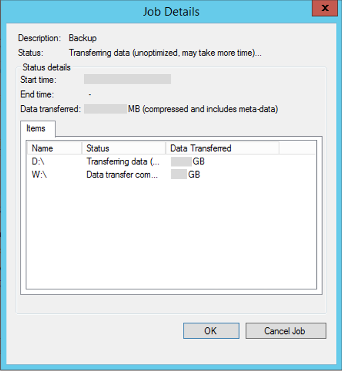

# Troubleshoot slow backup of files and folders in Azure Backup

This article provides troubleshooting guidance to help you diagnose the cause of slow backup performance for files and folders when you're using Azure Backup. When you use the Azure Backup agent to back up files, the backup process might take longer than expected. This delay might be caused by one or more of the following:

* [There are performance bottlenecks on the computer that's being backed up.](#cause1)
* [Another process or antivirus software is interfering with the Azure Backup process.](#cause2)
* [The Backup agent is running on an Azure virtual machine (VM).](#cause3)  
* [You're backing up a large number (millions) of files.](#cause4)

Before you start troubleshooting issues, we recommend that you download and install the [latest Azure Backup agent](https://aka.ms/azurebackup_agent). We make frequent
updates to the Backup agent to fix various issues, add features, and improve performance.

We also strongly recommend that you review the [Azure Backup service FAQ](backup-azure-backup-faq.yml) to make sure you're not experiencing any of the common configuration issues.

[!INCLUDE [support-disclaimer](../../includes/support-disclaimer.md)]

## Cause: Backup job running in unoptimized mode

* The MARS agent can run the backup job in **optimized mode** using USN (update sequence number) change journal or **unoptimized mode** by checking for changes in directories or files by scanning the entire volume.
* Unoptimized mode is slow because the agent has to scan each and every file on the volume and compare against the metadata to determine the changed files.
* To verify this, open **Job Details** from the MARS agent console  and check the status to see if it says **Transferring data (unoptimized, may take more time)** as shown below:

    

* The following conditions can cause the backup job to run in unoptimized mode:
  * First backup (also known as Initial Replication) will always run in unoptimized mode
  * If the previous backup job fails, then the next scheduled backup job will run as unoptimized.

## Cause: Performance bottlenecks on the computer

Bottlenecks on the computer that's being backed up can cause delays. For example, the computer's ability to read or write to disk, or available bandwidth to send data over the network, can cause bottlenecks.

Windows provides a built-in tool called [Performance Monitor](https://techcommunity.microsoft.com/t5/ask-the-performance-team/windows-performance-monitor-overview/ba-p/375481) (Perfmon) to detect these bottlenecks.

Here are some performance counters and ranges that can be helpful in diagnosing bottlenecks for optimal backups.

| Counter | Status |
| --- | --- |
| Logical Disk(Physical Disk)--%idle |<li> 100% idle to 50% idle = Healthy <li> 49% idle to 20% idle = Warning or Monitor <li> 19% idle to 0% idle = Critical or Out of Spec |
| Logical Disk(Physical Disk)--%Avg. Disk Sec Read or Write |<li> 0.001 ms to 0.015 ms  = Healthy <li> 0.015 ms to 0.025 ms = Warning or Monitor <li> 0.026 ms or longer = Critical or Out of Spec |
| Logical Disk(Physical Disk)--Current Disk Queue Length (for all instances) |80 requests for more than 6 minutes |
| Memory--Pool Non Paged Bytes |<li> Less than 60% of pool consumed = Healthy <li> 61% to 80% of pool consumed = Warning or Monitor <li> Greater than 80% pool consumed = Critical or Out of Spec |
| Memory--Pool Paged Bytes |<li> Less than 60% of pool consumed = Healthy <li> 61% to 80% of pool consumed = Warning or Monitor <li> Greater than 80% pool consumed = Critical or Out of Spec |
| Memory--Available Megabytes |<li> 50% of free memory available or more = Healthy <li> 25% of free memory available = Monitor <li>10% of free memory available = Warning <li> Less than 100 MB or 5% of free memory available = Critical or Out of Spec |
| Processor--\%Processor Time (all instances) |<li> Less than 60% consumed = Healthy <li> 61% to 90% consumed = Monitor or Caution <li> 91% to 100% consumed = Critical |

> [!NOTE]
> If you determine that the infrastructure is the culprit, we recommend that you defragment the disks regularly for better performance.
>
>

## Cause: Another process or antivirus software interfering with Azure Backup

We've seen several instances where other processes in the Windows system have negatively affected performance of the Azure Backup agent process. For example, if you use both the Azure Backup agent and another program to back up data, or if antivirus software is running and has a lock on files to be backed up, the multiple locks on files might cause contention. In this situation, the backup might fail, or the job might take longer than expected.

The best recommendation in this scenario is to turn off the other backup program to see whether the backup time for the Azure Backup agent changes. Usually, making sure that multiple backup jobs are not running at the same time is sufficient to prevent them from affecting each other.

[!INCLUDE [antivirus-scan-exclusion-rules](../../includes/backup-azure-antivirus-scan-exclusion-rules.md)]

## Cause: Backup agent running on an Azure virtual machine

If you're running the Backup agent on a VM, performance will be slower than when you run it on a physical machine. This is expected due to IOPS limitations.  However, you can optimize the performance by switching the data drives that are being backed up to Azure Premium Storage. We're working on fixing this issue, and the fix will be available in a future release.

## Cause: Backing up a large number (millions) of files

Moving a large volume of data will take longer than moving a smaller volume of data. In some cases, backup time is related to not only the size of the data, but also the number of files or folders. This is especially true when millions of small files (a few bytes to a few kilobytes) are being backed up.

This behavior occurs because while you're backing up the data and moving it to Azure, Azure is simultaneously cataloging your files. In some rare scenarios, the catalog operation might take longer than expected.

The following indicators can help you understand the bottleneck and accordingly work on the next steps:

* **UI is showing progress for the data transfer**. The data is still being transferred. The network bandwidth or the size of data might be causing delays.
* **UI isn't showing progress for the data transfer**. Open the logs located at C:\Program Files\Microsoft Azure Recovery Services Agent\Temp, and then check for the FileProvider::EndData entry in the logs. This entry signifies that the data transfer finished and the catalog operation is happening. Don't cancel the backup jobs. Instead, wait a little longer for the catalog operation to finish. If the problem persists, contact [Azure support](https://portal.azure.com/#create/Microsoft.Support).

If you're trying to back up large disks, then it's recommended to use [Azure Data Box](./offline-backup-azure-data-box.md) for the first backup (Initial Replication).  If you can't use Data Box, then any transient network issues happening in your environment during long data transfers over the network can cause backup failures.  To safeguard against these failures, you can add a few folders to your initial backup and keep incrementally adding more folders until all the folders are successfully backed up to Azure.  Subsequent incremental backups will be relatively faster.

## Next steps

* [Common questions about backing up files and folders](backup-azure-file-folder-backup-faq.yml)
