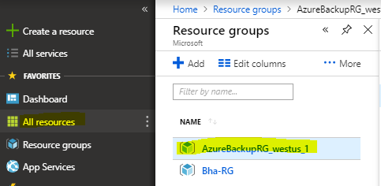
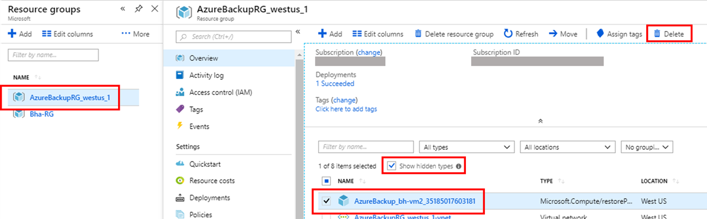

# Troubleshoot Azure Backup failure: Issues with the agent or extension

This article provides troubleshooting steps that can help you resolve Azure Backup errors related to communication with the VM agent and extension.

[!INCLUDE [support-disclaimer](../../includes/support-disclaimer.md)]

## UserErrorGuestAgentStatusUnavailable - VM agent unable to communicate with Azure Backup

**Error code**: UserErrorGuestAgentStatusUnavailable  
**Error message**: VM Agent unable to communicate with Azure Backup 

The Azure VM agent might be stopped, outdated, in an inconsistent state, or not installed and prevent Azure Backup service to trigger snapshots.

- **Open Azure Portal > VM > Settings > Properties blade** > ensure VM **Status** is **Running** and **Agent status** is **Ready**. If the VM agent is stopped or is in an inconsistent state, restart the agent 
  - For Windows VMs follow these [steps](#the-agent-installed-in-the-vm-but-unresponsive-for-windows-vms) to restart the Guest Agent. 
  - For Linux VMs follow these [steps](#the-agent-installed-in-the-vm-is-out-of-date-for-linux-vms) to restart the Guest Agent.
- **Open  Azure Portal > VM > Settings > Extensions** > Ensure all extensions are in **provisioning succeeded** state. If not, follow these [steps](https://docs.microsoft.com/azure/backup/backup-azure-troubleshoot-vm-backup-fails-snapshot-timeout#usererrorvmprovisioningstatefailed---the-vm-is-in-failed-provisioning-state) to resolve the issue.

## GuestAgentSnapshotTaskStatusError - Could not communicate with the VM agent for snapshot status

**Error code**: GuestAgentSnapshotTaskStatusError 
**Error message**: Could not communicate with the VM agent for snapshot status  

After you register and schedule a VM for the Azure Backup service, Backup initiates the job by communicating with the VM backup extension to take a point-in-time snapshot. Any of the following conditions might prevent the snapshot from being triggered. If the snapshot isn't triggered, a backup failure might occur. Complete the following troubleshooting steps in the order listed, and then retry your operation:  

**Cause 1: [The agent is installed in the VM, but it's unresponsive (for Windows VMs)](#the-agent-installed-in-the-vm-but-unresponsive-for-windows-vms)**  

**Cause 2: [The agent installed in the VM is out of date (for Linux VMs)](#the-agent-installed-in-the-vm-is-out-of-date-for-linux-vms)**

**Cause 3: [The snapshot status can't be retrieved, or a snapshot can't be taken](#the-snapshot-status-cannot-be-retrieved-or-a-snapshot-cannot-be-taken)**

**Cause 4: [The backup extension fails to update or load](#the-backup-extension-fails-to-update-or-load)**

**Cause 5: [VM-Agent configuration options are not set (for Linux VMs)](#vm-agent-configuration-options-are-not-set-for-linux-vms)**

## UserErrorVmProvisioningStateFailed - The VM is in failed provisioning state

**Error code**: UserErrorVmProvisioningStateFailed 
**Error message**: The VM is in failed provisioning state 

This error occurs when one of the extension failures puts the VM into provisioning failed state. **Open  Azure Portal > VM > Settings > Extensions > Extensions status** and check if all extensions are in **provisioning succeeded** state.

- If VMSnapshot extension is in a failed state, then right-click on the failed extension and remove it. Trigger an on-demand backup, this will reinstall the extensions and run the backup job.   
- If any other extension is in a failed state, then it can interfere with the backup. Ensure those extension issues are resolved and retry the backup operation.  

## UserErrorRpCollectionLimitReached - The Restore Point collection max limit has reached

**Error code**: UserErrorRpCollectionLimitReached  
**Error message**: The Restore Point collection max limit has reached.  

- This issue could happen if there is a lock on the recovery point resource group preventing automatic cleanup of recovery points.
- This issue can also happen if multiple backups are triggered per day. Currently we recommend only one backup per day, as the instant restore points are retained for 1-5 days per the configured snapshot retention and only 18 instant RPs can be associated with a VM at any given time.  

Recommended Action: 
To resolve this issue, remove the lock on the resource group of the VM, and retry the operation to trigger clean-up.
> [!NOTE]
> Backup service creates a separate resource group than the resource group of the VM to store restore point collection. Customers are advised not to lock the resource group created for use by the Backup service. The naming format of the resource group created by Backup service is: AzureBackupRG_`<Geo>`_`<number>` Eg: AzureBackupRG_northeurope_1

**Step 1: [Remove lock from the restore point resource group](#remove_lock_from_the_recovery_point_resource_group)**  
**Step 2: [Clean up restore point collection](#clean_up_restore_point_collection)** 

## UserErrorKeyvaultPermissionsNotConfigured - Backup doesn't have sufficient permissions to the key vault for backup of encrypted VMs

**Error code**: UserErrorKeyvaultPermissionsNotConfigured  
**Error message**: Backup doesn't have sufficient permissions to the key vault for backup of encrypted VMs.  

For a backup operation to succeed on encrypted VMs, it must have permissions to access the key vault. This can be done using the [Azure portal](https://docs.microsoft.com/azure/backup/backup-azure-vms-encryption) or through [PowerShell](https://docs.microsoft.com/azure/backup/backup-azure-vms-automation#enable-protection).

## ExtensionSnapshotFailedNoNetwork - Snapshot operation failed due to no network connectivity on the virtual machine

**Error code**: ExtensionSnapshotFailedNoNetwork 
**Error message**: Snapshot operation failed due to no network connectivity on the virtual machine 

After you register and schedule a VM for the Azure Backup service, Backup initiates the job by communicating with the VM backup extension to take a point-in-time snapshot. Any of the following conditions might prevent the snapshot from being triggered. If the snapshot isn't triggered, a backup failure might occur. Complete the following troubleshooting steps in the order listed, and then retry your operation:

**Cause 1: [The snapshot status can't be retrieved, or a snapshot can't be taken](#the-snapshot-status-cannot-be-retrieved-or-a-snapshot-cannot-be-taken)**  
**Cause 2: [The backup extension fails to update or load](#the-backup-extension-fails-to-update-or-load)**  

## ExtensionOperationFailedForManagedDisks - VMSnapshot extension operation failed

**Error code**: ExtensionOperationFailedForManagedDisks  
**Error message**: VMSnapshot extension operation failed 

After you register and schedule a VM for the Azure Backup service, Backup initiates the job by communicating with the VM backup extension to take a point-in-time snapshot. Any of the following conditions might prevent the snapshot from being triggered. If the snapshot isn't triggered, a backup failure might occur. Complete the following troubleshooting steps in the order listed, and then retry your operation:  
**Cause 1: [The snapshot status can't be retrieved, or a snapshot can't be taken](#the-snapshot-status-cannot-be-retrieved-or-a-snapshot-cannot-be-taken)**  
**Cause 2: [The backup extension fails to update or load](#the-backup-extension-fails-to-update-or-load)**  
**Cause 3: [The agent is installed in the VM, but it's unresponsive (for Windows VMs)](#the-agent-installed-in-the-vm-but-unresponsive-for-windows-vms)**  
**Cause 4: [The agent installed in the VM is out of date (for Linux VMs)](#the-agent-installed-in-the-vm-is-out-of-date-for-linux-vms)**

## BackUpOperationFailed / BackUpOperationFailedV2 - Backup fails, with an internal error

**Error code**: BackUpOperationFailed / BackUpOperationFailedV2  
**Error message**: Backup failed with an internal error - Please retry the operation in a few minutes  

After you register and schedule a VM for the Azure Backup service, Backup initiates the job by communicating with the VM backup extension to take a point-in-time snapshot. Any of the following conditions might prevent the snapshot from being triggered. If the snapshot isn't triggered, a backup failure might occur. Complete the following troubleshooting steps in the order listed, and then retry your operation:  
**Cause 1: [The agent installed in the VM, but it's unresponsive (for Windows VMs)](#the-agent-installed-in-the-vm-but-unresponsive-for-windows-vms)**  
**Cause 2: [The agent installed in the VM is out of date (for Linux VMs)](#the-agent-installed-in-the-vm-is-out-of-date-for-linux-vms)**  
**Cause 3: [The snapshot status can't be retrieved, or a snapshot can't be taken](#the-snapshot-status-cannot-be-retrieved-or-a-snapshot-cannot-be-taken)**  
**Cause 4: [The backup extension fails to update or load](#the-backup-extension-fails-to-update-or-load)**  
**Cause 5: Backup service doesn't have permission to delete the old restore points because of a resource group lock**  

## UserErrorUnsupportedDiskSize - The configured disk size(s) is currently not supported by Azure Backup.

**Error code**: UserErrorUnsupportedDiskSize  
**Error message**: The configured disk size(s) is currently not supported by Azure Backup.  

Your backup operation could fail when backing up a VM with a disk size greater than 32 TB. Also, backup of encrypted disks greater than 4 TB in size is not supported today. Ensure that the disk size(s) is less than or equal to the supported limit by splitting the disk(s).

## UserErrorBackupOperationInProgress - Unable to initiate backup as another backup operation is currently in progress

**Error code**: UserErrorBackupOperationInProgress  
**Error message**: Unable to initiate backup as another backup operation is currently in progress 

Your recent backup job failed because there is an existing backup job in progress. You can't start a new backup job until the current job finishes. Ensure the backup operation currently in progress is completed before triggering or scheduling another backup operations. To check the backup jobs status, perform the below steps:

1. Sign in to the Azure portal, click **All services**. Type Recovery Services and click **Recovery Services vaults**. The list of recovery services vaults appears.
2. From the list of recovery services vaults, select a vault in which the backup is configured.
3. On the vault dashboard menu, click **Backup Jobs** it displays all the backup jobs.
   - If a backup job is in progress, wait for it to complete or cancel the backup job.
     - To cancel the backup job, right-click on the backup job and click **Cancel** or use [PowerShell](https://docs.microsoft.com/powershell/module/az.recoveryservices/stop-azrecoveryservicesbackupjob?view=azps-1.4.0).
   - If you have reconfigured the backup in a different vault, then ensure there are no backup jobs running in the old vault. If it exists, then cancel the backup job.
     - To cancel the backup job, right-click on the backup job and click **Cancel** or use [PowerShell](https://docs.microsoft.com/powershell/module/az.recoveryservices/stop-azrecoveryservicesbackupjob?view=azps-1.4.0)
4. Retry backup operation.

If the scheduled backup operation is taking longer, conflicting with the next backup configuration, then review the [Best Practices](backup-azure-vms-introduction.md#best-practices), [Backup Performance](backup-azure-vms-introduction.md#backup-performance), and [Restore consideration](backup-azure-vms-introduction.md#backup-and-restore-considerations).

## Causes and solutions

### The agent is installed in the VM, but it's unresponsive (for Windows VMs)

#### Solution

The VM agent might have been corrupted, or the service might have been stopped. Reinstalling the VM agent helps get the latest version. It also helps restart communication with the service.

1. Determine whether the Windows Azure Guest Agent service is running in the VM services (services.msc). Try to restart the Windows Azure Guest Agent service and initiate the backup.
2. If the Windows Azure Guest Agent service isn't visible in services, in Control Panel, go to **Programs and Features** to determine whether the Windows Azure Guest Agent service is installed.
3. If the Windows Azure Guest Agent appears in **Programs and Features**, uninstall the Windows Azure Guest Agent.
4. Download and install the [latest version of the agent MSI](https://go.microsoft.com/fwlink/?LinkID=394789&clcid=0x409). You must have Administrator rights to complete the installation.
5. Verify that the Windows Azure Guest Agent services appear in services.
6. Run an on-demand backup:
   - In the portal, select **Backup Now**.

Also, verify that [Microsoft .NET 4.5 is installed](https://docs.microsoft.com/dotnet/framework/migration-guide/how-to-determine-which-versions-are-installed) in the VM. .NET 4.5 is required for the VM agent to communicate with the service.

### The agent installed in the VM is out of date (for Linux VMs)

#### Solution

Most agent-related or extension-related failures for Linux VMs are caused by issues that affect an outdated VM agent. To troubleshoot this issue, follow these general guidelines:

1. Follow the instructions for [updating the Linux VM agent](../virtual-machines/linux/update-agent.md).

   > [!NOTE]
   > We *strongly recommend* that you update the agent only through a distribution repository. We do not recommend downloading the agent code directly from GitHub and updating it. If the latest agent for your distribution is not available, contact distribution support for instructions on how to install it. To check for the most recent agent, go to the [Windows Azure Linux agent](https://github.com/Azure/WALinuxAgent/releases) page in the GitHub repository.

2. Ensure that the Azure agent is running on the VM by running the following command: `ps -e`

   If the process isn't running, restart it by using the following commands:

   - For Ubuntu: `service walinuxagent start`
   - For other distributions: `service waagent start`

3. [Configure the auto restart agent](https://github.com/Azure/WALinuxAgent/wiki/Known-Issues#mitigate_agent_crash).
4. Run a new test backup. If the failure persists, collect the following logs from the VM:

   - /var/lib/waagent/*.xml
   - /var/log/waagent.log
   - /var/log/azure/*

If you require verbose logging for waagent, follow these steps:

1. In the /etc/waagent.conf file, locate the following line: **Enable verbose logging (y|n)**
2. Change the **Logs.Verbose** value from *n* to *y*.
3. Save the change, and then restart waagent by completing the steps described earlier in this section.

### VM-Agent configuration options are not set (for Linux VMs)

A configuration file (/etc/waagent.conf) controls the actions of waagent. Configuration File Options **Extensions.Enable** and **Provisioning.Agent** should be set to **y** for Backup to work.
For full list of VM-Agent Configuration File Options, please refer <https://github.com/Azure/WALinuxAgent#configuration-file-options>

### The snapshot status can't be retrieved, or a snapshot can't be taken

The VM backup relies on issuing a snapshot command to the underlying storage account. Backup can fail either because it has no access to the storage account, or because the execution of the snapshot task is delayed.

#### Solution

The following conditions might cause the snapshot task to fail:

| Cause | Solution |
| --- | --- |
| The VM status is reported incorrectly because the VM is shut down in Remote Desktop Protocol (RDP). | If you shut down the VM in RDP, check the portal to determine whether the VM status is correct. If it’s not correct, shut down the VM in the portal by using the **Shutdown** option on the VM dashboard. |
| The VM can't get the host or fabric address from DHCP. | DHCP must be enabled inside the guest for the IaaS VM backup to work. If the VM can't get the host or fabric address from DHCP response 245, it can't download or run any extensions. If you need a static private IP, you should configure it through the **Azure portal** or **PowerShell** and make sure the DHCP option inside the VM is enabled. [Learn more](../virtual-network/virtual-networks-static-private-ip-arm-ps.md#change-the-allocation-method-for-a-private-ip-address-assigned-to-a-network-interface) about setting up a static IP address with PowerShell.

### The backup extension fails to update or load

If extensions can't load, backup fails because a snapshot can't be taken.

#### Solution

Uninstall the extension to force the VMSnapshot extension to reload. The next backup attempt reloads the extension.

To uninstall the extension:

1. In the [Azure portal](https://portal.azure.com/), go to the VM that is experiencing backup failure.
2. Select **Settings**.
3. Select **Extensions**.
4. Select **Snapshot Extension**.
5. Select **Uninstall**.

For Linux VM, If the VMSnapshot extension does not show in the Azure portal, [update the Azure Linux Agent](../virtual-machines/linux/update-agent.md), and then run the backup.

Completing these steps causes the extension to be reinstalled during the next backup.

### Remove lock from the recovery point resource group

1. Sign in to the [Azure portal](https://portal.azure.com/).
2. Go to **All Resources option**, select the restore point collection resource group in the following format AzureBackupRG_`<Geo>`_`<number>`.
3. In the **Settings** section, select **Locks** to display the locks.
4. To remove the lock, select the ellipsis and click **Delete**.

    

###  Clean up restore point collection

After removing the lock, the restore points have to be cleaned up.

If you delete the Resource Group of the VM, or the VM itself, the instant restore snapshots of managed disks remain active and expire according to the retention set. In order to delete the instant restore snapshots (if you don't need them anymore) that are stored in the Restore Point Collection, clean up the restore point collection according to the steps given below.

To clean up the restore points, follow any of the methods: 

- [Clean up restore point collection by running on-demand backup](#clean-up-restore-point-collection-by-running-on-demand-backup) 
- [Clean up restore point collection from Azure portal](#clean-up-restore-point-collection-from-azure-portal) 

#### Clean up restore point collection by running on-demand backup

After removing the lock, trigger an on-demand backup. This will ensure the restore points are automatically cleaned up. Expect this on-demand operation to fail the first time; however, it will ensure automatic cleanup instead of manual deletion of restore points. After cleanup your next scheduled backup should succeed.

> [!NOTE]
> Automatic cleanup will happen after few hours of triggering the on-demand backup. If your scheduled backup still fails, then try manually deleting the restore point collection using the steps listed [here](#clean-up-restore-point-collection-from-azure-portal).

#### Clean up restore point collection from Azure portal  

To manually clear the restore points collection, which is not cleared due to the lock on the resource group, try the following steps:

1. Sign in to the [Azure portal](https://portal.azure.com/).
2. On the **Hub** menu, click **All resources**, select the Resource group with the following format AzureBackupRG_`<Geo>`_`<number>` where your VM is located.

    

3. Click Resource group, the **Overview** blade is displayed.
4. Select **Show hidden types** option to display all the hidden resources. Select the restore point collections with the following format AzureBackupRG_`<VMName>`_`<number>`.

    

5. Click **Delete** to clean the restore point collection.
6. Retry the backup operation again.

> [!NOTE]
 >If the resource (RP Collection) has a large number of Restore Points, then deleting them from the portal may timeout and fail. This is a known CRP issue, where all restore points are not deleted in the stipulated time and the operation times out; however the delete operation usually succeeds after 2 or 3 retries.
