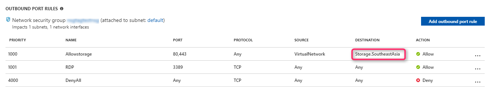

# Troubleshoot Azure Backup failure: Issues with the agent or extension

This article provides troubleshooting steps that can help you resolve Azure Backup errors related to communication with the VM agent and extension.

[!INCLUDE [support-disclaimer](../../includes/support-disclaimer.md)]

## VM agent unable to communicate with Azure Backup

Error message: "VM Agent unable to communicate with Azure Backup" 
Error code: "UserErrorGuestAgentStatusUnavailable"

After you register and schedule a VM for the Backup service, Backup initiates the job by communicating with the VM agent to take a point-in-time snapshot. Any of the following conditions might prevent the snapshot from being triggered. When a snapshot isn't triggered, the backup might fail. Complete the following troubleshooting steps in the order listed, and then retry your operation:

**Cause 1: [The VM doesn't have internet access](#the-vm-has-no-internet-access)**  
**Cause 2: [The agent is installed in the VM, but it's unresponsive (for Windows VMs)](#the-agent-installed-in-the-vm-but-unresponsive-for-windows-vms)**    
**Cause 3: [The agent installed in the VM is out of date (for Linux VMs)](#the-agent-installed-in-the-vm-is-out-of-date-for-linux-vms)**  
**Cause 4: [The snapshot status can't be retrieved, or a snapshot can't be taken](#the-snapshot-status-cannot-be-retrieved-or-a-snapshot-cannot-be-taken)**    
**Cause 5: [The backup extension fails to update or load](#the-backup-extension-fails-to-update-or-load)**  

## Snapshot operation fails because the virtual machine isn't connected to the network

Error message: "Snapshot operation failed due to no network connectivity on the virtual machine" 
Error code: "ExtensionSnapshotFailedNoNetwork"

After you register and schedule a VM for the Azure Backup service, Backup initiates the job by communicating with the VM backup extension to take a point-in-time snapshot. Any of the following conditions might prevent the snapshot from being triggered. If the snapshot isn't triggered, a backup failure might occur. Complete the following troubleshooting steps in the order listed, and then retry your operation:    
**Cause 1: [The VM doesn't have internet access](#the-vm-has-no-internet-access)**  
**Cause 2: [The snapshot status can't be retrieved, or a snapshot can't be taken](#the-snapshot-status-cannot-be-retrieved-or-a-snapshot-cannot-be-taken)**  
**Cause 3: [The backup extension fails to update or load](#the-backup-extension-fails-to-update-or-load)**  

## VMSnapshot extension operation fails

Error message: "VMSnapshot extension operation failed" 
Error code: "ExtentionOperationFailed"

After you register and schedule a VM for the Azure Backup service, Backup initiates the job by communicating with the VM backup extension to take a point-in-time snapshot. Any of the following conditions might prevent the snapshot from being triggered. If the snapshot isn't triggered, a backup failure might occur. Complete the following troubleshooting steps in the order listed, and then retry your operation:  
**Cause 1: [The snapshot status can't be retrieved, or a snapshot can't be taken](#the-snapshot-status-cannot-be-retrieved-or-a-snapshot-cannot-be-taken)**  
**Cause 2: [The backup extension fails to update or load](#the-backup-extension-fails-to-update-or-load)**  
**Cause 3: [The agent is installed in the VM, but it's unresponsive (for Windows VMs)](#the-agent-installed-in-the-vm-but-unresponsive-for-windows-vms)**  
**Cause 4: [The agent installed in the VM is out of date (for Linux VMs)](#the-agent-installed-in-the-vm-is-out-of-date-for-linux-vms)**

## Backup fails because the VM agent is unresponsive

Error message: "Could not communicate with the VM agent for snapshot status"  
Error code: "GuestAgentSnapshotTaskStatusError"

After you register and schedule a VM for the Azure Backup service, Backup initiates the job by communicating with the VM backup extension to take a point-in-time snapshot. Any of the following conditions might prevent the snapshot from being triggered. If the snapshot isn't triggered, a backup failure might occur. Complete the following troubleshooting steps in the order listed, and then retry your operation:  
**Cause 1: [The agent is installed in the VM, but it's unresponsive (for Windows VMs)](#the-agent-installed-in-the-vm-but-unresponsive-for-windows-vms)**  
**Cause 2: [The agent installed in the VM is out of date (for Linux VMs)](#the-agent-installed-in-the-vm-is-out-of-date-for-linux-vms)**  
**Cause 3: [The VM doesn't have internet access](#the-vm-has-no-internet-access)**  

## Backup fails, with an internal error

Error message: "Backup failed with an internal error - Please retry the operation in a few minutes"  
Error code: "BackUpOperationFailed"/ "BackUpOperationFailedV2"

After you register and schedule a VM for the Azure Backup service, Backup initiates the job by communicating with the VM backup extension to take a point-in-time snapshot. Any of the following conditions might prevent the snapshot from being triggered. If the snapshot isn't triggered, a backup failure might occur. Complete the following troubleshooting steps in the order listed, and then retry your operation:  
**Cause 1: [The VM doesn't have internet access](#the-vm-has-no-internet-access)**  
**Cause 2: [The agent installed in the VM, but it's unresponsive (for Windows VMs)](#the-agent-installed-in-the-vm-but-unresponsive-for-windows-vms)**  
**Cause 3: [The agent installed in the VM is out of date (for Linux VMs)](#the-agent-installed-in-the-vm-is-out-of-date-for-linux-vms)**  
**Cause 4: [The snapshot status can't be retrieved, or a snapshot can't be taken](#the-snapshot-status-cannot-be-retrieved-or-a-snapshot-cannot-be-taken)**  
**Cause 5: [The backup extension fails to update or load](#the-backup-extension-fails-to-update-or-load)**  
**Cause 6: [Backup service doesn't have permission to delete the old restore points because of a resource group lock](#backup-service-does-not-have-permission-to-delete-the-old-restore-points-due-to-resource-group-lock)**

## Causes and solutions

### The VM doesn't have internet access
Per the deployment requirement, the VM doesn't have internet access. Or, it might have restrictions that prevent access to the Azure infrastructure.

To function correctly, the Backup extension requires connectivity to Azure public IP addresses. The extension sends commands to an Azure storage endpoint (HTTPs URL) to manage the snapshots of the VM. If the extension doesn't have access to the public internet, backup eventually fails.

It is possible to deploy a proxy server to route the VM traffic.
##### Create a path for HTTPs traffic

1. If you have network restrictions in place (for example, a network security group), deploy an HTTPs proxy server to route the traffic.
2. To allow access to the internet from the HTTPs proxy server, add rules to the network security group, if you have one.

To learn how to set up an HTTPs proxy for VM backups, see [Prepare your environment to back up Azure virtual machines](backup-azure-arm-vms-prepare.md#establish-network-connectivity).

Either the backed up VM or the proxy server through which the traffic is routed requires access to Azure Public IP addresses

####  Solution
To resolve the issue, try one of the following methods:

##### Allow access to Azure storage that corresponds to the region

You can use [service tags](../virtual-network/security-overview.md#service-tags) to allow connections to storage of the specific region. Ensure that the rule that allows access to the storage account has higher priority than the rule that blocks internet access. 

To understand the step by step procedure to configure service tags, watch [this video](https://youtu.be/1EjLQtbKm1M).

> [!WARNING]
> Storage service tags are in preview. They are available only in specific regions. For a list of regions, see [Service tags for storage](../virtual-network/security-overview.md#service-tags).

If you use Azure Managed Disks, you might need an additional port opening (port 8443) on the firewalls.

Furthermore, if your subnet doesn't have a route for internet outbound traffic, you need to add a service endpoint with service tag "Microsoft.Storage" to your subnet. 

### The agent is installed in the VM, but it's unresponsive (for Windows VMs)

#### Solution
The VM agent might have been corrupted, or the service might have been stopped. Reinstalling the VM agent helps get the latest version. It also helps restart communication with the service.

1. Determine whether the Windows Guest Agent service is running in the VM services (services.msc). Try to restart the Windows Guest Agent service and initiate the backup.    
2. If the Windows Guest Agent service isn't visible in services, in Control Panel, go to **Programs and Features** to determine whether the Windows Guest Agent service is installed.
4. If the Windows Guest Agent appears in **Programs and Features**, uninstall the Windows Guest Agent.
5. Download and install the [latest version of the agent MSI](http://go.microsoft.com/fwlink/?LinkID=394789&clcid=0x409). You must have Administrator rights to complete the installation.
6. Verify that the Windows Guest Agent services appear in services.
7. Run an on-demand backup: 
	* In the portal, select **Backup Now**.

Also, verify that [Microsoft .NET 4.5 is installed](https://docs.microsoft.com/dotnet/framework/migration-guide/how-to-determine-which-versions-are-installed) in the VM. .NET 4.5 is required for the VM agent to communicate with the service.

### The agent installed in the VM is out of date (for Linux VMs)

#### Solution
Most agent-related or extension-related failures for Linux VMs are caused by issues that affect an outdated VM agent. To troubleshoot this issue, follow these general guidelines:

1. Follow the instructions for [updating the Linux VM agent](../virtual-machines/linux/update-agent.md).

 > [!NOTE]
 > We *strongly recommend* that you update the agent only through a distribution repository. We do not recommend downloading the agent code directly from GitHub and updating it. If the latest agent for your distribution is not available, contact distribution support for instructions on how to install it. To check for the most recent agent, go to the [Windows Azure Linux agent](https://github.com/Azure/WALinuxAgent/releases) page in the GitHub repository.

2. Ensure that the Azure agent is running on the VM by running the following command: `ps -e`

 If the process isn't running, restart it by using the following commands:

 * For Ubuntu: `service walinuxagent start`
 * For other distributions: `service waagent start`

3. [Configure the auto restart agent](https://github.com/Azure/WALinuxAgent/wiki/Known-Issues#mitigate_agent_crash).
4. Run a new test backup. If the failure persists, collect the following logs from the VM:

   * /var/lib/waagent/*.xml
   * /var/log/waagent.log
   * /var/log/azure/*

If we require verbose logging for waagent, follow these steps:

1. In the /etc/waagent.conf file, locate the following line: **Enable verbose logging (y|n)**
2. Change the **Logs.Verbose** value from *n* to *y*.
3. Save the change, and then restart waagent by completing the steps described earlier in this section.

###  The snapshot status can't be retrieved, or a snapshot can't be taken
The VM backup relies on issuing a snapshot command to the underlying storage account. Backup can fail either because it has no access to the storage account, or because the execution of the snapshot task is delayed.

#### Solution
The following conditions might cause the snapshot task to fail:

| Cause | Solution |
| --- | --- |
| The VM status is reported incorrectly because the VM is shut down in Remote Desktop Protocol (RDP). | If you shut down the VM in RDP, check the portal to determine whether the VM status is correct. If it’s not correct, shut down the VM in the portal by using the **Shutdown** option on the VM dashboard. |
| The VM can't get the host or fabric address from DHCP. | DHCP must be enabled inside the guest for the IaaS VM backup to work. If the VM can't get the host or fabric address from DHCP response 245, it can't download or run any extensions. If you need a static private IP, configure it through the platform. The DHCP option inside the VM should be left enabled. For more information, see [Set a static internal private IP](../virtual-network/virtual-networks-reserved-private-ip.md). |

### The backup extension fails to update or load
If extensions can't load, backup fails because a snapshot can't be taken.

#### Solution

Uninstall the extension to force the VMSnapshot extension to reload. The next backup attempt reloads the extension.

To uninstall the extension:

1. In the [Azure portal](https://portal.azure.com/), go to the VM that is experiencing backup failure.
2. Select **Settings**.
3. Select **Extensions**.
4. Select **Vmsnapshot Extension**.
5. Select **Uninstall**.

For Linux VM, If the VMSnapshot extension does not show in the Azure portal, [update the Azure Linux Agent](../virtual-machines/linux/update-agent.md), and then run the backup. 

Completing these steps causes the extension to be reinstalled during the next backup.

### The Backup service doesn't have permission to delete the old restore points because of a resource group lock
This issue is specific to managed VMs in which the user locks the resource group. In this case, the backup service can't delete older restore points. Because there's a limit of 18 restore points, new backups start to fail.

#### Solution

To resolve the issue, remove the lock from the resource group and complete the following steps to remove the restore point collection: 
 
1. Remove the lock in the resource group in which the VM is located. 
2. Install ARMClient by using Chocolatey:  
   https://github.com/projectkudu/ARMClient
3. Sign in to ARMClient:  
	`.\armclient.exe login`
4. Get the restore point collection that corresponds to the VM:  
   	`.\armclient.exe get https://management.azure.com/subscriptions/<SubscriptionId>/resourceGroups/<ResourceGroupName>/providers/Microsoft.Compute/restorepointcollections/AzureBackup_<VM-Name>?api-version=2017-03-30`

    Example: `.\armclient.exe get https://management.azure.com/subscriptions/f2edfd5d-5496-4683-b94f-b3588c579006/resourceGroups/winvaultrg/providers/Microsoft.Compute/restorepointcollections/AzureBackup_winmanagedvm?api-version=2017-03-30`
5. Delete the restore point collection:  
	`.\armclient.exe delete https://management.azure.com/subscriptions/<SubscriptionId>/resourceGroups/<ResourceGroupName>/providers/Microsoft.Compute/restorepointcollections/AzureBackup_<VM-Name>?api-version=2017-03-30` 
6. The next scheduled backup automatically creates a restore point collection and new restore points.

Once done, you can again put back the lock on the VM resource group. 
