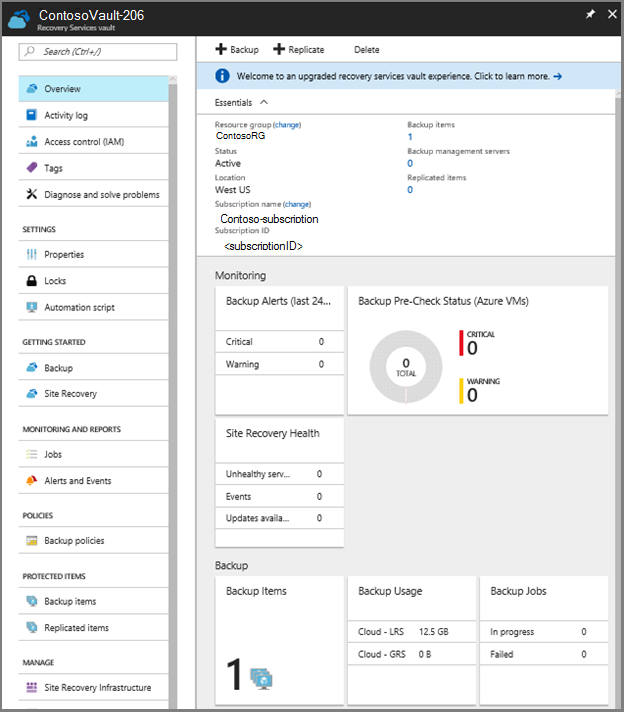
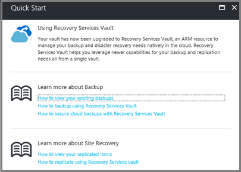

# Upgrade a Backup vault to a Recovery Services vault

This article explains how to upgrade a Backup vault to a Recovery Services vault. The upgrade process doesn't impact any running backup jobs, and no backup data is lost. The primary reasons to upgrade a Backup vault to a Recovery Services vault:
- All features of a Backup vault are retained in a Recovery Services vault.
- Recovery Services vaults have more features than Backup vaults, including: better security, integrated monitoring, faster restores and item-level restores.
- Manage backup items from an improved, simplified portal.
- New features only apply to Recovery Services vaults.

## Impact to operations during upgrade

When upgrading a Backup vault to a Recovery Services vault, there is no impact to your data plane operations. All backup jobs continue as normal, and any active restore jobs continue without interruption. During the upgrade, management operations incur a short downtime, and you can't protect new items or create adhoc backups jobs. Restore jobs for IaaS VMs don't run during the upgrade. The vault upgrade takes under an hour to complete. Once finished, a Recovery Services vault replaces the Backup vault.

## Changes to your automation and tool after upgrading

While preparing your infrastructure for the vault upgrade, you must update your existing automation or tooling to ensure that it continues to work after the upgrade.
Consult the PowerShell cmdlets references for the [Service Manager deployment model](backup-client-automation-classic.md) and the [Resource Manager deployment model](backup-client-automation.md).


## Before you upgrade

Check the following issues before you upgrade your Backup vaults to Recovery Service vaults.

- **Minimum agent version**: To upgrade your vault, make sure the Microsoft Azure Recovery Services (MARS) agent is at least version 2.0.9083.0. If the MARS agent is older than 2.0.9083.0, update the agent before starting the upgrade process.
- **Instance-based billing model**: Recovery Service vaults only support the Instance-based billing model. If you have a backup vault that is using the older Storage-based billing model, convert the billing model during upgrade.
- **No on-going backup configuration operations**: During upgrade, access to the management plane is restricted. Complete all management plane actions and then start the upgrade.

## Using PowerShell scripts to upgrade your vaults

You can use PowerShell scripts to upgrade your Backup vaults to Recovery Services vaults. Check that you have the required PowerShell components to trigger the vault upgrade. PowerShell scripts for Backup vaults do not work for Recovery Services vaults. Prepare your environment to upgrade the vaults:

1. Install or upgrade [Windows Management Framework (WMF) to version 5](https://www.microsoft.com/download/details.aspx?id=50395) or above.
2. [Install Azure PowerShell MSI](https://github.com/Azure/azure-powershell/releases/download/v3.8.0-April2017/azure-powershell.3.8.0.msi).
3. Download the [PowerShell script](https://aka.ms/vaultupgradescript2) to upgrade your vaults.

### Run the PowerShell script

Use the following script to upgrade your vaults. The following sample script has explanations of the parameters.

RecoveryServicesVaultUpgrade-1.0.2.ps1 **-SubscriptionID** `<subscriptionID>` **-VaultName** `<vaultname>` **-Location** `<location>` **-ResourceType** `BackupVault` **-TargetResourceGroupName** `<rgname>`

**SubscriptionID** - The subscription ID number of the vault that is being upgraded.<br/>
**VaultName** - The name of the Backup vault that is being upgraded.<br/>
**Location** - Location of the vault being upgraded.<br/>
**ResourceType** - Use BackupVault.<br/>
**TargetResourceGroupName** - Since you are upgrading the vault to a Resource Manager-based deployment, specify a Resource Group. You can use an existing Resource Group, or create one by providing a new name. If you misspell the name of a Resource Group, you may create a new Resource Group. To learn more about Resource Groups, read this [overview about Resource Groups](../azure-resource-manager/resource-group-overview.md#resource-groups).

>[!NOTE]
> Resource Group names have constraints. Be sure to follow the guidance; failure to do so could cause vault upgrades to fail.
>
>

The following code snippet is an example of what your PowerShell command should look like:

```
RecoveryServicesVaultUpgrade.ps1 -SubscriptionID 53a3c692-5283-4f0a-baf6-49412f5ebefe -VaultName "TestVault" -Location "Australia East" -ResourceType BackupVault -TargetResourceGroupName "ContosoRG"
```

You can also run the script without any parameters and you are asked to provide inputs for all required parameters.

The PowerShell script prompts you to enter your credentials. Enter your credentials twice: once for the Service Manager account, and a second time for the Resource Manager account.

### Pre-requisites checking
Once you have entered your Azure credentials, Azure checks that your environment meets the following prerequisites:

- **Minimum agent version** - Upgrading Backup vaults to Recovery Services vaults requires the MARS agent to be at least version 2.0.9083.0. If you have items registered to a Backup vault with an agent earlier than 2.0.9083.0, the prerequisite check fails. If the prerequisite check fails, update the agent and try to upgrade the vault again. You can download the latest version of the agent from [http://download.microsoft.com/download/F/4/B/F4B06356-150F-4DB0-8AD8-95B4DB4BBF7C/MARSAgentInstaller.exe](http://download.microsoft.com/download/F/4/B/F4B06356-150F-4DB0-8AD8-95B4DB4BBF7C/MARSAgentInstaller.exe).
- **On-going configuration jobs**: If someone is configuring job for a Backup vault set to be upgraded, or registering an item, the prerequisite check fails. Complete the configuration, or finish registering the item, and then start the vault upgrade process.
- **Storage-based billing model**: Recovery Services vaults support the Instance-based billing model. If you run the vault upgrade on a Backup vault that uses the Storage-based billing model, you are prompted to upgrade your billing model along with the vault. Otherwise, you can update your billing model first, and then run the vault upgrade.
- Identify a Resource Group for the Recovery Services vault. To take advantage of the Resource Manager deployment features, you must put a Recovery Services vault in a Resource Group. If you don't know which Resource Group to use, provide a name and the upgrade process creates the Resource Group for you. The upgrade process also associates the vault with the new Resource Group.

Once the upgrade process finishes checking the pre-requisites, the process prompts you to start the vault upgrade. After you confirm, the upgrade process typically takes around 15-20 minutes to complete, depending on the size of your vault. If you have a large vault, upgrading can take up to 90 minutes.

## Managing your Recovery Services vaults

The following screens show a new Recovery Services vault, upgraded from Backup vault, in the Azure portal. The first screen shows the vault dashboard that displays key entities for the vault.



The second screen shows the help links available to help you get started using the Recovery Services vault.



## Post-upgrade steps
Recovery Services vault supports specifying time zone information in backup policy. After vault is successfully upgraded, go to Backup policies from vault settings menu and update the time zone information for each of the policies configured in the vault. This screen already shows the backup schedule time specified as per local time zone used when you created policy. 

## Enhanced security

When a Backup vault is upgraded to a Recovery Services vault, the security settings for that vault are automatically turned on. When the security settings are on, certain operations such as deleting backups, or changing a passphrase require an [Azure Multi-Factor Authentication](../multi-factor-authentication/multi-factor-authentication.md) PIN. For more information on the enhanced security, see the article [Security features to protect hybrid backups](backup-azure-security-feature.md). 

When the enhanced security is turned on, data is retained up to 14 days after the recovery point information has been deleted from the vault. Customers are billed for storage of this security data. Security data retention applies to recovery points taken for the Azure Backup agent, Azure Backup Server, and System Center Data Protection Manager. 

## Gather data on your vault

Once you upgrade to a Recovery Services vault, configure reports for Azure Backup (for IaaS VMs and Microsoft Azure Recovery Services (MARS)), and use Power BI to access the reports. For additional information on gathering data, see the article, [Configure Azure Backup reports](backup-azure-configure-reports.md).

## Frequently asked questions

**Does the upgrade plan affect my ongoing backups?**</br>
No. Your ongoing backups continue uninterrupted during and after upgrade.

**If I don’t plan on upgrading soon, what happens to my vaults?**</br>
Since all new features apply only to Recovery Services vaults, we urge you to upgrade your vaults. Microsoft will eventually deprecate the classic portal. Starting September 1, 2017, Microsoft will begin auto-upgrading backup vaults to Recovery Services vaults. By November 1, 2017, Microsoft will complete the upgrade process. Your vault can be automatically upgraded any time during September or October. Microsoft recommends you upgrade your vault as soon as possible.

**What does this upgrade mean for my existing tooling?**</br>
Update your tooling to the Resource Manager deployment model. Recovery Services vaults were created for use in the Resource Manager deployment model. Planning for the Resource Manager deployment model, and accounting for the difference in your vaults is important. 

**During the upgrade, is there much downtime?**</br>
It depends on the number of resources that are being upgraded. For smaller deployments (a few tens of protected instances), the whole upgrade should take less than 20 minutes. For larger deployments, it should take a max of an hour.

**Can I roll back after upgrading?**</br>
No. Rollback is not supported after the resources have been successfully upgraded.

**Can I validate my subscription or resources to see if they're capable of upgrade?**</br>
Yes. The first step in upgrade validates that the resources are capable of upgrade. In case the validation of pre-requisites fails, you receive messages for all the reasons the upgrade cannot be completed.

**What permissions should I have to trigger vault upgrade?**</br>
To perform the vault upgrade, you must be added as co-administrator for the subscription in the Azure classic portal. This is required even if you are already listed as owner in the Azure portal. Try to add a co-administrator for the subscription in Azure classic portal to find out if you are co-administrator for the subscription. If you are not able to add a co-administrator, contact a service administrator or co-administrator for the subscription, who can add you as a co-administrator.

**Can I upgrade my CSP-based Backup vault?**</br>
No. Currently, you cannot upgrade CSP-based backup vaults. We will add support for upgrading CSP-based Backup vaults in the next releases.

**Can I view my classic vault post upgrade?**</br>
No. You cannot view or manage your classic vault post upgrade. You will only be able to use the new Azure portal for all management actions on the vault.

**My upgrade failed, but the machine that held the agent requiring updating, doesn't exist anymore. What do I do in such a case?**</br>
If you need to use the store, the backups of this machine for long-term retention, then you will not be able to upgrade the vault. In future releases we will add support for upgrading such a vault.
If you do not need to store the backups of this machine anymore, then please unregister this machine from the vault and retry the upgrade.

**Why can't I see the jobs information for my resources after upgrade?**</br>
Monitoring for backups (MARS agent and IaaS) is a new feature that you get when you upgrade your Backup vault to Recovery Services vault. The monitoring information takes up to 12 hours to sync with the service.

**How do I report an issue?**</br>
If any portion of the vault upgrade fails, note the OperationId listed in the error. Microsoft Support will proactively work to resolve the issue. You can reach out to Support or email us at rsvaultupgrade@service.microsoft.com with your Subscription ID, vault name and OperationId. We will attempt to resolve the issue as quickly as possible. Do not retry the operation unless explicitly instructed to do so by Microsoft.


## Next steps
Use the following article to:</br>
[Back up an IaaS VM](backup-azure-arm-vms-prepare.md)</br>
[Back up an Azure Backup Server](backup-azure-microsoft-azure-backup.md)</br>
[Back up a Windows Server](backup-configure-vault.md).
