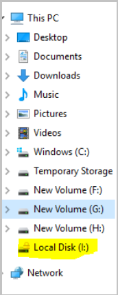
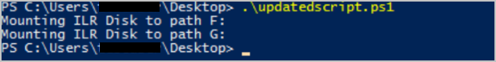
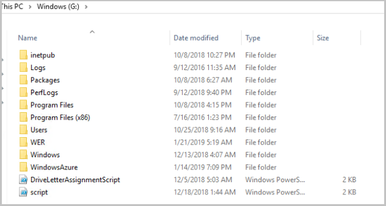

# Troubleshooting issues in file recovery of Azure VM backup

This article provides troubleshooting steps that can help you resolve Azure Backup errors related to issues specific to recovering files and folders from an Azure VM backup. 

## Exception caught while connecting to target

Possible Cause: The script is unable to access the recovery point 
Recommended action: Check whether the machine fulfills all the [access requirements](https://docs.microsoft.com/azure/backup/backup-azure-restore-files-from-vm#step-4-access-requirements-to-successfully-run-the-script).

## The target has already been logged in via an iSCSI session

Possible Cause: The script was already executed on the same machine and the drives have been attached.  
Recommended action: The volumes of the recovery point have already been attached. They may not be mounted with the same drive letters of the original VM. Browse through all the available volumes in the file explorer.

## This script is invalid because the disks have been dismounted via portal/exceeded the 12-hr limit. Download a new script from the portal

Possible Cause: The disks have been dismounted from the portal or the 12-hour limit was exceeded. 
Recommended action: The script is invalid after 12 hours from the time it was downloaded and cannot be executed. Visit the portal and download a new script to proceed with file recovery.

## Troubleshooting common issues

This section provides steps to troubleshoot issues encountered while downloading and executing the script for file recovery.

## Cannot download the script

Recommended action:

1. Ensure you have all the [required permissions to download the script](https://docs.microsoft.com/azure/backup/backup-azure-restore-files-from-vm#select-recovery-point-who-can-generate-script).
2. Ensure there is connectivity to Azure target IP(s). 
To verify connection run the following command from an elevated command prompt. 
    - *nslookup download.microsoft.com*
    or 
    - *ping download.microsoft.com*

## The script downloads successfully, but fails to run

### For SLES 12 SP4 OS (Linux)

Error: iscsi_tcp_module not found 

Possible Cause: While running the Python script for Item Level Recovery on SUSE Linux OS version 12sp4, it fails with an error ***iscsi_tcp module can’t be loaded***. 
ILR module uses 'iscsi_tcp' to establish tcp connection to the backup service, SUSE as part of 12SP4 release removed iscsi_tcp from open-iscsi package, hence the ILR operation fails.

Recommended action:  File recovery script execution is not supported on SUSE 12SP4 VMs, try the restore operation on an older version of SUSE 12SP4.

## The script runs but connection to iSCSI target failed

Error: Exception caught while connecting to Target

1. Ensure the machine where the script is run meets all the [access requirements](https://docs.microsoft.com/azure/backup/backup-azure-restore-files-from-vm#step-4-access-requirements-to-successfully-run-the-script)
2. Check for connectivity to Azure target IP(s). 
To verify connection run the following command from an elevated command prompt. 
    - *nslookup download.microsoft.com*
    or 
    - *ping download.microsoft.com*
3. Ensure there is access to iSCSI outbound port 3260.
4. Ensure there are no firewall/NSG that is blocking traffic to Azure target IP(s) or Recovery service URLs.
5. Check if antivirus is blocking the execution of the script.

## Connected to recovery point but disks did not get attached

Ensure you have the [right machine to run the script](https://docs.microsoft.com/azure/backup/backup-azure-restore-files-from-vm#step-2-ensure-the-machine-meets-the-requirements-before-executing-the-script)

### On Windows VM

**Storage pool on VM gets attached in read-only mode** 
For Windows 2012 R2 and Windows 2016(with storage pool), while running the script for the first time, the storage pool attached to the VM may go into read-only state. 

To resolve this issue, we need to manually set the Read-Write Access to the storage pool for the first time and attach the virtual disks, follow the steps below: 

1. Set Read-Write access. 
Navigate to Server Manager > File and Storage Services > Volumes > Storage Pools 

2. In the **Storage Pool** window, right-click the available storage pool and select **Set Read-Write Access** option. 

3. After storage pool is assigned with read/write access, we have to attach the virtual disk.  
Navigate to **Server Manager UI** under the Virtual Disks section, right-click to select **Attach Virtual Disk** option. 

### On Linux VM

#### File recovery fails to auto mount because disk does not contain volumes**  

While performing file recovery, the backup service detects volumes and auto mounts. However, if the backed-up disks have raw partitions then those disks are not auto-mounted and we are unable to see the data disk for recovery.

To solve this issue, follow the steps documented in this [article](https://docs.microsoft.com/azure/backup/backup-azure-restore-files-from-vm#lvmraid-arrays-for-linux-vms)
 
#### OS could not identify the filesystem causing Linux File recovery to fail while mountings disks ##### check for command o/p

While running the File recovery script data disk failed to attach with the below error:  
*The following partitions failed to mount since the OS couldn't identify the filesystem*

- To resolve this issue, check if the Volume is encrypted with a third-party application. If encrypted, then the disk or VM won't show up as encrypted on the portal
1. Login to the backed-up VM and run the command: 
*lsblk -f* 

2. Verify the filesystem and encryption
3. If the volume is encrypted, then file recovery is not supported. [Learn more](https://docs.microsoft.com/azure/backup/backup-support-matrix-iaas#support-for-file-level-restore)

## Disks are attached, but unable to mount volumes

- Ensure you have the [right machine to run the script](https://docs.microsoft.com/azure/backup/backup-azure-restore-files-from-vm#step-2-ensure-the-machine-meets-the-requirements-before-executing-the-script)

### On windows VM

While running the file recovery script for windows there is a message that ***0 volumes are attached***, but the disks get discovered in disk management console. While attaching volumes through iSCSI, some volumes that get detected go to offline state. When the iSCSI channel communicates between the VM and service, it detects these volumes and bring them online, but they are not mounted

To identify and resolve this issue, perform the following steps:

1. Go to **Disk Management** by running **diskmgmt** command in cmd window
2. Check whether any additional disks are displayed. In the below example, Disk 2 is an additional disk.

3. Right click on the **Volume** and select **Change Drive Letter and Paths**.

4. In the **Add Drive Letter or Path** window select **Assign the following drive letter** and assign an available drive and Click **OK**. 

5. From the File explorer, you can view the Drive  

The new volumes should get attached.  

6. In the file explorer, the new volumes will be visible after rerunning the script.

#### On Linux VMs 

- Ensure you have the [right machine to run the script](https://docs.microsoft.com/azure/backup/backup-azure-restore-files-from-vm#step-2-ensure-the-machine-meets-the-requirements-before-executing-the-script)
- If the protected Linux VM uses LVM and/or RAID Arrays, then follow the steps listed in this [article](https://docs.microsoft.com/azure/backup/backup-azure-restore-files-from-vm#lvmraid-arrays-for-linux-vms)    

## Cannot copy the files from mounted Volumes

The copy might fail with an error 0x80070780: The file cannot be accessed by the system. In this case, check if the source server has disk deduplication enabled. Then ensure the restore server also has deduplication enabled on the drives. You can leave the deduplication role unconfigured so that you do not deduplicate the drives on the restore server.
