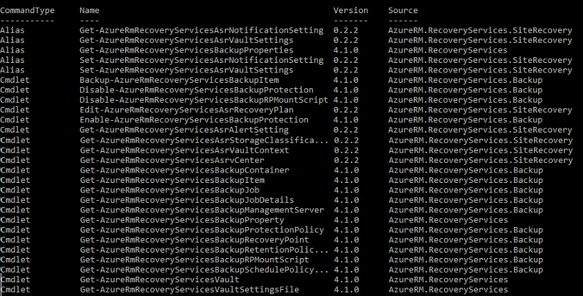

# Back up and restore Azure VMs using Azure PowerShell

This article describes how to back up and restore an Azure VM in an [Azure Backup](backup-overview.md) Recovery Services vault using PowerShell cmdlets.

Azure Backup provides independent and isolated backups to guard against unintended destruction of the data on your VMs. Backups are stored in a Recovery Services vault with built-in management of recovery points. Configuration and scaling are simple, backups are optimized, and you can easily restore as needed.

Before you can back up (or protect) a virtual machine, you must complete the [prerequisites](backup-azure-arm-vms-prepare.md) to prepare your environment for protecting your VMs.

## Before you start

* [Learn more](backup-azure-recovery-services-vault-overview.md) about Recovery Services vaults.
* [Review](backup-architecture.md#architecture-built-in-azure-vm-backup) the architecture for Azure VM backup, [learn about](backup-azure-vms-introduction.md) the backup process, and [review](backup-support-matrix-iaas.md) support, limitations, and prerequisites.
* Review the PowerShell object hierarchy for Recovery Services.

## Recovery Services object hierarchy

The object hierarchy is summarized in the following diagram.


Review the **Az.RecoveryServices** [cmdlet reference](/powershell/module/az.recoveryservices/) reference in the Azure library.

## Set up and register

[!INCLUDE [updated-for-az](../../includes/updated-for-az.md)]

To begin:

1. [Download the latest version of PowerShell](/powershell/azure/install-azure-powershell)

2. Find the Azure Backup PowerShell cmdlets available by typing the following command:

    ```powershell
    Get-Command *azrecoveryservices*
    ```

    The aliases and cmdlets for Azure Backup, Azure Site Recovery, and the Recovery Services vault appear. The following image is an example of what you'll see. It isn't the complete list of cmdlets.

    

3. Sign in to your Azure account using **Connect-AzAccount**. This cmdlet brings up a web page prompts you for your account credentials:

    * Alternately, you can include your account credentials as a parameter in the **Connect-AzAccount** cmdlet, using the **-Credential** parameter.
    * If you're a CSP partner working on behalf of a tenant, specify the customer as a tenant, by using their tenantID or tenant primary domain name. For example: **Connect-AzAccount -Tenant "fabrikam.com"**

4. Associate the subscription you want to use with the account, since an account can have several subscriptions:

    ```powershell
    Select-AzSubscription -SubscriptionName $SubscriptionName
    ```

5. If you're using Azure Backup for the first time, you must use the **[Register-AzResourceProvider](/powershell/module/az.resources/register-azresourceprovider)** cmdlet to register the Azure Recovery Service provider with your subscription.

    ```powershell
    Register-AzResourceProvider -ProviderNamespace "Microsoft.RecoveryServices"
    ```

6. You can verify that the Providers registered successfully, using the following commands:

    ```powershell
    Get-AzResourceProvider -ProviderNamespace "Microsoft.RecoveryServices"
    ```

    In the command output, the **RegistrationState** should change to **Registered**. If not, just run the **[Register-AzResourceProvider](/powershell/module/az.resources/register-azresourceprovider)** cmdlet again.

## Create a Recovery Services vault

The following steps lead you through creating a Recovery Services vault. A Recovery Services vault is different than a Backup vault.

1. The Recovery Services vault is a Resource Manager resource, so you need to place it within a resource group. You can use an existing resource group, or create a resource group with the **[New-AzResourceGroup](/powershell/module/az.resources/new-azresourcegroup)** cmdlet. When creating a resource group, specify the name and location for the resource group.  

    ```powershell
    New-AzResourceGroup -Name "test-rg" -Location "West US"
    ```

2. Use the [New-AzRecoveryServicesVault](/powershell/module/az.recoveryservices/new-azrecoveryservicesvault) cmdlet to create the Recovery Services vault. Be sure to specify the same location for the vault as was used for the resource group.

    ```powershell
    New-AzRecoveryServicesVault -Name "testvault" -ResourceGroupName "test-rg" -Location "West US"
    ```

3. Specify the type of storage redundancy to use. You can use [Locally Redundant Storage (LRS)](../storage/common/storage-redundancy.md#locally-redundant-storage), [Geo-redundant Storage (GRS)](../storage/common/storage-redundancy.md#geo-redundant-storage), or [Zone-redundant storage (ZRS)](../storage/common/storage-redundancy.md#zone-redundant-storage). The following example shows the **-BackupStorageRedundancy** option for `testvault` set to **GeoRedundant**.

    ```powershell
    $vault1 = Get-AzRecoveryServicesVault -Name "testvault"
    Set-AzRecoveryServicesBackupProperty  -Vault $vault1 -BackupStorageRedundancy GeoRedundant
    ```

   > [!TIP]
   > Many Azure Backup cmdlets require the Recovery Services vault object as an input. For this reason, it's convenient to store the Backup Recovery Services vault object in a variable.
   >
   >

## View the vaults in a subscription

To view all vaults in the subscription, use [Get-AzRecoveryServicesVault](/powershell/module/az.recoveryservices/get-azrecoveryservicesvault):

```powershell
Get-AzRecoveryServicesVault
```

The output is similar to the following example, notice the associated ResourceGroupName and Location are provided.

```output
Name              : Contoso-vault
ID                : /subscriptions/1234
Type              : Microsoft.RecoveryServices/vaults
Location          : WestUS
ResourceGroupName : Contoso-docs-rg
SubscriptionId    : 1234-567f-8910-abc
Properties        : Microsoft.Azure.Commands.RecoveryServices.ARSVaultProperties
```

## Back up Azure VMs

Use a Recovery Services vault to protect your virtual machines. Before you apply the protection, set the vault context (the type of data protected in the vault), and verify the protection policy. The protection policy is the schedule when the backup jobs run, and how long each backup snapshot is retained.

### Set vault context

Before enabling protection on a VM, use [Set-AzRecoveryServicesVaultContext](/powershell/module/az.recoveryservices/set-azrecoveryservicesvaultcontext) to set the vault context. Once the vault context is set, it applies to all subsequent cmdlets. The following example sets the vault context for the vault, `testvault`.

```powershell
Get-AzRecoveryServicesVault -Name "testvault" -ResourceGroupName "Contoso-docs-rg" | Set-AzRecoveryServicesVaultContext
```

### Fetch the vault ID

We plan on deprecating the vault context setting in accordance with Azure PowerShell guidelines. Instead, you can store or fetch the vault ID, and pass it to relevant commands. So, if you haven't set the vault context or want to specify the command to run for a certain vault, pass the vault ID as "-vaultID" to all relevant command, as follows:

```powershell
$targetVault = Get-AzRecoveryServicesVault -ResourceGroupName "Contoso-docs-rg" -Name "testvault"
$targetVault.ID
```

Or

```powershell
$targetVaultID = Get-AzRecoveryServicesVault -ResourceGroupName "Contoso-docs-rg" -Name "testvault" | select -ExpandProperty ID
```

### Modifying storage replication settings

Use [Set-AzRecoveryServicesBackupProperty](/powershell/module/az.recoveryservices/set-azrecoveryservicesbackupproperty) command to set the Storage replication configuration of the vault to LRS/GRS

```powershell
Set-AzRecoveryServicesBackupProperty -Vault $targetVault -BackupStorageRedundancy GeoRedundant/LocallyRedundant
```

> [!NOTE]
> Storage Redundancy can be modified only if there are no backup items protected to the vault.

### Create a protection policy

When you create a Recovery Services vault, it comes with default protection and retention policies. The default protection policy triggers a backup job each day at a specified time. The default retention policy retains the daily recovery point for 30 days. You can use the default policy to quickly protect your VM and edit the policy later with different details.

Use **[Get-AzRecoveryServicesBackupProtectionPolicy](/powershell/module/az.recoveryservices/get-azrecoveryservicesbackupprotectionpolicy)** to view the protection policies available in the vault. You can use this cmdlet to get a specific policy, or to view the policies associated with a workload type. The following example gets policies for workload type, AzureVM.

```powershell
Get-AzRecoveryServicesBackupProtectionPolicy -WorkloadType "AzureVM" -VaultId $targetVault.ID
```

The output is similar to the following example:

```output
Name                 WorkloadType       BackupManagementType BackupTime                DaysOfWeek
----                 ------------       -------------------- ----------                ----------
DefaultPolicy        AzureVM            AzureVM              4/14/2016 5:00:00 PM
```

> [!NOTE]
> The timezone of the BackupTime field in PowerShell is UTC. However, when the backup time is shown in the Azure portal, the time is adjusted to your local timezone.
>
>

A backup protection policy is associated with at least one retention policy. A retention policy defines how long a recovery point is kept before it's deleted.

* Use [Get-AzRecoveryServicesBackupRetentionPolicyObject](/powershell/module/az.recoveryservices/get-azrecoveryservicesbackupretentionpolicyobject) to view the default retention policy.
* Similarly you can use [Get-AzRecoveryServicesBackupSchedulePolicyObject](/powershell/module/az.recoveryservices/get-azrecoveryservicesbackupschedulepolicyobject) to obtain the default schedule policy.
* The [New-AzRecoveryServicesBackupProtectionPolicy](/powershell/module/az.recoveryservices/get-azrecoveryservicesbackupprotectionpolicy) cmdlet creates a PowerShell object that holds backup policy information.
* The schedule and retention policy objects are used as inputs to the New-AzRecoveryServicesBackupProtectionPolicy cmdlet.

By default, a start time is defined in the Schedule Policy Object. Use the following example to change the start time to the desired start time. The desired start time should be in UTC as well. The following example assumes the desired start time is 01:00 AM UTC for daily backups.

```powershell
$schPol = Get-AzRecoveryServicesBackupSchedulePolicyObject -WorkloadType "AzureVM"
$UtcTime = Get-Date -Date "2019-03-20 01:00:00Z"
$UtcTime = $UtcTime.ToUniversalTime()
$schpol.ScheduleRunTimes[0] = $UtcTime
```

> [!IMPORTANT]
> You need to provide the start time in 30 minute multiples only. In the example above, it can be only "01:00:00" or "02:30:00". The start time can't be "01:15:00"

The following example stores the schedule policy and the retention policy in variables. The example uses those variables to define the parameters when creating a protection policy, *NewPolicy*.

```powershell
$retPol = Get-AzRecoveryServicesBackupRetentionPolicyObject -WorkloadType "AzureVM"
New-AzRecoveryServicesBackupProtectionPolicy -Name "NewPolicy" -WorkloadType "AzureVM" -RetentionPolicy $retPol -SchedulePolicy $schPol -VaultId $targetVault.ID
```

The output is similar to the following example:

```output
Name                 WorkloadType       BackupManagementType BackupTime                DaysOfWeek
----                 ------------       -------------------- ----------                ----------
NewPolicy           AzureVM            AzureVM              4/24/2016 1:30:00 AM
```

### Enable protection

Once you've defined the protection policy, you still must enable the policy for an item. Use [Enable-AzRecoveryServicesBackupProtection](/powershell/module/az.recoveryservices/enable-azrecoveryservicesbackupprotection) to enable protection. Enabling protection requires two objects - the item and the policy. Once the policy has been associated with the vault, the backup workflow is triggered at the time defined in the policy schedule.

> [!IMPORTANT]
> While using PowerShell to enable backup for multiple VMs at once, ensure that a single policy doesn't have more than 100 VMs associated with it. This is a [recommended best practice](./backup-azure-vm-backup-faq.yml#is-there-a-limit-on-number-of-vms-that-can-be-associated-with-the-same-backup-policy). Currently, the PowerShell client doesn't explicitly block if there are more than 100 VMs, but the check is planned to be added in the future.

The following examples enable protection for the item, V2VM, using the policy, NewPolicy. The examples differ based on whether the VM is encrypted, and what type of encryption.

To enable the protection on **non-encrypted Resource Manager VMs**:

```powershell
$pol = Get-AzRecoveryServicesBackupProtectionPolicy -Name "NewPolicy" -VaultId $targetVault.ID
Enable-AzRecoveryServicesBackupProtection -Policy $pol -Name "V2VM" -ResourceGroupName "RGName1" -VaultId $targetVault.ID
```

To enable the protection on encrypted VMs (encrypted using BEK and KEK), you must give the Azure Backup service permission to read keys and secrets from the key vault.

```powershell
Set-AzKeyVaultAccessPolicy -VaultName "KeyVaultName" -ResourceGroupName "RGNameOfKeyVault" -PermissionsToKeys backup,get,list -PermissionsToSecrets get,list -ServicePrincipalName 262044b1-e2ce-469f-a196-69ab7ada62d3
$pol = Get-AzRecoveryServicesBackupProtectionPolicy -Name "NewPolicy" -VaultId $targetVault.ID
Enable-AzRecoveryServicesBackupProtection -Policy $pol -Name "V2VM" -ResourceGroupName "RGName1" -VaultId $targetVault.ID
```

To enable the protection on **encrypted VMs (encrypted using BEK only)**, you must give the Azure Backup service permission to read secrets from the key vault.

```powershell
Set-AzKeyVaultAccessPolicy -VaultName "KeyVaultName" -ResourceGroupName "RGNameOfKeyVault" -PermissionsToSecrets backup,get,list -ServicePrincipalName 262044b1-e2ce-469f-a196-69ab7ada62d3
$pol = Get-AzRecoveryServicesBackupProtectionPolicy -Name "NewPolicy" -VaultId $targetVault.ID
Enable-AzRecoveryServicesBackupProtection -Policy $pol -Name "V2VM" -ResourceGroupName "RGName1" -VaultId $targetVault.ID
```

> [!NOTE]
> If you're using the Azure Government cloud, then use the value `ff281ffe-705c-4f53-9f37-a40e6f2c68f3` for the parameter **ServicePrincipalName** in [Set-AzKeyVaultAccessPolicy](/powershell/module/az.keyvault/set-azkeyvaultaccesspolicy) cmdlet.
>

If you want to selectively back up a few disks and exclude others as mentioned in [these scenarios](selective-disk-backup-restore.md#scenarios), you can configure protection and backup only the relevant disks as documented [here](selective-disk-backup-restore.md#enable-backup-with-powershell).

## Monitoring a backup job

You can monitor long-running operations, such as backup jobs, without using the Azure portal. To get the status of an in-progress job, use the [Get-AzRecoveryservicesBackupJob](/powershell/module/az.recoveryservices/get-azrecoveryservicesbackupjob) cmdlet. This cmdlet gets the backup jobs for a specific vault, and that vault is specified in the vault context. The following example gets the status of an in-progress job as an array, and stores the status in the $joblist variable.

```powershell
$joblist = Get-AzRecoveryservicesBackupJob –Status "InProgress" -VaultId $targetVault.ID
$joblist[0]
```

The output is similar to the following example:

```output
WorkloadName     Operation            Status               StartTime                 EndTime                   JobID
------------     ---------            ------               ---------                 -------                   ----------
V2VM             Backup               InProgress            4/23/2016                5:00:30 PM                cf4b3ef5-2fac-4c8e-a215-d2eba4124f27
```

Instead of polling these jobs for completion - which is unnecessary additional code - use the [Wait-AzRecoveryServicesBackupJob](/powershell/module/az.recoveryservices/wait-azrecoveryservicesbackupjob) cmdlet. This cmdlet pauses the execution until either the job completes or the specified timeout value is reached.

```powershell
Wait-AzRecoveryServicesBackupJob -Job $joblist[0] -Timeout 43200 -VaultId $targetVault.ID
```

## Manage Azure VM backups

### Modify a protection policy

To modify the protection policy, use [Set-AzRecoveryServicesBackupProtectionPolicy](/powershell/module/az.recoveryservices/set-azrecoveryservicesbackupprotectionpolicy) to modify the SchedulePolicy or RetentionPolicy objects.

#### Modifying scheduled time

When you create a protection policy, it's assigned a start-time by default. The following examples show how to modify the start time of a protection policy.

````powershell
$SchPol = Get-AzRecoveryServicesBackupSchedulePolicyObject -WorkloadType "AzureVM"
$UtcTime = Get-Date -Date "2019-03-20 01:00:00Z" (This is the time that you want to start the backup)
$UtcTime = $UtcTime.ToUniversalTime()
$SchPol.ScheduleRunTimes[0] = $UtcTime
$pol = Get-AzRecoveryServicesBackupProtectionPolicy -Name "NewPolicy" -VaultId $targetVault.ID
Set-AzRecoveryServicesBackupProtectionPolicy -Policy $pol  -SchedulePolicy $SchPol -VaultId $targetVault.ID
````

#### Modifying retention

The following example changes the recovery point retention to 365 days.

```powershell
$retPol = Get-AzRecoveryServicesBackupRetentionPolicyObject -WorkloadType "AzureVM"
$retPol.DailySchedule.DurationCountInDays = 365
$pol = Get-AzRecoveryServicesBackupProtectionPolicy -Name "NewPolicy" -VaultId $targetVault.ID
Set-AzRecoveryServicesBackupProtectionPolicy -Policy $pol  -RetentionPolicy $RetPol -VaultId $targetVault.ID
```

#### Configuring Instant restore snapshot retention

> [!NOTE]
> From Azure PowerShell version 1.6.0 onwards, one can update the instant restore snapshot retention period in policy using PowerShell

````powershell
$bkpPol = Get-AzRecoveryServicesBackupProtectionPolicy -WorkloadType "AzureVM" -VaultId $targetVault.ID
$bkpPol.SnapshotRetentionInDays=7
Set-AzRecoveryServicesBackupProtectionPolicy -policy $bkpPol -VaultId $targetVault.ID
````

The default value will be 2. You can set the value with a minimum of 1 and maximum of 5. For weekly backup policies, the period is set to 5 and can't be changed.

#### Creating Azure Backup resource group during snapshot retention

> [!NOTE]
> From Azure PowerShell version 3.7.0 onwards, one can create and edit the resource group created for storing instant snapshots.

To understand more about resource group creation rules and other relevant details, refer to the [Azure Backup resource group for Virtual Machines](./backup-during-vm-creation.md#azure-backup-resource-group-for-virtual-machines) documentation.

```powershell
$bkpPol = Get-AzureRmRecoveryServicesBackupProtectionPolicy -name "DefaultPolicyForVMs"
$bkpPol.AzureBackupRGName="Contosto_"
$bkpPol.AzureBackupRGNameSuffix="ForVMs"
Set-AzureRmRecoveryServicesBackupProtectionPolicy -policy $bkpPol
```

### Exclude disks for a protected VM

Azure VM backup provides a capability to selectively exclude or include disks which are helpful in [these scenarios](selective-disk-backup-restore.md#scenarios). If the virtual machine is already protected by Azure VM backup and if all disks are backed up, then you can modify the protection to selectively include or exclude disks as mentioned [here](selective-disk-backup-restore.md#modify-protection-for-already-backed-up-vms-with-powershell).

### Trigger a backup

Use [Backup-AzRecoveryServicesBackupItem](/powershell/module/az.recoveryservices/backup-azrecoveryservicesbackupitem) to trigger a backup job. If it's the initial backup, it is a full backup. Subsequent backups take an incremental copy. The following example takes a VM backup to be retained for 60 days.

```powershell
$namedContainer = Get-AzRecoveryServicesBackupContainer -ContainerType "AzureVM" -Status "Registered" -FriendlyName "V2VM" -VaultId $targetVault.ID
$item = Get-AzRecoveryServicesBackupItem -Container $namedContainer -WorkloadType "AzureVM" -VaultId $targetVault.ID
$endDate = (Get-Date).AddDays(60).ToUniversalTime()
$job = Backup-AzRecoveryServicesBackupItem -Item $item -VaultId $targetVault.ID -ExpiryDateTimeUTC $endDate
```

The output is similar to the following example:

```output
WorkloadName     Operation            Status               StartTime                 EndTime                   JobID
------------     ---------            ------               ---------                 -------                   ----------
V2VM              Backup              InProgress          4/23/2016                  5:00:30 PM                cf4b3ef5-2fac-4c8e-a215-d2eba4124f27
```

> [!NOTE]
> The timezone of the StartTime and EndTime fields in PowerShell is UTC. However, when the time is shown in the Azure portal, the time is adjusted to your local timezone.
>
>

### Change policy for backup items

You can either modify existing policy or change the policy of the backed-up item from Policy1 to Policy2. To switch policies for a backed-up item, fetch the relevant policy and back up item and use the [Enable-AzRecoveryServices](/powershell/module/az.recoveryservices/enable-azrecoveryservicesbackupprotection) command with backup item as the parameter.

````powershell
$TargetPol1 = Get-AzRecoveryServicesBackupProtectionPolicy -Name <PolicyName> -VaultId $targetVault.ID
$anotherBkpItem = Get-AzRecoveryServicesBackupItem -WorkloadType AzureVM -BackupManagementType AzureVM -Name "<BackupItemName>" -VaultId $targetVault.ID
Enable-AzRecoveryServicesBackupProtection -Item $anotherBkpItem -Policy $TargetPol1 -VaultId $targetVault.ID
````

The command waits until the configure backup is completed and returns the following output.

```powershell
WorkloadName     Operation            Status               StartTime                 EndTime                   JobID
------------     ---------            ------               ---------                 -------                   -----
TestVM           ConfigureBackup      Completed            3/18/2019 8:00:21 PM      3/18/2019 8:02:16 PM      654e8aa2-4096-402b-b5a9-e5e71a496c4e
```

### Stop protection

#### Retain data

If you wish to stop protection, you can use the [Disable-AzRecoveryServicesBackupProtection](/powershell/module/az.recoveryservices/disable-azrecoveryservicesbackupprotection) PowerShell cmdlet. This will stop the scheduled backups but the data backed up until now is retained forever.

````powershell
$bkpItem = Get-AzRecoveryServicesBackupItem -BackupManagementType AzureVM -WorkloadType AzureVM -Name "<backup item name>" -VaultId $targetVault.ID
Disable-AzRecoveryServicesBackupProtection -Item $bkpItem -VaultId $targetVault.ID
````

### Resume backup

If the protection is stopped and the backup data is retained, you can resume the protection once more. You have to assign a policy for the renewed protection. The cmdlet is same as that of [change policy of backup items](#change-policy-for-backup-items).

````powershell
$TargetPol1 = Get-AzRecoveryServicesBackupProtectionPolicy -Name <PolicyName> -VaultId $targetVault.ID
$anotherBkpItem = Get-AzRecoveryServicesBackupItem -WorkloadType AzureVM -BackupManagementType AzureVM -Name "<BackupItemName>" -VaultId $targetVault.ID
Enable-AzRecoveryServicesBackupProtection -Item $anotherBkpItem -Policy $TargetPol1 -VaultId $targetVault.ID
````

#### Delete backup data

To completely remove the stored backup data in the vault,  add the '-RemoveRecoveryPoints' flag/switch to the ['disable' protection command](#retain-data).

````powershell
Disable-AzRecoveryServicesBackupProtection -Item $bkpItem -VaultId $targetVault.ID -RemoveRecoveryPoints

````

## Restore an Azure VM

There's an important difference between the restoring a VM using the Azure portal and restoring a VM using PowerShell. With PowerShell, the restore operation is complete once the disks and configuration information from the recovery point are created. The restore operation doesn't create the virtual machine. To create a virtual machine from disk, see the section, [Create the VM from restored disks](backup-azure-vms-automation.md#create-a-vm-from-restored-disks). If you don't want to restore the entire VM, but want to restore or recover a few files from an Azure VM backup, refer to the [file recovery section](backup-azure-vms-automation.md#restore-files-from-an-azure-vm-backup).

> [!Tip]
> The restore operation doesn't create the virtual machine.
>
>

The following graphic shows the object hierarchy from the `RecoveryServicesVault` down to the `BackupRecoveryPoint`.


To restore backup data, identify the backed-up item and the recovery point that holds the point-in-time data. Use [Restore-AzRecoveryServicesBackupItem](/powershell/module/az.recoveryservices/restore-azrecoveryservicesbackupitem) to restore data from the vault to your account.

The basic steps to restore an Azure VM are:

> [!div class="checklist"]
> * Select the VM.
> * Choose a recovery point.
> * Restore the disks.
> * Create the VM from stored disks.

Now, you can also use PowerShell to directly restore the backup content to a VM (original/new), without performing the above steps separately. For more information, see [Restore data to virtual machine using PowerShell](#restore-data-to-virtual-machine-using-powershell).

### Select the VM (when restoring files)

To get the PowerShell object that identifies the right backup item, start from the container in the vault, and work your way down the object hierarchy. To select the container that represents the VM, use the [Get-AzRecoveryServicesBackupContainer](/powershell/module/az.recoveryservices/get-azrecoveryservicesbackupcontainer) cmdlet and pipe that to the [Get-AzRecoveryServicesBackupItem](/powershell/module/az.recoveryservices/get-azrecoveryservicesbackupitem) cmdlet.

```powershell
$namedContainer = Get-AzRecoveryServicesBackupContainer  -ContainerType "AzureVM" -Status "Registered" -FriendlyName "V2VM" -VaultId $targetVault.ID
$backupitem = Get-AzRecoveryServicesBackupItem -Container $namedContainer  -WorkloadType "AzureVM" -VaultId $targetVault.ID
```

### Choose a recovery point (when restoring files)

Use the [Get-AzRecoveryServicesBackupRecoveryPoint](/powershell/module/az.recoveryservices/get-azrecoveryservicesbackuprecoverypoint) cmdlet to list all recovery points for the backup item. Then choose the recovery point to restore. If you're unsure which recovery point to use, it's a good practice to choose the most recent RecoveryPointType = AppConsistent point in the list.

In the following script, the variable, **$rp**, is an array of recovery points for the selected backup item, from the past seven days. The array is sorted in reverse order of time with the latest recovery point at index 0. Use standard PowerShell array indexing to pick the recovery point. In the example, $rp[0] selects the latest recovery point.

```powershell
$startDate = (Get-Date).AddDays(-7)
$endDate = Get-Date
$rp = Get-AzRecoveryServicesBackupRecoveryPoint -Item $backupitem -StartDate $startdate.ToUniversalTime() -EndDate $enddate.ToUniversalTime() -VaultId $targetVault.ID
$rp[0]
```

The output is similar to the following example:

```output
RecoveryPointAdditionalInfo :
SourceVMStorageType         : NormalStorage
Name                        : 15260861925810
ItemName                    : VM;iaasvmcontainer;RGName1;V2VM
RecoveryPointId             : /subscriptions/XX/resourceGroups/ RGName1/providers/Microsoft.RecoveryServices/vaults/testvault/backupFabrics/Azure/protectionContainers/IaasVMContainer;iaasvmcontainer;RGName1;V2VM/protectedItems/VM;iaasvmcontainer; RGName1;V2VM/recoveryPoints/15260861925810
RecoveryPointType           : AppConsistent
RecoveryPointTime           : 4/23/2016 5:02:04 PM
WorkloadType                : AzureVM
ContainerName               : IaasVMContainer;iaasvmcontainer; RGName1;V2VM
ContainerType               : AzureVM
BackupManagementType        : AzureVM
```

### Restore the disks

Use the [Restore-AzRecoveryServicesBackupItem](/powershell/module/az.recoveryservices/restore-azrecoveryservicesbackupitem) cmdlet to restore a backup item's data and configuration to a recovery point. Once you identify a recovery point, use it as the value for the **-RecoveryPoint** parameter. In the sample above, **$rp[0]** was the recovery point to use. In the following sample code, **$rp[0]** is the recovery point to use for restoring the disk.

To restore the disks and configuration information:

```powershell
$restorejob = Restore-AzRecoveryServicesBackupItem -RecoveryPoint $rp[0] -StorageAccountName "DestAccount" -StorageAccountResourceGroupName "DestRG" -VaultId $targetVault.ID
$restorejob
```

#### Restore managed disks

> [!NOTE]
> If the backed VM has managed disks and you want to restore them as managed disks, we've introduced the capability from Azure PowerShell RM module v 6.7.0. onwards.
>
>

Provide an additional parameter **TargetResourceGroupName** to specify the RG to which managed disks will be restored.

> [!IMPORTANT]
> It's strongly recommended to use the **TargetResourceGroupName** parameter for restoring managed disks since it results in significant performance improvements. If this parameter isn't given, then you can't benefit from the instant restore functionality and the restore operation will be slower in comparison. If the purpose is to restore managed disks as unmanaged disks, then don't provide this parameter and make the intention clear by providing the `-RestoreAsUnmanagedDisks` parameter. The `-RestoreAsUnmanagedDisks` parameter is available from Azure PowerShell 3.7.0 onwards. In future versions, it will be mandatory to provide either of these parameters for the right restore experience.
>
>

```powershell
$restorejob = Restore-AzRecoveryServicesBackupItem -RecoveryPoint $rp[0] -StorageAccountName "DestAccount" -StorageAccountResourceGroupName "DestRG" -TargetResourceGroupName "DestRGforManagedDisks" -VaultId $targetVault.ID
```

The **VMConfig.JSON** file will be restored to the storage account and the managed disks will be restored to the specified target RG.

The output is similar to the following example:

```output
WorkloadName     Operation          Status               StartTime                 EndTime            JobID
------------     ---------          ------               ---------                 -------          ----------
V2VM              Restore           InProgress           4/23/2016 5:00:30 PM                        cf4b3ef5-2fac-4c8e-a215-d2eba4124f27
```

Use the [Wait-AzRecoveryServicesBackupJob](/powershell/module/az.recoveryservices/wait-azrecoveryservicesbackupjob) cmdlet to wait for the Restore job to complete.

```powershell
Wait-AzRecoveryServicesBackupJob -Job $restorejob -Timeout 43200
```

Once the Restore job has completed, use the [Get-AzRecoveryServicesBackupJobDetail](/powershell/module/az.recoveryservices/get-azrecoveryservicesbackupjobdetail) cmdlet to get the details of the restore operation. The JobDetails property has the information needed to rebuild the VM.

```powershell
$restorejob = Get-AzRecoveryServicesBackupJob -Job $restorejob -VaultId $targetVault.ID
$details = Get-AzRecoveryServicesBackupJobDetail -Job $restorejob -VaultId $targetVault.ID
```

#### Using managed identity to restore disks

Azure Backup also allows you to use managed identity (MSI) during restore operation to access storage accounts where disks have to be restored to. This option is currently supported only for managed disk restore.

If you wish to use the vault's system assigned managed identity to restore disks, pass an additional flag ***-UseSystemAssignedIdentity*** to the Restore-AzRecoveryServicesBackupItem command. If you wish to use a user-assigned managed identity, pass a parameter ***-UserAssignedIdentityId*** with the Azure Resource Manager ID of the vault's managed identity as the value of the parameter. Refer to [this article](encryption-at-rest-with-cmk.md#enable-managed-identity-for-your-recovery-services-vault) to learn how to enable managed identity for your vaults. 

#### Restore selective disks

A user can selectively restore few disks instead of the entire backed up set. Provide the required disk LUNs as parameter to only restore them instead of the entire set as documented [here](selective-disk-backup-restore.md#restore-selective-disks-with-powershell).

> [!IMPORTANT]
> One has to selectively back up disks to selectively restore disks. More details are provided [here](selective-disk-backup-restore.md#selective-disk-restore).

Once you restore the disks, go to the next section to create the VM.

#### Restore disks to a secondary region

If cross-region restore is enabled on the vault with which you've protected your VMs, the backup data is replicated to the secondary region. You can use the backup data to perform a restore. Perform the following steps to trigger a restore in the secondary region:

1. [Fetch the vault ID](#fetch-the-vault-id) with which your VMs are protected.
1. Select the [correct backup item to restore](#select-the-vm-when-restoring-files).
1. Select the appropriate recovery point in the secondary region that you want to use to perform the restore.

    To complete this step, run this command:

    ```powershell
    $rp=Get-AzRecoveryServicesBackupRecoveryPoint -UseSecondaryRegion -Item $backupitem -VaultId $targetVault.ID
    $rp=$rp[0]
    ```

1. Execute the [Restore-AzRecoveryServicesBackupItem](/powershell/module/az.recoveryservices/restore-azrecoveryservicesbackupitem) cmdlet with the `-RestoreToSecondaryRegion` parameter to trigger a restore in the secondary region.

    To complete this step, run this command:

    ```powershell
    $restorejob = Restore-AzRecoveryServicesBackupItem -RecoveryPoint $rp[0] -StorageAccountName "DestAccount" -StorageAccountResourceGroupName "DestRG" -TargetResourceGroupName "DestRGforManagedDisks" -VaultId $targetVault.ID -VaultLocation $targetVault.Location -RestoreToSecondaryRegion -RestoreOnlyOSDisk
    ```

    The output will be similar to the following example:

    ```output
    WorkloadName     Operation             Status              StartTime                 EndTime          JobID
    ------------     ---------             ------              ---------                 -------          ----------
    V2VM             CrossRegionRestore   InProgress           4/23/2016 5:00:30 PM                       cf4b3ef5-2fac-4c8e-a215-d2eba4124f27
    ```

1. Execute the [Get-AzRecoveryServicesBackupJob](/powershell/module/az.recoveryservices/get-azrecoveryservicesbackupjob) cmdlet with the `-UseSecondaryRegion` parameter to monitor the restore job.

    To complete this step, run this command:

    ```powershell
    Get-AzRecoveryServicesBackupJob -From (Get-Date).AddDays(-7).ToUniversalTime() -To (Get-Date).ToUniversalTime() -UseSecondaryRegion -VaultId $targetVault.ID
    ```

    The output will be similar to the following example:

    ```output
    WorkloadName     Operation            Status               StartTime                 EndTime                   JobID
    ------------     ---------            ------               ---------                 -------                   -----
    V2VM             CrossRegionRestore   InProgress           2/8/2021 4:24:57 PM                                 2d071b07-8f7c-4368-bc39-98c7fb2983f7
    ```

#### Cross-zonal restore

You can restore [Azure zone pinned VMs](../virtual-machines/windows/create-portal-availability-zone.md) in any [availability zones](../availability-zones/az-overview.md) of the same region.

To restore a VM to another zone, specify the `TargetZoneNumber` parameter in the [Restore-AzRecoveryServicesBackupItem](/powershell/module/az.recoveryservices/restore-azrecoveryservicesbackupitem) cmdlet.

```powershell
$restorejob = Restore-AzRecoveryServicesBackupItem -RecoveryPoint $rp[0] -StorageAccountName "DestAccount" -StorageAccountResourceGroupName "DestRG" -VaultId $targetVault.ID -TargetZoneNumber 3
```
The output will be similar to the following example:

```output
WorkloadName     Operation            Status               StartTime                 EndTime                   JobID
------------     ---------            ------               ---------                 -------                   -----
zonevmeus2       Restore              InProgress           1/3/2022 10:27:20 AM                                b2298...
```

Cross-zonal restore is supported only in scenarios where:

- The source VM is zone pinned and is NOT encrypted.
- The recovery point is present in vault tier only. Snapshots only or snapshot and vault tier are not supported.
- The recovery option is to create a new VM or restore disks. Replace disks option replaces source data; therefore, the availability zone option is not applicable.
- Creating VM/disks in the same region when vault's storage redundancy is ZRS. Note that it doesn't work if vault's storage redundancy is GRS, even though the source VM is zone pinned.
- Creating VM/disks in the paired region when vault's storage redundancy is enabled for Cross-Region Restore and if the paired region supports zones.

## Replace disks in Azure VM

To replace the disks and configuration information, perform the following steps:

* Step 1: [Restore the disks](backup-azure-vms-automation.md#restore-the-disks)
* Step 2: [Detach data disk using PowerShell](../virtual-machines/windows/detach-disk.md#detach-a-data-disk-using-powershell)
* Step 3: [Attach data disk to Windows VM with PowerShell](../virtual-machines/windows/attach-disk-ps.md)

## Create a VM from restored disks

After you restore the disks, use the following steps to create and configure the virtual machine from disk.

> [!NOTE]
>
> 1. AzureAz module 3.0.0 or higher is required. <br>
> 2. To create encrypted VMs from restored disks, your Azure role must have permission to perform the action, **Microsoft.KeyVault/vaults/deploy/action**. If your role doesn't have this permission, create a custom role with this action. For more information, see [Azure custom roles](../role-based-access-control/custom-roles.md). <br>
> 3. After restoring disks, you can now get a deployment template which you can directly use to create a new VM. YOu don't need different PowerShell cmdlets to create managed/unmanaged VMs which are encrypted/unencrypted.<br>
> <br>

### Create a VM using the deployment template

The resultant job details give the template URI that can be queried and deployed.

```powershell
   $properties = $details.properties
   $storageAccountName = $properties["Target Storage Account Name"]
   $containerName = $properties["Config Blob Container Name"]
   $templateBlobURI = $properties["Template Blob Uri"]
```

The template isn't directly accessible since it's under a customer's storage account and the given container. We need the complete URL (along with a temporary SAS token) to access this template.

1. First extract the template name from the templateBlobURI. The format is mentioned below. You can use the split operation in PowerShell to extract the final template name from this URL.

    ```http
    https://<storageAccountName.blob.core.windows.net>/<containerName>/<templateName>
    ```

2. Then the full URL can be generated as explained [here](../azure-resource-manager/templates/secure-template-with-sas-token.md?tabs=azure-powershell#provide-sas-token-during-deployment).

    ```powershell
    Set-AzCurrentStorageAccount -Name $storageAccountName -ResourceGroupName <StorageAccount RG name>
    $templateBlobFullURI = New-AzStorageBlobSASToken -Container $containerName -Blob <templateName> -Permission r -FullUri
    ```

3. Deploy the template to create a new VM as explained [here](../azure-resource-manager/templates/deploy-powershell.md).

    ```powershell
    New-AzResourceGroupDeployment -Name ExampleDeployment -ResourceGroupName ExampleResourceGroup -TemplateUri $templateBlobFullURI
    ```

### Create a VM using the config file

The following section lists steps necessary to create a VM using `VMConfig` file.

> [!NOTE]
> It's highly recommended to use the deployment template detailed above to create a VM. This section (Points 1-6) will be deprecated soon.

1. Query the restored disk properties for the job details.

   ```powershell
   $properties = $details.properties
   $storageAccountName = $properties["Target Storage Account Name"]
   $containerName = $properties["Config Blob Container Name"]
   $configBlobName = $properties["Config Blob Name"]
   ```

2. Set the Azure storage context and restore the JSON configuration file.

   ```powershell
   Set-AzCurrentStorageAccount -Name $storageaccountname -ResourceGroupName "testvault"
   $destination_path = "C:\vmconfig.json"
   Get-AzStorageBlobContent -Container $containerName -Blob $configBlobName -Destination $destination_path
   $obj = ((Get-Content -Path $destination_path -Raw -Encoding Unicode)).TrimEnd([char]0x00) | ConvertFrom-Json
   ```

3. Use the JSON configuration file to create the VM configuration.

   ```powershell
   $vm = New-AzVMConfig -VMSize $obj.'properties.hardwareProfile'.vmSize -VMName "testrestore"
   ```

4. Attach the OS disk and data disks. This step provides examples for various managed and encrypted VM configurations. Use the example that suits your VM configuration.

    * **Non-managed and non-encrypted VMs** - Use the following sample for non-managed, non-encrypted VMs.

    ```powershell
        Set-AzVMOSDisk -VM $vm -Name "osdisk" -VhdUri $obj.'properties.StorageProfile'.osDisk.vhd.Uri -CreateOption "Attach"
        $vm.StorageProfile.OsDisk.OsType = $obj.'properties.StorageProfile'.OsDisk.OsType
        foreach($dd in $obj.'properties.StorageProfile'.DataDisks)
        {
            $vm = Add-AzVMDataDisk -VM $vm -Name "datadisk1" -VhdUri $dd.vhd.Uri -DiskSizeInGB 127 -Lun $dd.Lun -CreateOption "Attach"
        }
    ```

    * **Non-managed and encrypted VMs with Microsoft Entra ID (BEK only)** - For non-managed, encrypted VMs with Microsoft Entra ID (encrypted using BEK only), you need to restore the secret to the key vault before you can attach disks. For more information, see the [Restore an encrypted virtual machine from an Azure Backup recovery point](backup-azure-restore-key-secret.md). The following sample shows how to attach OS and data disks for encrypted VMs. When setting the OS disk, make sure to mention the relevant OS type.

    ```powershell
        $dekUrl = "https://ContosoKeyVault.vault.azure.net:443/secrets/ContosoSecret007/xx000000xx0849999f3xx30000003163"
        $dekUrl = "/subscriptions/abcdedf007-4xyz-1a2b-0000-12a2b345675c/resourceGroups/ContosoRG108/providers/Microsoft.KeyVault/vaults/ContosoKeyVault"
        Set-AzVMOSDisk -VM $vm -Name "osdisk" -VhdUri $obj.'properties.storageProfile'.osDisk.vhd.uri -DiskEncryptionKeyUrl $dekUrl -DiskEncryptionKeyVaultId $keyVaultId -CreateOption "Attach" -Windows/Linux
        $vm.StorageProfile.OsDisk.OsType = $obj.'properties.storageProfile'.osDisk.osType
        foreach($dd in $obj.'properties.storageProfile'.dataDisks)
        {
        $vm = Add-AzVMDataDisk -VM $vm -Name "datadisk1" -VhdUri $dd.vhd.Uri -DiskSizeInGB 127 -Lun $dd.Lun -CreateOption "Attach"
        }
    ```

    * **Non-managed and encrypted VMs with Microsoft Entra ID (BEK and KEK)** - For non-managed, encrypted VMs with Microsoft Entra ID (encrypted using BEK and KEK), restore the key and secret to the key vault before attaching the disks. For more information, see [Restore an encrypted virtual machine from an Azure Backup recovery point](backup-azure-restore-key-secret.md). The following sample shows how to attach OS and data disks for encrypted VMs.

    ```powershell
        $dekUrl = "https://ContosoKeyVault.vault.azure.net:443/secrets/ContosoSecret007/xx000000xx0849999f3xx30000003163"
        $kekUrl = "https://ContosoKeyVault.vault.azure.net:443/keys/ContosoKey007/x9xxx00000x0000x9b9949999xx0x006"
        $keyVaultId = "/subscriptions/abcdedf007-4xyz-1a2b-0000-12a2b345675c/resourceGroups/ContosoRG108/providers/Microsoft.KeyVault/vaults/ContosoKeyVault"
        Set-AzVMOSDisk -VM $vm -Name "osdisk" -VhdUri $obj.'properties.storageProfile'.osDisk.vhd.uri -DiskEncryptionKeyUrl $dekUrl -DiskEncryptionKeyVaultId $keyVaultId -KeyEncryptionKeyUrl $kekUrl -KeyEncryptionKeyVaultId $keyVaultId -CreateOption "Attach" -Windows
        $vm.StorageProfile.OsDisk.OsType = $obj.'properties.storageProfile'.osDisk.osType
        foreach($dd in $obj.'properties.storageProfile'.dataDisks)
        {
        $vm = Add-AzVMDataDisk -VM $vm -Name "datadisk1" -VhdUri $dd.vhd.Uri -DiskSizeInGB 127 -Lun $dd.Lun -CreateOption "Attach"
        }
    ```

    * **Non-managed and encrypted VMs without Microsoft Entra ID (BEK only)** - For non-managed, encrypted VMs without Microsoft Entra ID (encrypted using BEK only), if source **keyVault/secret are not available** restore the secrets to key vault using the procedure in [Restore an non-encrypted virtual machine from an Azure Backup recovery point](backup-azure-restore-key-secret.md). Then execute the following scripts to set encryption details on the restored OS blob (this step isn't required for a data blob). The $dekurl can be fetched from the restored keyVault.

    The following script needs to be executed only when the source keyVault/secret isn't available.

    ```powershell
        $dekUrl = "https://ContosoKeyVault.vault.azure.net/secrets/ContosoSecret007/xx000000xx0849999f3xx30000003163"
        $keyVaultId = "/subscriptions/abcdedf007-4xyz-1a2b-0000-12a2b345675c/resourceGroups/ContosoRG108/providers/Microsoft.KeyVault/vaults/ContosoKeyVault"
        $encSetting = "{""encryptionEnabled"":true,""encryptionSettings"":[{""diskEncryptionKey"":{""sourceVault"":{""id"":""$keyVaultId""},""secretUrl"":""$dekUrl""}}]}"
        $osBlobName = $obj.'properties.StorageProfile'.osDisk.name + ".vhd"
        $osBlob = Get-AzStorageBlob -Container $containerName -Blob $osBlobName
        $osBlob.ICloudBlob.Metadata["DiskEncryptionSettings"] = $encSetting
        $osBlob.ICloudBlob.SetMetadata()
    ```

    After the **secrets are available** and the encryption details are also set on the OS Blob, attach the disks using the script given below.

    If the source keyVault/secrets are available already, then the script above need not be executed.

    ```powershell
        Set-AzVMOSDisk -VM $vm -Name "osdisk" -VhdUri $obj.'properties.StorageProfile'.osDisk.vhd.Uri -CreateOption "Attach"
        $vm.StorageProfile.OsDisk.OsType = $obj.'properties.StorageProfile'.OsDisk.OsType
        foreach($dd in $obj.'properties.StorageProfile'.DataDisks)
        {
        $vm = Add-AzVMDataDisk -VM $vm -Name "datadisk1" -VhdUri $dd.vhd.Uri -DiskSizeInGB 127 -Lun $dd.Lun -CreateOption "Attach"
        }
    ```

    * **Non-managed and encrypted VMs without Microsoft Entra ID (BEK and KEK)** - For non-managed, encrypted VMs without Microsoft Entra ID (encrypted using BEK & KEK), if source **keyVault/key/secret are not available** restore the key and secrets to key vault using the procedure in [Restore an non-encrypted virtual machine from an Azure Backup recovery point](backup-azure-restore-key-secret.md). Then execute the following scripts to set encryption details on the restored OS blob (this step isn't required for a data blob). The $dekurl and $kekurl can be fetched from the restored keyVault.

    The script below needs to be executed only when the source keyVault/key/secret isn't available.

    ```powershell
        $dekUrl = "https://ContosoKeyVault.vault.azure.net/secrets/ContosoSecret007/xx000000xx0849999f3xx30000003163"
        $kekUrl = "https://ContosoKeyVault.vault.azure.net/keys/ContosoKey007/x9xxx00000x0000x9b9949999xx0x006"
        $keyVaultId = "/subscriptions/abcdedf007-4xyz-1a2b-0000-12a2b345675c/resourceGroups/ContosoRG108/providers/Microsoft.KeyVault/vaults/ContosoKeyVault"
        $encSetting = "{""encryptionEnabled"":true,""encryptionSettings"":[{""diskEncryptionKey"":{""sourceVault"":{""id"":""$keyVaultId""},""secretUrl"":""$dekUrl""},""keyEncryptionKey"":{""sourceVault"":{""id"":""$keyVaultId""},""keyUrl"":""$kekUrl""}}]}"
        $osBlobName = $obj.'properties.StorageProfile'.osDisk.name + ".vhd"
        $osBlob = Get-AzStorageBlob -Container $containerName -Blob $osBlobName
        $osBlob.ICloudBlob.Metadata["DiskEncryptionSettings"] = $encSetting
        $osBlob.ICloudBlob.SetMetadata()
    ```

    After the **key/secrets are available** and the encryption details are set on the OS Blob, attach the disks using the script given below.

    If the source keyVault/key/secrets are available, then the script above need not be executed.

    ```powershell
        Set-AzVMOSDisk -VM $vm -Name "osdisk" -VhdUri $obj.'properties.StorageProfile'.osDisk.vhd.Uri -CreateOption "Attach"
        $vm.StorageProfile.OsDisk.OsType = $obj.'properties.StorageProfile'.OsDisk.OsType
        foreach($dd in $obj.'properties.StorageProfile'.DataDisks)
        {
        $vm = Add-AzVMDataDisk -VM $vm -Name "datadisk1" -VhdUri $dd.vhd.Uri -DiskSizeInGB 127 -Lun $dd.Lun -CreateOption "Attach"
        }
    ```

    * **Managed and non-encrypted VMs** - For managed non-encrypted VMs, attach the restored managed disks. For in-depth information, see [Attach a data disk to a Windows VM using PowerShell](../virtual-machines/windows/attach-disk-ps.md).

    * **Managed and encrypted VMs with Microsoft Entra ID (BEK only)** - For managed encrypted VMs with Microsoft Entra ID (encrypted using BEK only), attach the restored managed disks. For in-depth information, see [Attach a data disk to a Windows VM using PowerShell](../virtual-machines/windows/attach-disk-ps.md).

    * **Managed and encrypted VMs with Microsoft Entra ID (BEK and KEK)** - For managed encrypted VMs with Microsoft Entra ID (encrypted using BEK and KEK), attach the restored managed disks. For in-depth information, see [Attach a data disk to a Windows VM using PowerShell](../virtual-machines/windows/attach-disk-ps.md).

    * **Managed and encrypted VMs without Microsoft Entra ID (BEK only)** -For managed, encrypted VMs without Microsoft Entra ID (encrypted using BEK only), if source **keyVault/secret are not available** restore the secrets to key vault using the procedure in [Restore an non-encrypted virtual machine from an Azure Backup recovery point](backup-azure-restore-key-secret.md). Then execute the following scripts to set encryption details on the restored OS disk (this step isn't required for a data disk). The $dekurl can be fetched from the restored keyVault.

    The script below needs to be executed only when the source keyVault/secret isn't available.  

    ```powershell
    $dekUrl = "https://ContosoKeyVault.vault.azure.net/secrets/ContosoSecret007/xx000000xx0849999f3xx30000003163"
    $keyVaultId = "/subscriptions/abcdedf007-4xyz-1a2b-0000-12a2b345675c/resourceGroups/ContosoRG108/providers/Microsoft.KeyVault/vaults/ContosoKeyVault"
    $diskupdateconfig = New-AzDiskUpdateConfig -EncryptionSettingsEnabled $true
    $encryptionSettingsElement = New-Object Microsoft.Azure.Management.Compute.Models.EncryptionSettingsElement
    $encryptionSettingsElement.DiskEncryptionKey = New-Object Microsoft.Azure.Management.Compute.Models.KeyVaultAndSecretReference
    $encryptionSettingsElement.DiskEncryptionKey.SourceVault = New-Object Microsoft.Azure.Management.Compute.Models.SourceVault
    $encryptionSettingsElement.DiskEncryptionKey.SourceVault.Id = $keyVaultId
    $encryptionSettingsElement.DiskEncryptionKey.SecretUrl = $dekUrl
    $diskupdateconfig.EncryptionSettingsCollection.EncryptionSettings = New-Object System.Collections.Generic.List[Microsoft.Azure.Management.Compute.Models.EncryptionSettingsElement]
    $diskupdateconfig.EncryptionSettingsCollection.EncryptionSettings.Add($encryptionSettingsElement)
    $diskupdateconfig.EncryptionSettingsCollection.EncryptionSettingsVersion = "1.1"
    Update-AzDisk -ResourceGroupName "testvault" -DiskName $obj.'properties.StorageProfile'.osDisk.name -DiskUpdate $diskupdateconfig
    ```

    After the secrets are available and the encryption details are set on the OS disk, to attach the restored managed disks, see [Attach a data disk to a Windows VM using PowerShell](../virtual-machines/windows/attach-disk-ps.md).

    * **Managed and encrypted VMs without Microsoft Entra ID (BEK and KEK)** - For managed, encrypted VMs without Microsoft Entra ID (encrypted using BEK & KEK), if source **keyVault/key/secret are not available** restore the key and secrets to key vault using the procedure in [Restore an non-encrypted virtual machine from an Azure Backup recovery point](backup-azure-restore-key-secret.md). Then execute the following scripts to set encryption details on the restored OS disk (this step isn't required for data disks). The $dekurl and $kekurl can be fetched from the restored keyVault.

    The following script needs to be executed only when the source keyVault/key/secret isn't available.

    ```powershell
    $dekUrl = "https://ContosoKeyVault.vault.azure.net/secrets/ContosoSecret007/xx000000xx0849999f3xx30000003163"
    $kekUrl = "https://ContosoKeyVault.vault.azure.net/keys/ContosoKey007/x9xxx00000x0000x9b9949999xx0x006"
    $keyVaultId = "/subscriptions/abcdedf007-4xyz-1a2b-0000-12a2b345675c/resourceGroups/ContosoRG108/providers/Microsoft.KeyVault/vaults/ContosoKeyVault"
    $diskupdateconfig = New-AzDiskUpdateConfig -EncryptionSettingsEnabled $true
    $encryptionSettingsElement = New-Object Microsoft.Azure.Management.Compute.Models.EncryptionSettingsElement
    $encryptionSettingsElement.DiskEncryptionKey = New-Object Microsoft.Azure.Management.Compute.Models.KeyVaultAndSecretReference
    $encryptionSettingsElement.DiskEncryptionKey.SourceVault = New-Object Microsoft.Azure.Management.Compute.Models.SourceVault
    $encryptionSettingsElement.DiskEncryptionKey.SourceVault.Id = $keyVaultId
    $encryptionSettingsElement.DiskEncryptionKey.SecretUrl = $dekUrl
    $encryptionSettingsElement.KeyEncryptionKey = New-Object Microsoft.Azure.Management.Compute.Models.KeyVaultAndKeyReference
    $encryptionSettingsElement.KeyEncryptionKey.SourceVault = New-Object Microsoft.Azure.Management.Compute.Models.SourceVault
    $encryptionSettingsElement.KeyEncryptionKey.SourceVault.Id = $keyVaultId
    $encryptionSettingsElement.KeyEncryptionKey.KeyUrl = $kekUrl
    $diskupdateconfig.EncryptionSettingsCollection.EncryptionSettings = New-Object System.Collections.Generic.List[Microsoft.Azure.Management.Compute.Models.EncryptionSettingsElement]
    $diskupdateconfig.EncryptionSettingsCollection.EncryptionSettings.Add($encryptionSettingsElement)
    $diskupdateconfig.EncryptionSettingsCollection.EncryptionSettingsVersion = "1.1"
    Update-AzDisk -ResourceGroupName "testvault" -DiskName $obj.'properties.StorageProfile'.osDisk.name -DiskUpdate $diskupdateconfig
    ```

    After the key/secrets are available and the encryption details are set on the OS disk, to attach the restored managed disks, see [Attach a data disk to a Windows VM using PowerShell](../virtual-machines/windows/attach-disk-ps.md).

5. Set the Network settings.

    ```powershell
    $nicName="p1234"
    $pip = New-AzPublicIpAddress -Name $nicName -ResourceGroupName "test" -Location "WestUS" -AllocationMethod Dynamic
    $virtualNetwork = New-AzVirtualNetwork -ResourceGroupName "test" -Location "WestUS" -Name "testvNET" -AddressPrefix 10.0.0.0/16
    $virtualNetwork | Set-AzVirtualNetwork
    $vnet = Get-AzVirtualNetwork -Name "testvNET" -ResourceGroupName "test"
    $subnetindex=0
    $nic = New-AzNetworkInterface -Name $nicName -ResourceGroupName "test" -Location "WestUS" -SubnetId $vnet.Subnets[$subnetindex].Id -PublicIpAddressId $pip.Id
    $vm=Add-AzVMNetworkInterface -VM $vm -Id $nic.Id
    ```

6. Create the virtual machine.

    ```powershell  
    New-AzVM -ResourceGroupName "test" -Location "WestUS" -VM $vm
    ```

7. Push ADE extension.
   If the ADE extensions aren't pushed, then the data disks will be marked as unencrypted, so it's mandatory for the steps below to be executed:

   * **For VM with Microsoft Entra ID** - Use the following command to manually enable encryption for the data disks  

     **BEK only**

      ```powershell  
      Set-AzVMDiskEncryptionExtension -ResourceGroupName $RG -VMName $vm.Name -AadClientID $aadClientID -AadClientSecret $aadClientSecret -DiskEncryptionKeyVaultUrl $dekUrl -DiskEncryptionKeyVaultId $keyVaultId -VolumeType Data
      ```

     **BEK and KEK**

      ```powershell  
      Set-AzVMDiskEncryptionExtension -ResourceGroupName $RG -VMName $vm.Name -AadClientID $aadClientID -AadClientSecret $aadClientSecret -DiskEncryptionKeyVaultUrl $dekUrl -DiskEncryptionKeyVaultId $keyVaultId  -KeyEncryptionKeyUrl $kekUrl -KeyEncryptionKeyVaultId $keyVaultId -VolumeType Data
      ```

   * **For VM without Microsoft Entra ID** - Use the following command to manually enable encryption for the data disks.

     If during the command execution it asks for AADClientID, then you need to update your Azure PowerShell.

     **BEK only**

      ```powershell  
      Set-AzVMDiskEncryptionExtension -ResourceGroupName $RG -VMName $vm.Name -DiskEncryptionKeyVaultUrl $dekUrl -DiskEncryptionKeyVaultId $keyVaultId -SkipVmBackup -VolumeType "All"
      ```

      **BEK and KEK**

      ```powershell  
      Set-AzVMDiskEncryptionExtension -ResourceGroupName $RG -VMName $vm.Name -DiskEncryptionKeyVaultUrl $dekUrl -DiskEncryptionKeyVaultId $keyVaultId -KeyEncryptionKeyUrl $kekUrl -KeyEncryptionKeyVaultId $keyVaultId -SkipVmBackup -VolumeType "All"
      ```

> [!NOTE]
> Ensure to manually delete the JASON files created as part of encrypted VM restore disk process.

## Restore files from an Azure VM backup

In addition to restoring disks, you can also restore individual files from an Azure VM backup. The restore files functionality provides access to all files in a recovery point. Manage the files via File Explorer as you would for normal files.

The basic steps to restore a file from an Azure VM backup are:

* Select the VM
* Choose a recovery point
* Mount the disks of recovery point
* Copy the required files
* Unmount the disk

### Select the VM (when restoring the VM)

To get the PowerShell object that identifies the right backup item, start from the container in the vault, and work your way down the object hierarchy. To select the container that represents the VM, use the [Get-AzRecoveryServicesBackupContainer](/powershell/module/az.recoveryservices/get-azrecoveryservicesbackupcontainer) cmdlet and pipe that to the [Get-AzRecoveryServicesBackupItem](/powershell/module/az.recoveryservices/get-azrecoveryservicesbackupitem) cmdlet.

```powershell
$namedContainer = Get-AzRecoveryServicesBackupContainer  -ContainerType "AzureVM" -Status "Registered" -FriendlyName "V2VM" -VaultId $targetVault.ID
$backupitem = Get-AzRecoveryServicesBackupItem -Container $namedContainer  -WorkloadType "AzureVM" -VaultId $targetVault.ID
```

### Choose a recovery point (when restoring the VM)

Use the [Get-AzRecoveryServicesBackupRecoveryPoint](/powershell/module/az.recoveryservices/get-azrecoveryservicesbackuprecoverypoint) cmdlet to list all recovery points for the backup item. Then choose the recovery point to restore. If you're unsure which recovery point to use, it's a good practice to choose the most recent RecoveryPointType = AppConsistent point in the list.

In the following script, the variable, **$rp**, is an array of recovery points for the selected backup item, from the past seven days. The array is sorted in reverse order of time with the latest recovery point at index 0. Use standard PowerShell array indexing to pick the recovery point. In the example, $rp[0] selects the latest recovery point.

```powershell
$startDate = (Get-Date).AddDays(-7)
$endDate = Get-Date
$rp = Get-AzRecoveryServicesBackupRecoveryPoint -Item $backupitem -StartDate $startdate.ToUniversalTime() -EndDate $enddate.ToUniversalTime() -VaultId $targetVault.ID
$rp[0]
```

The output is similar to the following example:

```output
RecoveryPointAdditionalInfo :
SourceVMStorageType         : NormalStorage
Name                        : 15260861925810
ItemName                    : VM;iaasvmcontainer;RGName1;V2VM
RecoveryPointId             : /subscriptions/XX/resourceGroups/ RGName1/providers/Microsoft.RecoveryServices/vaults/testvault/backupFabrics/Azure/protectionContainers/IaasVMContainer;iaasvmcontainer;RGName1;V2VM/protectedItems/VM;iaasvmcontainer; RGName1;V2VM/recoveryPoints/15260861925810
RecoveryPointType           : AppConsistent
RecoveryPointTime           : 4/23/2016 5:02:04 PM
WorkloadType                : AzureVM
ContainerName               : IaasVMContainer;iaasvmcontainer; RGName1;V2VM
ContainerType               : AzureVM
BackupManagementType        : AzureVM
```

### Mount the disks of recovery point

Use the [Get-AzRecoveryServicesBackupRPMountScript](/powershell/module/az.recoveryservices/get-azrecoveryservicesbackuprpmountscript) cmdlet to get the script to mount all the disks of the recovery point.

> [!NOTE]
> The disks are mounted as iSCSI attached disks to the machine where the script is run. Mounting occurs immediately, and you don't incur any charges.
>
>

```powershell
Get-AzRecoveryServicesBackupRPMountScript -RecoveryPoint $rp[0] -VaultId $targetVault.ID
```

The output is similar to the following example:

```output
OsType  Password        Filename
------  --------        --------
Windows e3632984e51f496 V2VM_wus2_8287309959960546283_451516692429_cbd6061f7fc543c489f1974d33659fed07a6e0c2e08740.exe
```

Run the script on the machine where you want to recover the files. To execute the script, you must enter the password provided. After the disks are attached, use Windows File Explorer to browse the new volumes and files. For more information, see the Backup article, [Recover files from Azure virtual machine backup](backup-azure-restore-files-from-vm.md).

### Unmount the disks

After the required files are copied, use [Disable-AzRecoveryServicesBackupRPMountScript](/powershell/module/az.recoveryservices/disable-azrecoveryservicesbackuprpmountscript) to unmount the disks. Be sure to unmount the disks so access to the files of the recovery point is removed.

```powershell
Disable-AzRecoveryServicesBackupRPMountScript -RecoveryPoint $rp[0] -VaultId $targetVault.ID
```

## Restore data to virtual machine using PowerShell

You can now directly restore data to original/alternate VM without performing multiple steps.

### Restore data to original VM

```powershell-interactive
$vault = Get-AzRecoveryServicesVault -ResourceGroupName "resourceGroup" -Name "vaultName"
$BackupItem = Get-AzRecoveryServicesBackupItem -BackupManagementType "AzureVM" -WorkloadType "AzureVM" -Name "V2VM" -VaultId $vault.ID
$StartDate = (Get-Date).AddDays(-7)
$EndDate = Get-Date
$RP = Get-AzRecoveryServicesBackupRecoveryPoint -Item $BackupItem -StartDate $StartDate.ToUniversalTime() -EndDate $EndDate.ToUniversalTime() -VaultId $vault.ID
$OriginalLocationRestoreJob = Restore-AzRecoveryServicesBackupItem -RecoveryPoint $RP[0] -StorageAccountName "DestStorageAccount" -StorageAccountResourceGroupName "DestStorageAccRG" -VaultId $vault.ID -VaultLocation $vault.Location 
```

```output
WorkloadName    Operation       Status          StartTime              EndTime
------------    ---------       ------          ---------              -------
V2VM            Restore         InProgress      26-Apr-16 1:14:01 PM   01-Jan-01 12:00:00 AM
```

The last command triggers an original location restore operation to restore the data in-place in the existing VM.

###  Restore data to a newly created VM

```powershell-interactive
$vault = Get-AzRecoveryServicesVault -ResourceGroupName "resourceGroup" -Name "vaultName"
$BackupItem = Get-AzRecoveryServicesBackupItem -BackupManagementType "AzureVM" -WorkloadType "AzureVM" -Name "V2VM" -VaultId $vault.ID
$StartDate = (Get-Date).AddDays(-7)
$EndDate = Get-Date
$RP = Get-AzRecoveryServicesBackupRecoveryPoint -Item $BackupItem -StartDate $StartDate.ToUniversalTime() -EndDate $EndDate.ToUniversalTime() -VaultId $vault.ID
$AlternateLocationRestoreJob = Restore-AzRecoveryServicesBackupItem -RecoveryPoint $RP[0] -TargetResourceGroupName "Target_RG" -StorageAccountName "DestStorageAccount" -StorageAccountResourceGroupName "DestStorageAccRG" -TargetVMName "TagetVirtualMachineName" -TargetVNetName "Target_VNet" -TargetVNetResourceGroup "" -TargetSubnetName "subnetName" -VaultId $vault.ID -VaultLocation $vault.Location 
```

```output
WorkloadName    Operation       Status          StartTime              EndTime
------------    ---------       ------          ---------              -------
V2VM            Restore         InProgress      26-Apr-16 1:14:01 PM   01-Jan-01 12:00:00 AM
```

The last command triggers an alternate location restore operation to create a new VM in *Target_RG* resource group as per the inputs specified by parameters *TargetVMName*, *TargetVNetName*, *TargetVNetResourceGroup*, *TargetSubnetName*. This ensures that the data is restored in the required VM, virtual network and subnet.

## Next steps

If you prefer to use PowerShell to engage with your Azure resources, see the PowerShell article, [Deploy and Manage Backup for Windows Server](backup-client-automation.md). If you manage DPM backups, see the article, [Deploy and Manage Backup for DPM](backup-dpm-automation.md).
