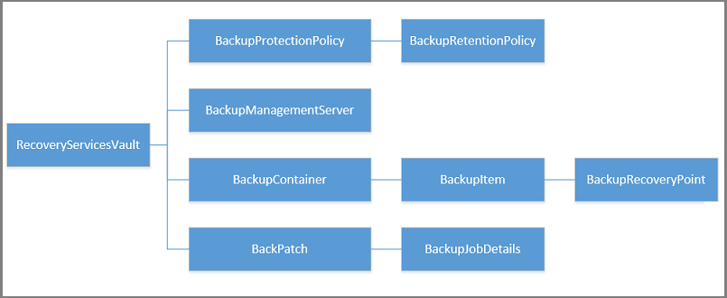
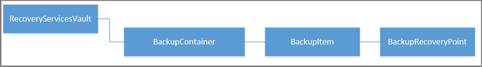

<properties
   pageTitle="Deploy and manage backups for Resource Manager-deployed VMs using PowerShell | Microsoft Azure"
   description="Use PowerShell to deploy and manage backups in Azure for Resource Manager-deployed VMs"
   services="backup"
   documentationCenter=""
   authors="markgalioto"
   manager="cfreeman"
   editor=""/>

<tags
   ms.service="backup"
   ms.devlang="na"
   ms.topic="article"
   ms.tgt_pltfrm="na"
   ms.workload="storage-backup-recovery"
   ms.date="08/03/2016"
   ms.author="markgal; trinadhk"/>

# Deploy and manage backups for Resource Manager-deployed VMs using PowerShell

> [AZURE.SELECTOR]
- [Resource Manager](backup-azure-vms-automation.md)
- [Classic](backup-azure-vms-classic-automation.md)

This article shows you how to use Azure PowerShell cmdlets to back up and recover an Azure virtual machine (VM) from a Recovery Services vault. A Recovery Services vault is an Azure Resource Manager resource and is used to protect data and assets in both Azure Backup and Azure Site Recovery services. You can use a Recovery Services vault to protect Azure Service Manager-deployed VMs, as well as Azure Resource Manager-deployed VMs.

>[AZURE.NOTE] Azure has two deployment models for creating and working with resources: [Resource Manager and Classic](../resource-manager-deployment-model.md). This article is for use with VMs created using the Resource Manager model.

This article walks you through using PowerShell to protect a VM, and restore data from a recovery point.

## Concepts

If you are not familiar with the Azure Backup service, for an overview of the service, check out [What is Azure Backup?](backup-introduction-to-azure-backup.md) Before you start, ensure that you cover the essentials about the prerequisites needed to work with Azure Backup, and the limitations of the current VM backup solution.

In order to use PowerShell effectively, it is necessary to understand the hierarchy of objects and from where to start.



To view the AzureRmRecoveryServicesBackup PowerShell cmdlet reference, see the [Azure Backup - Recovery Services Cmdlets](https://msdn.microsoft.com/library/mt723320.aspx) in the Azure library.
To view the AzureRmRecoveryServicesVault PowerShell cmdlet reference, see the [Azure Recovery Service Cmdlets](https://msdn.microsoft.com/library/mt643905.aspx).


## Setup and Registration

To begin:

1. [Download the latest version of PowerShell](https://github.com/Azure/azure-powershell/releases) (the minimum version required is : 1.4.0)

2. Find the Azure Backup PowerShell cmdlets available by typing the following command:

```
PS C:\> Get-Command *azurermrecoveryservices*

CommandType     Name                                               Version    Source
-----------     ----                                               -------    ------
Cmdlet          Backup-AzureRmRecoveryServicesBackupItem           1.4.0      AzureRM.RecoveryServices.Backup
Cmdlet          Disable-AzureRmRecoveryServicesBackupProtection    1.4.0      AzureRM.RecoveryServices.Backup
Cmdlet          Enable-AzureRmRecoveryServicesBackupProtection     1.4.0      AzureRM.RecoveryServices.Backup
Cmdlet          Get-AzureRmRecoveryServicesBackupContainer         1.4.0      AzureRM.RecoveryServices.Backup
Cmdlet          Get-AzureRmRecoveryServicesBackupItem              1.4.0      AzureRM.RecoveryServices.Backup
Cmdlet          Get-AzureRmRecoveryServicesBackupJob               1.4.0      AzureRM.RecoveryServices.Backup
Cmdlet          Get-AzureRmRecoveryServicesBackupJobDetails        1.4.0      AzureRM.RecoveryServices.Backup
Cmdlet          Get-AzureRmRecoveryServicesBackupManagementServer  1.4.0      AzureRM.RecoveryServices.Backup
Cmdlet          Get-AzureRmRecoveryServicesBackupProperties        1.4.0      AzureRM.RecoveryServices
Cmdlet          Get-AzureRmRecoveryServicesBackupProtectionPolicy  1.4.0      AzureRM.RecoveryServices.Backup
Cmdlet          Get-AzureRMRecoveryServicesBackupRecoveryPoint     1.4.0      AzureRM.RecoveryServices.Backup
Cmdlet          Get-AzureRmRecoveryServicesBackupRetentionPolic... 1.4.0      AzureRM.RecoveryServices.Backup
Cmdlet          Get-AzureRmRecoveryServicesBackupSchedulePolicy... 1.4.0      AzureRM.RecoveryServices.Backup
Cmdlet          Get-AzureRmRecoveryServicesVault                   1.4.0      AzureRM.RecoveryServices
Cmdlet          Get-AzureRmRecoveryServicesVaultSettingsFile       1.4.0      AzureRM.RecoveryServices
Cmdlet          New-AzureRmRecoveryServicesBackupProtectionPolicy  1.4.0      AzureRM.RecoveryServices.Backup
Cmdlet          New-AzureRmRecoveryServicesVault                   1.4.0      AzureRM.RecoveryServices
Cmdlet          Remove-AzureRmRecoveryServicesProtectionPolicy     1.4.0      AzureRM.RecoveryServices.Backup
Cmdlet          Remove-AzureRmRecoveryServicesVault                1.4.0      AzureRM.RecoveryServices
Cmdlet          Restore-AzureRMRecoveryServicesBackupItem          1.4.0      AzureRM.RecoveryServices.Backup
Cmdlet          Set-AzureRmRecoveryServicesBackupProperties        1.4.0      AzureRM.RecoveryServices
Cmdlet          Set-AzureRmRecoveryServicesBackupProtectionPolicy  1.4.0      AzureRM.RecoveryServices.Backup
Cmdlet          Set-AzureRmRecoveryServicesVaultContext            1.4.0      AzureRM.RecoveryServices
Cmdlet          Stop-AzureRmRecoveryServicesBackupJob              1.4.0      AzureRM.RecoveryServices.Backup
Cmdlet          Unregister-AzureRmRecoveryServicesBackupContainer  1.4.0      AzureRM.RecoveryServices.Backup
Cmdlet          Unregister-AzureRmRecoveryServicesBackupManagem... 1.4.0      AzureRM.RecoveryServices.Backup
Cmdlet          Wait-AzureRmRecoveryServicesBackupJob              1.4.0      AzureRM.RecoveryServices.Backup
```


The following tasks can be automated with PowerShell:

- Create a Recovery Services vault
- Backup or protect Azure VMs
- Trigger a backup job
- Monitor a backup job
- Restore an Azure VM

## Create a recovery services vault

The following steps lead you through creating a Recovery Services vault. A Recovery Services vault is different than a Backup vault.

1. If you are using Azure Backup for the first time, you must use the **[Register-AzureRMResourceProvider](https://msdn.microsoft.com/library/mt679020.aspx)** cmdlet to register the Azure Recovery Service provider with your subscription.

    ```
    PS C:\> Register-AzureRmResourceProvider -ProviderNamespace "Microsoft.RecoveryServices"
    ```

2. The Recovery Services vault is an Resource Manager resource, so you need to place it within a resource group. You can use an existing resource group, or create a new resource group with the **[New-AzureRmResourceGroup](https://msdn.microsoft.com/library/mt678985.aspx)** cmdlet. When creating a new resource group, specify the name and location for the resource group.  

    ```
    PS C:\> New-AzureRmResourceGroup –Name "test-rg" –Location "West US"
    ```

3. Use the **[New-AzureRmRecoveryServicesVault](https://msdn.microsoft.com/library/mt643910.aspx)** cmdlet to create the new vault. Be sure to specify the same location for the vault as was used for the resource group.

    ```
    PS C:\> New-AzureRmRecoveryServicesVault -Name "testvault" -ResourceGroupName " test-rg" -Location "West US"
    ```

4. Specify the type of storage redundancy to use; you can use [Locally Redundant Storage (LRS)](../storage/storage-redundancy.md#locally-redundant-storage) or [Geo Redundant Storage (GRS)](../storage/storage-redundancy.md#geo-redundant-storage). The following example shows the -BackupStorageRedundancy option for testVault is set to GeoRedundant.

    ```
    PS C:\> $vault1 = Get-AzureRmRecoveryServicesVault –Name "testVault"
    PS C:\> Set-AzureRmRecoveryServicesBackupProperties  -Vault $vault1 -BackupStorageRedundancy GeoRedundant
    ```

    > [AZURE.TIP] Many Azure Backup cmdlets require the Recovery Services vault object as an input. For this reason, it is convenient to store the Backup Recovery Services vault object in a variable.

## View the vaults in a subscription
Use **[Get-AzureRmRecoveryServicesVault](https://msdn.microsoft.com/library/mt643907.aspx)** to view the list of all vaults in the current subscription. You can use this command to check that a new  vault was created, or to see what vaults are available in the subscription.

Run the command, Get-AzureRmRecoveryServicesVault, and all vaults in the subscription are listed.

```
PS C:\> Get-AzureRmRecoveryServicesVault
Name              : Contoso-vault
ID                : /subscriptions/1234
Type              : Microsoft.RecoveryServices/vaults
Location          : WestUS
ResourceGroupName : Contoso-docs-rg
SubscriptionId    : 1234-567f-8910-abc
Properties        : Microsoft.Azure.Commands.RecoveryServices.ARSVaultProperties
```


## Backup Azure VMs
Now that you have created a recovery services vault, you can use it to protect a virtual machine. However before you apply the protection, you must set the vault context and you will want to verify the protection policy. Vault context defines the type of data that is protected in the vault. The protection policy is the schedule for when the backup job is run, and how long each backup snapshot is retained.

Before enabling protection on a VM, you must set the vault context. The context is applied to all subsequent cmdlets.

```
PS C:\> Get-AzureRmRecoveryServicesVault -Name testvault | Set-AzureRmRecoveryServicesVaultContext
```

### Create a protection policy

When you create a new vault, it comes with a default policy. This policy triggers a backup job each day at a specified time. Per the default policy, the backup snapshot is retained for 30 days. You can use the default policy to quickly protect your VM and edit the policy later with different details.

Use **[Get-AzureRmRecoveryServicesBackupProtectionPolicy](https://msdn.microsoft.com/library/mt723300.aspx)** to view the available list of policies in the vault :

```
PS C:\> Get-AzureRmRecoveryServicesBackupProtectionPolicy -WorkloadType AzureVM
Name                 WorkloadType       BackupManagementType BackupTime                DaysOfWeek
----                 ------------       -------------------- ----------                ----------
DefaultPolicy        AzureVM            AzureVM              4/14/2016 5:00:00 PM
```

> [AZURE.NOTE] The timezone of the BackupTime field in PowerShell is UTC. However, when the backup time is shown in the Azure portal, the time is adjusted to your local timezone.

A backup protection policy is associated with at least one retention policy.  Retention policy defines how long a recovery point is kept with Azure Backup. Use **Get-AzureRmRecoveryServicesBackupRetentionPolicyObject** to view the default retention policy.  Similarly you can use **Get-AzureRmRecoveryServicesBackupSchedulePolicyObject** to obtain the default schedule policy. The schedule and retention policy objects are used as inputs to the **New-AzureRmRecoveryServicesBackupProtectionPolicy** cmdlet.

A backup protection policy defines when and how often the backup of an item is done. The New-AzureRmRecoveryServicesBackupProtectionPolicy cmdlet creates a PowerShell object that holds backup policy information. The backup policy is used as an input to the Enable-AzureRmRecoveryServicesBackupProtection cmdlet.

```
PS C:\> $schPol = Get-AzureRmRecoveryServicesBackupSchedulePolicyObject -WorkloadType "AzureVM"
PS C:\>  $retPol = Get-AzureRmRecoveryServicesBackupRetentionPolicyObject -WorkloadType "AzureVM"
PS C:\>  New-AzureRmRecoveryServicesBackupProtectionPolicy -Name "NewPolicy" -WorkloadType AzureVM -RetentionPolicy $retPol -SchedulePolicy $schPol
Name                 WorkloadType       BackupManagementType BackupTime                DaysOfWeek
----                 ------------       -------------------- ----------                ----------
NewPolicy           AzureVM            AzureVM              4/24/2016 1:30:00 AM
```

### Enable protection

Enabling protection involves two objects - the item and the policy. Both objects are required to enable protection on the vault. Once the policy has been associated with the vault, the backup workflow is triggered at the time defined in the policy schedule.

To enable the protection on non-encrypted ARM VMs

```
PS C:\> $pol=Get-AzureRmRecoveryServicesBackupProtectionPolicy -Name "NewPolicy"
PS C:\> Enable-AzureRmRecoveryServicesBackupProtection -Policy $pol -Name "V2VM" -ResourceGroupName "RGName1"
```

To enable the protection on encrypted VMs[encrypted using BEK and KEK], you need to give permissions for Azure Backup service to read keys and secrets from key vault. 

```
PS C:\> Set-AzureRmKeyVaultAccessPolicy -VaultName 'KeyVaultName' -ResourceGroupName 'RGNameOfKeyVault' -PermissionsToKeys backup,get,list -PermissionsToSecrets get,list -ServicePrincipalName 262044b1-e2ce-469f-a196-69ab7ada62d3
PS C:\> $pol=Get-AzureRmRecoveryServicesBackupProtectionPolicy -Name "NewPolicy"
PS C:\> Enable-AzureRmRecoveryServicesBackupProtection -Policy $pol -Name "V2VM" -ResourceGroupName "RGName1"
```

For ASM based VMs

```
PS C:\>  $pol=Get-AzureRmRecoveryServicesBackupProtectionPolicy -Name "NewPolicy"
PS C:\>  Enable-AzureRmRecoveryServicesBackupProtection -Policy $pol -Name "V1VM" -ServiceName "ServiceName1"
```

### Modify a protection policy

In order to modify the policy, modify the BackupSchedulePolicyObject or BackupRetentionPolicy object and modify the policy using Set-AzureRmRecoveryServicesBackupProtectionPolicy

The following example changes the retention count to 365.

```
PS C:\> $retPol = Get-AzureRmRecoveryServicesBackupRetentionPolicyObject -WorkloadType "AzureVM"
PS C:\> $retPol.DailySchedule.DurationCountInDays = 365
PS C:\> $pol= Get-AzureRmRecoveryServicesBackupProtectionPolicy -Name NewPolicy
PS C:\> Set-AzureRmRecoveryServicesBackupProtectionPolicy -Policy $pol  -RetentionPolicy  $RetPol
```

## Run an initial backup

The backup schedule triggers a full back up on the initial back up for the item. On subsequent back ups, the back up is an incremental copy. If you want to force the initial backup to happen at a certain time or even immediately then use the **[Backup-AzureRmRecoveryServicesBackupItem](https://msdn.microsoft.com/library/mt723312.aspx)** cmdlet:

```
PS C:\> $namedContainer = Get-AzureRmRecoveryServicesBackupContainer -ContainerType "AzureVM" -Status "Registered" -Name "V2VM"
PS C:\> $item = Get-AzureRmRecoveryServicesBackupItem -Container $namedContainer -WorkloadType "AzureVM"
PS C:\> $job = Backup-AzureRmRecoveryServicesBackupItem -Item $item
WorkloadName     Operation            Status               StartTime                 EndTime                   JobID
------------     ---------            ------               ---------                 -------                   ----------
V2VM              Backup               InProgress            4/23/2016 5:00:30 PM                       cf4b3ef5-2fac-4c8e-a215-d2eba4124f27
```

> [AZURE.NOTE: The timezone of the StartTime and EndTime fields in PowerShell is UTC. However, when the time is shown in the Azure portal, the time is adjusted to your local timezone.

## Monitoring a backup job

Most long-running operations in Azure Backup are modelled as a job. This makes it easy to track progress without having to keep the Azure portal open at all times.

To get the latest status of an in-progress job, use the Get-AzureRmRecoveryservicesBackupJob cmdlet.

```
PS C:\ > $joblist = Get-AzureRmRecoveryservicesBackupJob –Status InProgress
PS C:\ > $joblist[0]
WorkloadName     Operation            Status               StartTime                 EndTime                   JobID
------------     ---------            ------               ---------                 -------                   ----------
V2VM             Backup               InProgress            4/23/2016 5:00:30 PM           cf4b3ef5-2fac-4c8e-a215-d2eba4124f27
```

Instead of polling these jobs for completion - which is unnecessary additional code - use the  **[Wait-AzureRmRecoveryServicesBackupJob](https://msdn.microsoft.com/library/mt723321.aspx)** cmdlet. This  cmdlet pauses the execution until either the job completes or the specified timeout value is reached.

```
PS C:\> Wait-AzureRmRecoveryServicesBackupJob -Job $joblist[0] -Timeout 43200
```

## Restore an Azure VM

There is a key difference between the restoring a VM using the Azure portal and restoring a VM using PowerShell. With PowerShell, the restore operation is complete once the disks and configuration information from the recovery point are created. The restore operation does not create a virtual machine. The instructions for creating the virtual machine from disks are provided. However, to fully restore a VM, you need to work through the following procedures:

- Select the VM
- Choose a recovery point
- Restore the disks
- Create the VM from stored disks

The graphic below shows the object hierarchy from the RecoveryServicesVault down to the BackupRecoveryPoint.



In order to restore backup data, identify the backed-up item and the recovery point that holds the point-in-time data. Then use the **[Restore-AzureRmRecoveryServicesBackupItem](https://msdn.microsoft.com/library/mt723316.aspx)** cmdlet to restore data from the vault to the customer's account.

### Select the VM

To get the PowerShell object that identifies the right backup item, start from the container in the vault, and work your way down the object hierarchy. To select the container that represents the VM, use the **[Get-AzureRmRecoveryServicesBackupContainer](https://msdn.microsoft.com/library/mt723319.aspx)** cmdlet and pipe that to the **[Get-AzureRmRecoveryServicesBackupItem](https://msdn.microsoft.com/library/mt723305.aspx)** cmdlet.

```
PS C:\> $namedContainer = Get-AzureRmRecoveryServicesBackupContainer  -ContainerType AzureVM –Status Registered -Name 'V2VM'
PS C:\> $backupitem = Get-AzureRmRecoveryServicesBackupItem –Container $namedContainer  –WorkloadType "AzureVM"
```

### Choose a recovery point

Use the **[Get-AzureRmRecoveryServicesBackupRecoveryPoint](https://msdn.microsoft.com/library/mt723308.aspx)** cmdlet to list all the recovery points for the backup item. Then choose the recovery point to restore. If you are unsure which recovery point to use, it is a good practice to choose the most recent RecoveryPointType = AppConsistent point in the list.

In the following script, the variable, **$rp**, is an array of recovery points for the selected backup item. The array is sorted in reverse order of time with the latest recovery point at index 0. Use standard PowerShell array indexing to pick the recovery point. For example: $rp[0] will select the latest recovery point.

```
PS C:\> $startDate = (Get-Date).AddDays(-7)
PS C:\> $endDate = Get-Date
PS C:\> $rp = Get-AzureRmRecoveryServicesBackupRecoveryPoint -Item $backupitem -StartDate $startdate.ToUniversalTime() -EndDate $enddate.ToUniversalTime()
PS C:\> $rp[0]
RecoveryPointAdditionalInfo :
SourceVMStorageType         : NormalStorage
Name                        : 15260861925810
ItemName                    : VM;iaasvmcontainer;RGName1;V2VM
RecoveryPointId             : /subscriptions/XX/resourceGroups/ RGName1/providers/Microsoft.RecoveryServices/vaults/testvault/backupFabrics/Azure/protectionContainers/IaasVMContainer;iaasvmcontainer;RGName1;V2VM/protectedItems/VM;iaasvmcontainer; RGName1;V2VM
                              /recoveryPoints/15260861925810
RecoveryPointType           : AppConsistent
RecoveryPointTime           : 4/23/2016 5:02:04 PM
WorkloadType                : AzureVM
ContainerName               : IaasVMContainer;iaasvmcontainer; RGName1;V2VM
ContainerType               : AzureVM
BackupManagementType        : AzureVM
```


### Restore the disks

Use the **[Restore-AzureRmRecoveryServicesBackupItem](https://msdn.microsoft.com/library/mt723316.aspx)** cmdlet to restore data and configuration for a Backup item, to a recovery point. Once you have identified a recovery point use it as the value for the **-RecoveryPoint** parameter. In the previous example code, **$rp[0]** was chosen as the recovery point to use. In the sample code below, **$rp[0]** is specified as the recovery point to use for restoring to disk.

To restore the disks and configuration information

```
PS C:\> $restorejob = Restore-AzureRmRecoveryServicesBackupItem -RecoveryPoint $rp[0] -StorageAccountName DestAccount -StorageAccountResourceGroupName DestRG
PS C:\> $restorejob
WorkloadName     Operation          Status               StartTime                 EndTime            JobID
------------     ---------          ------               ---------                 -------          ----------
V2VM              Restore           InProgress           4/23/2016 5:00:30 PM                        cf4b3ef5-2fac-4c8e-a215-d2eba4124f27
```

Once the Restore job has completed, use the **[Get-AzureRmRecoveryServicesBackupJobDetails](https://msdn.microsoft.com/library/mt723310.aspx)** cmdlet to get the details of the restore operation. The JobDetails property has the information needed to rebuild the VM.

```
PS C:\> $restorejob = Get-AzureRmRecoveryServicesBackupJob -Job $restorejob
PS C:\> $details = Get-AzureRmRecoveryServicesBackupJobDetails
```

Once you restore the disks, go to the next section for information on creating the VM.

### Create a VM from restored disks

After you have restored the disks, use these steps to create and configure the virtual machine from disk.

1. Query the restored disk properties for the job details.

    ```
    PS C:\> $properties = $details.properties
    PS C:\> $storageAccountName = $properties["Target Storage Account Name"]
    PS C:\> $containerName = $properties["Config Blob Container Name"]
    PS C:\> $blobName = $properties["Config Blob Name"]
    ```

2. Set the Azure storage context and restore the JSON configuration file.

    ```
    Set -AzureRmCurrentStorageAccount -Name $storageaccountname -ResourceGroupName testvault
    PS C:\> $destination_path = "C:\vmconfig.json"
    Get-AzureStorageBlobContent -Container $containerName -Blob $blobName -Destination
    PS C:\> $destination_path -Context $storageContext
    PS C:\> $obj = ((Get-Content -Path $destination_path -Encoding Unicode)).TrimEnd([char]0x00) | ConvertFrom-Json
    ```

3. Use the JSON configuration file to create the VM configuration.

    ```
  PS C:\> $vm = New-AzureRmVMConfig -VMSize $obj.HardwareProfile.VirtualMachineSize -VMName "testrestore"
    ```

4. Attach the OS disk and data disks.
   For non-encrypted VMs,

    ```
    PS C:\> Set-AzureRmVMOSDisk -VM $vm -Name "osdisk" -VhdUri $obj.StorageProfile.OSDisk.VirtualHardDisk.Uri -CreateOption “Attach”
    PS C:\> $vm.StorageProfile.OsDisk.OsType = $obj.StorageProfile.OSDisk.OperatingSystemType foreach($dd in $obj.StorageProfile.DataDisks)
    {
    $vm = Add-AzureRmVMDataDisk -VM $vm -Name "datadisk1" -VhdUri $dd.VirtualHardDisk.Uri -DiskSizeInGB 127 -Lun $dd.Lun -CreateOption Attach
    }
    ```
   
   For encrypted VMs, you need to specify [Key vault information](https://msdn.microsoft.com/library/dn868052.aspx) before you can attach disks.
   
   ```
   PS C:\> Set-AzureRmVMOSDisk -VM $vm -Name "osdisk" -VhdUri $obj.StorageProfile.OSDisk.VirtualHardDisk.Uri -DiskEncryptionKeyUrl "https://ContosoKeyVault.vault.azure.net:443/secrets/ContosoSecret007" -DiskEncryptionKeyVaultId "/subscriptions/abcdedf007-4xyz-1a2b-0000-12a2b345675c/resourceGroups/ContosoRG108/providers/Microsoft.KeyVault/vaults/ContosoKeyVault" -KeyEncryptionKeyUrl "https://ContosoKeyVault.vault.azure.net:443/keys/ContosoKey007" -KeyEncryptionKeyVaultId "subscriptions/abcdedf007-4xyz-1a2b-0000-12a2b345675c/resourceGroups/ContosoRG108/providers/Microsoft.KeyVault/vaults/ContosoKeyVault" -CreateOption "Attach" -Windows
   PS C:\> $vm.StorageProfile.OsDisk.OsType = $obj.StorageProfile.OSDisk.OperatingSystemType foreach($dd in $obj.StorageProfile.DataDisks)
    {
    $vm = Add-AzureRmVMDataDisk -VM $vm -Name "datadisk1" -VhdUri $dd.VirtualHardDisk.Uri -DiskSizeInGB 127 -Lun $dd.Lun -CreateOption Attach
    }
   ```
   
5. Set the Network settings.

    ```
    PS C:\> $nicName="p1234"
    PS C:\> $pip = New-AzureRmPublicIpAddress -Name $nicName -ResourceGroupName "test" -Location "WestUS" -AllocationMethod Dynamic
    PS C:\> $vnet = Get-AzureRmVirtualNetwork -Name "testvNET" -ResourceGroupName "test"
    PS C:\> $nic = New-AzureRmNetworkInterface -Name $nicName -ResourceGroupName "test" -Location "WestUS" -SubnetId $vnet.Subnets[$subnetindex].Id -PublicIpAddressId $pip.Id
    PS C:\> $vm=Add-AzureRmVMNetworkInterface -VM $vm -Id $nic.Id
    ```

6. Create the virtual machine.

    ```
    PS C:\> $vm.StorageProfile.OsDisk.OsType = $obj.StorageProfile.OSDisk.OperatingSystemType
    PS C:\> New-AzureRmVM -ResourceGroupName "test" -Location "WestUS" -VM $vm
    ```

## Next steps

If you prefer using PowerShell to engage with your Azure resources, check out the PowerShell article for protecting Windows Server, [Deploy and Manage Backup for Windows Server](./backup-client-automation.md). There is also a PowerShell article for managing DPM backups, [Deploy and Manage Backup for DPM](./backup-dpm-automation.md). Both of these articles have a version for Resource Manager deployments as well as Classic deployments.  
