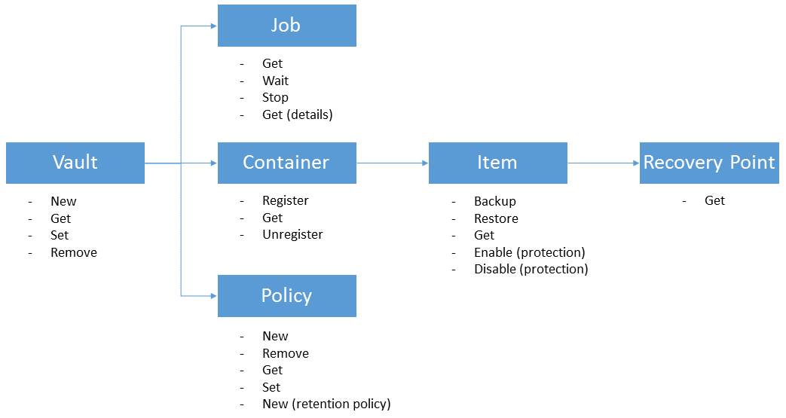

<properties
	pageTitle="Deploy and manage backup for Azure VMs using PowerShell | Microsoft Azure"
	description="Learn how to deploy and manage Azure Backup using PowerShell"
	services="backup"
	documentationCenter=""
	authors="markgalioto"
	manager="cfreeman"
	editor=""/>

<tags
	ms.service="backup"
	ms.workload="storage-backup-recovery"
	ms.tgt_pltfrm="na"
	ms.devlang="na"
	ms.topic="article"
	ms.date="08/08/2016"
	ms.author="markgal;trinadhk;jimpark" />


# Deploy and manage backup for Azure VMs using PowerShell

> [AZURE.SELECTOR]
- [Resource Manager](backup-azure-vms-automation.md)
- [Classic](backup-azure-vms-classic-automation.md)

This article shows you how to use Azure PowerShell for backup and recovery of Azure VMs. Azure has two different deployment models for creating and working with resources: Resouce Manager and Classic. This article covers using the Classic deployment model. Microsoft recommends that most new deployments use the Resource Manager model.

## Concepts


This article provides information specific to the PowerShell cmdlets used to back up virtual machines. For introductory information about protecting Azure VMs, please see [Plan your VM backup infrastructure in Azure](backup-azure-vms-introduction.md).

> [AZURE.NOTE] Before you start, read the [prerequisites](backup-azure-vms-prepare.md) required to work with Azure Backup, and the [limitations](backup-azure-vms-prepare.md#limitations) of the current VM backup solution.

To use PowerShell effectively, take a moment to understand the hierarchy of objects and from where to start.



The two most important flows are enabling protection for a VM, and restoring data from a recovery point. The focus of this article is to help you become adept at working with the PowerShell cmdlets to enable these two scenarios.


## Setup and Registration
To begin:

1. [Download latest PowerShell](https://github.com/Azure/azure-powershell/releases) (minimum version required is : 1.0.0)

2. Find the Azure Backup PowerShell cmdlets available by typing the following command:

```
PS C:\> Get-Command *azurermbackup*

CommandType     Name                                               Version    Source
-----------     ----                                               -------    ------
Cmdlet          Backup-AzureRmBackupItem                           1.0.1      AzureRM.Backup
Cmdlet          Disable-AzureRmBackupProtection                    1.0.1      AzureRM.Backup
Cmdlet          Enable-AzureRmBackupContainerReregistration        1.0.1      AzureRM.Backup
Cmdlet          Enable-AzureRmBackupProtection                     1.0.1      AzureRM.Backup
Cmdlet          Get-AzureRmBackupContainer                         1.0.1      AzureRM.Backup
Cmdlet          Get-AzureRmBackupItem                              1.0.1      AzureRM.Backup
Cmdlet          Get-AzureRmBackupJob                               1.0.1      AzureRM.Backup
Cmdlet          Get-AzureRmBackupJobDetails                        1.0.1      AzureRM.Backup
Cmdlet          Get-AzureRmBackupProtectionPolicy                  1.0.1      AzureRM.Backup
Cmdlet          Get-AzureRmBackupRecoveryPoint                     1.0.1      AzureRM.Backup
Cmdlet          Get-AzureRmBackupVault                             1.0.1      AzureRM.Backup
Cmdlet          Get-AzureRmBackupVaultCredentials                  1.0.1      AzureRM.Backup
Cmdlet          New-AzureRmBackupProtectionPolicy                  1.0.1      AzureRM.Backup
Cmdlet          New-AzureRmBackupRetentionPolicyObject             1.0.1      AzureRM.Backup
Cmdlet          New-AzureRmBackupVault                             1.0.1      AzureRM.Backup
Cmdlet          Register-AzureRmBackupContainer                    1.0.1      AzureRM.Backup
Cmdlet          Remove-AzureRmBackupProtectionPolicy               1.0.1      AzureRM.Backup
Cmdlet          Remove-AzureRmBackupVault                          1.0.1      AzureRM.Backup
Cmdlet          Restore-AzureRmBackupItem                          1.0.1      AzureRM.Backup
Cmdlet          Set-AzureRmBackupProtectionPolicy                  1.0.1      AzureRM.Backup
Cmdlet          Set-AzureRmBackupVault                             1.0.1      AzureRM.Backup
Cmdlet          Stop-AzureRmBackupJob                              1.0.1      AzureRM.Backup
Cmdlet          Unregister-AzureRmBackupContainer                  1.0.1      AzureRM.Backup
Cmdlet          Wait-AzureRmBackupJob                              1.0.1      AzureRM.Backup
```

The following setup and registration tasks can be automated with PowerShell:

- Create a backup vault
- Registering the VMs with the Azure Backup service

### Create a backup vault

> [AZURE.WARNING] For customers using Azure Backup for the first time, you need to register the Azure Backup provider to be used with your subscription. This can be done by running the following command: Register-AzureRmResourceProvider -ProviderNamespace "Microsoft.Backup"

You can create a new backup vault using the **New-AzureRmBackupVault** cmdlet. The backup vault is an ARM resource, so you need to place it within a Resource Group. In an elevated Azure PowerShell console, run the following commands:

```
PS C:\> New-AzureRmResourceGroup –Name “test-rg” –Location “West US”
PS C:\> $backupvault = New-AzureRmBackupVault –ResourceGroupName “test-rg” –Name “test-vault” –Region “West US” –Storage GeoRedundant
```

You can get a list of all the backup vaults in a given subscription using the **Get-AzureRmBackupVault** cmdlet.

> [AZURE.NOTE] It is convenient to store the backup vault object into a variable. The vault object is needed as an input for many Azure Backup cmdlets.


### Registering the VMs
The first step towards configuring backup with Azure Backup is to register your machine or VM with an Azure Backup vault. The **Register-AzureRmBackupContainer** cmdlet takes the input information of an Azure IaaS virtual machine and registers it with the specified vault. The register operation associates the Azure virtual machine with the backup vault and tracks the VM through the backup lifecycle.

Registering your VM with the Azure Backup service creates a top-level container object. A container typically contains multiple items that can be backed up, but in the case of VMs there will be only one backup item for the container.

```
PS C:\> $registerjob = Register-AzureRmBackupContainer -Vault $backupvault -Name "testvm" -ServiceName "testvm"
```

## Backup Azure VMs

### Create a protection policy
It is not mandatory to create a new protection policy to start backup of your VMs. The vault comes with a 'Default Policy' that can be used to quickly enable protection, and then edited later with the right details. You can get a list of the policies available in the vault by using the **Get-AzureRmBackupProtectionPolicy** cmdlet:

```
PS C:\> Get-AzureRmBackupProtectionPolicy -Vault $backupvault

Name                      Type               ScheduleType       BackupTime
----                      ----               ------------       ----------
DefaultPolicy             AzureVM            Daily              26-Aug-15 12:30:00 AM
```

> [AZURE.NOTE] The timezone of the BackupTime field in PowerShell is UTC. However, when the backup time is shown in the Azure portal, the timezone is aligned to your local system along with the UTC offset.

A backup policy is associated with at least one retention policy. The retention policy defines how long a recovery point is kept with Azure Backup. The **New-AzureRmBackupRetentionPolicy** cmdlet creates PowerShell objects that hold retention policy information. These retention policy objects are used as inputs to the *New-AzureRmBackupProtectionPolicy* cmdlet, or directly with the *Enable-AzureRmBackupProtection* cmdlet.

A backup policy defines when and how often the backup of an item is done. The **New-AzureRmBackupProtectionPolicy** cmdlet creates a PowerShell object that holds backup policy information. The backup policy is used as an input to the *Enable-AzureRmBackupProtection* cmdlet.

```
PS C:\> $Daily = New-AzureRmBackupRetentionPolicyObject -DailyRetention -Retention 30
PS C:\> $newpolicy = New-AzureRmBackupProtectionPolicy -Name DailyBackup01 -Type AzureVM -Daily -BackupTime ([datetime]"3:30 PM") -RetentionPolicy $Daily -Vault $backupvault

Name                      Type               ScheduleType       BackupTime
----                      ----               ------------       ----------
DailyBackup01             AzureVM            Daily              01-Sep-15 3:30:00 PM
```

### Enable protection
Enabling protection involves two objects - the Item and the Policy, and both need to belong to the same vault. Once the policy has been associated with the item, the backup workflow will kick in at the defined schedule.

```
PS C:\> Get-AzureRmBackupContainer -Type AzureVM -Status Registered -Vault $backupvault | Get-AzureRmBackupItem | Enable-AzureRmBackupProtection -Policy $newpolicy
```

### Initial backup
The backup schedule will take care of doing the full initial copy for the item and the incremental copy for the subsequent backups. However, if you want to force the initial backup to happen at a certain time or even immediately then use the **Backup-AzureRmBackupItem** cmdlet:

```
PS C:\> $container = Get-AzureRmBackupContainer -Vault $backupvault -Type AzureVM -Name "testvm"
PS C:\> $backupjob = Get-AzureRmBackupItem -Container $container | Backup-AzureRmBackupItem
PS C:\> $backupjob

WorkloadName    Operation       Status          StartTime              EndTime
------------    ---------       ------          ---------              -------
testvm          Backup          InProgress      01-Sep-15 12:24:01 PM  01-Jan-01 12:00:00 AM
```

> [AZURE.NOTE] The timezone of the StartTime and EndTime fields shown in PowerShell is UTC. However, when the similar information is shown in the Azure portal, the timezone is aligned to your local system clock.

### Monitoring a backup job
Most long-running operations in Azure Backup are modelled as a job. This makes it easy to track progress without having to keep the Azure portal open at all times.

To get the latest status of an in-progress job, use the **Get-AzureRmBackupJob** cmdlet.

```
PS C:\> $joblist = Get-AzureRmBackupJob -Vault $backupvault -Status InProgress
PS C:\> $joblist[0]

WorkloadName    Operation       Status          StartTime              EndTime
------------    ---------       ------          ---------              -------
testvm          Backup          InProgress      01-Sep-15 12:24:01 PM  01-Jan-01 12:00:00 AM
```

Instead of polling these jobs for completion - which is unnecessary, additional code - it is simpler to use the **Wait-AzureRmBackupJob** cmdlet. When used in a script, the cmdlet will pause the execution until either the job completes or the specified timeout value is reached.

```
PS C:\> Wait-AzureRmBackupJob -Job $joblist[0] -Timeout 43200
```


## Restore an Azure VM

In order to restore backup data, you need to identify the backed-up Item and the Recovery Point that holds the point-in-time data. This information is supplied to the Restore-AzureRmBackupItem cmdlet to initiate a restore of data from the vault to the customer's account.

### Select the VM

To get the PowerShell object that identifies the right backup Item, you need to start from the Container in the vault, and work your way down object hierarchy. To select the container that represents the VM, use the **Get-AzureRmBackupContainer** cmdlet and pipe that to the **Get-AzureRmBackupItem** cmdlet.

```
PS C:\> $backupitem = Get-AzureRmBackupContainer -Vault $backupvault -Type AzureVM -name "testvm" | Get-AzureRmBackupItem
```

### Choose a recovery point

You can now list all the recovery points for the backup item using the **Get-AzureRmBackupRecoveryPoint** cmdlet, and choose the recovery point to restore. Typically users pick the most recent *AppConsistent* point in the list.

```
PS C:\> $rp =  Get-AzureRmBackupRecoveryPoint -Item $backupitem
PS C:\> $rp

RecoveryPointId    RecoveryPointType  RecoveryPointTime      ContainerName
---------------    -----------------  -----------------      -------------
15273496567119     AppConsistent      01-Sep-15 12:27:38 PM  iaasvmcontainer;testvm;testv...
```

The variable ```$rp``` is an array of recovery points for the selected backup item, sorted in reverse order of time - the latest recovery point is at index 0. Use standard PowerShell array indexing to pick the recovery point. For example: ```$rp[0]``` will select the latest recovery point.

### Restoring disks

There is a key difference between the restore operations done through the Azure portal and through Azure PowerShell. With PowerShell, the restore operation stops at restoring the disks and config information from the recovery point. It does not create a virtual machine.

> [AZURE.WARNING] The Restore-AzureRmBackupItem does not create a VM. It only restores the disks to the specified storage account. This is not the same behavior you will experience in the Azure portal.

```
PS C:\> $restorejob = Restore-AzureRmBackupItem -StorageAccountName "DestAccount" -RecoveryPoint $rp[0]
PS C:\> $restorejob

WorkloadName    Operation       Status          StartTime              EndTime
------------    ---------       ------          ---------              -------
testvm          Restore         InProgress      01-Sep-15 1:14:01 PM   01-Jan-01 12:00:00 AM
```

You can get the details of the restore operation using the **Get-AzureRmBackupJobDetails** cmdlet once the Restore job has completed. The *ErrorDetails* property will have the information needed to rebuild the VM.

```
PS C:\> $restorejob = Get-AzureRmBackupJob -Job $restorejob
PS C:\> $details = Get-AzureRmBackupJobDetails -Job $restorejob
```

### Build the VM

Building the VM out of the restored disks can be done using the older Azure Service Management PowerShell cmdlets, the new Azure Resource Manager templates, or even using the Azure portal. In a quick example, we will show how to get there using the Azure Service Management cmdlets.

```
 $properties  = $details.Properties

 $storageAccountName = $properties["Target Storage Account Name"]
 $containerName = $properties["Config Blob Container Name"]
 $blobName = $properties["Config Blob Name"]

 $keys = Get-AzureStorageKey -StorageAccountName $storageAccountName
 $storageAccountKey = $keys.Primary
 $storageContext = New-AzureStorageContext -StorageAccountName $storageAccountName -StorageAccountKey $storageAccountKey


 $destination_path = "C:\Users\admin\Desktop\vmconfig.xml"
 Get-AzureStorageBlobContent -Container $containerName -Blob $blobName -Destination $destination_path -Context $storageContext


$obj = [xml](((Get-Content -Path $destination_path -Encoding UniCode)).TrimEnd([char]0x00))
 $pvr = $obj.PersistentVMRole
 $os = $pvr.OSVirtualHardDisk
 $dds = $pvr.DataVirtualHardDisks
 $osDisk = Add-AzureDisk -MediaLocation $os.MediaLink -OS $os.OS -DiskName "panbhaosdisk"
 $vm = New-AzureVMConfig -Name $pvr.RoleName -InstanceSize $pvr.RoleSize -DiskName $osDisk.DiskName

 if (!($dds -eq $null))
 {
	 foreach($d in $dds.DataVirtualHardDisk)
 	 {
		 $lun = 0
		 if(!($d.Lun -eq $null))
		 {
	 		 $lun = $d.Lun
		 }
		 $name = "panbhadataDisk" + $lun
     Add-AzureDisk -DiskName $name -MediaLocation $d.MediaLink
     $vm | Add-AzureDataDisk -Import -DiskName $name -LUN $lun
	}
}

New-AzureVM -ServiceName "panbhasample" -Location "SouthEast Asia" -VM $vm
```

For more information on how to build a VM from the restored disks, read about the following cmdlets:

- [Add-AzureDisk](https://msdn.microsoft.com/library/azure/dn495252.aspx)
- [New-AzureVMConfig](https://msdn.microsoft.com/library/azure/dn495159.aspx)
- [New-AzureVM](https://msdn.microsoft.com/library/azure/dn495254.aspx)

## Code samples

### 1. Get the completion status of job sub-tasks

To track the completion status of individual sub-tasks, you can use the **Get-AzureRmBackupJobDetails** cmdlet:

```
PS C:\> $details = Get-AzureRmBackupJobDetails -JobId $backupjob.InstanceId -Vault $backupvault
PS C:\> $details.SubTasks

Name                                                        Status
----                                                        ------
Take Snapshot                                               Completed
Transfer data to Backup vault                               InProgress
```

### 2. Create a daily/weekly report of backup jobs

Administrators typically want to know what backup jobs ran in the last 24 hours, the status of those backup jobs. Additionally, the amount of data transferred gives administrators a way to estimate their monthly data usage. The script below pulls the raw data from the Azure Backup service and displays the information in the PowerShell console.

```
param(  [Parameter(Mandatory=$True,Position=1)]
        [string]$backupvaultname,

        [Parameter(Mandatory=$False,Position=2)]
        [int]$numberofdays = 7)


#Initialize variables
$DAILYBACKUPSTATS = @()
$backupvault = Get-AzureRmBackupVault -Name $backupvaultname
$enddate = ([datetime]::Today).AddDays(1)
$startdate = ([datetime]::Today)

for( $i = 1; $i -le $numberofdays; $i++ )
{
    # We query one day at a time because pulling 7 days of data might be too much
    $dailyjoblist = Get-AzureRmBackupJob -Vault $backupvault -From $startdate -To $enddate -Type AzureVM -Operation Backup
    Write-Progress -Activity "Getting job information for the last $numberofdays days" -Status "Day -$i" -PercentComplete ([int]([decimal]$i*100/$numberofdays))

    foreach( $job in $dailyjoblist )
    {
        #Extract the information for the reports
        $newstatsobj = New-Object System.Object
        $newstatsobj | Add-Member -Type NoteProperty -Name Date -Value $startdate
        $newstatsobj | Add-Member -Type NoteProperty -Name VMName -Value $job.WorkloadName
        $newstatsobj | Add-Member -Type NoteProperty -Name Duration -Value $job.Duration
        $newstatsobj | Add-Member -Type NoteProperty -Name Status -Value $job.Status

        $details = Get-AzureRmBackupJobDetails -Job $job
        $newstatsobj | Add-Member -Type NoteProperty -Name BackupSize -Value $details.Properties["Backup Size"]
        $DAILYBACKUPSTATS += $newstatsobj
    }

    $enddate = $enddate.AddDays(-1)
    $startdate = $startdate.AddDays(-1)
}

$DAILYBACKUPSTATS | Out-GridView
```

If you want to add charting capabilities to this report output, learn from the TechNet blog post [Charting with PowerShell](http://blogs.technet.com/b/richard_macdonald/archive/2009/04/28/3231887.aspx)

## Next steps

If you prefer using PowerShell to engage with your Azure resources, check out the PowerShell article for protecting Windows Server, [Deploy and Manage Backup for Windows Server](./backup-client-automation-classic.md). There is also a PowerShell article for managing DPM backups, [Deploy and Manage Backup for DPM](./backup-dpm-automation-classic.md). Both of these articles have a version for Resource Manager deployments as well as Classic deployments.
