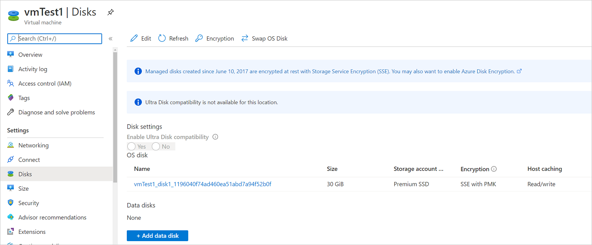
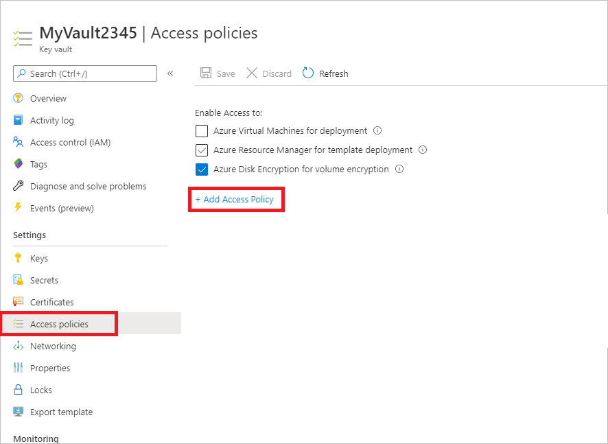

# Back up and restore encrypted Azure virtual machines

This article describes how to back up and restore Windows or Linux Azure virtual machines (VMs) with encrypted disks using the [Azure Backup](backup-overview.md) service. For more information, see [Encryption of Azure VM backups](backup-azure-vms-introduction.md#encryption-of-azure-vm-backups).

## Encryption using platform-managed keys

By default, all the disks in your VMs are automatically encrypted-at-rest using platform-managed keys (PMK) that use [storage service encryption](../storage/common/storage-service-encryption.md). You can back up these VMs using Azure Backup without any specific actions required to support encryption on your end. For more information about encryption with platform-managed keys, [see this article](../virtual-machines/disk-encryption.md#platform-managed-keys).



## Encryption using customer-managed keys

When you encrypt disks with customer-managed keys (CMK), the key used for encrypting the disks is stored in the Azure Key Vault and is managed by you. Storage Service Encryption (SSE) using CMK differs from Azure Disk Encryption (ADE) encryption. ADE uses the encryption tools of the operating system. SSE encrypts data in the storage service, enabling you to use any OS or images for your VMs.

You don't need to perform any explicit actions for backup or restore of VMs that use customer-managed keys for encrypting their disks. The backup data for these VMs stored in the vault will be encrypted with the same methods as the [encryption used on the vault](encryption-at-rest-with-cmk.md).

For more information about encryption of managed disks with customer-managed keys, see [this article](../virtual-machines/disk-encryption.md#customer-managed-keys).

## Encryption support using ADE

Azure Backup supports backup of Azure VMs that have their OS/data disks encrypted with Azure Disk Encryption (ADE). ADE uses BitLocker for encryption of Windows VMs, and the dm-crypt feature for Linux VMs. ADE integrates with Azure Key Vault to manage disk-encryption keys and secrets. Key Vault Key Encryption Keys (KEKs) can be used to add an additional layer of security, encrypting encryption secrets before writing them to Key Vault.

Azure Backup can back up and restore Azure VMs using ADE with and without the Azure AD app, as summarized in the following table.

**VM disk type** | **ADE (BEK/dm-crypt)** | **ADE and KEK**
--- | --- | ---
**Unmanaged** | Yes | Yes
**Managed**  | Yes | Yes

- Learn more about [ADE](../virtual-machines/disk-encryption-overview.md), [Key Vault](../key-vault/general/overview.md), and [KEKs](../virtual-machine-scale-sets/disk-encryption-key-vault.md#set-up-a-key-encryption-key-kek).
- Read the [FAQ](../virtual-machines/disk-encryption-overview.md) for Azure VM disk encryption.

### Limitations

- You can back up and restore ADE encrypted VMs within the same subscription.
- Azure Backup supports VMs encrypted using standalone keys. Any key that's a part of a certificate used to encrypt a VM isn't currently supported.
- Azure Backup supports Cross Region Restore of encrypted Azure VMs to the Azure paired regions. For more information, see [support matrix](./backup-support-matrix.md#cross-region-restore).
- ADE encrypted VMs can’t be recovered at the file/folder level. You need to recover the entire VM to restore files and folders.
- When restoring a VM, you can't use the [replace existing VM](backup-azure-arm-restore-vms.md#restore-options) option for ADE encrypted VMs. This option is only supported for unencrypted managed disks.

## Before you start

Before you start, do the following:

1. Make sure you have one or more [Windows](../virtual-machines/linux/disk-encryption-overview.md) or [Linux](../virtual-machines/linux/disk-encryption-overview.md) VMs with ADE enabled.
2. [Review the support matrix](backup-support-matrix-iaas.md) for Azure VM backup
3. [Create](backup-create-rs-vault.md) a Recovery Services Backup vault if you don't have one.
4. If you enable encryption for VMs that are already enabled for backup, you simply need to provide Backup with permissions to access the Key Vault so that backups can continue without disruption. [Learn more](#provide-permissions) about assigning these permissions.

In addition, there are a couple of things that you might need to do in some circumstances:

- **Install the VM agent on the VM**: Azure Backup backs up Azure VMs by installing an extension to the Azure VM agent running on the machine. If your VM was created from an Azure Marketplace image, the agent is installed and running. If you create a custom VM, or you migrate an on-premises machine, you might need to [install the agent manually](backup-azure-arm-vms-prepare.md#install-the-vm-agent).

## Configure a backup policy

1. If you haven't yet created a Recovery Services backup vault, follow [these instructions](backup-create-rs-vault.md).
1. Navigate to Backup center and click **+Backup**  from the **Overview** tab

    

1. Select **Azure Virtual machines** as the **Datasource type** and select the vault you have created, then click **Continue**.

     

1. Select the policy that you want to associate with the vault, then select **OK**.
   - A backup policy specifies when backups are taken, and how long they're stored.
   - The details of the default policy are listed under the drop-down menu.

   
    
1. If you don't want to use the default policy, select **Create New**, and [create a custom policy](backup-azure-arm-vms-prepare.md#create-a-custom-policy).

1. Under **Virtual Machines**, select **Add**.

    

1. Choose the encrypted VMs you want to back up using the select policy, and select **OK**.

      

1. If you're using Azure Key Vault, on the vault page, you'll see a message that Azure Backup needs read-only access to the keys and secrets in the Key Vault.

    - If you receive this message, no action is required.

        

    - If you receive this message, you need to set permissions as described in the [procedure below](#provide-permissions).

        

1. Select **Enable Backup** to deploy the backup policy in the vault, and enable backup for the selected VMs.

### Back up ADE encrypted VMs with RBAC enabled key vaults

To enable backups for ADE encrypted VMs using Azure RBAC enabled key vaults, you need to assign Key Vault Administrator role to the Backup Management Service Azure AD app by adding a role assignment in Access Control of key vault.

:::image type="content" source="./media/backup-azure-vms-encryption/enable-key-vault-encryption-inline.png" alt-text="Screenshot shows the checkbox to enable ADE encrypted key vault." lightbox="./media/backup-azure-vms-encryption/enable-key-vault-encryption-expanded.png":::

Learn about the [different available roles](../key-vault/general/rbac-guide.md?tabs=azure-cli#azure-built-in-roles-for-key-vault-data-plane-operations). The **Key Vault Administrator** role can allow permissions to *get*, *list*, and *back up* both secret and key.

For Azure RBAC enabled key vaults, you can create custom role with the following set of permissions. Learn [how to create custom role](../active-directory/roles/custom-create.md).

| Action | Description |
| --- | --- |
| Microsoft.KeyVault/vaults/keys/backup/action | Creates the backup file of a key.  |
| Microsoft.KeyVault/vaults/secrets/backup/action | Creates the backup file of a secret.  |
| Microsoft.KeyVault/vaults/secrets/getSecret/action | Gets the value of a secret.  |
| Microsoft.KeyVault/vaults/keys/read | List keys in the specified vault or read properties and public materials.  |
| Microsoft.KeyVault/vaults/secrets/readMetadata/action | List or view the properties of a secret, but not its values.    |

```json
"permissions": [
            {
                "actions": [],
                "notActions": [],
                "dataActions": [
                    "Microsoft.KeyVault/vaults/keys/backup/action",
                    "Microsoft.KeyVault/vaults/secrets/backup/action",
                    "Microsoft.KeyVault/vaults/secrets/getSecret/action",
                    "Microsoft.KeyVault/vaults/keys/read",
                    "Microsoft.KeyVault/vaults/secrets/readMetadata/action"
                ],
                "notDataActions": []
            }
        ]
```

:::image type="content"  source="./media/backup-azure-vms-encryption/key-vault-add-permissions.png" alt-text="Screenshot shows how to add permissions to key vault.":::

## Trigger a backup job

The initial backup will run in accordance with the schedule, but you can run it immediately as follows:

1. Navigate to **Backup center** and select the **Backup Instances** menu item.
1. Select **Azure Virtual machines** as the **Datasource type** and search for the VM that you have configured for backup.
1. Right-click the relevant row or select the more icon (…), and click **Backup Now**.
1. In **Backup Now**, use the calendar control to select the last day that the recovery point should be retained. Then select **OK**.
1. Monitor the portal notifications.
   To monitor the job progress, go to **Backup center** > **Backup Jobs** and filter the list for **In progress** jobs.
   Depending on the size of your VM, creating the initial backup may take a while.

## Provide permissions

Azure Backup needs read-only access to back up the keys and secrets, along with the associated VMs.

- Your Key Vault is associated with the Azure AD tenant of the Azure subscription. If you're a **Member user**, Azure Backup acquires access to the Key Vault without further action.
- If you're a **Guest user**, you must provide permissions for Azure Backup to access the key vault. You need to have access to key vaults to configure Backup for encrypted VMs.

To set permissions:

1. In the Azure portal, select **All services**, and search for **Key vaults**.
1. Select the key vault associated with the encrypted VM you're backing up.

    >[!TIP]
    >To identify a VM's associated key vault, use the following PowerShell command. Substitute your resource group name and VM name:
    >
    >`Get-AzVm -ResourceGroupName "MyResourceGroup001" -VMName "VM001" -Status`
    >
    > Look for the key vault name in this line:
    >
    >`SecretUrl            : https://<keyVaultName>.vault.azure.net`
    >

1. Select **Access policies** > **Add Access Policy**.

    

1. In **Add access policy** > **Configure from template (optional)**, select **Azure Backup**.
    - The required permissions are prefilled for **Key permissions** and **Secret permissions**.
    - If your VM is encrypted using **BEK only**, remove the selection for **Key permissions** since you only need permissions for secrets.

    

1. Select **Add**. **Backup Management Service** is added to **Access policies**.

    

1. Select **Save** to provide Azure Backup with the permissions.

You can also set the access policy using [PowerShell](./backup-azure-vms-automation.md#enable-protection) or [CLI](./quick-backup-vm-cli.md#prerequisites-to-backup-encrypted-vms).

## Next steps

[Restore encrypted Azure virtual machines](restore-azure-encrypted-virtual-machines.md)

If you run into any issues, review these articles:

- [Common errors](backup-azure-vms-troubleshoot.md) when backing up and restoring encrypted Azure VMs.
- [Azure VM agent/backup extension](backup-azure-troubleshoot-vm-backup-fails-snapshot-timeout.md) issues.