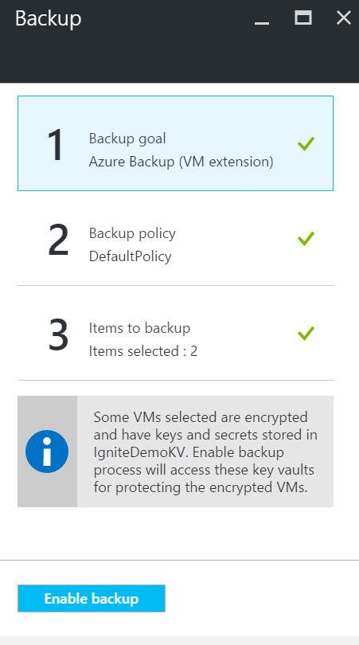

# How to back up and restore encrypted virtual machines with Azure Backup
This article talks about steps to backup and restore virtual machines using Azure Backup. It also provides details about supported scenarios, pre-requisites, and troubleshooting steps for error cases.

## Supported Scenarios
> [!NOTE]
> 1. Backup and restore of encrypted VMs is supported only for Resource Manager deployed virtual machines. It is not supported for Classic virtual machines.  
> 2. It is supported for both Windows and Linux virtual machines using Azure Disk Encryption, which leverages the industry standard BitLocker feature of Windows and DM-Crypt feature of Linux to provide encryption of disks.  
> 3. It is supported only for virtual machines encrypted using BitLocker Encryption Key and Key Encryption Key both. It is not supported for virtual machines encrypted using BitLocker Encryption Key only.  
>
>

## Pre-requisites
1. Virtual machine has been encrypted using [Azure Disk Encryption](../security/azure-security-disk-encryption.md). It should be encrypted using BitLocker Encryption Key and Key Encryption Key both.
2. Recovery services vault has been created and storage replication set using steps mentioned in the article [Prepare your environment for backup](backup-azure-arm-vms-prepare.md).

## Backup encrypted VM
Use the following steps to set backup goal, define policy, configure items and trigger backup.

### Configure backup
1. If you already have a Recovery Services vault open, proceed to next step. If you do not have a Recovery Services vault open, but are in the Azure portal, on the Hub menu, click **Browse**.

   * In the list of resources, type **Recovery Services**.
   * As you begin typing, the list filters based on your input. When you see **Recovery Services vaults**, click it.

        

     The list of Recovery Services vaults appears. From the list of Recovery Services vaults, select a vault.

     The selected vault dashboard opens.
2. From the list of items that appears under vault, click **Backup** to open the Backup blade.

      
3. On the Backup blade, click **Backup goal** to open the Backup Goal blade.

      
4. On the Backup Goal blade, set **Where is your workload running** to Azure and **What do you want to backup** to Virtual machine, then click **OK**.

   The Backup Goal blade closes and the Backup policy blade opens.

   
5. On the Backup policy blade, select the backup policy you want to apply to the vault and click **OK**.

      

    The details of the default policy are listed in the details. If you want to create a policy, select **Create New** from the drop-down menu. Once you click **OK**, the backup policy is associated with the vault.

    Next choose the VMs to associate with the vault.
6. Choose the encrypted virtual machines to associate with the specified policy and click **OK**.

      
7. This page shows a message about key vault associated to the encrypted VMs selected. Backup service requires read-only access to the keys and secrets in the key vault. It uses these permissions to backup key and secret, along with the associated VMs.

      

      Now that you have defined all settings for the vault, in the Backup blade click Enable Backup at the bottom of the page. Enable  Backup deploys the policy to the vault and the VMs.
8. The next phase in preparation is installing the VM Agent or making sure the VM Agent is installed. To do the same, use the steps mentioned in the article [Prepare your environment for backup](backup-azure-arm-vms-prepare.md).

### Triggering backup job
Use the steps mentioned in the article [Backup Azure VMs to recovery services vault](backup-azure-arm-vms.md) to trigger backup job.

### Continue backups of already backed up VMs with encryption enabled  
If you have VMs already being backup up in recovery services vault and have been enabled for encryption at a later point, you must give permissions to backup service to access key vault for backups to continue. You can provide these permissions in PowerShell using steps mentioned in **Enable Backup** section of [PowerShell documentation](backup-azure-vms-automation.md). 

## Restore encrypted VM
To restore encrypted VM, first Restore Disks using steps mentioned in section **Restore backed up disks** in [Choosing VM restore configuration](backup-azure-arm-restore-vms.md#choosing-a-vm-restore-configuration). After that, you can use one of the following options:
* Use the PowerShell steps mentioned in [Create a VM from restored disks](backup-azure-vms-automation.md#create-a-vm-from-restored-disks) to create full VM from restored disks.
* OR, [Use template generated as part of Restore Disks](backup-azure-arm-restore-vms.md#use-templates-to-customize-restore-vm) to create VMs from restored disks. Templates can be used only for recovery points created after 26 April 2017.

## Troubleshooting errors
| Operation | Error details | Resolution |
| --- | --- | --- |
| Backup |Validation failed as virtual machine is encrypted with BEK alone. Backups can be enabled only for virtual machines encrypted with both BEK and KEK. |Virtual machine should be encrypted using BEK and KEK. First decrypt the VM and encrypt it using both BEK and KEK. Enable backup once VM is encrypted using both BEK and KEK. Learn more on how you can [decrypt and encrypt the VM](../security/azure-security-disk-encryption.md)  |
| Restore |You cannot restore this encrypted VM since key vault associated with this VM does not exist. |Create key vault using [Get Started with Azure Key Vault](../key-vault/key-vault-get-started.md). Refer the article [Restore key vault key and secret using Azure Backup](backup-azure-restore-key-secret.md) to restore key and secret if they are not present. |
| Restore |You cannot restore this encrypted VM since key and secret associated with this VM do not exist. |Refer the article [Restore key vault key and secret using Azure Backup](backup-azure-restore-key-secret.md) to restore key and secret if they are not present. |
| Restore |Backup Service does not have authorization to access resources in your subscription. |As mentioned above, Restore Disks first, using steps mentioned in section **Restore backed up disks** in [Choosing VM restore configuration](backup-azure-arm-restore-vms.md#choosing-a-vm-restore-configuration). After that, user PowerShell to [Create a VM from restored disks](backup-azure-vms-automation.md#create-a-vm-from-restored-disks). |
|Backup | Azure Backup Service does not have sufficient permissions to Key Vault for Backup of Encrypted Virtual Machines | Virtual machine should be encrypted using both BitLocker Encryption Key and Key Encryption Key. After that, backup should be enabled.  Backup service hould be provided these permissions in PowerShell using steps mentioned in the **Enable protection** section of the PowerShell documentation at [Use AzureRM.RecoveryServices.Backup cmdlets to back up virtual machines](backup-azure-vms-automation.md). |  
