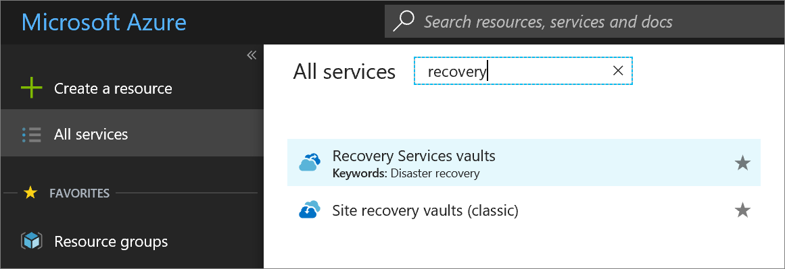
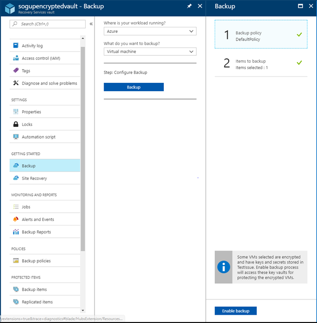
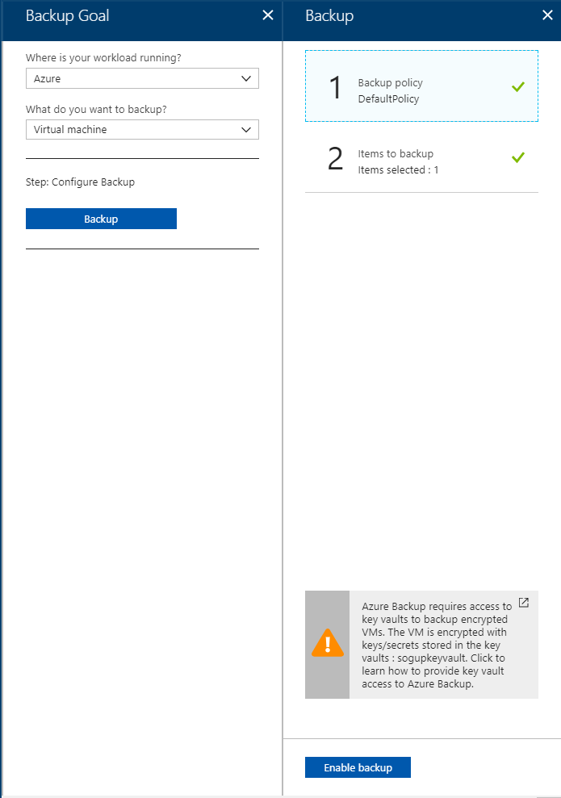
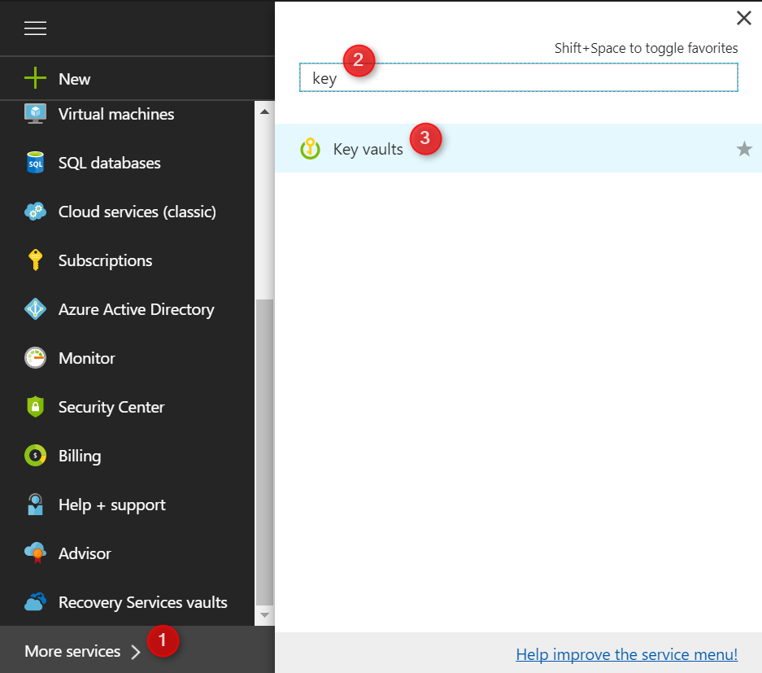
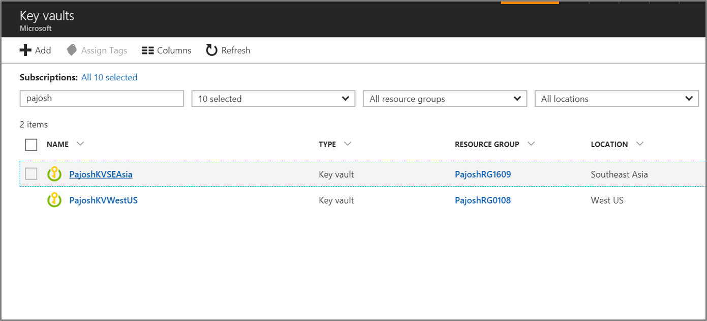
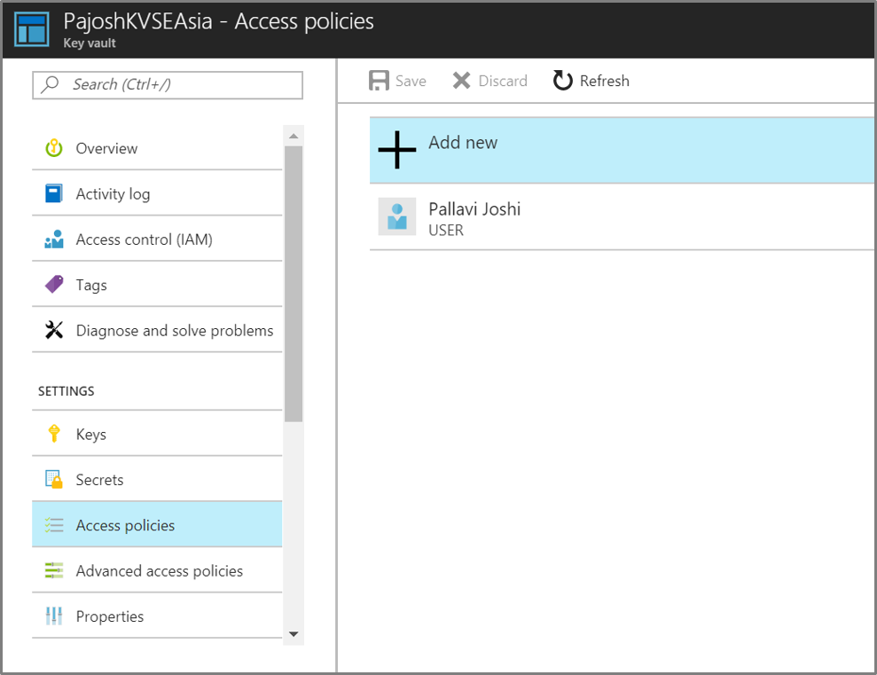
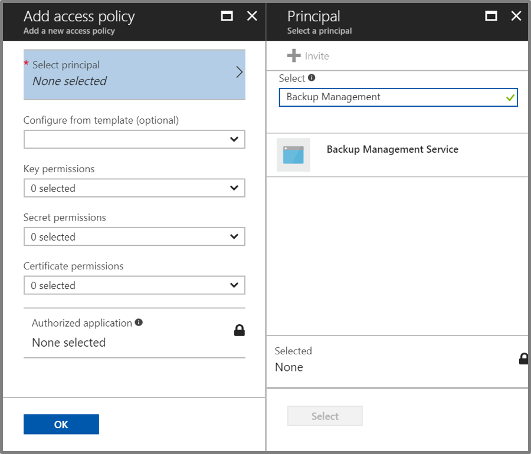
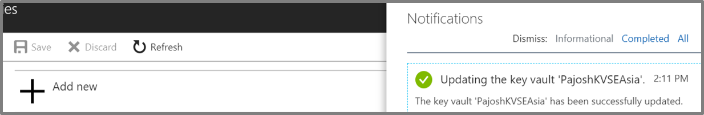

# Back up and restore encrypted virtual machines with Azure Backup
This article talks about the steps to back up and restore virtual machines (VMs) by using Azure Backup. It also provides details about supported scenarios, prerequisites, and troubleshooting steps for error cases.

## Supported scenarios

 Backup and restore of encrypted VMs is supported only for VMs that use the Azure Resource Manager deployment model. It's not supported for VMs that use the classic deployment model. Backup and restore of encrypted VMs is supported for Windows and Linux VMs that use Azure Disk Encryption. Disk Encryption uses the industry standard BitLocker feature of Windows and the dm-crypt feature of Linux to provide encryption of disks. The following table shows encryption type and support for VMs.

   |  | BEK + KEK VMs | BEK-only VMs |
   | --- | --- | --- |
   | **Nonmanaged VMs**  | Yes | Yes  |
   | **Managed VMs**  | Yes | Yes  |

## Prerequisites
* The VM was encrypted by using [Azure Disk Encryption](../security/azure-security-disk-encryption.md).

* A Recovery Services vault was created and storage replication was set by following the steps in [Prepare your environment for backup](backup-azure-arm-vms-prepare.md).

* Backup was given [permissions to access a key vault](#provide-permissions-to-backup) containing keys and secrets for encrypted VMs.

## Backup-encrypted VM
Use the following steps to set a backup goal, define a policy, configure items, and trigger a backup.

### Configure backup
1. If you already have a Recovery Services vault open, proceed to the next step. If you don't have a Recovery Services vault open but you're in the Azure portal, select **All services**.

   a. In the list of resources, type **Recovery Services**.

   b. As you begin typing, the list filters based on your input. When you see **Recovery Services vaults**, select it.

        

    c. The list of Recovery Services vaults appears. Select a vault from the list.

     The selected vault dashboard opens.
1. From the list of items that appears under the vault, select **Backup** to start backing up the encrypted VM.

      
1. On the **Backup** tile, select **Backup goal**.

      
1. Under **Where is your workload running?**, select **Azure**. Under **What do you want to backup?**, select **Virtual machine**. Then select **OK**.

   
1. Under **Choose backup policy**, select the backup policy you want to apply to the vault. Then select **OK**.

      

    The details of the default policy are listed. If you want to create a policy, select **Create New** from the drop-down list. After you select **OK**, the backup policy is associated with the vault.

1. Choose the encrypted VMs to associate with the specified policy, and select **OK**.

      
1. This page shows a message about key vaults associated to the encrypted VMs you selected. Backup requires read-only access to the keys and secrets in the key vault. It uses these permissions to back up the keys and secrets, along with the associated VMs. 
If you are a **Member user**, Enable Backup process will seamlessly acquire access to the key vault to backup encrypted VMs without requiring any user intervention.

   

   For a **Guest user**, you must provide permissions to the backup service to access the key vault for backups to work. You can      provide these permissions by following the [steps mentioned in the following section](#provide-permissions-to-backup)

   
 
    Now that you have defined all settings for the vault, select **Enable Backup** at the bottom of the page. **Enable Backup** deploys     the policy to the vault and the VMs.
  
1. The next phase in preparation is installing the VM Agent or making sure the VM Agent is installed. To do the same, follow the steps in [Prepare your environment for backup](backup-azure-arm-vms-prepare.md).

### Trigger a backup job
Follow the steps in [Backup Azure VMs to a Recovery Services vault](backup-azure-arm-vms.md) to trigger a backup job.

### Continue backups of already backed-up VMs with encryption enabled  
If you have VMs already being backed up in a Recovery Services vault that are enabled for encryption later, you must give permissions to Backup to access the key vault for backups to continue. You can provide these permissions by following the [steps in the following section](#provide-permissions-to-azure-backup). Or you can follow the PowerShell steps in the "Enable backup" section of the [PowerShell documentation](backup-azure-vms-automation.md). 

## Provide permissions to Backup
Use the following steps to provide relevant permissions to Backup to access the key vault and perform backup of encrypted VMs.
1. Select **All services**, and search for **Key vaults**.

    
    
1. From the list of key vaults, select the key vault associated with the encrypted VM that needs to be backed up.

     
     
1. Select **Access policies**, and then select **Add new**.

    
    
1. Select **Select principal**, and then type **Backup Management Service** in the search box. 

    
    
1. Select **Backup Management Service**, and then select **Select**.

    
    
1. Under **Configure from template (optional)**, select **Azure Backup**. The required permissions are prefilled for **Key permissions** and **Secret permissions**. If your VM is encrypted by using **BEK only**, permissions only for secrets are required, so you must remove the selection for **Key permissions**.

    
    
1. Select **OK**. Notice that **Backup Management Service** gets added in **Access policies**. 

    
    
1. Select **Save** to give the required permissions to Backup.

    

After permissions are successfully provided, you can proceed with enabling backup for encrypted VMs.

## Restore an encrypted VM
To restore an encrypted VM, first restore disks by following the steps in the "Restore backed-up disks" section in [Choose a VM restore configuration](backup-azure-arm-restore-vms.md#choose-a-vm-restore-configuration). After that, you can use one of the following options:

* Follow the PowerShell steps in [Create a VM from restored disks](backup-azure-vms-automation.md#create-a-vm-from-restored-disks) to create a full VM from restored disks.
* Or, [use templates to customize a restored VM](backup-azure-arm-restore-vms.md#use-templates-to-customize-a-restored-vm) to create VMs from restored disks. Templates can be used only for recovery points created after April 26, 2017.

## Troubleshooting errors
| Operation | Error details | Resolution |
| --- | --- | --- |
|Backup | Backup doesn't have sufficient permissions to the key vault for backup of encrypted VMs. | Backup should be provided these permissions by following the [steps in the previous section](#provide-permissions-to-azure-backup). Or you can follow the PowerShell steps in the "Enable protection" section of the article, [Use PowerShell to back up and restore virtual machines](backup-azure-vms-automation.md#enable-protection). |  
| Restore |You can't restore this encrypted VM because the key vault associated with this VM doesn't exist. |Create a key vault by using [Get started with Azure Key Vault](../key-vault/key-vault-get-started.md). See [Restore a key vault key and a secret by using Azure Backup](backup-azure-restore-key-secret.md) to restore a key and a secret if they aren't present. |
| Restore |You can't restore this encrypted VM because the key and the secret associated with this VM don't exist. |See [Restore a key vault key and a secret by using Azure Backup](backup-azure-restore-key-secret.md) to restore a key and a secret if they aren't present. |
| Restore |Backup doesn't have the authorization to access resources in your subscription. |As mentioned previously, restore disks first by following the steps in the "Restore backed-up disks" section in [Choose a VM restore configuration](backup-azure-arm-restore-vms.md#choose-a-vm-restore-configuration). After that, use PowerShell to [create a VM from restored disks](backup-azure-vms-automation.md#create-a-vm-from-restored-disks). |
