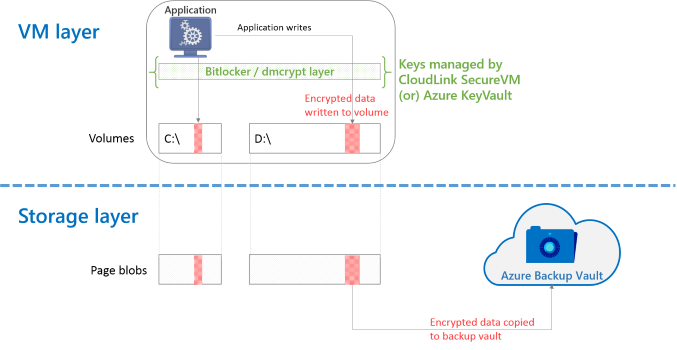

<properties
   pageTitle="Azure Backup - Backup of Azure IaaS VMs with encrypted disks | Microsoft Azure"
   description="Learn how Azure Backup handles data encrypted using BitLocker or dmcrypt during IaaS VM backup. This article prepares you for the differences in backup and restore experiences when dealing with encrypted disks."
   services="backup"
   documentationCenter=""
   authors="pallavijoshi"
   manager="vijayts"
   editor=""/>
<tags
   ms.service="backup"
   ms.devlang="na"
   ms.topic="article"
   ms.tgt_pltfrm="na"
   ms.workload="storage-backup-recovery"
   ms.date="07/01/2016"
   ms.author="markgal; jimpark; trinadhk"/>

# Dealing with encrypted disks during VM backup

For enterprises looking to encrypt their VM data in Azure, the solution is to use [Azure Disk Encryption](../azure-security-disk-encryption.md) or Bitlocker on Windows and dmcrypt on Linux machines. 

> [AZURE.NOTE]  Azure Backup supports backup and restore of VMs encrypted using Azure Disk Encryption (ADE).  
1. This is supported using PowerShell if VM is encrypted using BEK and KEK.  
2. Backup and restore is not supported if VM is encrypted using BEK only.  
Please refer Azure Backup [PowerShell documentation](backup-azure-vms-automation.md) to backup and restore VMs encrypted using ADE. 

This article deals with Azure VMs encrypted using CloudLink.

## How backup works

The overall solution consists of two layers - the VM layer and the Storage layer.

1. The VM layer deals with the data as seen by the guest operating system and the applications running in the virtual machine. It is also the layer that runs the encryption software (Bitlocker or dmcrypt), transparently encrypting data on the volumes before writing it to the disks.
2. The Storage layer deals with the page blobs and the disks attached to the VM. It has no knowledge of the data being written to the disk, and whether it is encrypted or not. This is the layer at which the VM backup functionality operates.

The entire encryption of data happens transparently and seamlessly in the VM layer. Thus the data written to the page blobs attached to the VM is encrypted data. When [Azure Backup takes a snapshot of the VM’s disks and transfers data](backup-azure-vms-introduction.md#how-does-azure-back-up-virtual-machines), it copies the encrypted data present on the page blobs.

## Solution components

There are many parts to this solution that need to be configured and managed correctly for this to work:

| Function | Software used | Additional notes |
| -------- | ------------- | ------- |
| Encryption | Bitlocker or dmcrypt | Because the encryption happens in a *different* layer when compared to Azure Backup, it doesn't matter what encryption software is used. That said, this experience has been validated with only CloudLink using Bitlocker and dmcrypt.   In order to encrypt the data, a key is needed. The key also needs to be kept safe to ensure authorized access to data.  |
| Key management | CloudLink SecureVM | The key is essential to encrypting or decrypting the data. Without the right key, the data cannot be retrieved. This becomes *incredibly* important with: <li>Key roll-overs<li>Long term retention  For example, it possible that the key used to backup data 7 years ago is not the same key used today. Without the key from 7 years ago, it will be impossible to use the data restored from that time.|
| Data backup | Azure Backup | Use Azure Backup to back up your Azure IaaS VMs using the [Azure management portal](http://manage.windowsazure.com) or using PowerShell |
| Data restore | Azure Backup | Use Azure Backup to restore disks or an entire VM from a recovery point. Data is not decrypted by Azure Backup as a part of the restore operation.|
| Decryption | Bitlocker or dmcrypt | In order to read data out of a restored data disk or restored VM, the software needs the key from the Key Management software. Without the right key, the data cannot be decrypted. |

> [AZURE.IMPORTANT]  Key management - including key rollover - is not a part of Azure Backup. This aspect needs to be managed independently but is very important to the overall backup/restore operation.

### Supported Scenarios

| &nbsp; | Backup Vault | Recovery Services Vault |
| :-- | :-- | :-- |
| Azure IaaS V1 VMs | Yes | No |
| Azure IaaS V2 VMs | N/A | No |

## CloudLink SecureVM

[CloudLink SecureVM](http://www.cloudlinktech.com/choose-your-cloud/microsoft-azure/) is a VM encryption solution that can be used to secure your Azure IaaS VM data. CloudLink SecureVM is supported for use with Azure Backup.

### Support information

- CloudLink SecureVM version 4.0 (build 21536.121 or higher)
- Azure PowerShell version 0.9.8 or higher

### Key Management

When you need to roll-over or change keys for VMs that have existing backups, you need to ensure that the keys used at the time of backup are available. One suggested way is to take a backup of the keystore or the entire SecureVM system.

### Documentation & Resources

- [Deployment guide - PDF](http://www.cloudlinktech.com/Azure/CL_SecureVM_4_0_DG_EMC_Azure_R2.pdf)
- [Deploying and using SecureVM - video](https://www.youtube.com/watch?v=8AIRe92UDNg)
