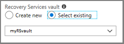
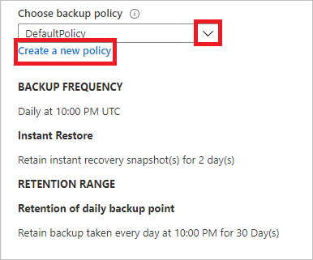
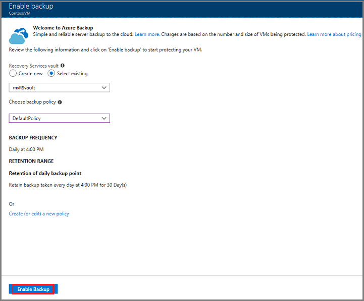
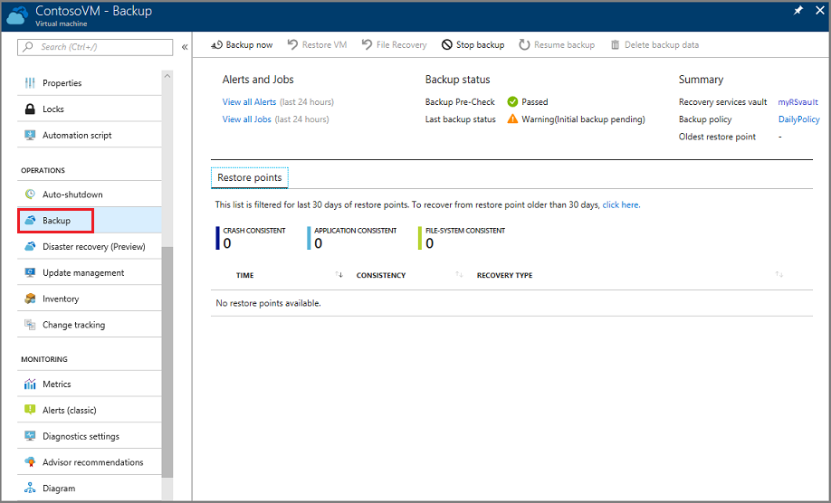
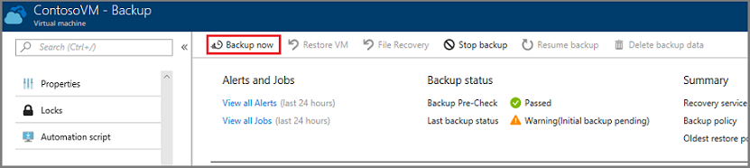

# Back up an Azure VM from the VM settings

This article explains how to back up Azure VMs with the [Azure Backup](backup-overview.md) service. You can back up Azure VMs using a couple of methods:

- Single Azure VM: The instructions in this article describe how to back up an Azure VM directly from the VM settings.
- Multiple Azure VMs: You can set up a Recovery Services vault and configure backup for multiple Azure VMs. Follow the instructions in [this article](backup-azure-arm-vms-prepare.md) for this scenario.

## Before you start

1. [Learn](backup-architecture.md#how-does-azure-backup-work) how backup works, and [verify](backup-support-matrix.md#azure-vm-backup-support) support requirements.
2. [Get an overview](backup-azure-vms-introduction.md) of Azure VM backup.

### Azure VM agent installation

In order to back up Azure VMs, Azure Backup installs an extension on the VM agent running on the machine. If your VM was created from an Azure marketplace image, the agent will be running. In some cases, for example if you create a custom VM, or you migrate a machine from on-premises. you might need to install the agent manually.

- If you do need to install the VM agent manually, follow the instructions for [Windows](https://docs.microsoft.com/azure/virtual-machines/extensions/agent-windows) or [Linux](https://docs.microsoft.com/azure/virtual-machines/extensions/agent-linux) VMs.
- After the agent is installed, when you enable backup, Azure Backup installs the backup extension to the agent. It updates and patches the extension without user intervention.

## Back up from Azure VM settings

1. Sign in to the [Azure portal](https://portal.azure.com/).
2. Click **All services** and in the Filter, type **Virtual machines**, and then click **Virtual machines**.
3. From the list of VMs select the VM you want to back up.
4. On the VM menu, click **Backup**.
5. In **Recovery Services vault**, do the following:
   - If you already have a vault, click **Select existing**, and select a vault.
   - If you don't have a vault, click **Create new**. Specify a name for the vault. It's created in the same region and resource group as the VM. You can't modify these settings when you enable backup directly from the VM settings.

   

6. In **Choose backup policy**, do the following:

   - Leave the default policy. This backs up the VM once a day at the time specified, and retains backups in the vault for 30 days.
   - Select an existing backup policy if you  have one.
   - Create a new policy, and define the policy settings.  

   

7. Click **Enable Backup**. This associates the backup policy with the VM.

    

8. You can track the configuration progress in the portal notifications.
9. After the job completes, in the VM menu, click **Backup**. The page shows backup status for the VM, information about recovery points, jobs running, and alerts issued.

   

10. After enabling backup, an initial backup runs. You can start the initial backup immediately, or wait until it starts in accordance with the backup schedule.
    - Until the initial backup completes, the **Last backup status** shows as **Warning (Initial backup pending)**.
    - To see when the next scheduled backup will run, click the backup policy name.

## Run a backup immediately

1. To run a backup immediately, in the VM menu, click **Backup** > **Backup now**.

    

2. In **Backup Now** use the calendar control to select until when the recovery point will be retained >  and **OK**.

    

3. Portal notifications let you know the backup job has been triggered. To monitor backup progress, click **View all jobs**.

## Back up from the Recovery Services vault

Follow the instructions in this article to enable backup for Azure VMs by setting up an Azure Backup Recovery Services vault, and enabling backup in the vault.

>[!NOTE]
> Azure Backup now supports selective disk backup and restore using the Azure Virtual Machine backup solution.
>
>Today, Azure Backup supports backing up all the disks (Operating System and data) in a VM together using the Virtual Machine backup solution. With exclude-disk functionality, you get an option to backup one or a few from the many data disks in a VM. This provides an efficient and cost-effective solution for your backup and restore needs. Each recovery point contains data of the disks included in the backup operation, which further allows you to have a subset of disks restored from the given recovery point during the restore operation. This applies to restore both from the snapshot and the vault.
>
> This solution is particularly useful in the following scenarios:
>  
>1. You have critical data to be backed up in only one disk and you don’t want to back up the rest of the disks attached to a VM. This minimizes the backup storage costs.  
>2. You have other backup solutions for part of your VM data. For example, you back up your databases or data with a different workload backup solution, and you want to use Azure VM level backup for the rest of your disks and data to build an efficient and robust system utilizing the best capabilities available.
>
>To sign up for the preview, write to us at AskAzureBackupTeam@microsoft.com

## Next steps

- If you have difficulties with any of the procedures in this article, consult the [troubleshooting guide](backup-azure-vms-troubleshoot.md).
- [Learn about](backup-azure-manage-vms.md) managing your backups.
