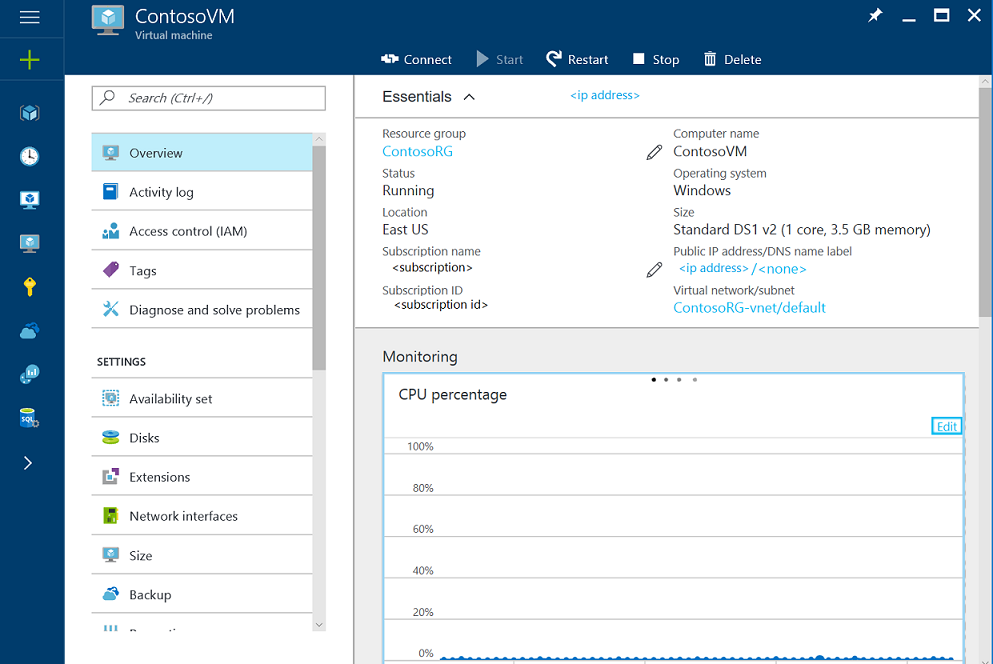
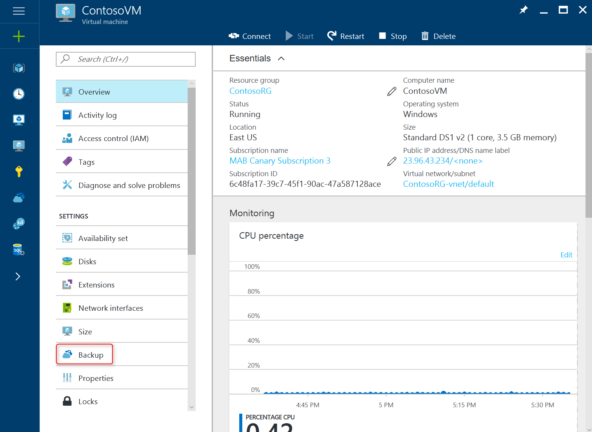
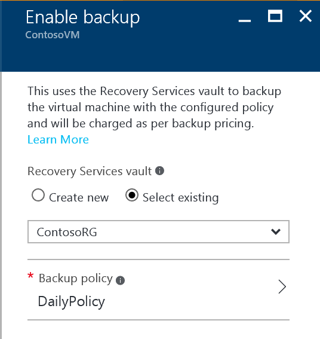
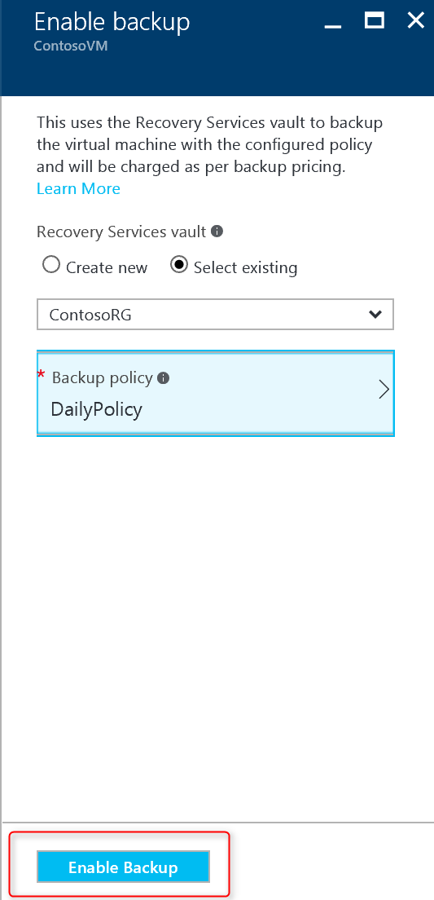
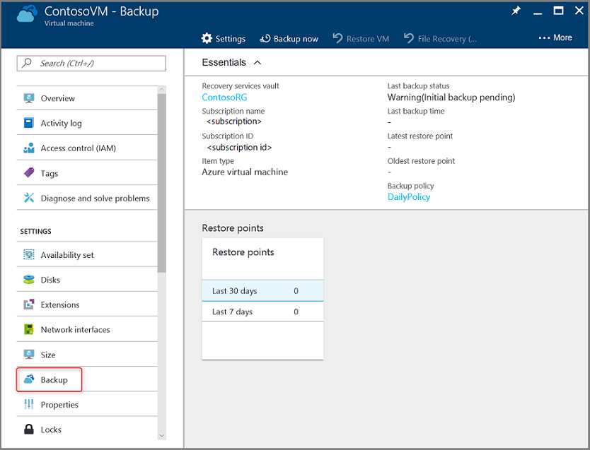

# First look: Protect Azure VMs with a recovery services vault
> [!div class="op_single_selector"]
> * [Protect VMs with a recovery services vault](backup-azure-vms-first-look-arm.md)
> * [Protect VMs with a backup vault](backup-azure-vms-first-look.md)
>
>

This tutorial takes you through the steps for creating a recovery services vault and backing up an Azure virtual machine (VM). Recovery services vaults protect:

* Azure Resource Manager-deployed VMs
* Classic VMs
* Standard storage VMs
* Premium storage VMs
* VMs running on Managed Disks
* VMs encrypted using Azure Disk Encryption, with BEK and KEK

For more information on protecting Premium storage VMs, see the article, [Back up and Restore Premium Storage VMs](backup-introduction-to-azure-backup.md#using-premium-storage-vms-with-azure-backup). For more information on support for managed disk VMs, see [Back up and restore VMs on managed disks](backup-introduction-to-azure-backup.md#using-managed-disk-vms-with-azure-backup).

> [!NOTE]
> This tutorial assumes you already have a VM in your Azure subscription and that you have taken measures to allow the backup service to access the VM.
>
>

[!INCLUDE [learn-about-Azure-Backup-deployment-models](../../includes/backup-deployment-models.md)]

Depending on the number of virtual machines you want to protect, you can begin from different starting points. If you want to back up multiple virtual machines in one operation, go to your Recovery Services vault and initiate the backup job from the vault dashboard. If you want to back up a single virtual machine, you can initiate the backup job from VM management blade.

## Configure the backup job from the VM management blade
1. Sign in to the [Azure portal](https://portal.azure.com/).
2. On the Hub menu, click **More Services** and in the list of resources, type **Virtual machines**.  
    The list of virtual machines (VM) in the subscription, appears. From the list, select a VM to back up. When you select the VM, the virtual machine management blade and the virtual machine dashboard, open.
 

3. On the VM management blade, in the **Settings** section, click **Backup**.

    The Enable backup blade opens. In the Enable backup blade, you specify the Recovery Services vault where the backup data is stored, and the Backup policy which is the schedule when snapshots (or recovery points) of your data are taken.

4. For the Recovery Services vault area, click **Select existing** and choose the vault from the drop-down list.

    If there are no Recovery Services vaults, or you want to use a new vault, then click **Create new** and provide the name for the new vault. A new vault is created in the same Resource Group and same location as the virtual machine. If you want to create a Recovery Services vault with different values, see the section on how to [create a recovery services vault](backup-azure-vms-first-look-arm.md#create-a-recovery-services-vault-for-a-vm).

    

5. To view the details of the Backup policy, click **Backup policy**.

    The **Backup policy** blade opens and provides the details of the selected policy. You can choose a different backup policy from the drop-down menu, if other policies exist. If you want to create a new policy, select **Create New** from the drop-down menu. For instructions on defining a backup policy, see [Defining a backup policy](backup-azure-vms-first-look-arm.md#defining-a-backup-policy). To save the changes to the backup policy and return to the Enable backup blade, click **OK**.

    

6. On the Backup policy blade, verify the backup policy is the one you want. Click **Enable Backup** to trigger the deployment which associates the policy with the vault and the virtual machine(s).

  

7. You can track the configuration progress through the notifications that appear in the portal.

8. Once the configuration progress has completed, on the VM management blade, click **Backup** to open the Backup Item blade and view the details.

  

## Configure Backup from Recovery Services vault View
At a high level, here are the steps that you'll complete.  

1. Create a recovery services vault for a VM.
2. Use the Azure portal to select a Scenario, set Policy, and identify items to protect.
3. Run the initial backup.

## Create a recovery services vault for a VM
A recovery services vault is an entity that stores all the backups and recovery points that have been created over time. The recovery services vault also contains the backup policy applied to the protected VMs.

> [!NOTE]
> Backing up VMs is a local process. You cannot back up VMs from one location to a recovery services vault in another location. So, for every Azure location that has VMs to be backed up, at least one recovery services vault must exist in that location.
>
>

To create a recovery services vault:

1. If you haven't already done so, sign in to the [Azure portal](https://portal.azure.com/) using your Azure subscription.
2. On the Hub menu, click **More services** and in the list of resources, type **Recovery Services** and click **Recovery Services vaults**.

      

    If there are recovery services vaults in the subscription, the vaults are listed.
3. On the **Recovery Services vaults** menu, click **Add**.

    

    The Recovery Services vault blade opens, prompting you to provide a **Name**, **Subscription**, **Resource group**, and **Location**.

    

4. For **Name**, enter a friendly name to identify the vault. The name needs to be unique for the Azure subscription. Type a name that contains between 2 and 50 characters. It must start with a letter, and can contain only letters, numbers, and hyphens.

5. In the **Subscription** section, use the drop-down menu to choose the Azure subscription. If you use only one subscription, that subscription appears and you can skip to the next step. If you are not sure which subscription to use, use the default (or suggested) subscription. There are multiple choices only if your organizational account is associated with multiple Azure subscriptions.

6. In the **Resource group** section:

    * select **Create new** if you want to create a new Resource group.
    Or
    * select **Use existing** and click the drop-down menu to see the available list of Resource groups.

  For complete information on Resource groups, see the [Azure Resource Manager overview](../azure-resource-manager/resource-group-overview.md).

7. Click **Location** to select the geographic region for the vault. This choice determines the geographic region where your backup data is sent.

  > [!IMPORTANT]
  > If you are unsure of the location in which your VM exists, close out of the vault creation dialog, and go to the list of Virtual Machines in the portal. If you have virtual machines in multiple regions, create a recovery services vault in each region. Create the vault in the first location before going to the next location. There is no need to specify storage accounts to store the backup data--the recovery services vault and the Azure Backup service handle this automatically.
  >

8. At the bottom of the Recovery Services vault blade, click **Create**.

    It can take several minutes for the Recovery Services vault to be created. Monitor the status notifications in the upper right-hand area of the portal. Once your vault is created, it appears in the list of Recovery Services vaults. If after several minutes you don't see your vault, click **Refresh**.

     

    Once you see your vault in the list of Recovery Services vaults, you are ready to set the storage redundancy.

Now that you've created your vault, learn how to set the storage replication.

### Set Storage Replication
The storage replication option allows you to choose between geo-redundant storage and locally redundant storage. By default, your vault has geo-redundant storage. Leave the option set to geo-redundant storage if this is your primary backup. Choose locally redundant storage if you want a cheaper option that isn't as durable. Read more about [geo-redundant](../storage/storage-redundancy.md#geo-redundant-storage) and [locally redundant](../storage/storage-redundancy.md#locally-redundant-storage) storage options in the [Azure Storage replication overview](../storage/storage-redundancy.md).

To edit the storage replication setting:

1. From the **Recovery Services vaults** blade, click the new vault.

  

  When you select the vault, the **Recovery Services vault** blade narrows, and the Settings blade (*which has the name of the vault at the top*) and the vault details blade open.

    
2. In the new vault's Settings blade, use the vertical slide to scroll down to the Manage section, and click **Backup Infrastructure**.
    The Backup Infrastructure blade opens.
3. In the Backup Infrastructure blade, click **Backup Configuration** to open the **Backup Configuration** blade.

    
4. Choose the appropriate storage replication option for your vault.

    

    By default, your vault has geo-redundant storage. If you use Azure as a primary backup storage endpoint, continue to use **Geo-redundant**. If you don't use Azure as a primary backup storage endpoint, then choose **Locally-redundant**, which reduces the Azure storage costs. Read more about [geo-redundant](../storage/storage-redundancy.md#geo-redundant-storage) and [locally redundant](../storage/storage-redundancy.md#locally-redundant-storage) storage options in this [Storage redundancy overview](../storage/storage-redundancy.md).

## Select a backup goal, set policy and define items to protect
Before registering a VM with a vault, run the discovery process to ensure that any new virtual machines that have been added to the subscription are identified. The process queries Azure for the list of virtual machines in the subscription, along with additional information like the cloud service name and the region. In the Azure portal, scenario refers to what you are going to put into the recovery services vault. Policy is the schedule for how often and when recovery points are taken. Policy also includes the retention range for the recovery points.

1. If you already have a recovery services vault open, proceed to step 2. Otherwise, on the Hub menu, click **More services** and in the list of resources, type **Recovery Services** and click **Recovery Services vaults**.

      

    The list of recovery services vaults appears.

    

    From the list of recovery services vaults, select a vault to open its dashboard.

     

2. On the vault dashboard menu click **Backup** to open the Backup blade.

    

    The Backup and Backup Goal blades open.

    
3. On the Backup Goal blade, from the **Where is your workload running** drop-down menu, choose Azure. From the **What do you want to backup** drop-down, choose Virtual machine, then click **OK**.

    This registers the VM extension with the vault. The Backup Goal blade closes and the **Backup policy** blade opens.

    

4. On the Backup policy blade, select the backup policy you want to apply to the vault.

    

    The details of the default policy are listed under the drop-down menu. If you want to create a new policy, select **Create New** from the drop-down menu. For instructions on defining a backup policy, see [Defining a backup policy](backup-azure-vms-first-look-arm.md#defining-a-backup-policy).
    Click **OK** to associate the backup policy with the vault.

    The Backup policy blade closes and the **Select virtual machines** blade opens.
5. In the **Select virtual machines** blade, choose the virtual machines to associate with the specified policy and click **OK**.

    

    The selected virtual machine is validated. If you do not see the virtual machines that you expected to see, check that they exist in the same Azure location as the Recovery Services vault. The location of the Recovery Services vault is shown on the vault dashboard.

6. Now that you have defined all settings for the vault, in the Backup blade click **Enable Backup**. This deploys the policy to the vault and the VMs. This does not create the initial recovery point for the virtual machine.

    

After successfully enabling the backup, your backup policy will execute on schedule. However, proceed to initiate the first backup job.

## Initial backup
Once a backup policy has been deployed on the virtual machine, that does not mean the data has been backed up. By default, the first scheduled backup (as defined in the backup policy) is the initial backup. Until the initial backup occurs, the Last Backup Status on the **Backup Jobs** blade shows as **Warning(initial backup pending)**.

Unless your initial backup is due to begin soon, it is recommended that you run **Back up Now**.

To run **Back up Now**:

1. On the vault dashboard, on the **Backup** tile, click **Azure Virtual Machines**  
    

    The **Backup Items** blade opens.
2. On the **Backup Items** blade, right-click the vault you want to back up, and click **Backup now**.

    

    The Backup job is triggered.  

    
3. To view that your initial backup has completed, on the vault dashboard, on the **Backup Jobs** tile, click **Azure virtual machines**.

    

    The Backup Jobs blade opens.
4. In the Backup jobs blade, you can see the status of all jobs.

    

   > [!NOTE]
   > As a part of the backup operation, the Azure Backup service issues a command to the backup extension in each VM to flush all writes and take a consistent snapshot.
   >
   >

    When the backup job is finished, the status is *Completed*.

[!INCLUDE [backup-create-backup-policy-for-vm](../../includes/backup-create-backup-policy-for-vm.md)]

## Install the VM Agent on the virtual machine
This information is provided in case it is needed. The Azure VM Agent must be installed on the Azure virtual machine for the Backup extension to work. However, if your VM was created from the Azure gallery, then the VM Agent is already present on the virtual machine. VMs that are migrated from on-premises datacenters would not have the VM Agent installed. In such a case, the VM Agent needs to be installed. If you have problems backing up the Azure VM, check that the Azure VM Agent is correctly installed on the virtual machine (see the table below). If you create a custom VM, [ensure the **Install the VM Agent** check box is selected](../virtual-machines/virtual-machines-windows-classic-agents-and-extensions.md?toc=%2fazure%2fvirtual-machines%2fwindows%2fclassic%2ftoc.json) before the virtual machine is provisioned.

Learn about the [VM Agent](https://go.microsoft.com/fwLink/?LinkID=390493&clcid=0x409) and [how to install it](../virtual-machines/virtual-machines-windows-classic-manage-extensions.md?toc=%2fazure%2fvirtual-machines%2fwindows%2fclassic%2ftoc.json).

The following table provides additional information about the VM Agent for Windows and Linux VMs.

| **Operation** | **Windows** | **Linux** |
| --- | --- | --- |
| Installing the VM Agent |<li>Download and install the [agent MSI](http://go.microsoft.com/fwlink/?LinkID=394789&clcid=0x409). You need Administrator privileges to complete the installation. <li>[Update the VM property](http://blogs.msdn.com/b/mast/archive/2014/04/08/install-the-vm-agent-on-an-existing-azure-vm.aspx) to indicate that the agent is installed. |<li> Install the latest [Linux agent](https://github.com/Azure/WALinuxAgent) from GitHub. You need Administrator privileges to complete the installation. <li> [Update the VM property](http://blogs.msdn.com/b/mast/archive/2014/04/08/install-the-vm-agent-on-an-existing-azure-vm.aspx) to indicate that the agent is installed. |
| Updating the VM Agent |Updating the VM Agent is as simple as reinstalling the [VM Agent binaries](http://go.microsoft.com/fwlink/?LinkID=394789&clcid=0x409).  Ensure that no backup operation is running while the VM agent is being updated. |Follow the instructions on [updating the Linux VM Agent ](../virtual-machines/virtual-machines-linux-update-agent.md?toc=%2fazure%2fvirtual-machines%2flinux%2ftoc.json).  Ensure that no backup operation is running while the VM Agent is being updated. |
| Validating the VM Agent installation |<li>Navigate to the *C:\WindowsAzure\Packages* folder in the Azure VM. <li>You should find the WaAppAgent.exe file present.<li> Right-click the file, go to **Properties**, and then select the **Details** tab. The Product Version field should be 2.6.1198.718 or higher. |N/A |

### Backup extension
Once the VM Agent is installed on the virtual machine, the Azure Backup service installs the backup extension to the VM Agent. The Azure Backup service seamlessly upgrades and patches the backup extension without additional user intervention.

The backup extension is installed by the Backup service whether the VM is running. A running VM provides the greatest chance of getting an application-consistent recovery point. However, the Azure Backup service continues to back up the VM even if it is turned off, and the extension could not be installed. This is known as Offline VM. In this case, the recovery point will be *crash consistent*.

## Troubleshooting information
If you have issues accomplishing some of the tasks in this article, consult the
[Troubleshooting guidance](backup-azure-vms-troubleshoot.md).

## Pricing
Azure VM backup will be charged based on Protected Instances model. Learn more on [Backup Pricing](https://azure.microsoft.com/pricing/details/backup/)

## Questions?
If you have questions, or if there is any feature that you would like to see included, [send us feedback](http://aka.ms/azurebackup_feedback).
