# Back up Azure virtual machines to Recovery Services vault

This article explains how to configure protection for a virtual machine from Virtual machines operations menu, or the Recovery Services vault. Recovery Services vaults protect:

* Azure Resource Manager-deployed VMs
* Classic VMs
* Standard storage VMs
* Premium storage VMs
* VMs running on Managed Disks
* VMs encrypted using Azure Disk Encryption
* Application consistent backup of Windows VMs using VSS and Linux VMs using custom pre-snapshot and post-snapshot scripts

For more information on protecting Premium storage VMs, see the article, [Back up and Restore Premium Storage VMs](backup-introduction-to-azure-backup.md#using-premium-storage-vms-with-azure-backup). For more information on support for managed disk VMs, see [Back up and restore VMs on managed disks](backup-introduction-to-azure-backup.md#using-managed-disk-vms-with-azure-backup). For more information on pre and post-script framework for Linux VM backup see [Application consistent Linux VM backup using pre-script and post-script](https://docs.microsoft.com/azure/backup/backup-azure-linux-app-consistent).

To find out more about what you can and can't backup, see [Prepare your environment to back up Azure VMs](backup-azure-arm-vms-prepare.md#limitations-when-backing-up-and-restoring-a-vm).

> [!NOTE]
> Backup service creates a separate resource group than the resource group of the VM to store restore point collection. Customers are advised not to lock the resource group created for use by the Backup service.
The naming format of the resource group created by Backup service is: AzureBackupRG_`<Geo>`_`<number>`
 Eg: AzureBackupRG_northeurope_1
>
>

Depending on the number of virtual machines you want to protect, you can begin from different starting points. If you want to back up multiple virtual machines in one operation, go to the Recovery Services vault and [initiate the backup job from the vault dashboard](backup-azure-vms-first-look-arm.md#configure-the-backup-job-from-the-recovery-services-vault). If you want to back up a single virtual machine, [initiate the backup job from VM operations menu](backup-azure-vms-first-look-arm.md#configure-the-backup-job-from-the-vm-operations-menu).

## Configure the backup job from the VM operations menu

Use the following steps to configure the backup job from the Virtual Machine operations menu. The steps apply only to virtual machines in the Azure portal.

1. Sign in to the [Azure portal](https://portal.azure.com/).
2. On the Hub menu, click **All services** and in the Filter dialog, type **Virtual machines**. As you type, the list of resources filters. When you see Virtual machines, select it.

  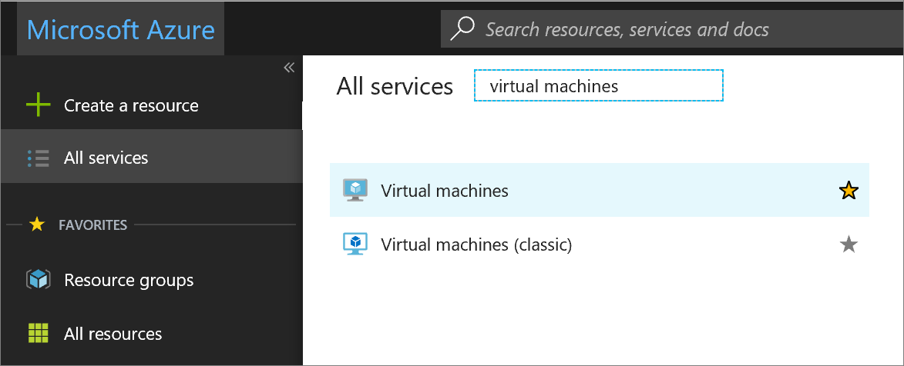

  The list of virtual machines (VM) in the subscription appears.

  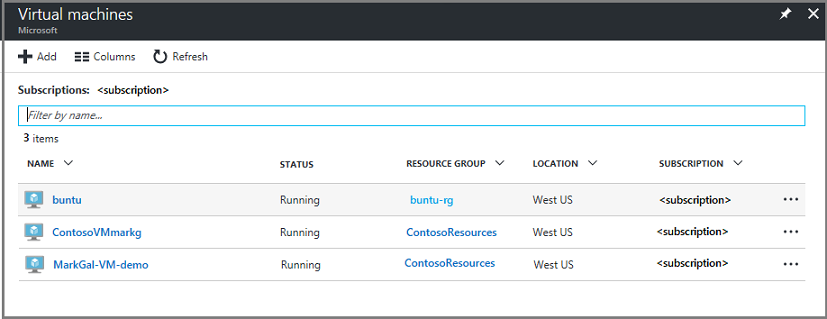

3. From the list, select a VM to back up.

  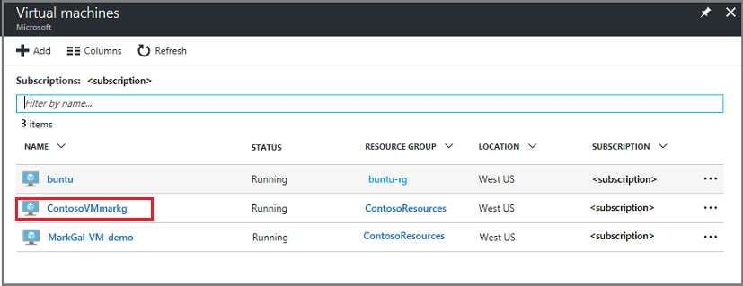

  When you select the VM, the list of virtual machines shifts to the left, and the virtual machine management menu and the virtual machine dashboard, open.

4. On the VM management menu, in the **Operations** section, click **Backup**.  

  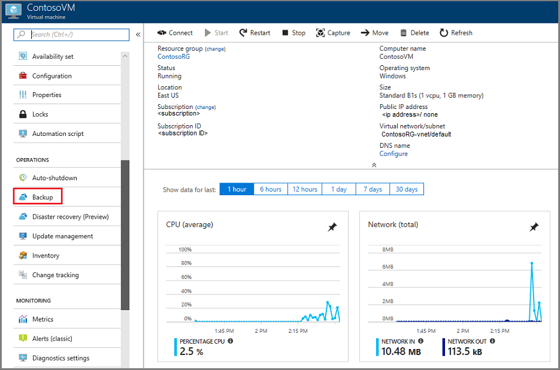

  The Enable backup menu opens.

  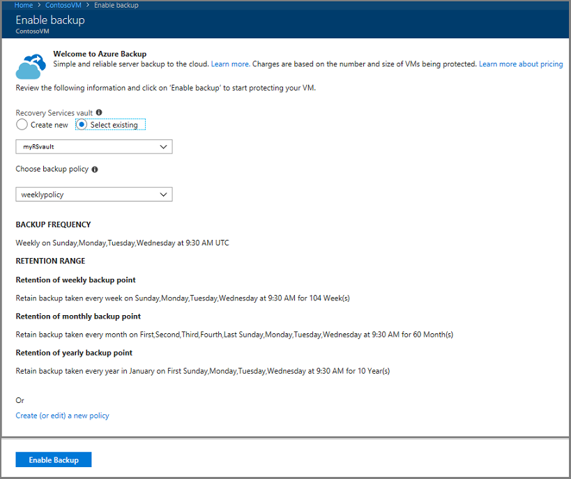

5. In the Recovery Services vault area, click **Select existing** and choose a vault from the drop-down list.

  

  If there are no Recovery Services vaults, or you want to use a new vault, click **Create new** and provide the name for the new vault. A new vault is created in the same Resource Group and same region as the virtual machine. If you want to create a Recovery Services vault with different values, see the section on how to [create a recovery services vault](backup-azure-vms-first-look-arm.md#create-a-recovery-services-vault-for-a-vm).

6. From the Choose backup policy menu, select a policy. The details for the selected policy appears beneath the drop-down menu.

  If you want to create a new policy or edit the existing policy, click **Create (or edit) a new policy** to open the Backup policy editor. For instructions on defining a backup policy, see [Defining a backup policy](backup-azure-vms-first-look-arm.md#defining-a-backup-policy). To save the changes to the backup policy and return to the Enable backup menu, click **OK**.

  

7. To apply the Recovery Services vault and backup policy to the virtual machine, click **Enable Backup** to deploy the policy. Deploying the policy associates it with the vault and the virtual machines.

  

8. You can track the configuration progress through the notifications that appear in the portal. The following example shows that Deployment started.

  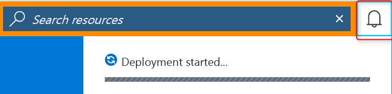

9. Once the configuration progress has completed, on the VM management menu, click **Backup** to open the Backup menu and view the available details.

  

  Until the initial backup has completed, **Last backup status** shows as **Warning(Initial backup pending)**. To see when the next scheduled backup job occurs, under **Summary** click the name of the policy. The Backup Policy menu opens and shows the time of the scheduled backup.

10. To protect the virtual machine, click **Backup now**. 

  

  The Backup Now menu opens. 

  

11. On the Backup Now menu, click the calendar icon, use the calendar control to select the last day this recovery point is retained, and click **OK**.

  

  Deployment notifications let you know the backup job has been triggered, and that you can monitor the progress of the job on the Backup jobs page.

## Configure the backup job from the Recovery Services vault
To configure the backup job, you complete the following steps.

1. Create a Recovery Services vault for a virtual machine.
2. Use the Azure portal to select a Scenario, set a Backup policy, and identify items to protect.
3. Run the initial backup.

## Create a recovery services vault for a VM
A Recovery Services vault is an entity that stores all the backups and recovery points that have been created over time. The Recovery Services vault also contains the backup policy applied to the protected VMs.

> [!NOTE]
> Backing up VMs is a local process. You cannot back up VMs from one region to a Recovery Services vault in another region. So, for every Azure region that has VMs to be backed up, at least one Recovery Services vault must exist in that region.
>
>

To create a Recovery Services vault:

1. If you haven't already done so, sign in to the [Azure portal](https://portal.azure.com/) using your Azure subscription.
2. On the Hub menu, click **All services** and in the Filter dialog type **Recovery Services**. As you type, the list of resources filters. When you see Recovery Services vaults in the list, click it.

      

    If there are Recovery Services vaults in the subscription, the vaults are listed.

    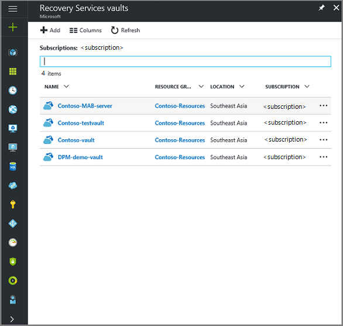
3. On the **Recovery Services vaults** menu, click **Add**.

    

    The Recovery Services vault menu opens, prompting you to provide a **Name**, **Subscription**, **Resource group**, and **Location**.

    

4. For **Name**, enter a friendly name to identify the vault. The name needs to be unique for the Azure subscription. Type a name that contains between 2 and 50 characters. It must start with a letter, and can contain only letters, numbers, and hyphens.

5. In the **Subscription** section, use the drop-down menu to choose the Azure subscription. If you use only one subscription, that subscription appears and you can skip to the next step. If you are not sure which subscription to use, use the default (or suggested) subscription. There are multiple choices only if your organizational account is associated with multiple Azure subscriptions.

6. In the **Resource group** section:

    * select **Create new** if you want to create a Resource group.
    Or
    * select **Use existing** and click the drop-down menu to see the available list of Resource groups.

  For complete information on Resource groups, see the [Azure Resource Manager overview](../azure-resource-manager/resource-group-overview.md).

7. Click **Location** to select the geographic region for the vault. This choice determines the geographic region where your backup data is sent.

  > [!IMPORTANT]
  > If you are unsure of the region in which your VM exists, close out of the vault creation dialog, and go to the list of Virtual Machines in the portal. If you have virtual machines in multiple regions, create a Recovery Services vault in each region. Create the vault in the first region before going to the next region. There is no need to specify the storage accounts used to store the backup data--the Recovery Services vault and the Azure Backup service automatically handle the storage.
  >

8. At the bottom of the Recovery Services vault menu, click **Create**.

    It can take several minutes for the Recovery Services vault to be created. Monitor the status notifications in the upper right-hand area of the portal. Once your vault is created, it appears in the list of Recovery Services vaults. If after several minutes you don't see your vault, click **Refresh**.

     

    Once you see your vault in the list of Recovery Services vaults, you are ready to set the storage redundancy.

Now that you've created your vault, learn how to set the storage replication.

### Set Storage Replication
The storage replication option allows you to choose between geo-redundant storage and locally redundant storage. By default, your vault has geo-redundant storage. If the Recovery Services vault is your primary backup, leave the storage replication option set to geo-redundant storage. Choose locally redundant storage if you want a cheaper option that isn't as durable. Read more about [geo-redundant](../storage/common/storage-redundancy-grs.md) and [locally redundant](../storage/common/storage-redundancy-lrs.md) storage options in the [Azure Storage replication overview](../storage/common/storage-redundancy.md).

To edit the storage replication setting:

1. From the **Recovery Services vaults** menu, select the new vault.

  

  When you select the vault, the Settings menu (*which has the vault's name at the top*) and the vault dashboard open.

  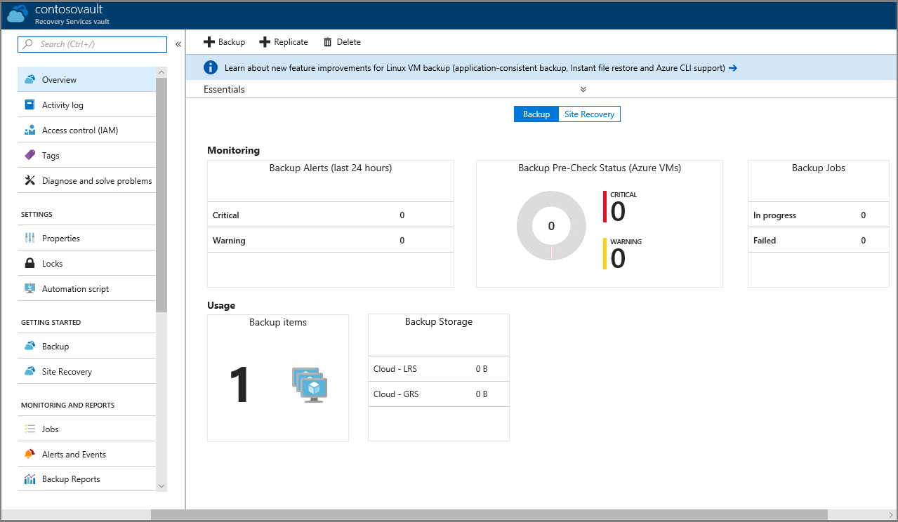

2. In the new vault's Management menu, use the vertical slide to scroll down to the Manage section, and click **Backup Infrastructure** to open the Backup Infrastructure menu.
 
   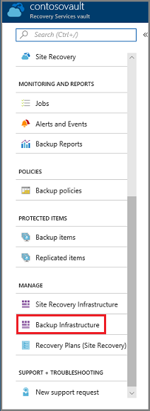

3. In the Backup Infrastructure menu, click **Backup Configuration** to open the **Backup Configuration** menu.

    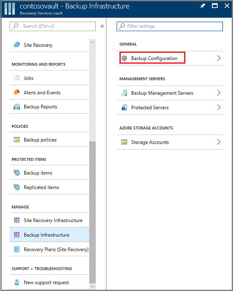
4. Choose the appropriate storage replication option for your vault.

    

    By default, your vault has geo-redundant storage. If you use Azure as a primary backup storage endpoint, continue to use **Geo-redundant**. If you don't use Azure as a primary backup storage endpoint, then choose **Locally redundant**, which reduces the Azure storage costs. Read more about [geo-redundant](../storage/common/storage-redundancy-grs.md) and [locally redundant](../storage/common/storage-redundancy-lrs.md) storage options in this [Storage redundancy overview](../storage/common/storage-redundancy.md).

## Select a backup goal, set policy and define items to protect
Before registering a VM with a vault, run the discovery process to ensure that any new virtual machines that have been added to the subscription are identified. The process queries Azure for the list of virtual machines in the subscription, along with additional information like the cloud service name and the region. In the Azure portal, scenario refers to what you are going to put into the recovery services vault. Policy is the schedule for how often and when recovery points are taken. Policy also includes the retention range for the recovery points.

1. If you already have a recovery services vault open, proceed to step 2. Otherwise, click **All services**. Type **Recovery Services** and click **Recovery Services vaults**.

      

    The list of recovery services vaults appears.

    

    From the list of recovery services vaults, select a vault to open its dashboard.

     

2. On the vault dashboard menu, click **Backup** to open the Backup menu.

    

    The Backup and Backup Goal menus open.

    
3. On the Backup Goal menu, from the **Where is your workload running** drop-down menu, choose Azure. From the **What do you want to backup** drop-down, choose Virtual machine, then click **OK**.

    These actions register the VM extension with the vault. The Backup Goal menu closes and the **Backup policy** menu opens.

    

4. On the Backup policy menu, select the backup policy you want to apply to the vault.

    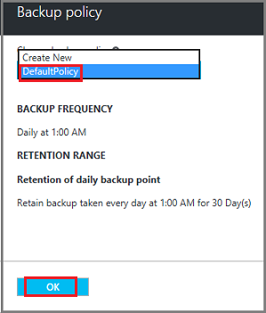

    The details of the default policy are listed under the drop-down menu. If you want to create a policy, select **Create New** from the drop-down menu. For instructions on defining a backup policy, see [Defining a backup policy](backup-azure-vms-first-look-arm.md#defining-a-backup-policy).
    Click **OK** to associate the backup policy with the vault.

    The Backup policy menu closes and the **Select virtual machines** menu opens.
5. In the **Select virtual machines** menu, choose the virtual machines to associate with the specified policy and click **OK**.

    

    The selected virtual machine is validated. If you do not see the virtual machines that you expected to see, check that they exist in the same Azure location as the Recovery Services vault and that they are not already being protected. The location of the Recovery Services vault is shown on the vault dashboard.

6. Now that you have defined all settings for the vault, in the Backup menu, click **Enable Backup** to deploy the policy to the vault and the VMs. Deploying the backup policy does not create the initial recovery point for the virtual machine.

    

After successfully enabling the backup, your backup policy will execute on schedule. However, proceed to initiate the first backup job.

## Initial backup
Once a backup policy has been deployed on the virtual machine, that does not mean the data has been backed up. By default, the first scheduled backup (as defined in the backup policy) is the initial backup. Until the initial backup occurs, the Last Backup Status on the **Backup Jobs** menu shows as **Warning(initial backup pending)**.

Unless your initial backup is due to begin soon, it is recommended that you run **Back up Now**.

To run the initial backup job:

1. On the vault dashboard, click the number under **Backup Items**, or click the **Backup Items** tile.  
  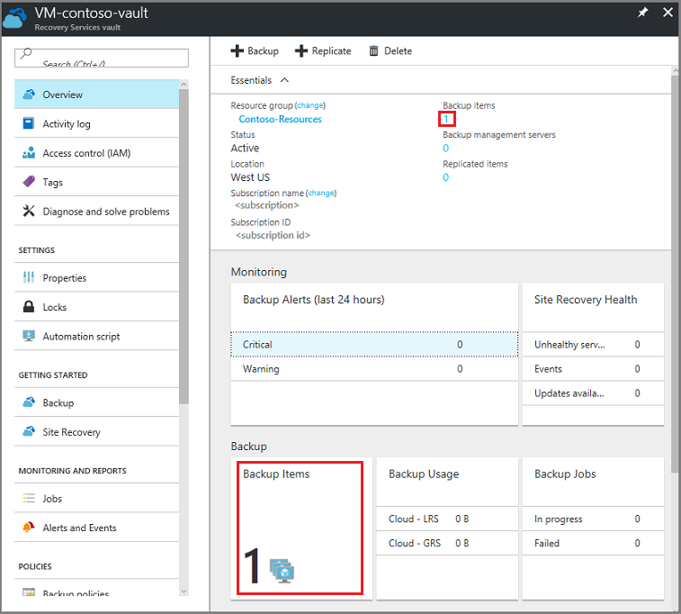

  The **Backup Items** menu opens.

  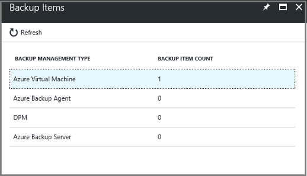

2. On the **Backup Items** menu, select the item.

  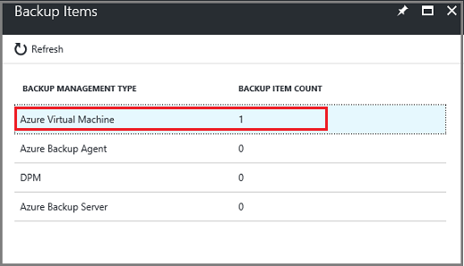

  The **Backup Items** list opens.  

  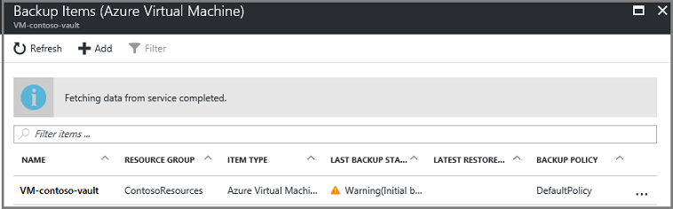

3. On the **Backup Items** list, click the ellipses **...** to open the Context menu.

  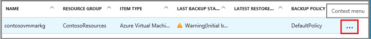

  The Context menu appears.

  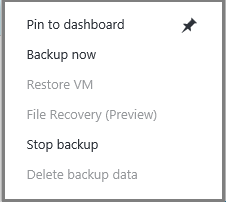

4. On the Context menu, click **Backup now**.

  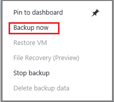

  The Backup Now menu opens.

  

5. On the Backup Now menu, click the calendar icon, use the calendar control to select the last day this recovery point is retained, and click **Backup**.

  

  Deployment notifications let you know the backup job has been triggered, and that you can monitor the progress of the job on the Backup jobs page. Depending on the size of your VM, creating the initial backup may take a while.

6. To view or track the status of the initial backup, on the vault dashboard, on the **Backup Jobs** tile click **In progress**.

  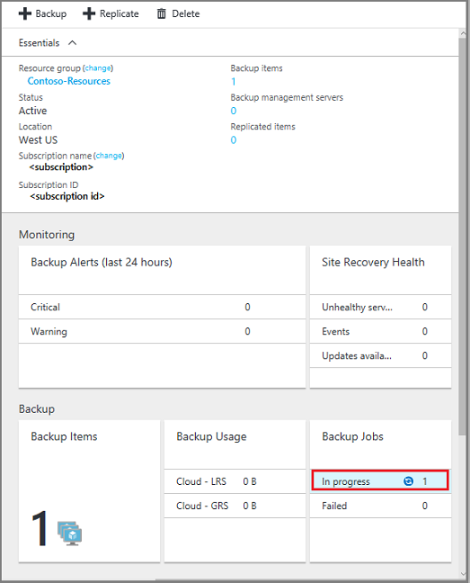

  The Backup Jobs menu opens.

  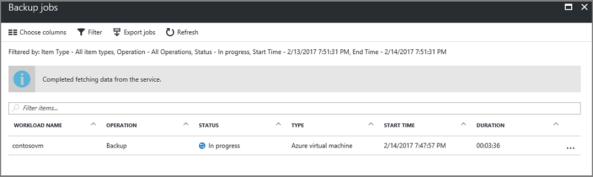

  In the **Backup jobs** menu, you can see the status of all jobs. Check if the backup job for your VM is still in progress, or if it has finished. When a backup job is finished, the status is *Completed*.

  > [!NOTE]
  > As a part of the backup operation, the Azure Backup service issues a command to the backup extension in each VM to flush all writes and take a consistent snapshot.
  >
  >

[!INCLUDE [backup-create-backup-policy-for-vm](../../includes/backup-create-backup-policy-for-vm.md)]

## Install the VM Agent on the virtual machine
This information is provided in case it is needed. The Azure VM Agent must be installed on the Azure virtual machine for the Backup extension to work. However, if your VM was created from the Azure gallery, then the VM Agent is already present on the virtual machine. VMs that are migrated from on-premises datacenters would not have the VM Agent installed. In such a case, the VM Agent needs to be installed. If you have problems backing up the Azure VM, check that the Azure VM Agent is correctly installed on the virtual machine (see the following table). If you create a custom VM, install the VM Agent before the virtual machine is provisioned.

Learn about the [VM Agent](https://go.microsoft.com/fwLink/?LinkID=390493&clcid=0x409) and [how to install it](../virtual-machines/windows/classic/manage-extensions.md?toc=%2fazure%2fvirtual-machines%2fwindows%2fclassic%2ftoc.json).

The following table provides additional information about the VM Agent for Windows and Linux VMs.

| **Operation** | **Windows** | **Linux** |
| --- | --- | --- |
| Installing the VM Agent |<li>Download and install the [agent MSI](http://go.microsoft.com/fwlink/?LinkID=394789&clcid=0x409). You need Administrator privileges to complete the installation. <li>[Update the VM property](http://blogs.msdn.com/b/mast/archive/2014/04/08/install-the-vm-agent-on-an-existing-azure-vm.aspx) to indicate that the agent is installed. |<li> Install the latest [Linux agent](https://github.com/Azure/WALinuxAgent) from GitHub. You need Administrator privileges to complete the installation. <li> [Update the VM property](http://blogs.msdn.com/b/mast/archive/2014/04/08/install-the-vm-agent-on-an-existing-azure-vm.aspx) to indicate that the agent is installed. |
| Updating the VM Agent |Updating the VM Agent is as simple as reinstalling the [VM Agent binaries](http://go.microsoft.com/fwlink/?LinkID=394789&clcid=0x409).  Ensure that no backup operation is running while the VM agent is being updated. |Follow the instructions on [updating the Linux VM Agent](../virtual-machines/linux/update-agent.md?toc=%2fazure%2fvirtual-machines%2flinux%2ftoc.json).  Ensure that no backup operation is running while the VM Agent is being updated. |
| Validating the VM Agent installation |<li>Navigate to the *C:\WindowsAzure\Packages* folder in the Azure VM. <li>You should find the WaAppAgent.exe file present.<li> Right-click the file, go to **Properties**, and then select the **Details** tab. The Product Version field should be 2.6.1198.718 or higher. |N/A |

### Backup extension
Once the VM Agent is installed on the virtual machine, the Azure Backup service installs the backup extension to the VM Agent. The Azure Backup service seamlessly upgrades and patches the backup extension without additional user intervention.

The Backup service installs the backup extension, even if the VM is not running. A running VM provides the greatest chance of getting an application-consistent recovery point. However, the Azure Backup service continues to back up the VM even if it is turned off, and the extension could not be installed. This type of backup is known as Offline VM, and the recovery point is *crash consistent*.

## Troubleshooting information
If you have issues accomplishing some of the tasks in this article, consult the
[Troubleshooting guidance](backup-azure-vms-troubleshoot.md).

## Pricing
The cost of backing up Azure VMs is based on the number of protected instances. For a definition of a protected instance, see [What is a protected instance](backup-introduction-to-azure-backup.md#what-is-a-protected-instance). For an example of calculating the cost of backing up a virtual machine, see [How are protected instances calculated](backup-azure-vms-introduction.md#calculating-the-cost-of-protected-instances). See the Azure Backup Pricing page for information about [Backup Pricing](https://azure.microsoft.com/pricing/details/backup/).

## Questions?
If you have questions, or if there is any feature that you would like to see included, [send us feedback](http://aka.ms/azurebackup_feedback).
