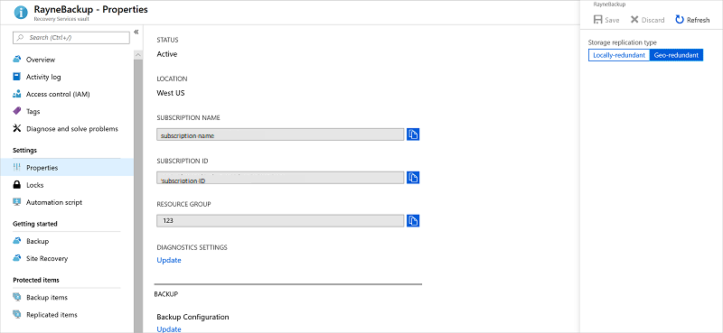
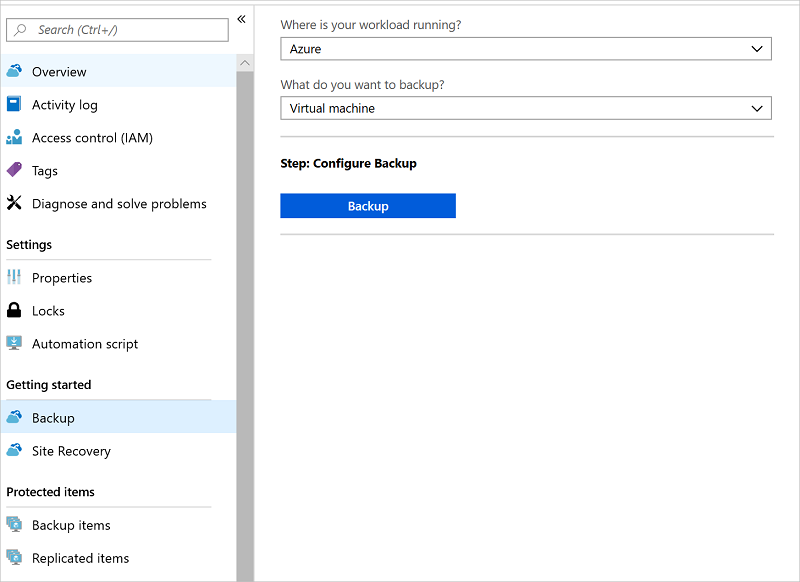
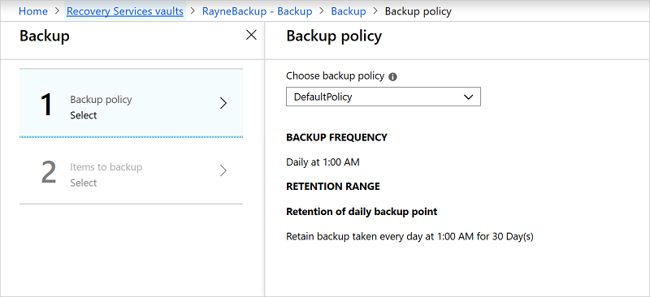
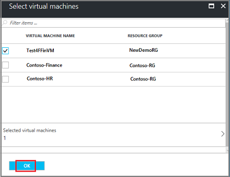
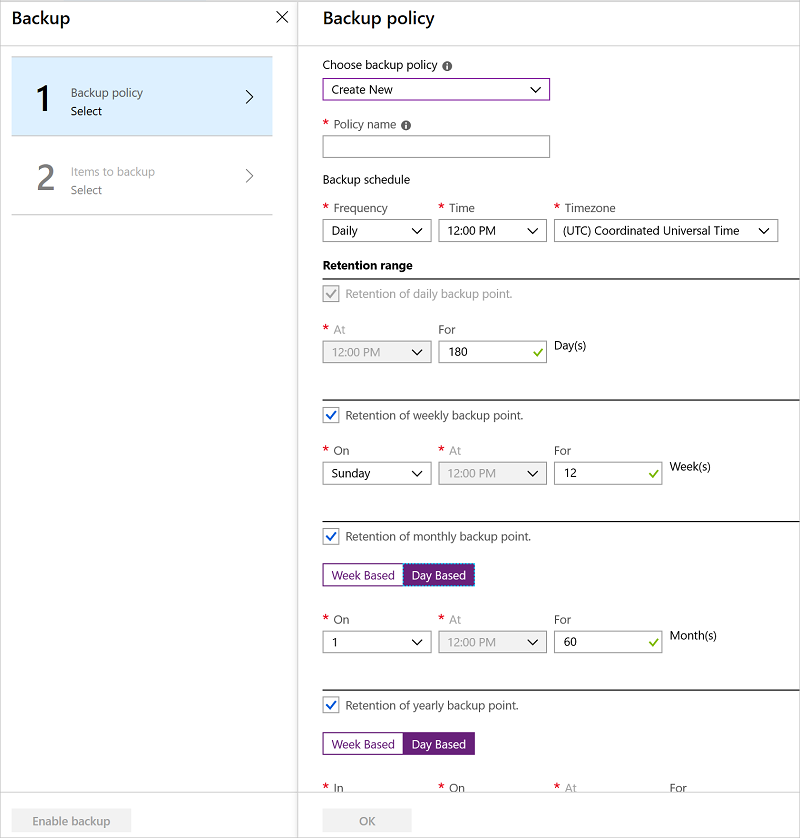

# Back up Azure VMs with the Azure Backup service

This article explains how to back up an Azure VM with the [Azure Backup](backup-overview.md) service. You can back up Azure VMs using a couple of methods:

- Single Azure VM: You can back up directly from the VM settings.
- Multiple Azure VMs: You can set up a Recovery Services vault and configure backup for multiple VM.

## Before you start

1. [Learn](backup-architecture.md#how-does-azure-backup-work) how backup works, and [verify](backup-support-matrix.md#azure-vms) support requirements. 
2. [Get an overview](backup-azure-vms-introduction.md) of Azure VM backup.
3. [Prepare](backup-azure-arm-vms-prepare.md) Azure VMs for backup.

### Azure VM agent installation

In order to back up Azure VMs, Azure Backup installs an extension on the VM agent running on the machine. If your VM was created from an Azure marketplace image, However, there are some cases (for example if you create a custom VM, or when you migrate a machine from on-premises) when the agent might not be installed.

- If you do need to install the VM agent manually, follow the instructions for [Windows](https://docs.microsoft.com/azure/virtual-machines/extensions/agent-windows) or [Linux](https://docs.microsoft.com/azure/virtual-machines/extensions/agent-linux) VMs. 
- With the agent install, Azure Backup installs the backup extension to the agent. It updates and patches the extension without user intervention.

## Back up from Azure VM settings

1. Sign in to the [Azure portal](https://portal.azure.com/).
2. Click **All services** and in the Filter, type **Virtual machines**, and then click **Virtual machines**. 
3. From the list of VMs select the VM you want to back up.
4. On the VM menu, click **Backup**. 
5. In **Recovery Services vault**, do the following:
  - If you already have a vault, click **Select existing**, and select a vault.
  - If you don't have a vault, click **Create new**. Specify a name for the vault. It's created in the same region and resource group as the VM. You can't modify these settings when you enable backup directly from the VM settings.

  

6. In **Choose backup policy**, do the following:

  - Leave the default policy. This backs up the VM once a day at the time specified, and retains backups in the vault for 30 days.
  - Select an existing backup policy if you  have one.
  - Create a new policy, and define the policy settings.  

  

7. Click **Enable Backup**. This associates the policy with the VM. 

    

8. You can track the configuration progress in the portal notifications.
9. After the job completes, in the VM menu, click **Backup**. The page shows backup status for the VM, information about recovery points, jobs running, and alerts issued.

  

10. After protecting the Azure VM, an initial backup runs. You can either start that backup immediately, or wait until it starts in accordance with the backup schedule.
    - Until the initial backup completes, the **Last backup status** shows as **Warning(Initial backup pending)**.
    - To see when the next scheduled backup will run, click the backup policy name.

> [!NOTE]
> Azure Backup creates a separate resource group (other than the VM resource group) to store restore points, with the naming format **AzureBackupRG_geography_number** (example:
AzureBackupRG_northeurope_1). You shouldn't lock this resource group.

### Run a backup immediately 

1. To run a backup immediately, in the VM menu, click **Backup** > **Backup now**.

    

2. In **Backup Now** use the calendar control to select until when the recovery point will be retained >  and **OK**.
  
    

3. Portal notifications let you know the backup job has been triggered. To monitor backup progress, click **View all jobs**.

## Back up from the Recovery Services vault

To back up an Azure VM from the vault, you create the vault, configure backup settings and policy, and enable backup for Azure VMs.

### Create a vault

1. In the Azure portmenu, click **All services** and in the Filter dialog type **Recovery services**. Any existing vaults will be listed.
2. In **Recovery Services vaults** , click **+Add**.
3. In **Recovery Services vault**, type in a friendly name to identify the vault. Select the Azure subscription, an existing or new [resource group](../azure-resource-manager/resource-group-overview.md), and the geographic region.
    - The name needs to be unique in the Azure subscription.
    - It should contain between 2 and 50 characters. It must start with a letter, and can contain only letters, numbers, and hyphens.
    - Create the vault in the region in which the VMs you want to back up are location. If you have VMs in multiple regions, you need a vault in each region.

    

4. Click **Create**. It can take several minutes to create the vault. Monitor the status notifications.
    - After the vault is created, it appears in the list of Recovery Services vaults.
    - If after several minutes you don't see your vault, click **Refresh**.

### Configure storage for the vault

Azure Backup automatically allocates and manages backup storage for vaults, using a [pay-as-you-use model](backup-azure-vms-introduction.md#backup-costs). The only thing you need to configure is the type of replication that backup storage should use.

- **LRS**: Locally redundant storage (LRS) replicates your data three times (it creates three copies of your data) in a storage scale unit in a datacenter. All copies of the data exist within the same region. LRS is a low-cost option for protecting your data from local hardware failures.
- **GRS**: Geo-redundant storage (GRS) is the default and recommended replication option. GRS replicates your data to a secondary region (hundreds of miles away from the primary location of the source data). GRS costs more than LRS, but GRS provides a higher level of durability for your data, even if there is a regional outage.

By default the vault uses GRS:
- In general, if you're directing backing up machines with Azure Backup, using the vault as your primary backup location, you might want to use GRS redundancy.
- If you want to use a cheaper option, or you're machines are also backing up to System Center DPM or Azure Backup Server running in Azure, you can consider LRS.

Configuration storage replication as follows:

1. In the vault menu > **Settings**, click **Properties**.
2. In the properties list **Backup configuration**, click **Update**, and select the replication option.

    

## Configure backup settings and policy

1. In the vault, under **Getting Started**, click **Backup**.
2. In **Where is your workload running?**, select **Azure**. In **What do you want to back up?**, select **Virtual Machine**. 
3. Click **Backup**. This registers the VM extension with the vault.

    

4. In **Backup policy**,  in the dropdown list:

    - Use the default policy.
    - Use an existing policy.
    - [Create a new policy](#define-a-backup-policy)

    

    Click **OK** to associate the backup policy with the vault.

5. In **Items to back up**, choose the VMs that you want to back up using the specified policy > **OK**.

    

6. The VMs are validated. If you don't see a particular VM, check that it exists in the same region as the vault, and that it isn't already enabled for protection.
7. After validation, in **Backup**, click **Enable Backup**. This deploys the backup policy and the VMs to the vault. 

    

8. You can start the initial backup immediately, or wait for it to run in accordance with the backup schedule. Until it runs, the **Last Backup** status in **Backup Jobs** shows as **Warning (initial backup pending)**.

    

### Define a backup policy

If you elected to create a new policy, do the following:

1. In **Policy name**, specify a name that makes the policy clearly identifiable.
2. In **Backup schedule**, specify how often you want to take snapshots for backup (daily or weekly), and when you want to take the snapshot.
3. In **Retention range**, specify how long you want to keep the backups:
    - If you're taking snapshots daily, you can specify both how long to keep the daily snapshots, and you can optionally configure retention settings for a weekly, monthly, and yearly snapshot. Monthly and yearly backups can be day or week-based.
    - If you're taking snapshots weekly, you can specify both how long to keep the weekly snapshots, and you can optionally configure retention settings for a monthly and yearly snapshot.
4. Click **OK** to save the policy.

    

## Run the initial backup

The initial backup will run in accordance with the schedule unless you manually run it immediately. Run it manually as follows:

1. In the vault menu, click **Backup items**.
2. In **Backup Items** click **Azure Virtual Machine**.
    
    

3. In the **Backup Items** list, click the ellipses **...**.

    

4. Click **Backup now**.
5. In **Backup Now**, use the calendar control to select the last day that the recovery point should be retained >  **OK**.

    

6. Monitor the portal notifications. You can monitor the job progress in the vault dashboard > **Backup Jobs** > **In progress**. Depending on the size of your VM, creating the initial backup may take a while.

    

## Next steps

- If you have difficulties with any of the procedures in this article, consult the [troubleshooting guide](backup-azure-vms-troubleshoot.md).
- [Learn about](backup-azure-manage-vms.md) managing your backups.

