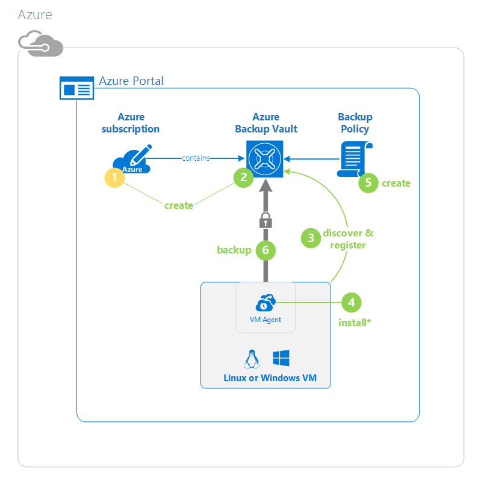

<properties
	pageTitle="Protect VMs in Azure with Azure Backup | Microsoft Azure"
	description="Protect Azure VMs with Azure Backup service. Tutorial explains create vault, register VMs, create policy, and protect VMs in Azure."
	services="backup"
	documentationCenter=""
	authors="markgalioto"
	manager="jwhit"
	editor=""/>

<tags
	ms.service="backup"
	ms.workload="storage-backup-recovery"
	ms.tgt_pltfrm="na"
	ms.devlang="na"
	ms.topic="hero-article"
	ms.date="03/30/2016"
	ms.author="markgal; jimpark"/>

# First look: Backing up Azure virtual machines

> [AZURE.SELECTOR]
- [Back up ARM VMs](backup-azure-vms-first-look-arm.md)
- [Back up Classic mode VMs](backup-azure-vms-first-look.md)

This article is a tutorial that will take you through the set of steps for preparing your Azure environment to back up an Azure virtual machine (VM). This tutorial assumes you already have a VM in your Azure subscription and that you have taken the measures to allow the backup service to access the VM. At a high level, here are the steps that you will complete.  

1. Create or sign in to your Azure subscription.
2. Create a backup vault or identify an existing backup vault *in the same region as your VM*.
3. Use the Azure portal to discover and register the virtual machines in the subscription.
4. Install the VM Agent on the virtual machine (if you are using a VM from the Azure gallery, the VM Agent will already be present).
5. Create the policy for protecting the virtual machines.
6. Run the backup.

>[AZURE.NOTE] Azure has two deployment models for creating and working with resources: [Resource Manager and classic](../resource-manager-deployment-model.md). Currently, the Azure Backup service does not support Azure Resource Manager (ARM)-based virtual machines - also known as IaaS V2 virtual machines. Since IaaS V2 VMs came about with the release of the new Azure portal, this tutorial is designed for use with the type of VMs that can be created in the Azure classic portal.

## Step 1 - Create a backup vault for a VM

A backup vault is an entity that stores all the backups and recovery points that have been created over time. The backup vault also contains the backup policies that will be applied to the virtual machines being backed up.

This image shows the relationships between the various Azure Backup entities:
    

To create a backup vault:

1. Sign in to the [Azure portal](http://manage.windowsazure.com/).

2. In the Azure portal click **New** > **Data Services** > **Recovery Services** > **Backup Vault** > **Quick Create** (see the image below).

    

3. For **Name**, enter a friendly name to identify the vault. The name needs to be unique for the Azure subscription. Type a name that contains between 2 and 50 characters. It must start with a letter, and can contain only letters, numbers, and hyphens.

4. In **Region**, select the geographic region for the vault. The vault **must** be in the same region as the virtual machines that you want to protect.

    If you are unsure of the region in which your VM exists, close out of the vault creation dialog, and go to the list of Virtual Machines in the portal. If you have virtual machines in multiple regions, you will need to create a backup vault in each region - although complete the creation of the vault in the first region before going to the next. There is no need to specify storage accounts to store the backup data--the backup vault and the Azure Backup service handle this automatically.

5. In **Subscription** select the subscription you want to associate with the backup vault. There will be multiple choices only if your organizational account is associated with multiple Azure subscriptions.

6. Click **Create Vault**. It can take a while for the backup vault to be created. Monitor the status notifications at the bottom of the portal.

    

    A message will confirm the vault has been successfully created. It will be listed on the **recovery services** page as **Active**.

    

7. In the list of vaults on **Recovery Services** page, click the vault you created to launch the **Quick Start** page.

    

8. On the **Quick Start** page, click **Configure** to open the storage replication option.
    

9. On the **storage replication** option, choose the replication option for your vault.

    

    By default, your vault has geo-redundant storage. If you are using Azure as a primary backup storage endpoint, it is recommended that you continue using geo-redundant storage. If you are using Azure as  non-primary backup storage endpoint, then you can consider choosing locally redundant storage, which will reduce the cost of storing data in Azure. Read more about [geo-redundant](../storage/storage-redundancy.md#geo-redundant-storage) and [locally redundant](../storage/storage-redundancy.md#locally-redundant-storage) storage options in this [overview](../storage/storage-redundancy.md).

After choosing the storage option for your vault, you are ready to associate the VM with the vault. To begin the association, you should discover and register the Azure virtual machines.

## Step 2 - Discover and Register Azure virtual machines
Before registering the a VM with a vault, run the discovery process to ensure that any new virtual machines that have been added to the subscription are identified. The process queries Azure for the list of virtual machines in the subscription, along with additional information like the cloud service name and the region.

1. Sign in to the [Azure portal](http://manage.windowsazure.com/)

2. In the Azure classic portal, click **Recovery Services** to open the list of Recovery Services vaults.
    

3. In the list of **Recovery Services** vaults, select the vault you want to use to back up a VM.

    When you select your vault, it will open in the **Quick Start** page

4. From the vault menu (at the top of the page), click **Registered Items**.

5. From the **Type** menu, select **Azure Virtual Machine**.

    

6. Click **DISCOVER** at the bottom of the page.
    

    The discovery process may take a few minutes while the virtual machines are being tabulated. There is a notification at the bottom of the screen that lets you know that the process is running.

    

    The notification changes when the process is complete.

    

7. Click **REGISTER** at the bottom of the page.
    

8. In the **Register Items** shortcut menu, select the virtual machines that you want to register. If there are two or more virtual machines with the same name, use the cloud service to distinguish between them.

    >[AZURE.TIP] Multiple virtual machines can be registered at one time.

    A job is created for each virtual machine that you've selected.

9. Click **View Job** in the notification to go to the **Jobs** page.

    

    The virtual machine also appears in the list of registered items, along with the status of the registration operation.

    

    When the operation completes, the status will change to reflect the *registered* state.

    

## Step 3 - Install the VM Agent on the virtual machine

The Azure VM Agent must be installed on the Azure virtual machine for the Backup extension to work. If your VM was created from the Azure gallery, then the VM Agent is already present on the virtual machine. However, VMs that are migrated from on-premises datacenters would not have the VM Agent installed. In such a case, the VM Agent needs to be installed explicitly. Before you attempt to back up the Azure VM, check that the Azure VM Agent is correctly installed on the virtual machine (see the table below). If you creating a custom VM, [ensure that the **Install the VM Agent** check box is selected](../virtual-machines/virtual-machines-windows-classic-agents-and-extensions.md) before the virtual machine is provisioned.

Learn about the [VM Agent](https://go.microsoft.com/fwLink/?LinkID=390493&clcid=0x409) and [how to install it](../virtual-machines/virtual-machines-windows-classic-manage-extensions.md).

The following table provides additional information about the VM Agent for Windows and Linux VMs.

| **Operation** | **Windows** | **Linux** |
| --- | --- | --- |
| Installing the VM Agent | <li>Download and install the [agent MSI](http://go.microsoft.com/fwlink/?LinkID=394789&clcid=0x409). You will need Administrator privileges to complete the installation. <li>[Update the VM property](http://blogs.msdn.com/b/mast/archive/2014/04/08/install-the-vm-agent-on-an-existing-azure-vm.aspx) to indicate that the agent is installed. | <li> Install the latest [Linux agent](https://github.com/Azure/WALinuxAgent) from GitHub. You will need Administrator privileges to complete the installation. <li> [Update the VM property](http://blogs.msdn.com/b/mast/archive/2014/04/08/install-the-vm-agent-on-an-existing-azure-vm.aspx) to indicate that the agent is installed. |
| Updating the VM Agent | Updating the VM Agent is as simple as reinstalling the [VM Agent binaries](http://go.microsoft.com/fwlink/?LinkID=394789&clcid=0x409).  Ensure that no backup operation is running while the VM agent is being updated. | Follow the instructions on [updating the Linux VM Agent ](../virtual-machines-linux-update-agent.md).  Ensure that no backup operation is running while the VM Agent is being updated. |
| Validating the VM Agent installation | <li>Navigate to the *C:\WindowsAzure\Packages* folder in the Azure VM. <li>You should find the WaAppAgent.exe file present.<li> Right-click the file, go to **Properties**, and then select the **Details** tab. The Product Version field should be 2.6.1198.718 or higher. | N/A |

### Backup extension

Once the VM Agent is installed on the virtual machine, the Azure Backup service installs the backup extension to the VM Agent. The Azure Backup service seamlessly upgrades and patches the backup extension without additional user intervention.

The backup extension is installed by the Backup service whether or not the VM is running. A running VM provides the greatest chance of getting an application-consistent recovery point. However, the Azure Backup service will continue to back up the VM even if it is turned off, and the extension could not be installed. This is known as Offline VM. In this case, the recovery point will be *crash consistent*.

## Step 4 - Protect Azure virtual machines
Now you can set up a backup and retention policy for the virtual machine. Multiple virtual machines can be protected by using a single protect action. Azure Backup vaults created after May 2015 come with a default policy built into the vault. This default policy comes with a default retention of 30 days and a once-daily backup schedule.

1. Navigate to the backup vault under **Recovery Services** in the Azure portal, and then click **Registered Items**.
2. Select **Azure Virtual Machine** from the drop-down menu.

    

3. Click **PROTECT** at the bottom of the page.
    

    The **Protect Items wizard** appears and lists *only* virtual machines that are registered and not protected.

    

4. Select the virtual machines that you want to protect.

    If there are two or more virtual machines with the same name, use the Cloud Service to distinguish between the virtual machines.

5. On **Configure protection** select an existing policy or create a new policy to protect the virtual machines that you identified.

    Each backup policy can have multiple virtual machines associated with it. However, the virtual machine can only be associated with one policy at any given point in time.

    

    >[AZURE.NOTE] A backup policy includes a retention scheme for the scheduled backups. If you select an existing backup policy, you will be unable to modify the retention options in the next step.

6. On **Retention Range** define the daily, weekly, monthly, and yearly scope for the specific backup points.

    

    Retention policy specifies the length of time for storing a backup. You can specify different retention policies based on when the backup is taken. For example, a backup point taken at the end of each quarter may need to be preserved for a longer period (for audit purposes) - while the backup point taken daily (which serves as an operational recovery point) only needs to be preserved for 90 days.

    

    In this example image:

    - **Daily retention policy**: Backups taken daily are stored for 30 days.
    - **Weekly retention policy**: Backups taken every week on Sunday will be preserved for 104 weeks.
    - **Monthly retention policy**: Backups taken on the last Sunday of each month will be preserved for 120 months.
    - **Yearly retention policy**: Backups taken on the first Sunday of every January will be preserved for 99 years.

    A job is created to configure the protection policy and associate the virtual machines to that policy for each virtual machine that you've selected.

6. Click **Job** and choose the right filter to view the list of **Configure Protection** jobs.

    

## Step 5 - Initial backup

Once a virtual machine has been protected with a policy, you can view that relationship on the **Protected Items** tab. Until the initial backup for a VM has occurred, the **Protection Status** shows as **Protected - (pending initial backup)**. By default, the first scheduled backup is the *initial backup*.

To trigger the initial backup immediately after configuring protection:

1. On the **Protected Items** page click the **Backup Now** button at the bottom of the page.
    

    The Azure Backup service creates a backup job for the initial backup operation.

2. Click the **Jobs** tab to view the list of jobs.

    

    >[AZURE.NOTE] As a part of the backup operation, the Azure Backup service issues a command to the backup extension in each virtual machine to flush all writes and take a consistent snapshot.

    When initial backup is complete, the status of the virtual machine in the **Protected Items** tab will be *Protected*.

    

    >[AZURE.NOTE] Backing up virtual machines is a local process. You cannot back up virtual machines from one region to a backup vault in another region. So, for every Azure region that has VMs that need to be backed up, at least one backup vault must be created in that region.

## Next steps
Now that you have successfully backed up a VM, there are several next steps that could be of interest. The most logical step is to familiarize yourself with restoring data to a VM, however there are management tasks that will help you understand how to keep your data safe and keep costs down.

- [Manage and monitor your virtual machines](backup-azure-manage-vms.md)
- [Restore virtual machines](backup-azure-restore-vms.md)
- [Troubleshooting guidance](backup-azure-vms-troubleshoot.md)

## Questions?
If you have questions, or if there is any feature that you would like to see included, [send us feedback](http://aka.ms/azurebackup_feedback).
