<properties
	pageTitle="First Look: Protect Azure VMs with a backup vault | Microsoft Azure"
	description="Protect Azure VMs with Backup vault. Tutorial explains create vault, register VMs, create policy, and protect VMs in Azure."
	services="backup"
	documentationCenter=""
	authors="markgalioto"
	manager="cfreeman"
	editor=""/>

<tags
	ms.service="backup"
	ms.workload="storage-backup-recovery"
	ms.tgt_pltfrm="na"
	ms.devlang="na"
	ms.topic="hero-article"
	ms.date="07/29/2016"
	ms.author="markgal; jimpark"/>

# First look: Backing up Azure virtual machines

> [AZURE.SELECTOR]
- [First look: Protect VMs with a recovery services vault](backup-azure-vms-first-look-arm.md)
- [First Look: Protect Azure VMs with a backup vault](backup-azure-vms-first-look.md)

This tutorial takes you through the steps for backing up an Azure virtual machine (VM) to a backup vault in Azure. This article describes the Classic model or Service Manager deployment model, for backing up VMs. If you are interested in backing up a VM to a Recovery Services vault that belongs to a Resource Group, see [First look: Protect VMs with a recovery services vault](backup-azure-vms-first-look-arm.md). To successfully complete this tutorial, these prerequisites must exist:

- You have created a VM in your Azure subscription.
- The VM has connectivity to Azure public IP addresses. For additional information, see [Network connectivity](./backup-azure-vms-prepare.md#network-connectivity).

To back up a VM, there are five main steps:  

 Create a backup vault or identify an existing backup vault.  
 Use the Azure Classic portal to discover and register the virtual machines.  
 Install the VM Agent.  
 Create the policy for protecting the virtual machines.  
 Run the backup.

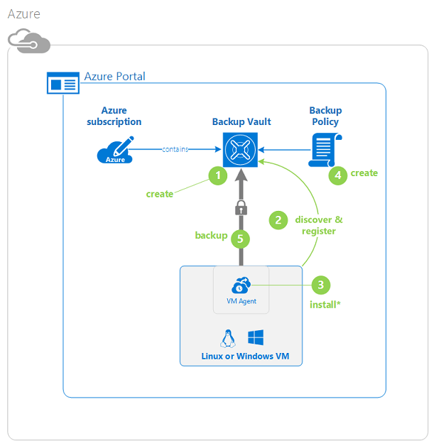

>[AZURE.NOTE] Azure has two deployment models for creating and working with resources: [Resource Manager and Classic](../resource-manager-deployment-model.md). This tutorial is for use with the VMs that can be created in the Azure Classic portal. The Azure Backup service supports Resource Manager-based VMs. For details on backing up VMs to a recovery services vault, see [First Look: Protect VMs with a recovery services vault](backup-azure-vms-first-look-arm.md).

## Step 1 - Create a backup vault for a VM

A backup vault is an entity that stores all the backups and recovery points that have been created over time. The backup vault also contains the backup policies that are applied to the virtual machines being backed up.

1. Sign in to the [Azure Classic portal](http://manage.windowsazure.com/).

2. In the lower left corner of the Azure portal, click **New**

    

3. In the Quick Create wizard, click **Data Services** > **Recovery Services** > **Backup Vault** > **Quick Create**.

    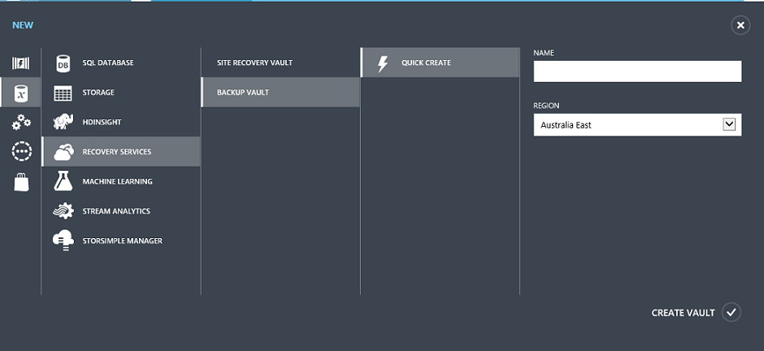

    The wizard prompts you for the **Name** and **Region**. If you administer more than one subscription, a dialog for choosing the subscription appears.

4. For **Name**, enter a friendly name to identify the vault. The name needs to be unique for the Azure subscription.

5. In **Region**, select the geographic region for the vault. The vault **must** be in the same region as the virtual machines it protects.

    If you don't know the region in which your VM exists, close this wizard and click **Virtual Machines** in the list of Azure services. The Location column provides the name of the region. If you have virtual machines in multiple regions, create a backup vault in each region.

6. If there is no **Subscription** dialog in the wizard, skip to the next step. If you work with multiple subscriptions, select a subscription to associate with the new backup vault.

    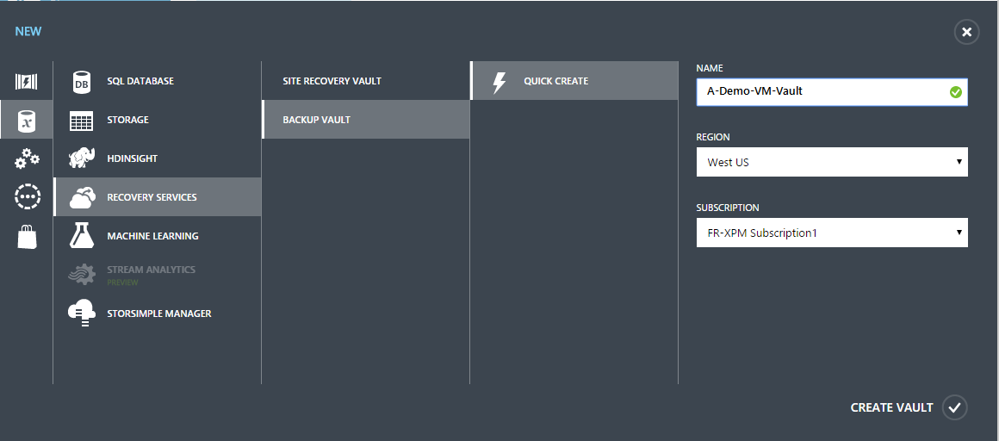

7. Click **Create Vault**. It can take a while for the backup vault to be created. Monitor the status notifications at the bottom of the portal.

    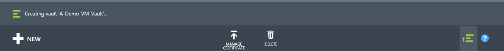

    A message confirms the vault has been successfully created. It is listed on the **Recovery services** page as **Active**.

    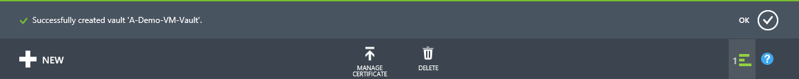

8. In the list of vaults on **Recovery Services** page, select the vault you created to launch the **Quick Start** page.

    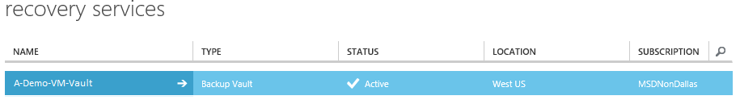

9. On the **Quick Start** page, click **Configure** to open the storage replication option.
    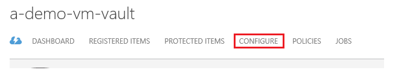

10. On the **storage replication** option, choose the replication option for your vault.

    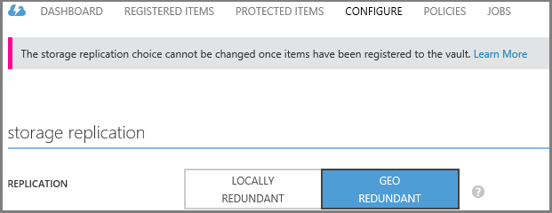

    By default, your vault has geo-redundant storage. Choose geo-redundant storage if this is your primary backup. Choose locally redundant storage if you want a cheaper option that isn't quite as durable. Read more about geo-redundant and locally redundant storage options in the [Azure Storage replication overview](../storage/storage-redundancy.md).

After choosing the storage option for your vault, you are ready to associate the VM with the vault. To begin the association, discover and register the Azure virtual machines.

## Step 2 - Discover and Register Azure virtual machines
Before registering the VM with a vault, run the discovery process to identify any new VMs. This returns a list of virtual machines in the subscription, along with additional information like the cloud service name and the region.

1. Sign in to the [Azure Classic portal](http://manage.windowsazure.com/)

2. In the Azure classic portal, click **Recovery Services** to open the list of Recovery Services vaults.
    

3. From the list of vaults, select the vault to back up a VM.

    When you select your vault, it opens in the **Quick Start** page

4. From the vault menu, click **Registered Items**.

    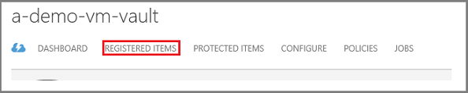

5. From the **Type** menu, select **Azure Virtual Machine**.

    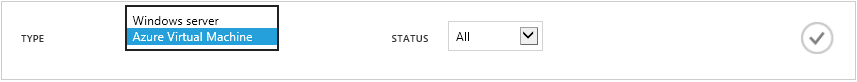

6. Click **DISCOVER** at the bottom of the page.
    

    The discovery process may take a few minutes while the virtual machines are being tabulated. There is a notification at the bottom of the screen that lets you know that the process is running.

    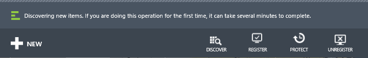

    The notification changes when the process is complete.

    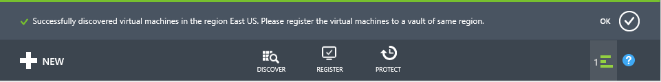

7. Click **REGISTER** at the bottom of the page.
    

8. In the **Register Items** shortcut menu, select the virtual machines that you want to register.

    >[AZURE.TIP] Multiple virtual machines can be registered at one time.

    A job is created for each virtual machine that you've selected.

9. Click **View Job** in the notification to go to the **Jobs** page.

    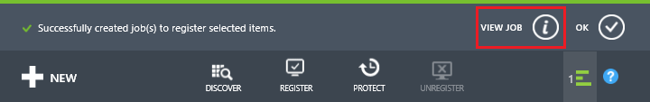

    The virtual machine also appears in the list of registered items, along with the status of the registration operation.

    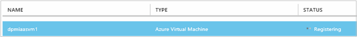

    When the operation completes, the status changes to reflect the *registered* state.

    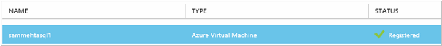

## Step 3 - Install the VM Agent on the virtual machine

The Azure VM Agent must be installed on the Azure virtual machine for the Backup extension to work. If your VM was created from the Azure gallery, the VM Agent is already present on the VM. You can skip to [protecting your VMs](backup-azure-vms-first-look.md#step-4---protect-azure-virtual-machines).

If your VM migrated from an on-premises datacenter, the VM probably does not have the VM Agent installed. You must install the VM Agent on the virtual machine before proceeding to protect the VM. For detailed steps on installing the VM Agent, see the [VM Agent section of the Backup VMs article](backup-azure-vms-prepare.md#vm-agent).

## Step 4 - Create the backup policy
Before you trigger the initial backup job, set the schedule when backup snapshots are taken. The schedule when backup snapshots are taken, and the length of time those snapshots are retained, is the backup policy. The retention information is based on Grandfather-father-son backup rotation scheme.

1. Navigate to the backup vault under **Recovery Services** in the Azure Classic portal, and  click **Registered Items**.
2. Select **Azure Virtual Machine** from the drop-down menu.

    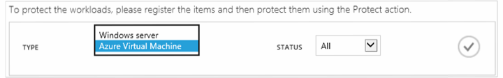

3. Click **PROTECT** at the bottom of the page.
    

    The **Protect Items wizard** appears and lists *only* virtual machines that are registered and not protected.

    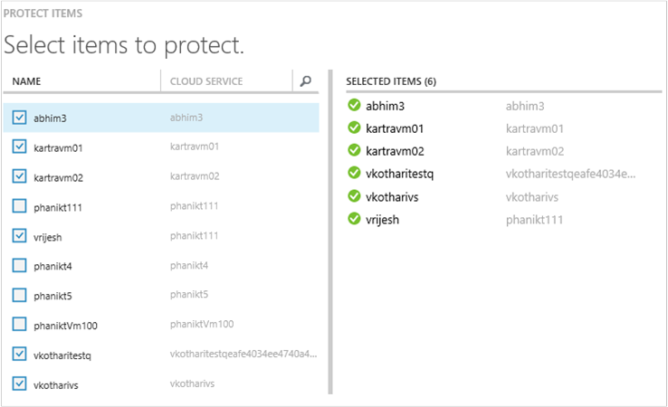

4. Select the virtual machines that you want to protect.

    If there are two or more virtual machines with the same name, use the Cloud Service to distinguish between the virtual machines.

5. On the **Configure protection** menu select an existing policy or create a new policy to protect the virtual machines that you identified.

    New Backup vaults have a default policy associated with the vault. This policy takes a daily snapshot each evening, and the daily snapshot is retained for 30 days. Each backup policy can have multiple virtual machines associated with it. However, the virtual machine can only be associated with one policy at a time.

    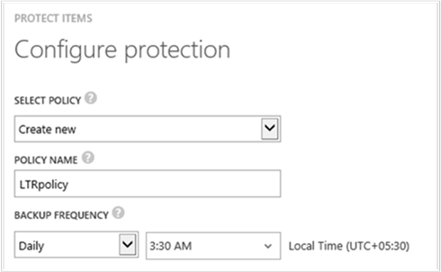

    >[AZURE.NOTE] A backup policy includes a retention scheme for the scheduled backups. If you select an existing backup policy, you will be unable to modify the retention options in the next step.

6. On **Retention Range** define the daily, weekly, monthly, and yearly scope for the specific backup points.

    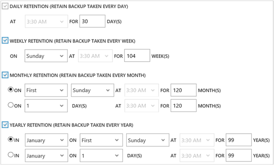

    Retention policy specifies the length of time for storing a backup. You can specify different retention policies based on when the backup is taken.

7. Click **Jobs** to view the list of **Configure Protection** jobs.

    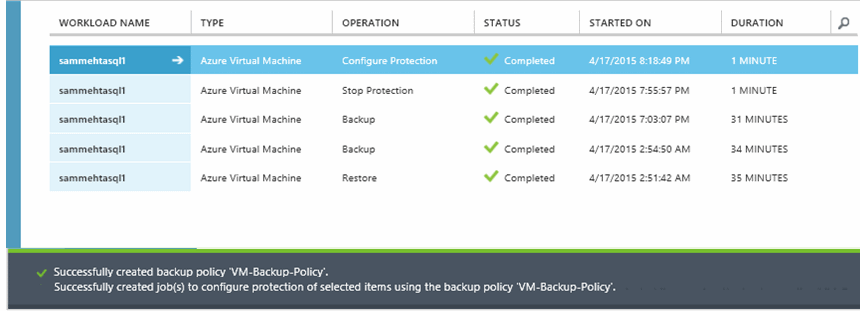

    Now that you've established the policy, go to the next step and run the initial backup.

## Step 5 - Initial backup

Once a virtual machine has been protected with a policy, you can view that relationship on the **Protected Items** tab. Until the initial backup occurs, the **Protection Status** shows as **Protected - (pending initial backup)**. By default, the first scheduled backup is the *initial backup*.

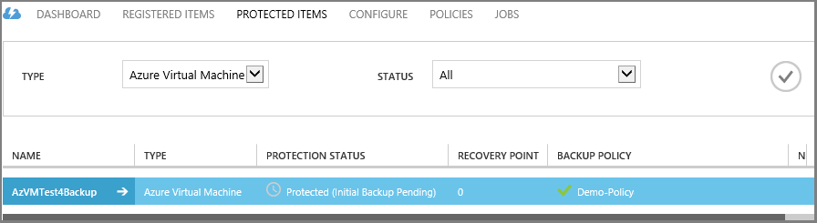

To start the initial backup now:

1. On the **Protected Items** page, click **Backup Now** at the bottom of the page.
    

    The Azure Backup service creates a backup job for the initial backup operation.

2. Click the **Jobs** tab to view the list of jobs.

    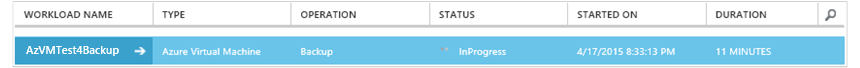

    When initial backup is complete, the status of the virtual machine in the **Protected Items** tab is *Protected*.

    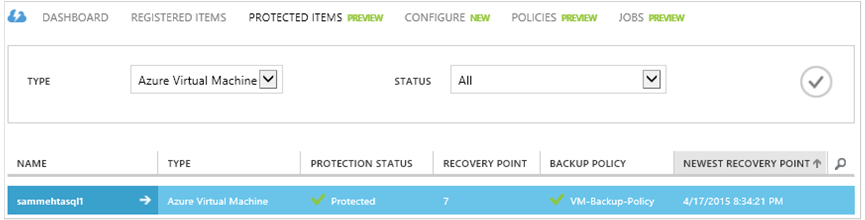

    >[AZURE.NOTE] Backing up virtual machines is a local process. You cannot back up virtual machines from one region to a backup vault in another region. So, for every Azure region that has VMs that need to be backed up, at least one backup vault must be created in that region.

## Next steps
Now that you have successfully backed up a VM, there are several next steps that could be of interest. The most logical step is to familiarize yourself with restoring data to a VM. However there are management tasks that will help you understand how to keep your data safe and minimize costs.

- [Manage and monitor your virtual machines](backup-azure-manage-vms.md)
- [Restore virtual machines](backup-azure-restore-vms.md)
- [Troubleshooting guidance](backup-azure-vms-troubleshoot.md)

## Questions?
If you have questions, or if there is any feature that you would like to see included, [send us feedback](http://aka.ms/azurebackup_feedback).
