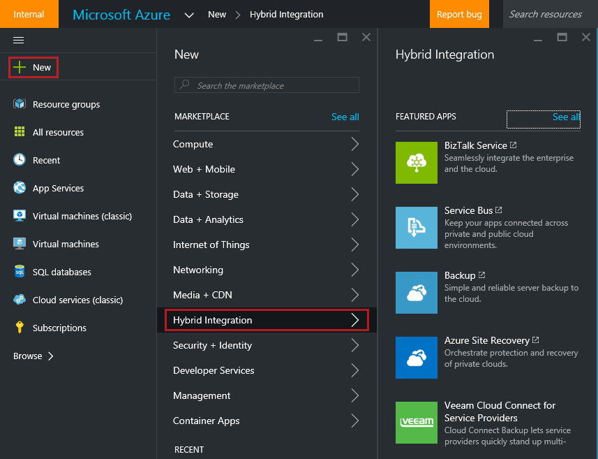
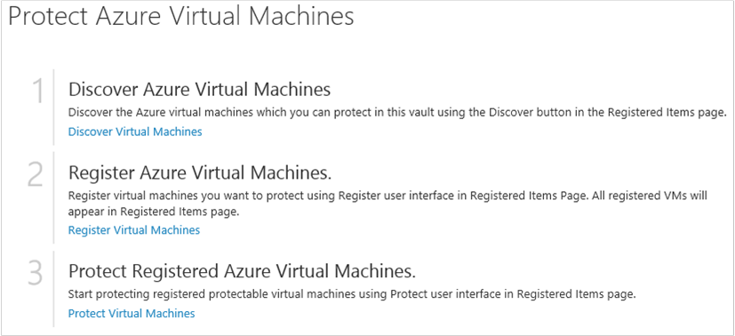

<properties
	pageTitle="Preparing your environment to back up Azure virtual machines | Microsoft Azure"
	description="Make sure your environment is prepared for backing up virtual machines in Azure"
	services="backup"
	documentationCenter=""
	authors="markgalioto"
	manager="cfreeman"
	editor=""
	keywords="backups; backing up;"/>

<tags
	ms.service="backup"
	ms.workload="storage-backup-recovery"
	ms.tgt_pltfrm="na"
	ms.devlang="na"
	ms.topic="article"
	ms.date="06/03/2016"
	ms.author="trinadhk; jimpark; markgal;"/>


# Prepare your environment to back up Azure virtual machines

> [AZURE.SELECTOR]
- [Resource manager model](backup-azure-arm-vms-prepare.md)
- [Classic model](backup-azure-vms-prepare.md)

Before you can back up an Azure virtual machine (VM), there are three conditions that must exist.

- You need to create a backup vault or identify an existing backup vault *in the same region as your VM*.
- Establish network connectivity between the Azure public Internet addresses and the Azure storage endpoints.
- Install the VM agent on the VM.

If you know these conditions already exist in your environment then proceed to the [Back up your VMs article](backup-azure-vms.md). Otherwise, read on, this article will lead you through the steps to prepare your environment to back up an Azure VM.


## Limitations when backing up and restoring a VM

>[AZURE.NOTE] Azure has two deployment models for creating and working with resources: [Resource Manager and classic](../resource-manager-deployment-model.md). The following list provides the limitations when deploying in the classic model.

- Backing up virtual machines with more than 16 data disks is not supported.
- Backing up virtual machines with a reserved IP address and no defined endpoint is not supported.
- Replacing an existing virtual machine during restore is not supported. First delete the existing virtual machine and any associated disks, and then restore the data from backup.
- Cross-region backup and restore is not supported.
- Backing up virtual machines by using the Azure Backup service is supported in all public regions of Azure (see the [checklist](https://azure.microsoft.com/regions/#services) of supported regions). If the region that you are looking for is unsupported today, it will not appear in the dropdown list during vault creation.
- Backing up virtual machines by using the Azure Backup service is supported only for select operating system versions:
  - **Linux**: Azure Backup supports [a list of distributions that are endorsed by Azure](../virtual-machines/virtual-machines-linux-endorsed-distros.md) except Core OS Linux. Other Bring-Your-Own-Linux distributions also might work as long as the VM agent is available on the virtual machine and support for Python exists.
  - **Windows Server**:  Versions older than Windows Server 2008 R2 are not supported.
- Restoring a domain controller (DC) VM that is part of a multi-DC configuration is supported only through PowerShell. Read more about [restoring a multi-DC domain controller](backup-azure-restore-vms.md#restoring-domain-controller-vms).
- Restoring virtual machines that have the following special network configurations is supported only through PowerShell. VMs that you create by using the restore workflow in the UI will not have these network configurations after the restore operation is complete. To learn more, see [Restoring VMs with special network configurations](backup-azure-restore-vms.md#restoring-vms-with-special-netwrok-configurations).
    - Virtual machines under load balancer configuration (internal and external)
    - Virtual machines with multiple reserved IP addresses
    - Virtual machines with multiple network adapters

## Create a backup vault for a VM

A backup vault is an entity that stores all the backups and recovery points that have been created over time. The backup vault also contains the backup policies that will be applied to the virtual machines being backed up.

This image shows the relationships between the various Azure Backup entities:
    

To create a backup vault:

1. Sign in to the [Azure portal](http://manage.windowsazure.com/).

2. In the Azure portal click **New** > **Hybrid Integration** > **Backup**. When you click **Backup**, you will automatically switch to the classic portal (shown after the Note).

    

    >[AZURE.NOTE] If your subscription was last used in the classic portal, then your subscription may open in the classic portal. In this event, to create a backup vault, click **New** > **Data Services** > **Recovery Services** > **Backup Vault** > **Quick Create** (see the image below).

    

3. For **Name**, enter a friendly name to identify the vault. The name needs to be unique for the Azure subscription. Type a name that contains between 2 and 50 characters. It must start with a letter, and can contain only letters, numbers, and hyphens.

4. In **Region**, select the geographic region for the vault. The vault must be in the same region as the virtual machines that you want to protect. If you have virtual machines in multiple regions, you must create a backup vault in each region. There is no need to specify storage accounts to store the backup data--the backup vault and the Azure Backup service handle this automatically.

5. In **Subscription** select the subscription you want to associate with the backup vault. There will be multiple choices only if your organizational account is associated with multiple Azure subscriptions.

6. Click **Create Vault**. It can take a while for the backup vault to be created. Monitor the status notifications at the bottom of the portal.

    

7. A message will confirm that the vault has been successfully created. It will be listed on the **recovery services** page as **Active**. Make sure to choose the appropriate storage redundancy option right after the vault has been created. Read more about [setting the storage redundancy option in the backup vault](backup-configure-vault.md#azure-backup---storage-redundancy-options).

    

8. Click the backup vault to go to the **Quick Start** page, where the instructions for backing up Azure virtual machines are shown.

    


## Network connectivity

In order to manage the VM snapshots, the backup extension needs connectivity to the Azure public IP addresses. Without the right Internet connectivity, the virtual machine's HTTP requests time out and the backup operation fails. If your deployment has access restrictions in place (through a network security group (NSG), for example), then choose one of these options for providing a clear path for backup traffic:

- [Whitelist the Azure datacenter IP ranges](http://www.microsoft.com/en-us/download/details.aspx?id=41653) - see the article for instructions on how to whitelist the IP addresses.
- Deploy an HTTP proxy server for routing traffic.

When deciding which option to use, the trade-offs are between manageability, granular control, and cost.

|Option|Advantages|Disadvantages|
|------|----------|-------------|
|Whitelist IP ranges| No additional costs.<br><br>For opening access in an NSG, use the <i>Set-AzureNetworkSecurityRule</i> cmdlet. | Complex to manage as the impacted IP ranges change over time.<br><br>Provides access to the whole of Azure, and not just Storage.|
|HTTP proxy| Granular control in the proxy over the storage URLs allowed.<br>Single point of Internet access to VMs.<br>Not subject to Azure IP address changes.| Additional costs for running a VM with the proxy software.|

### Whitelist the Azure datacenter IP ranges

To whitelist the Azure datacenter IP ranges, please see the [Azure website](http://www.microsoft.com/en-us/download/details.aspx?id=41653) for details on the IP ranges, and instructions.

### Using an HTTP proxy for VM backups
When backing up a VM, the backup extension on the VM sends the snapshot management commands to Azure Storage using an HTTPS API. Route the backup extension traffic through the HTTP proxy since it is the only component configured for access to the public Internet.

>[AZURE.NOTE] There is no recommendation for the proxy software that should be used. Ensure that you pick a proxy that is compatible with the configuration steps below.

The example image below shows the three configuration steps necessary to use an HTTP proxy:

- App VM routes all HTTP traffic bound for the public Internet through Proxy VM.
- Proxy VM allows incoming traffic from VMs in the virtual network.
- The Network Security Group (NSG) named NSF-lockdown needs a security rule allowing outbound Internet traffic from Proxy VM.


To use an HTTP proxy to communicating to the public Internet, follow these steps:

#### Step 1. Configure outgoing network connections
###### For Windows machines
This will setup proxy server configuration for Local System Account.

1. Download [PsExec](https://technet.microsoft.com/sysinternals/bb897553)
2. Run following command from elevated prompt,

     ```
     psexec -i -s "c:\Program Files\Internet Explorer\iexplore.exe"
     ```
     It will open internet explorer window.
3. Go to Tools -> Internet Options -> Connections -> LAN settings.
4. Verify proxy settings for System account. Set Proxy IP and port.
5. Close Internet Explorer.

This will set up a machine-wide proxy configuration, and will be used for any outgoing HTTP/HTTPS traffic.

If you have setup a proxy server on a current user account(not a Local System Account), use the following script to apply them to SYSTEMACCOUNT:

```
   $obj = Get-ItemProperty -Path Registry::”HKEY_CURRENT_USER\Software\Microsoft\Windows\CurrentVersion\Internet Settings\Connections"
   Set-ItemProperty -Path Registry::”HKEY_USERS\S-1-5-18\Software\Microsoft\Windows\CurrentVersion\Internet Settings\Connections" -Name DefaultConnectionSettings -Value $obj.DefaultConnectionSettings
   Set-ItemProperty -Path Registry::”HKEY_USERS\S-1-5-18\Software\Microsoft\Windows\CurrentVersion\Internet Settings\Connections" -Name SavedLegacySettings -Value $obj.SavedLegacySettings
   $obj = Get-ItemProperty -Path Registry::”HKEY_CURRENT_USER\Software\Microsoft\Windows\CurrentVersion\Internet Settings"
   Set-ItemProperty -Path Registry::”HKEY_USERS\S-1-5-18\Software\Microsoft\Windows\CurrentVersion\Internet Settings" -Name ProxyEnable -Value $obj.ProxyEnable
   Set-ItemProperty -Path Registry::”HKEY_USERS\S-1-5-18\Software\Microsoft\Windows\CurrentVersion\Internet Settings" -Name Proxyserver -Value $obj.Proxyserver
```

>[AZURE.NOTE] If you observe "(407)Proxy Authentication Required" in proxy server log, check your authrntication is setup correctly.

######For Linux machines

Add the following line to the ```/etc/environment``` file:

```
http_proxy=http://<proxy IP>:<proxy port>
```

Add the following lines to the ```/etc/waagent.conf``` file:

```
HttpProxy.Host=<proxy IP>
HttpProxy.Port=<proxy port>
```

#### Step 2. Allow incoming connections on the proxy server:

1. On the proxy server, open Windows Firewall. The easiest way to access the firewall is to search for Windows Firewall with Advanced Security.

    

2. In the Windows Firewall dialog, right-click  **Inbound Rules** and click **New Rule...**.

    

3. In the **New Inbound Rule Wizard**, choose the **Custom** option for the **Rule Type** and click **Next**.

4. On the page to select the **Program**, choose **All Programs** and click **Next**.

5. On the **Protocol and Ports** page, enter the following information and click **Next**:

    

    - for *Protocol type* choose *TCP*
    - for *Local port* choose *Specific Ports*, in the field below specify the ```<Proxy Port>``` that has been configured.
    - for *Remote port* select *All Ports*

    For the rest of the wizard, click all the way to the end and give this rule a name.

#### Step 3. Add an exception rule to the NSG:

In an Azure PowerShell command prompt, enter the following command:

The following command adds an exception to the NSG. This exception allows TCP traffic from any port on 10.0.0.5 to any Internet address on port 80 (HTTP) or 443 (HTTPS). If you require a specific port in the public Internet, be sure to add that port to the ```-DestinationPortRange``` as well.

```
Get-AzureNetworkSecurityGroup -Name "NSG-lockdown" |
Set-AzureNetworkSecurityRule -Name "allow-proxy " -Action Allow -Protocol TCP -Type Outbound -Priority 200 -SourceAddressPrefix "10.0.0.5/32" -SourcePortRange "*" -DestinationAddressPrefix Internet -DestinationPortRange "80-443"
```

*Ensure that you replace the names in the example with the details appropriate to your deployment.*


## VM agent

Before you can back up the Azure virtual machine, you should ensure that the Azure VM agent is correctly installed on the virtual machine. Since the VM agent is an optional component at the time that the virtual machine is created, ensure that the check box for the VM agent is selected before the virtual machine is provisioned.

### Manual installation and update

The VM agent is already present in VMs that are created from the Azure gallery. However, virtual machines that are migrated from on-premises datacenters would not have the VM agent installed. For such VMs, the VM agent needs to be installed explicitly. Read more about [installing the VM agent on an existing VM](http://blogs.msdn.com/b/mast/archive/2014/04/08/install-the-vm-agent-on-an-existing-azure-vm.aspx).

| **Operation** | **Windows** | **Linux** |
| --- | --- | --- |
| Installing the VM agent | <li>Download and install the [agent MSI](http://go.microsoft.com/fwlink/?LinkID=394789&clcid=0x409). You will need Administrator privileges to complete the installation. <li>[Update the VM property](http://blogs.msdn.com/b/mast/archive/2014/04/08/install-the-vm-agent-on-an-existing-azure-vm.aspx) to indicate that the agent is installed. | <li> Install the latest [Linux agent](https://github.com/Azure/WALinuxAgent) from GitHub. You will need Administrator privileges to complete the installation. <li> [Update the VM property](http://blogs.msdn.com/b/mast/archive/2014/04/08/install-the-vm-agent-on-an-existing-azure-vm.aspx) to indicate that the agent is installed. |
| Updating the VM agent | Updating the VM agent is as simple as reinstalling the [VM agent binaries](http://go.microsoft.com/fwlink/?LinkID=394789&clcid=0x409). <br><br>Ensure that no backup operation is running while the VM agent is being updated. | Follow the instructions on [updating the Linux VM agent ](../virtual-machines-linux-update-agent.md). <br><br>Ensure that no backup operation is running while the VM agent is being updated. |
| Validating the VM agent installation | <li>Navigate to the *C:\WindowsAzure\Packages* folder in the Azure VM. <li>You should find the WaAppAgent.exe file present.<li> Right-click the file, go to **Properties**, and then select the **Details** tab. The Product Version field should be 2.6.1198.718 or higher. | N/A |


Learn about the [VM agent](https://go.microsoft.com/fwLink/?LinkID=390493&clcid=0x409) and [how to install it](https://azure.microsoft.com/blog/2014/04/15/vm-agent-and-extensions-part-2/).

### Backup extension

To back up the virtual machine, the Azure Backup service installs an extension to the VM agent. The Azure Backup service seamlessly upgrades and patches the backup extension without additional user intervention.

The backup extension is installed if the VM is running. A running VM also provides the greatest chance of getting an application-consistent recovery point. However, the Azure Backup service will continue to back up the VM--even if it is turned off, and the extension could not be installed (aka Offline VM). In this case, the recovery point will be *crash consistent* as discussed above.


## Questions?
If you have questions, or if there is any feature that you would like to see included, [send us feedback](http://aka.ms/azurebackup_feedback).

## Next steps
Now that you have prepared your environment for backing up your VM, your next logical step is to create a backup. The planning article provides more detailed information about backing up VMs.

- [Back up virtual machines](backup-azure-vms.md)
- [Plan your VM backup infrastructure](backup-azure-vms-introduction.md)
- [Manage virtual machine backups](backup-azure-manage-vms.md)
