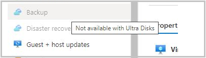

# Troubleshooting backup failures on Azure virtual machines

You can troubleshoot errors encountered while using Azure Backup with the information listed below:

## Backup

This section covers backup operation failure of Azure Virtual machine.

### Basic troubleshooting

* Ensure that the VM Agent (WA Agent) is the [latest version](./backup-azure-arm-vms-prepare.md#install-the-vm-agent).
* Ensure that the Windows or Linux VM OS version is supported, refer to the [IaaS VM Backup Support Matrix](./backup-support-matrix-iaas.md).
* Verify that another backup service isn't running.
  * To ensure there are no snapshot extension issues, [uninstall extensions to force reload and then retry the backup](./backup-azure-troubleshoot-vm-backup-fails-snapshot-timeout.md).
* Verify that the VM has internet connectivity.
  * Make sure another backup service isn't running.
* From `Services.msc`, ensure the **Windows Azure Guest Agent** service is **Running**. If the **Windows Azure Guest Agent** service is missing, install it from [Back up Azure VMs in a Recovery Services vault](./backup-azure-arm-vms-prepare.md#install-the-vm-agent).
* The **Event log** may show backup failures that are from other backup products, for example, Windows Server backup aren't happening due to Azure Backup. Use the following steps to determine whether the issue is with Azure Backup:
  * If there's an error with the entry **Backup** in the event source or message, check whether Azure IaaS VM Backup backups were successful, and whether a Restore Point was created with the desired snapshot type.
  * If Azure Backup is working, then the issue is likely with another backup solution.
  * Here is an example of an Event Viewer error 517 where Azure Backup was working fine but "Windows Server Backup" was failing:
    
  * If Azure Backup is failing, then look for the corresponding error code in the [Common issues](#common-issues) section.
  * If you see Azure Backup option greyed out on an Azure VM, hover over the disabled menu to find the reason. The reasons could be  "Not available with EphemeralDisk" or "Not available with Ultra Disk".
    

## Common issues

The following are common issues with backup failures on Azure virtual machines.

### VMRestorePointInternalError - Antivirus configured in the VM is restricting the execution of backup extension

Error code: VMRestorePointInternalError

If at the time of backup, the **Event Viewer Application logs** displays the message **Faulting application name: IaaSBcdrExtension.exe** then it's confirmed that the antivirus configured in the VM is restricting the execution of backup extension.
To resolve this issue, exclude the directories below in the antivirus configuration and retry the backup operation.

* `C:\Packages\Plugins\Microsoft.Azure.RecoveryServices.VMSnapshot`
* `C:\WindowsAzure\Logs\Plugins\Microsoft.Azure.RecoveryServices.VMSnapshot`

### CopyingVHDsFromBackUpVaultTakingLongTime - Copying backed up data from vault timed out

Error code: CopyingVHDsFromBackUpVaultTakingLongTime <br/>
Error message: Copying backed up data from vault timed out

This could happen due to transient storage errors or insufficient storage account IOPS for backup service to transfer data to the vault within the timeout period. Configure VM backup using these [best practices](backup-azure-vms-introduction.md#best-practices) and retry the backup operation.

### UserErrorVmNotInDesirableState - VM is not in a state that allows backups

Error code: UserErrorVmNotInDesirableState <br/>
Error message: VM is not in a state that allows backups.<br/>

The backup operation failed because the VM is in Failed state. For a successful backup, the VM state should be Running, Stopped, or Stopped (deallocated).

* If the VM is in a transient state between **Running** and **Shut down**, wait for the state to change. Then trigger the backup job.
* If the VM is a Linux VM and uses the Security-Enhanced Linux kernel module, exclude the Azure Linux Agent path **/var/lib/waagent** from the security policy and make sure the Backup extension is installed.

### UserErrorFsFreezeFailed - Failed to freeze one or more mount-points of the VM to take a file-system consistent snapshot

Error code: UserErrorFsFreezeFailed <br/>
Error message: Failed to freeze one or more mount-points of the VM to take a file-system consistent snapshot.

**Step 1:**

* Unmount the devices for which the file system state wasn't cleaned, using the **umount** command.
* Run a file system consistency check on these devices by using the **fsck** command.
* Mount the devices again and retry backup operation.</ol>

If you can't un-mount the devices then you can update the VM backup configuration to ignore certain mount points. For example, if '/mnt/resource' mount point can't be un-mounted and causing the VM backup failures, you can update the VM backup configuration files with the `MountsToSkip` property as follows.

```bash
cat /var/lib/waagent/Microsoft.Azure.RecoveryServices.VMSnapshotLinux-1.0.9170.0/main/tempPlugin/vmbackup.conf[SnapshotThread]
fsfreeze: True
MountsToSkip = /mnt/resource
SafeFreezeWaitInSeconds=600
```

**Step 2:**

* Check if there are duplicate mount points present.

Identify the failed to freeze mount points from the extension log file. <br>
For example: /boot, /usr/sap in the below sample output. 
```
    2017-11-02 11:22:56 Thawing: /boot
    2017-11-02 11:22:56 Failed to FITHAW: /boot
    2017-11-02 11:22:56 Thawing: /sapshare
    2017-11-02 11:22:56 Thawing: /usr/sap
    2017-11-02 11:22:56 Failed to FITHAW: /usr/sap
```

On the Linux VM execute 'mount' command and check if the failed mount points have multiple entries. If yes, remove the old entries or rename the mount path and retry the backup operation.


### ExtensionSnapshotFailedCOM / ExtensionInstallationFailedCOM / ExtensionInstallationFailedMDTC - Extension installation/operation failed due to a COM+ error

Error code: ExtensionSnapshotFailedCOM <br/>
Error message: Snapshot operation failed due to COM+ error

Error code: ExtensionInstallationFailedCOM  <br/>
Error message: Extension installation/operation failed due to a COM+ error

Error code: ExtensionInstallationFailedMDTC <br/>
Error message: Extension installation failed with the error "COM+ was unable to talk to the Microsoft Distributed Transaction Coordinator <br/>

The Backup operation failed due to an issue with Windows service **COM+ System** application.  To resolve this issue, follow these steps:

* Try starting/restarting Windows service **COM+ System Application** (from an elevated command prompt **- net start COMSysApp**).
* Ensure **Distributed Transaction Coordinator** service is running as **Network Service** account. If not, change it to run as **Network Service** account and restart **COM+ System Application**.
* If unable to restart the service, then reinstall **Distributed Transaction Coordinator** service by following the steps below:
  * Stop the MSDTC service
  * Open a command prompt (cmd)
  * Run the command `msdtc -uninstall`
  * Run the command `msdtc -install`
  * Start the MSDTC service
* Start the Windows service **COM+ System Application**. After the **COM+ System Application** starts, trigger a backup job from the Azure portal.</ol>

### ExtensionFailedVssWriterInBadState - Snapshot operation failed because VSS writers were in a bad state

Error code: ExtensionFailedVssWriterInBadState <br/>
Error message: Snapshot operation failed because VSS writers were in a bad state.

This error occurs because the VSS writers were in a bad state. Azure Backup extensions interact with VSS Writers to take snapshots of the disks. To resolve this issue, follow these steps:

**Step 1:** Check the **Free Disk Space**, **VM resources as RAM and page file**, and **CPU utilization percentage**.

- Increase the VM size to increase vCPUs and RAM space.
- Increase the disk size if the free disk space is low.

**Step 2:** Restart VSS writers that are in a bad state.

* From an elevated command prompt, run `vssadmin list writers`.
* The output contains all VSS writers and their state. For every VSS writer with a state that's not **[1] Stable**, restart the respective VSS writer's service.
* To restart the service, run the following commands from an elevated command prompt:

  `net stop serviceName` <br>
  `net start serviceName`

> [!NOTE]
> Restarting some services can have an impact on your production environment. Ensure the approval process is followed and the service is restarted at the scheduled downtime.

**Step 3:** If restarting the VSS writers did not resolve the issue, then run the following command from an elevated command-prompt (as an administrator) to prevent the threads from being created for blob-snapshots.

```console
REG ADD "HKLM\SOFTWARE\Microsoft\BcdrAgentPersistentKeys" /v SnapshotWithoutThreads /t REG_SZ /d True /f
```

**Step 4:** If steps 1 and 2 did not resolve the issue, then the failure could be due to VSS writers timing out due to limited IOPS.<br>

To verify, navigate to ***System and Event Viewer Application logs*** and check for the following error message:<br>
*The shadow copy provider timed out while holding writes to the volume being shadow copied. This is probably due to excessive activity on the volume by an application or a system service. Try again later when activity on the volume is reduced.*<br>

Solution:

* Check for possibilities to distribute the load across the VM disks. This will reduce the load on single disks. You can [check the IOPs throttling by enabling diagnostic metrics at storage level](/troubleshoot/azure/virtual-machines/performance-diagnostics#install-and-run-performance-diagnostics-on-your-vm).
* Change the backup policy to perform backups during off peak hours, when the load on the VM is at its lowest.
* Upgrade the Azure disks to support higher IOPs. [Learn more here](../virtual-machines/disks-types.md)

### ExtensionFailedVssServiceInBadState - Snapshot operation failed due to VSS (Volume Shadow Copy) service in bad state

Error code: ExtensionFailedVssServiceInBadState <br/>
Error message: Snapshot operation failed due to VSS (Volume Shadow Copy) service in bad state.

This error occurs because the VSS service was in a bad state. Azure Backup extensions interact with VSS service to take snapshots of the disks. To resolve this issue, follow these steps:

Restart VSS (Volume Shadow Copy) service.

* Navigate to Services.msc and restart 'Volume Shadow Copy service'.<br>
(or)<br>
* Run the following commands from an elevated command prompt:

  `net stop VSS` <br>
  `net start VSS`

If the issue still persists, restart the VM at the scheduled downtime.

### UserErrorSkuNotAvailable - VM creation failed as VM size selected is not available

Error code: UserErrorSkuNotAvailable
Error message: VM creation failed as VM size selected is not available.

This error occurs because the VM size selected during the restore operation is an unsupported size. <br>

To resolve this issue, use the [restore disks](./backup-azure-arm-restore-vms.md#restore-disks) option during the restore operation. Use those disks to create a VM from the list of [available supported VM sizes](./backup-support-matrix-iaas.md#vm-compute-support) using [PowerShell cmdlets](./backup-azure-vms-automation.md#create-a-vm-from-restored-disks).

### UserErrorMarketPlaceVMNotSupported - VM creation failed due to Market Place purchase request being not present

**Error code**: UserErrorMarketPlaceVMNotSupported

**Error message**: VM creation failed due to Market Place purchase request being not present.

Azure Backup supports backup and restore of VMs that are available in Azure Marketplace. This error occurs when you try to restore a VM (with a specific Plan/Publisher setting), which is no longer available in Azure Marketplace. [Learn more here](../marketplace/deprecate-vm.md).

In this scenario, a partial failure happens where the disks are restored, but the VM isn't restored. This is because it's not possible to create a new VM from the restored disks.

If the publisher doesn't have any Marketplace information, you can attach the restored disk(s) (that were created during partial failure) as data disks to an existing VM.

### ExtensionConfigParsingFailure - Failure in parsing the config for the backup extension

Error code: ExtensionConfigParsingFailure<br/>
Error message: Failure in parsing the config for the backup extension.

This error happens because of changed permissions on the **MachineKeys** directory: **%systemdrive%\programdata\microsoft\crypto\rsa\machinekeys**.
Run the following command and verify that permissions on the **MachineKeys** directory are default ones:
`icacls %systemdrive%\programdata\microsoft\crypto\rsa\machinekeys`.

Default permissions are as follows:

* Everyone: (R,W)
* BUILTIN\Administrators: (F)

If you see permissions in the **MachineKeys** directory that are different than the defaults, follow these steps to correct permissions, delete the certificate, and trigger the backup:

1. Fix permissions on the **MachineKeys** directory. By using Explorer security properties and advanced security settings in the directory, reset permissions back to the default values. Remove all user objects except the defaults from the directory and make sure the **Everyone** permission has special access as follows:

   * List folder/read data
   * Read attributes
   * Read extended attributes
   * Create files/write data
   * Create folders/append data
   * Write attributes
   * Write extended attributes
   * Read permissions
2. Delete all certificates where **Issued To** is the classic deployment model or **Windows Azure CRP Certificate Generator**:

   * [Open certificates on a local computer console](/dotnet/framework/wcf/feature-details/how-to-view-certificates-with-the-mmc-snap-in).
   * Under **Personal** > **Certificates**, delete all certificates where **Issued To** is the classic deployment model or **Windows Azure CRP Certificate Generator**.
3. Trigger a VM backup job.

### ExtensionStuckInDeletionState - Extension state is not supportive to the backup operation

Error code: ExtensionStuckInDeletionState <br/>
Error message: Extension state is not supportive to the backup operation

The Backup operation failed due to inconsistent state of Backup Extension. To resolve this issue, follow these steps:

* Ensure Guest Agent is installed and responsive
* From the Azure portal, go to **Virtual Machine** > **All Settings** > **Extensions**
* Select the backup extension VmSnapshot or VmSnapshotLinux and select **Uninstall**.
* After deleting backup extension, retry the backup operation
* The subsequent backup operation will install the new extension in the desired state

### ExtensionFailedSnapshotLimitReachedError - Snapshot operation failed as snapshot limit is exceeded for some of the disks attached

Error code: ExtensionFailedSnapshotLimitReachedError  <br/>
Error message: Snapshot operation failed as snapshot limit is exceeded for some of the disks attached

The snapshot operation failed as the snapshot limit has exceeded for some of the disks attached. Complete the following troubleshooting steps and then retry the operation.

* Delete the disk blob-snapshots that aren't required. Be careful to not delete disk blobs. Only snapshot blobs should be deleted.
* If Soft-delete is enabled on VM disk Storage-Accounts, configure soft-delete retention so existing snapshots are less than the maximum allowed at any point of time.
* If Azure Site Recovery is enabled in the backed-up VM, then perform the steps below:

  * Ensure the value of **isanysnapshotfailed** is set as false in /etc/azure/vmbackup.conf
  * Schedule Azure Site Recovery at a different time, so it doesn't conflict the backup operation.

### ExtensionFailedTimeoutVMNetworkUnresponsive - Snapshot operation failed due to inadequate VM resources

Error code: ExtensionFailedTimeoutVMNetworkUnresponsive<br/>
Error message: Snapshot operation failed due to inadequate VM resources.

The backup operation on the VM failed due to delay in network calls while performing the snapshot operation. To resolve this issue, perform Step 1. If the issue persists, try steps 2 and 3.

**Step 1:** Create snapshot through Host

From an elevated (admin) command-prompt, run the following command:

```console
REG ADD "HKLM\SOFTWARE\Microsoft\BcdrAgentPersistentKeys" /v SnapshotMethod /t REG_SZ /d firstHostThenGuest /f
REG ADD "HKLM\SOFTWARE\Microsoft\BcdrAgentPersistentKeys" /v CalculateSnapshotTimeFromHost /t REG_SZ /d True /f
```

This will ensure the snapshots are taken through host instead of Guest. Retry the backup operation.

**Step 2:** Try changing the backup schedule to a time when the VM is under less load (like less CPU or IOPS)

**Step 3:** Try [increasing the size of the VM](../virtual-machines/resize-vm.md) and retry the operation

### 320001, ResourceNotFound - Could not perform the operation as VM no longer exists / 400094, BCMV2VMNotFound - The virtual machine doesn't exist / An Azure virtual machine wasn't found

Error code: 320001, ResourceNotFound <br/> Error message: Could not perform the operation as VM no longer exists. <br/> <br/> Error code: 400094, BCMV2VMNotFound <br/> Error message: The virtual machine doesn't exist <br/>
An Azure virtual machine wasn't found.

This error happens when the primary VM is deleted, but the backup policy still looks for a VM to back up. To fix this error, take the following steps:

* Re-create the virtual machine with the same name and same resource group name, **cloud service name**,<br>or
* Stop protecting the virtual machine with or without deleting the backup data. For more information, see [Stop protecting virtual machines](backup-azure-manage-vms.md#stop-protecting-a-vm).</li></ol>

### UserErrorBCMPremiumStorageQuotaError - Could not copy the snapshot of the virtual machine, due to insufficient free space in the storage account

Error code: UserErrorBCMPremiumStorageQuotaError<br/> Error message: Could not copy the snapshot of the virtual machine, due to insufficient free space in the storage account

 For premium VMs on VM backup stack V1, we copy the snapshot to the storage account. This step makes sure that backup management traffic, which works on the snapshot, doesn't limit the number of IOPS available to the application using premium disks. <br><br>We recommend that you allocate only 50 percent, 17.5 TB, of the total storage account space. Then the Azure Backup service can copy the snapshot to the storage account and transfer data from this copied location in the storage account to the vault.

### 380008, AzureVmOffline - Failed to install Microsoft Recovery Services extension as virtual machine  is not running

Error code: 380008, AzureVmOffline <br/> Error message: Failed to install Microsoft Recovery Services extension as virtual machine  is not running

The VM Agent is a prerequisite for the Azure Recovery Services extension. Install the Azure Virtual Machine Agent and restart the registration operation. <br> <ol> <li>Check if the VM Agent is installed correctly. <li>Make sure that the flag on the VM config is set correctly.</ol> Read more about installing the VM Agent and how to validate the VM Agent installation.

### ExtensionSnapshotBitlockerError - The snapshot operation failed with the Volume Shadow Copy Service (VSS) operation error

Error code: ExtensionSnapshotBitlockerError <br/> Error message: The snapshot operation failed with the Volume Shadow Copy Service (VSS) operation error **This drive is locked by BitLocker Drive Encryption. You must unlock this drive from the Control Panel.**

Turn off BitLocker for all drives on the VM and check if the VSS issue is resolved.

### VmNotInDesirableState - The VM isn't in a state that allows backups

Error code: VmNotInDesirableState <br/> Error message:  The VM isn't in a state that allows backups.

* If the VM is in a transient state between **Running** and **Shut down**, wait for the state to change. Then trigger the backup job.
* If the VM is a Linux VM and uses the Security-Enhanced Linux kernel module, exclude the Azure Linux Agent path **/var/lib/waagent** from the security policy and make sure the Backup extension is installed.

* The VM Agent isn't present on the virtual machine: <br>Install any prerequisite and the VM Agent. Then restart the operation. |Read more about [VM Agent installation and how to validate VM Agent installation](#vm-agent).

### ExtensionSnapshotFailedNoSecureNetwork - The snapshot operation failed because of failure to create a secure network communication channel

Error code: ExtensionSnapshotFailedNoSecureNetwork <br/> Error message: The snapshot operation failed because of failure to create a secure network communication channel.

* Open the Registry Editor by running **regedit.exe** in an elevated mode.
* Identify all versions of the .NET Framework present in your system. They're present under the hierarchy of registry key **HKEY_LOCAL_MACHINE\SOFTWARE\Microsoft**.
* For each .NET Framework present in the registry key, add the following key: <br> **SchUseStrongCrypto"=dword:00000001**. </ol>

### ExtensionVCRedistInstallationFailure - The snapshot operation failed because of failure to install Visual C++ Redistributable for Visual Studio 2012

Error code: ExtensionVCRedistInstallationFailure <br/> Error message: The snapshot operation failed because of failure to install Visual C++ Redistributable for Visual Studio 2012.

* Navigate to `C:\Packages\Plugins\Microsoft.Azure.RecoveryServices.VMSnapshot\agentVersion` and install vcredist2013_x64.<br/>Make sure that the registry key value that allows the service installation is set to the correct value. That is, set the **Start** value in **HKEY_LOCAL_MACHINE\SYSTEM\CurrentControlSet\Services\Msiserver** to **3** and not **4**. <br><br>If you still have issues with installation, restart the installation service by running **MSIEXEC /UNREGISTER** followed by **MSIEXEC /REGISTER** from an elevated command prompt.
* Check the event log to verify if you're noticing access related issues. For example: *Product: Microsoft Visual C++ 2013 x64 Minimum Runtime - 12.0.21005 -- Error 1401.Could not create key: Software\Classes.  System error 5.  Verify that you have sufficient access to that key, or contact your support personnel.* <br><br> Ensure the administrator or user account has sufficient permissions to update the registry key **HKEY_LOCAL_MACHINE\SOFTWARE\Classes**. Provide sufficient permissions and restart the Windows Azure Guest Agent.<br><br> <li> If you have antivirus products in place, ensure they have the right exclusion rules to allow the installation.

### UserErrorRequestDisallowedByPolicy - An invalid policy is configured on the VM which is preventing Snapshot operation

Error code:  UserErrorRequestDisallowedByPolicy <BR> Error message: An invalid policy is configured on the VM which is preventing Snapshot operation.

If you have an Azure Policy that [governs tags within your environment](../governance/policy/tutorials/govern-tags.md), either consider changing the policy from a [Deny effect](../governance/policy/concepts/effects.md#deny) to a [Modify effect](../governance/policy/concepts/effects.md#modify), or create the resource group manually according to the [naming schema required by Azure Backup](./backup-during-vm-creation.md#azure-backup-resource-group-for-virtual-machines).

### UserErrorUnableToOpenMount

**Error code**: UserErrorUnableToOpenMount

**Cause**: Backups failed because the backup extensions on the VM were unable to open the mount points in the VM.

**Recommended action**: The backup extension on the VM must be able to access all mount points in the VM to determine the underlying disks, take snapshot, and calculate the size. Ensure that all mount points are accessible.

## Jobs

| Error details | Workaround |
| --- | --- |
| Cancellation isn't supported for this job type: <br>Wait until the job finishes. |None |
| The job isn't in a cancelable state: <br>Wait until the job finishes. <br>**or**<br> The selected job isn't in a cancelable state: <br>Wait for the job to finish. |It's likely that the job is almost finished. Wait until the job is finished.|
| Backup can't cancel the job because it isn't in progress: <br>Cancellation is supported only for jobs in progress. Try to cancel an in-progress job. |This error happens because of a transitory state. Wait a minute and retry the cancel operation. |
| Backup failed to cancel the job: <br>Wait until the job finishes. |None |

## Restore

### Disks appear offline after File Restore

If after restore, you notice the disks are offline then:

* Verify if the machine where the script is executed meets the OS requirements. [Learn more](./backup-azure-restore-files-from-vm.md#step-3-os-requirements-to-successfully-run-the-script).
* Ensure you are not restoring to the same source, [Learn more](./backup-azure-restore-files-from-vm.md#step-2-ensure-the-machine-meets-the-requirements-before-executing-the-script).

### UserErrorInstantRpNotFound - Restore failed because the Snapshot of the VM was not found

Error code: UserErrorInstantRpNotFound <br>
Error message: Restore failed because the snapshot of the VM was not found. The snapshot could have been deleted, please check.<br>

This error occurs when you are trying to restore from a recovery point that was not transferred to the vault and was deleted in the snapshot phase. 
<br>
To resolve this issue, try to restore the VM from a different restore point.<br>

#### Common errors

| Error details | Workaround |
| --- | --- |
| Restore failed with a cloud internal error. |<ol><li>The cloud service to which you're trying to restore is configured with DNS settings. You can check: <br>**$deployment = Get-AzureDeployment -ServiceName "ServiceName" -Slot "Production"     Get-AzureDns -DnsSettings $deployment.DnsSettings**.<br>If **Address** is configured, then DNS settings are configured.<br> <li>The cloud service to which to you're trying to restore is configured with **ReservedIP**, and existing VMs in the cloud service are in the stopped state. You can check that a cloud service has reserved an IP by using the following PowerShell cmdlets: **$deployment = Get-AzureDeployment -ServiceName "servicename" -Slot "Production" $dep.ReservedIPName**. <br><li>You're trying to restore a virtual machine with the following special network configurations into the same cloud service: <ul><li>Virtual machines under load balancer configuration, internal and external.<li>Virtual machines with multiple reserved IPs. <li>Virtual machines with multiple NICs. </ul><li>Select a new cloud service in the UI or see [restore considerations](backup-azure-arm-restore-vms.md#restore-vms-with-special-configurations) for VMs with special network configurations.</ol> |
| The selected DNS name is already taken: <br>Specify a different DNS name and try again. |This DNS name refers to the cloud service name, usually ending with **.cloudapp.net**. This name needs to be unique. If you get this error, you need to choose a different VM name during restore. <br><br> This error is shown only to users of the Azure portal. The restore operation through PowerShell succeeds because it restores only the disks and doesn't create the VM. The error will be faced when the VM is explicitly created by you after the disk restore operation. |
| The specified virtual network configuration isn't correct: <br>Specify a different virtual network configuration and try again. |None |
| The specified cloud service is using a reserved IP that doesn't match the configuration of the virtual machine being restored: <br>Specify a different cloud service that isn't using a reserved IP. Or choose another recovery point to restore from. |None |
| The cloud service has reached its limit on the number of input endpoints: <br>Retry the operation by specifying a different cloud service or by using an existing endpoint. |None |
| The Recovery Services vault and target storage account are in two different regions: <br>Make sure the storage account specified in the restore operation is in the same Azure region as your Recovery Services vault. |None |
| The storage account specified for the restore operation isn't supported: <br>Only Basic or Standard storage accounts with locally redundant or geo-redundant replication settings are supported. Select a supported storage account. |None |
| The type of storage account specified for the restore operation isn't online: <br>Make sure that the storage account specified in the restore operation is online. |This error might happen because of a transient error in Azure Storage or because of an outage. Choose another storage account. |
| The resource group quota has been reached: <br>Delete some resource groups from the Azure portal or contact Azure Support to increase the limits. |None |
| The selected subnet doesn't exist: <br>Select a subnet that exists. |None |
| The Backup service doesn't have authorization to access resources in your subscription. |To resolve this error, first restore disks by using the steps in [Restore backed-up disks](backup-azure-arm-restore-vms.md#restore-disks). Then use the PowerShell steps in [Create a VM from restored disks](backup-azure-vms-automation.md#restore-an-azure-vm). |

### UserErrorMigrationFromTrustedLaunchVM ToNonTrustedVMNotAllowed

**Error code**: UserErrorMigrationFromTrustedLaunchVMToNonTrustedVMNotAllowed

**Error message**: Backup cannot be configured for the VM which has migrated from Trusted Launch mode to non Trusted Launch mode.

**Scenario 1**: Migration of Trusted Launch VM to Generation 2 VM is blocked.

Migration of Trusted Launch VM to Generation 2 VM is not supported. This is because the VM Guest State (VMGS) blob created for Trusted Launch VMs isn't present for Generation 2 VM. Therefore, the VM won't start. 

**Scenario 2**: Unable to protect a Standard VM with the same name as of Trusted Launch VM that was previously deleted.

To resolve this issue:

1. [Disable soft delete](backup-azure-security-feature-cloud.md#disabling-soft-delete-using-azure-portal).
1. [Stop VM protection with delete backup data](backup-azure-manage-vms.md#stop-protection-and-delete-backup-data).
1. Re-enable soft delete.
1. Configure VM protection again with the appropriate policy after the old backup data deletion is complete from the Recovery Services vault.

>[!Note]
>You can also create a VM:
>
>- With a different name than the original one, **or**
>- In a different resource group with the same name.

#### UserErrorCrossSubscriptionRestoreNotSuppportedForOLR  

**Error code**: UserErrorCrossSubscriptionRestoreNotSuppportedForOLR 

**Error message**: Operation failed as Cross Subscription Restore is not supported for Original Location Recovery.

**Resolution**: Ensure that you [select Create New/ Restore Disk](backup-azure-arm-restore-vms.md#restore-disks) for restore operation.

#### UserErrorCrossSubscriptionRestoreNotSuppportedForUnManagedAzureVM   

**Error code**: UserErrorCrossSubscriptionRestoreNotSuppportedForUnManagedAzureVM  

**Error message**: Operation failed as Cross Subscription Restore is not supported for Azure VMs with Unmanaged Disks.

**Resolution**: Perform standard restores within the same subscription instead.

#### UserErrorCrossSubscriptionRestoreNotSuppportedForCRR

**Error code**: UserErrorCrossSubscriptionRestoreNotSuppportedForCRR  

**Error message**: Operation failed as Cross Subscription Restore is not supported along-with Cross Region Restore.

**Resolution**: Use either Cross Subscription Restore' or Cross Region Restore.  
  
#### UserErrorCrossSubscriptionRestoreNotSuppportedFromSnapshot  

**Error code**: UserErrorCrossSubscriptionRestoreNotSuppportedFromSnapshot 

**Error message**: Operation failed as Cross Subscription Restore is not supported when restoring from a Snapshot recovery point.

**Resolution**: Select a different recovery point where Tier 2 (Vault-Tier) is available. 
  
#### UserErrorCrossSubscriptionRestoreInvalidTenant  

**Error code**: UserErrorCrossSubscriptionRestoreInvalidTenant 

**Error message**: Operation failed as the tenant IDs for source and target subscriptions don't match.

**Resolution**: Ensure that the source and target subscriptions belong to the same tenant.

#### UserErrorCrossSubscriptionRestoreInvalidTargetSubscription  

**Error code**: UserErrorCrossSubscriptionRestoreInvalidTargetSubscription 

**Error message**: Operation failed as the target subscription specified for restore is not registered to the Azure Recovery Services Resource Provider.  

**Resolution**:  Ensure the target subscription is registered to the Recovery Services Resource Provider before you attempt a cross subscription restore. Creating a vault in the target Subscription should register the Subscription to Recovery Services Resource Provider.
 
#### UserErrorCrossSubscriptionRestoreNotSuppportedForEncryptedAzureVM 

**Error code**: UserErrorCrossSubscriptionRestoreNotSuppportedForEncryptedAzureVM

**Error message**: Operation failed as Cross Subscription Restore is not supported for Encrypted Azure VMs.

**Resolution**: Use the same subscription for Restore of Encrypted AzureVMs. 
 
#### UserErrorCrossSubscriptionRestoreNotSuppportedForTrustedLaunchAzureVM 

**Error code**: UserErrorCrossSubscriptionRestoreNotSuppportedForTrustedLaunchAzureVM

**Error message**: Operation failed as Cross Subscription Restore is not supported for Trusted Launch Azure VMs (TVMs).

**Resolution**: Use the same subscription for Restore of Trusted Launch Azure VMs. 

### UserErrorCrossSubscriptionRestoreInvalidTargetSubscription

**Error code**: UserErrorCrossSubscriptionRestoreInvalidTargetSubscription

**Error message**: Operation failed as the target subscription specified for restore is not registered to the Azure Recovery Services Resource Provider.

**Recommended action**: Ensure that the target subscription is registered to the Recovery Services Resource Provider before you attempt a cross subscription restore. Creating a vault in the target Subscription should typically register the Subscription to Recovery Services vault Provider.

## Backup or restore takes time

If your backup takes more than 12 hours, or restore takes more than 6 hours, review [best practices](backup-azure-vms-introduction.md#best-practices), and
[performance considerations](backup-azure-vms-introduction.md#backup-performance)

## VM Agent

### Set up the VM Agent

Typically, the VM Agent is already present in VMs that are created from the Azure gallery. But virtual machines that are migrated from on-premises datacenters won't have the VM Agent installed. For those VMs, the VM Agent needs to be installed explicitly.

#### Windows VMs - Set up the agent

* Download and install the [agent MSI](https://go.microsoft.com/fwlink/?LinkID=394789&clcid=0x409). You need Administrator privileges to finish the installation.
* For virtual machines created by using the classic deployment model, [update the VM property](/troubleshoot/azure/virtual-machines/install-vm-agent-offline#use-the-provisionguestagent-property-for-classic-vms) to indicate that the agent is installed. This step isn't required for Azure Resource Manager virtual machines.

#### Linux VMs - Set up the agent

* Install the latest version of the agent from the distribution repository. For details on the package name, see the [Linux Agent repository](https://github.com/Azure/WALinuxAgent).
* For VMs created by using the classic deployment model, [update the VM property](/troubleshoot/azure/virtual-machines/install-vm-agent-offline#use-the-provisionguestagent-property-for-classic-vms) and verify that the agent is installed. This step isn't required for Resource Manager virtual machines.

### Update the VM Agent

#### Windows VMs - Update the agent

* To update the VM Agent, reinstall the [VM Agent binaries](https://go.microsoft.com/fwlink/?LinkID=394789&clcid=0x409). Before you update the agent, make sure no backup operations occur during the VM Agent update.

#### Linux VMs - Update the agent

* To update the Linux VM Agent, follow the instructions in the article [Updating the Linux VM Agent](../virtual-machines/extensions/update-linux-agent.md?toc=/azure/virtual-machines/linux/toc.json).

    > [!NOTE]
    > Always use the distribution repository to update the agent.

    Don't download the agent code from GitHub. If the latest agent isn't available for your distribution, contact the distribution support for instructions to acquire the latest agent. You can also check the latest [Windows Azure Linux agent](https://github.com/Azure/WALinuxAgent/releases) information in the GitHub repository.

### Validate VM Agent installation

Verify the VM Agent version on Windows VMs:

1. Sign in to the Azure virtual machine and navigate to the folder **C:\WindowsAzure\Packages**. You should find the **WaAppAgent.exe** file.
2. Right-click the file and go to **Properties**. Then select the **Details** tab. The **Product Version** field should be 2.6.1198.718 or higher.

## Troubleshoot VM snapshot issues

VM backup relies on issuing snapshot commands to underlying storage. Not having access to storage or delays in a snapshot task run can cause the backup job to fail. The following conditions can cause snapshot task failure:

* **VMs with SQL Server backup configured can cause snapshot task delay**. By default, VM backup creates a VSS full backup on Windows VMs. VMs that run SQL Server, with SQL Server backup configured, can experience snapshot delays. If snapshot delays cause backup failures, set following registry key:

   ```console
   REG ADD "HKLM\SOFTWARE\Microsoft\BcdrAgent" /v UseVssFullBackup /t REG_SZ /d True /f
   
   ```

  >[!Note]
  >From December 12, 2022, Azure VM backup automatically sets the registry key in the existing protected Azure VMs that are registered as SQL VMs. Now, you don't need  to explicitly set this registry key. This ensures that snapshots aren't delayed and any log chains managed by other backup products are also not broken. Azure VM backup now also set the registry key in any new SQL VMs automatically during the configuration of backup.

* **VM status is reported incorrectly because the VM is shut down in RDP**. If you used the remote desktop to shut down the virtual machine, verify that the VM status in the portal is correct. If the status isn't correct, use the **Shutdown** option in the portal VM dashboard to shut down the VM.
* **If more than four VMs share the same cloud service, spread the VMs across multiple backup policies**. Stagger the backup times, so no more than four VM backups start at the same time. Try to separate the start times in the policies by at least an hour.
* **The VM runs at high CPU or memory**. If the virtual machine runs at high memory or CPU usage, more than 90 percent, your snapshot task is queued and delayed. Eventually it times out. If this issue happens, try an on-demand backup.

## Networking

DHCP must be enabled inside the guest for IaaS VM backup to work. If you need a static private IP, configure it through the Azure portal or PowerShell. Make sure the DHCP option inside the VM is enabled.
Get more information on how to set up a static IP through PowerShell:

* [How to add a static internal IP to an existing VM](/powershell/module/az.network/set-aznetworkinterfaceipconfig#description)
* [Change the allocation method for a private IP address assigned to a network interface](../virtual-network/ip-services/virtual-networks-static-private-ip-arm-ps.md)