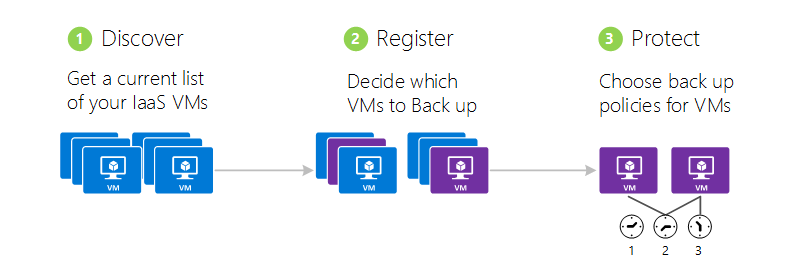
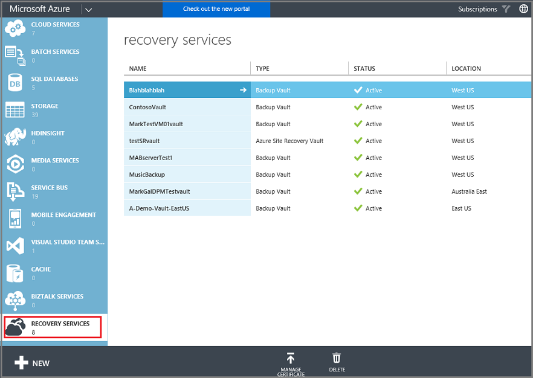
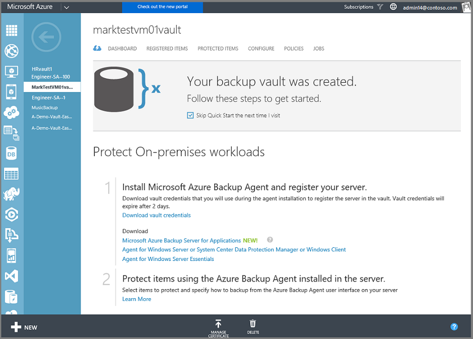
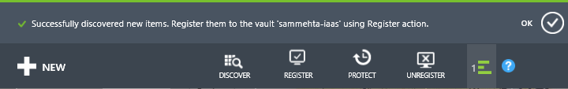
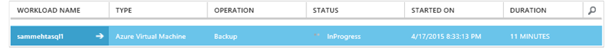

<properties
	pageTitle="Back up Azure virtual machines | Microsoft Azure"
	description="Discover, register, and back up your virtual machines with these procedures for Azure virtual machine backup."
	services="backup"
	documentationCenter=""
	authors="markgalioto"
	manager="jwhit"
	editor=""
	keywords="virtual machine backup; back up virtual machine; backup and disaster recovery; vm backup"/>

<tags
	ms.service="backup"
	ms.workload="storage-backup-recovery"
	ms.tgt_pltfrm="na"
	ms.devlang="na"
	ms.topic="article"
	ms.date="07/01/2016"
	ms.author="trinadhk; jimpark; markgal;"/>

# Back up Azure virtual machines

> [AZURE.SELECTOR]
- [Back up ARM VMs to Azure](backup-azure-arm-vms.md)
- [Back up Azure virtual machines](backup-azure-vms.md)

This article provides the procedures for how to back up your Azure virtual machines (VMs).

First, there are a few things you need to take care of before you can back up an Azure virtual machine. If you haven't already done so, complete the [prerequisites](backup-azure-vms-prepare.md) to prepare your environment for backing up your VMs.

For additional information, see the articles on [planning your VM backup infrastructure in Azure](backup-azure-vms-introduction.md) and [Azure virtual machines](https://azure.microsoft.com/documentation/services/virtual-machines/).

Backing up Azure virtual machines involves three key steps:

>[AZURE.NOTE] Backing up virtual machines is a local process. You cannot back up virtual machines in one region to a backup vault in another region. So, you must create a backup vault in each Azure region, where there are VMs that will be backed up.

## Step 1 - Discover Azure virtual machines
To ensure any new virtual machines (VMs) added to the subscription are identified before registering, run the discovery process. The process queries Azure for the list of virtual machines in the subscription, along with additional information like the cloud service name and the region.

1. Sign in to the [Classic portal](http://manage.windowsazure.com/)

2. In the list of Azure services , click **Recovery Services** to open the list of Backup and Site Recovery vaults.
    

3. In the list of Backup vaults, select the vault to back up a VM.

    If this is a new vault the portal opens to the **Quick Start** page.

    

    If the vault has previously been configured, the portal opens to the most recently-used menu.

4. From the vault menu (at the top of the page), click **Registered Items**.

    

5. From the **Type** menu, select **Azure Virtual Machine**.

    

6. Click **DISCOVER** at the bottom of the page.
    

    The discovery process may take a few minutes while the virtual machines are being tabulated. There is a notification at the bottom of the screen that lets you know that the process is running.

    

    The notification changes when the process is complete. If the discovery process did not find the virtual machines, first ensure the VMs exist. If the VMs exist, ensure the VMs are in the same region as the backup vault. If the VMs exist and are in the same region, ensure the VMs are not already registered to a backup vault. If a VMs is assigned to a backup vault it is not available to be assigned to other backup vaults.

    

    Once you have discovered the new items, go to Step 2 and register your VMs.

##  Step 2 - Register Azure virtual machines
You register an Azure virtual machine to associate it with the Azure Backup service. This is typically a one-time activity.

1. Navigate to the backup vault under **Recovery Services** in the Azure portal, and then click **Registered Items**.

2. Select **Azure Virtual Machine** from the drop-down menu.

    

3. Click **REGISTER** at the bottom of the page.
    

4. In the **Register Items** shortcut menu, select the virtual machines that you want to register. If there are two or more virtual machines with the same name, use the cloud service to distinguish between them.

    >[AZURE.TIP] Multiple virtual machines can be registered at one time.

    A job is created for each virtual machine that you've selected.

5. Click **View Job** in the notification to go to the **Jobs** page.

    

    The virtual machine also appears in the list of registered items, along with the status of the registration operation.

    

    When the operation completes, the status changes to reflect the *registered* state.

    

## Step 3 - Protect Azure virtual machines
Now you can set up a backup and retention policy for the virtual machine. Multiple virtual machines can be protected by using a single protect action.

Azure Backup vaults created after May 2015 come with a default policy built into the vault. This default policy comes with a default retention of 30 days and a once-daily backup schedule.

1. Navigate to the backup vault under **Recovery Services** in the Azure portal, and then click **Registered Items**.
2. Select **Azure Virtual Machine** from the drop-down menu.

    

3. Click **PROTECT** at the bottom of the page.

    The **Protect Items wizard** appears. The wizard only lists virtual machines that are registered and not protected. Select the virtual machines that you want to protect.

    If there are two or more virtual machines with the same name, use the cloud service to distinguish between the virtual machines.

    >[AZURE.TIP] You can protect multiple virtual machines at one time.

    

4. Choose a **backup schedule** to back up the virtual machines that you've selected. You can pick from an existing set of policies or define a new one.

    Each backup policy can have multiple virtual machines associated with it. However, the virtual machine can only be associated with one policy at any given point in time.

    

    >[AZURE.NOTE] A backup policy includes a retention scheme for the scheduled backups. If you select an existing backup policy, you cannot modify the retention options in the next step.

5. Choose a **retention range** to associate with the backups.

    

    Retention policy specifies the length of time for storing a backup. You can specify different retention policies based on when the backup is taken. For example, a backup point taken daily (which serves as an operational recovery point) might be preserved for 90 days. In comparison, a backup point taken at the end of each quarter (for audit purposes) may need to be preserved for many months or years.

    

    In this example image:

    - **Daily retention policy**: Backups taken daily are stored for 30 days.
    - **Weekly retention policy**: Backups taken every week on Sunday are preserved for 104 weeks.
    - **Monthly retention policy**: Backups taken on the last Sunday of each month are preserved for 120 months.
    - **Yearly retention policy**: Backups taken on the first Sunday of every January are preserved for 99 years.

    A job is created to configure the protection policy and associate the virtual machines to that policy for each virtual machine that you've selected.

6. To view the list of **Configure Protection** jobs, from the vaults menu, click **Jobs** and select **Configure Protection** from the **Operation** filter.

    

## Initial backup
Once the virtual machine is protected with a policy, it shows up under the **Protected Items** tab with the status of *Protected - (pending initial backup)*. By default, the first scheduled backup is the *initial backup*.

To trigger the initial backup immediately after configuring protection:

1. At the bottom of the **Protected Items** page, click **Backup Now**.

    The Azure Backup service creates a backup job for the initial backup operation.

2. Click the **Jobs** tab to view the list of jobs.

    

>[AZURE.NOTE] During the backup operation, the Azure Backup service issues a command to the backup extension in each virtual machine to flush all write jobs and take a consistent snapshot.

When the initial backup finishes, the status of the virtual machine in the **Protected Items** tab is *Protected*.

## Viewing backup status and details
Once protected, the virtual machine count also increases in the **Dashboard** page summary. The **Dashboard** page also shows the number of jobs from the last 24 hours that were *successful*, have *failed*, and are *in progress*. On the **Jobs** page, use the **Status**, **Operation**, or **From** and **To** menus to filter the jobs.

Values in the dashboard are refreshed once every 24 hours.

## Troubleshooting errors
If you run into issues while backing up your virtual machine, look at the [VM 	troubleshooting article](backup-azure-vms-troubleshoot.md) for help.

## Next steps

- [Manage and monitor your virtual machines](backup-azure-manage-vms.md)
- [Restore virtual machines](backup-azure-restore-vms.md)
