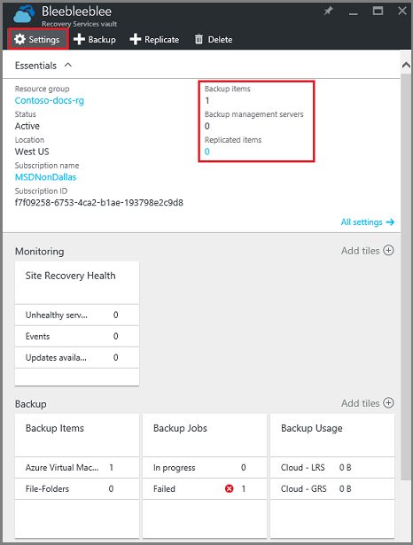

<properties
   pageTitle="Create and delete an Azure Backup vault"
   description="Fundamentals of working with Azure Backup vaults: this article explains how to create, delete and use vaults. "
   services="service-name"
   documentationCenter="dev-center-name"
   authors="markgalioto"
   manager="cfreeman"
   editor=""/>

<tags
   ms.service="backup"
   ms.devlang="na"
   ms.topic="article"
   ms.tgt_pltfrm="na"
   ms.workload="storage-backup-recovery"
   ms.date="08/25/2016"
   ms.author="markgal;trinadhk"/>

# Working with an Azure Backup vault

This article provides the fundamentals of working with an Azure Backup vault. The Azure Backup service has two types of vaults - the Backup vault and the Recovery Services vault. Though the names may be a bit confusing, the Backup vault came first. Then the Recovery Services vault came along to support the expanded Resource Manager deployments. Because of the expanded capabilities, Microsoft recommends using Resource Manager deployments and Recovery Services vaults unless you have a specific reason to use a Backup vault.

| |Portal|Vault|
|-|------|-----|
|**Classic deployment**|Classic|Backup vault|
|**Resource Manager deployment**|Azure|Recovery Services vault|

> [AZURE.NOTE] Backup vaults cannot protect Resource Manager-deployed solutions. However, you can use a Recovery Services vault to protect classically-deployed servers and VMs.  

In this article, we'll use the term, vault, to refer to the generic form of the Backup vault or Recovery Services vault. We'll provide the formal name, Backup vault or Recovery Services, when it is necessary to create a distinction between the types of vault.

## Why create a vault?

You create a vault to protect your data in Azure. If you are protecting Resource Manager-deployed VMs or workloads, your Recovery Services vault protects not only the VMs, but also all data in the resource group. The resource group contains the configuration information about the solution, so protecting that information is critical if you ever need to restore your solution.

## Create a Recovery Services vault

The following steps explain how to create a Recovery Services vault in the Azure portal. If you are working in the Classic portal, and want to create a Backup vault, see [Create a Backup vault](backup-azure-work-with-vaults.md#create-a-backup-vault).

1. If you haven't already done so, sign in to the [Azure Portal](https://portal.azure.com/) using your Azure subscription.

2. On the Hub menu, click **Browse** and in the list of resources, type **Recovery Services**. As you begin typing, the list will filter based on your input. Click **Recovery Services vaults**.

      

    The list of Recovery Services vaults is displayed.

3. On the **Recovery Services vaults** menu, click **Add**.

    

    The Recovery Services vault blade opens, prompting you to provide a **Name**, **Subscription**, **Resource group**, and **Location**.

    

4. For **Name**, enter a friendly name to identify the vault. The name needs to be unique for the Azure subscription. Type a name that contains between 2 and 50 characters. It must start with a letter, and can contain only letters, numbers, and hyphens.

5. Click **Subscription** to see the available list of subscriptions. If you are not sure which subscription to use, use the default (or suggested) subscription. There will be multiple choices only if your organizational account is associated with multiple Azure subscriptions.

6. Click **Resource group** to see the available list of Resource groups, or click **New** to create a new Resource group. For complete information on Resource groups, see [Azure Resource Manager overview](../resource-group-overview.md)

7. Click **Location** to select the geographic region for the vault. This choice determines the geographic region where your backup data is sent. By choosing a geographic region that's close to your location, you can reduce network latency when backing up to Azure.

8. Click **Create**. It can take a while for the Recovery Services vault to be created. Monitor the status notifications in the upper right-hand area in the portal. Once your vault is created, it should open in the portal. If you don't see your vault listed after it has been completed, click **Refresh**. When the list refreshes, click the name of the vault.

### To determine storage redundancy
When you first create a Recovery Services vault you determine how storage is replicated.

1. In the **Settings** blade, which opens automatically with your vault dashboard, click **Backup Infrastructure**.

2. In the Backup Infrastructure blade, click **Backup Configuration** to view the **Storage replication type**.

    

3. Choose the storage replication option for your vault.

    

    By default, your vault has geo-redundant storage. If you are using Azure as a primary backup storage endpoint, continue using geo-redundant storage. If you are using Azure as a non-primary backup storage endpoint, then choose locally redundant storage, which will reduce the cost of storing data in Azure. Read more about [geo-redundant](../storage/storage-redundancy.md#geo-redundant-storage) and [locally redundant](../storage/storage-redundancy.md#locally-redundant-storage) storage options in this [overview](../storage/storage-redundancy.md).

    After choosing the storage option for your vault, you are ready to associate your files and folders with the vault.

Now that you've created a vault, you prepare your infrastructure to back up files and folders by downloading and installing the Microsoft Azure Recovery Services agent, downloading vault credentials, and then using those credentials to register the agent with the vault.

## Delete a Recovery Services vault

Deleting a Recovery Services vault is a simple process - provided that it doesn't contain any resources. Before you can delete a Recovery Services vault, you must remove or delete the resources in the vault before you can delete the vault. If you attempt to delete a vault that contains resources, you'll get an error that suggests you delete the resources before trying to delete the vault again.

To delete the resources in a Recovery Services vault:

1. In the Azure portal, on the Hub menu, click **Browse** and in the list of resources, type **Recovery Services**. As you begin typing, the list will filter based on your input. Click **Recovery Services vaults**.

      

    The list of Recovery Services vaults is displayed.

2. From the list of Recovery Services vaults, select the vault you want to delete.

    

3. In the vault view, check the **Essentials** pane. To delete a vault, there cannot be any protected items. If you see a number other than zero, under Backup Items, Backup management servers, or Replicated items, you'll need to remove those items before you can delete the vault.

    

4. If there are no protected items in the vault, click **Delete** and that will delete the vault. If there are protected items in the vault, click **Settings** to open the **Settings** blade.

5. On the **Settings** blade, click **Backup items** to open the **Backup Items** blade.

6. On the **Backup Items** blade, right-click the name of the VM, and in the context menu, click **Stop backup**.

    The **Stop Backup** blade opens. To delete VMs, you need to stop future backups and delete the existing backup data.

7. On the **Stop Backup** blade, from the **Choose an option** menu, select Delete Backup data, and click **Stop backup**.

    If you like, provide a reason why you are deleting the data, and Comments. Make sure that the delete job has had time to complete. To verify that the job has completed, scroll to the Essentials pane in the Backup vault blade. There shouldn't be any VMs or servers listed.

8. In the vault toolbar, click **Delete**.

## Create a backup vault

## Delete a backup vault

### Next steps
