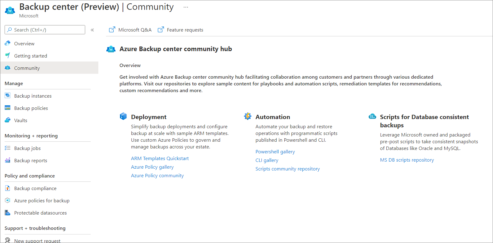

# Access community resources using Backup center

You can use Backup center to access various community resources useful for a backup admin or operator.

## Using Community Hub

To access the Community Hub, navigate to Backup Center in the Azure portal and select the **Community** menu item.

Some of the resources available via the Community Hub are:

- **Microsoft Q&A**: You can use this forum to ask and discover questions about various product features and obtain guidance from the community.

- **Feature Requests**: You can navigate to UserVoice and file feature requests.

- **Samples for automated deployments**: Using the Community Hub, you can discover sample Azure Resource Manager(ARM) templates and Azure Policies that you can use out of the box. You can also find sample PowerShell Scripts, CLI commands, and Microsoft Database Backup scripts.

## Next Steps

- [Learn More about Backup center](backup-center-overview.md)
