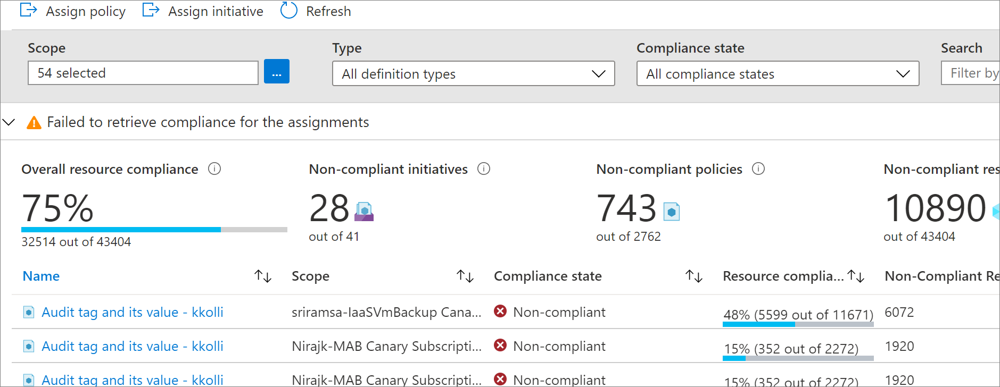

# Govern your backup estate using Backup Center

Backup Center helps you govern your Azure environment to ensure that all your resources are compliant from a backup perspective. Below are some of the governance capabilities of Backup Center:

* View and assign Azure Policies for backup

* View compliance of your resources on all the built-in Azure Policies for backup.

* View all datasources that haven't been configured for backup.

## Supported scenarios

* Refer to the support matrix for a detailed list of supported and unsupported scenarios.

## Azure Policies for Backup

To view all the Azure Policies that are available for backup, select the **Azure Policies for Backup** menu item. This will display all the built-in and custom Azure policy definitions for backup that are available for assignment to your subscriptions and resource groups.

Selecting any of the definitions allows you to assign the policy to a scope.

## Backup compliance

Selecting the **Backup Compliance** menu item helps you view the compliance of your resources according to the various built-in policies that you've assigned to your Azure environment. You can view the percentage of resources that are compliant on all policies, as well as the policies that have one or more non-compliant resources.

## Protectable datasources

Selecting the **Protectable Datasources** menu item allows you to view all your datasources that haven't been configured for backup. You can filter the list by datasource subscription, resource group, location, type and tags. Once you've identified a datasource that needs to be backed up, you can right-click on the corresponding grid item and select **Backup** to configure backup for the resource.

## Next steps

* [Govern your backup estate]()

* [Perform actions using Backup Center]()

* [Obtain insights on your backups]()
