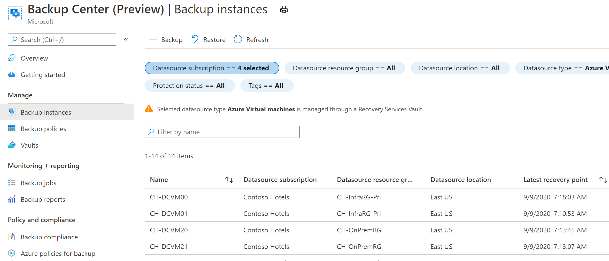
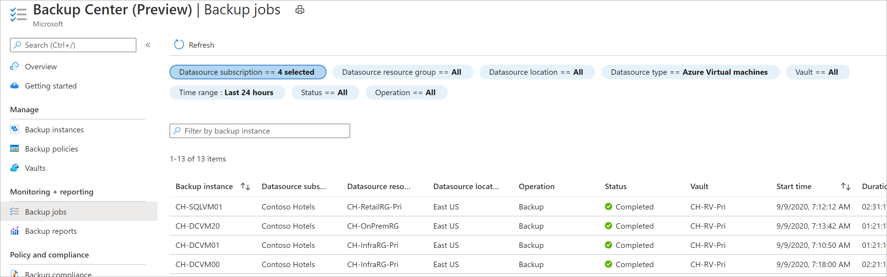
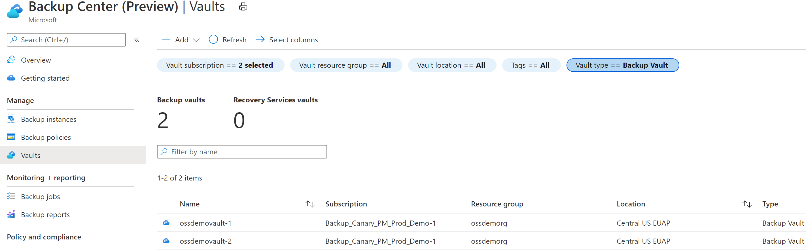
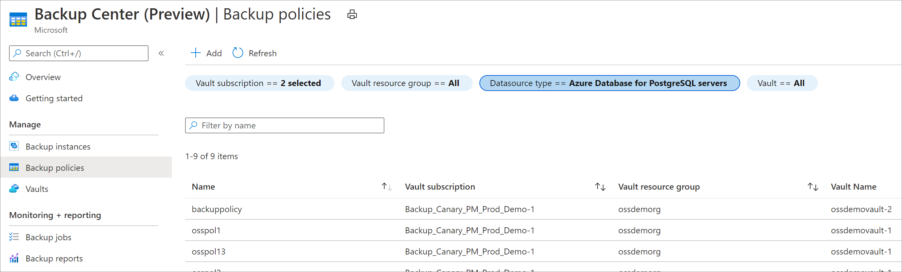

# Monitor and operate backups and disaster recovery using Backup center

As a backup admin, you can use Backup center as a single pane of glass to monitor your jobs and backup inventory on a day-to-day basis. You can also use Backup center to perform your regular operations, such as responding to on-demand backup requests, restoring backups, creating backup policies, and so on.

Now, you can use Backup center to monitor your jobs and replication inventory as a disaster recovery admin. You can also use Backup center to enable replication for new virtual machines.

## Supported scenarios

* Backup center is supported for Azure VM backup, SQL in Azure VM backup, SAP HANA in Azure VM backup, Azure Files backup, Azure Blobs backup, Azure Managed Disks backup and Azure Database for PostgreSQL Server backup.

* Backup center is also supported for Azure VM disaster recovery, VMware and Physical machine disaster recovery.

Learn more about the [supported and unsupported scenarios](backup-center-support-matrix.md).

## Backup instances

Backup center allows easy search and discoverability of backup instances across your backup estate.

On Backup center, select the **Backup Instances** tile to get a summarized view of all the backup instances that you've access to.

 You can view the following information about each of your backup instances:

* Datasource subscription
* Datasource resource group
* Latest recovery point
* Vault associated with the backup instance
* Protection status

 You can also filter the list of backup instances on the following parameters:

* Datasource subscription
* Datasource resource group
* Datasource location
* Datasource type
* Vault
* Protection status
* Datasource tags

Right-click any of the items in the grid to perform actions on the given backup instance, such as navigating to the resource, trigger on-demand backups and restores, or stopping backup.

## Replicated items

Backup center allows easy search and discoverability of replicated items across your replication estate.

On Backup center, select the **Backup Instances** tile to get a summarized view of all replicated items across your entire replication estate.

You can view the following information about each of your replicated items:

- Datasource subscription
- Datasource resource group
- Datasource location
- Replication health
- failover health
- Vault associated with the replicated item
- Status
- Active location

You can also filter the list of backup instances on the following parameters:

- Datasource subscription
- Datasource resource group
- Datasource location
- Replication health
- Failover health
- Replication type
- Vault
- Protection status
- Datasource tags

Right-click any of the items on the grid to go to the resource details.

:::image type="content" source="./media/backup-center-monitor-operate/backup-center-instances-replicated-items-inline.png" alt-text="Screenshot shows the Backup center replication instances." lightbox="./media/backup-center-monitor-operate/backup-center-instances-replicated-items-expanded.png":::

## Backup jobs

Backup center allows you to view detailed information on all jobs that were created in your backup estate and take appropriate action for failing jobs.

Selecting the **Backup jobs** menu item in Backup center provides a view of all your jobs. Each job contains the following information:

* Backup instance associated with the job
* Datasource subscription
* Datasource resource group
* Datasource location
* Job operation
* Job status
* Job start time
* Job duration

Selecting an item in the grid allows you to view more details about the given job. Right-clicking on an item helps you navigate to the resource to take necessary action.

Using the **Backup jobs** tab, you can view jobs up to the last seven days. To view older jobs, use [Backup Reports](backup-center-obtain-insights.md).

## Metrics

Azure Backup provides a set of built-in metrics via Azure Monitor that allows you to monitor the health of your backups. To view metrics, go to **Backup center** and click **Metrics** from the menu.

:::image type="content" source="./media/metrics-overview/metrics-chart-inline.png" alt-text="Screenshot showing the built-in metrics to monitor the health of your backups." lightbox="./media/metrics-overview/metrics-chart-expanded.png":::

Azure Backup offers the following key capabilities:

* Ability to view out-of-the-box metrics related to back up and restore health of your backup items along with associated trends.
* Ability to write custom alert rules on these metrics to efficiently monitor the health of your backup items.
* Ability to route fired metric alerts to different notification channels supported by Azure Monitor, such as email, ITSM, webhook, logic apps, and so on.

[Learn more about Azure Backup metrics](metrics-overview.md).

## Alerts

To view alerts, go to **Backup center** and click the **Alerts** from the menu.

You can also see a summary of open alerts in the last 24 hours in the **Overview** dashboard.

:::image type="content" source="./media/backup-azure-monitoring-laworkspace/backup-center-azure-monitor-alert-inline.png" alt-text="Screenshot showing alerts in Backup center." lightbox="./media/backup-azure-monitoring-laworkspace/backup-center-azure-monitor-alert-expanded.png":::

Currently, the following types of alerts are displayed in Backup center:

* **Default Azure Monitor alerts for Azure Backup (preview)**: This includes the built-in security alerts and configured alerts that Azure Backup provides via Azure Monitor. [Learn more about the alert scenarios supported by this solution](backup-azure-monitoring-built-in-monitor.md#azure-monitor-alerts-for-azure-backup).
* **Metric alerts for Azure Backup (preview)**: This includes alerts fired based on the metric alert rules you created. [Learn more about Azure Backup metric alerts](metrics-overview.md)

>[!NOTE]
>- Currently, Backup center displays only alerts for Azure-based workloads. To view alerts for on-premises resources, go to the Recovery Services vault and click **Alerts** from the menu.
>- Backup center displays only Azure Monitor alerts. Alerts raised by the older alerting solution (accessed under the [Backup Alerts](backup-azure-monitoring-built-in-monitor.md#backup-alerts-in-recovery-services-vault) tab in Recovery Services vault) aren't displayed in Backup center.

For more information about Azure Monitor alerts, see [Overview of alerts in Azure](../azure-monitor/alerts/alerts-overview.md).

### Datasource and Global Alerts

The following classes of alerts are displayed:

* **Datasource Alerts**: Alerts that are tied to a specific datasource being backed up (such as, backup or restore failure for a VM, deleting backup data for a database, and so on) appear under the **Datasource Alerts** section. For metric alerts, if the fired alert has a datasource ID dimension associated with it, the fired alert appears under **Datasource Alerts**.
* **Global Alerts**: Alerts that aren't tied to a specific datasource (such as, disabling soft-delete functionality for a vault) appear under the **Global Alerts** section. For metric alerts, if the fired alert doesn't have a datasource ID associated with it, the fired alert appears under **Global Alerts**.

>[!Note]
>Currently, in case of blob restore alerts, alerts appear under datasource alerts only if you select both the dimensions - *datasourceId* and *datasourceType* while creating the alert rule. If any dimensions aren't selected, the alerts appear under global alerts.

## Vaults

Selecting the **Vaults** menu item in Backup center allows you to see a list of all [Recovery Services vaults](backup-azure-recovery-services-vault-overview.md) and [Backup vaults](backup-vault-overview.md) that you have access to. You can filter the list with the following parameters:

* Vault subscription
* Vault resource group
* Vault name
* Datasource type associated with the policy

Selecting any item in the list allows you to navigate to a given vault.

## Backup policies

Backup center allows you to view and edit key information for any of your backup policies.

Selecting the **Backup Policies** menu item allows you to view all the policies that you've created across your backup estate. You can filter the list by vault subscription, resource group, datasource type, and vault. Right-clicking on an item in the grid lets you view associated items for that policy, edit the policy, or even delete it if necessary.

## Resource-centric views

If your organization backs up multiple resources to a common vault, and each resource owner only wants to see backup information of the resources that they own, you can use the resource-centric view in Backup center. To use the resource-centric view, select the checkbox 'Only show information about datasources which I have access to'. This option is currently supported for the following tabs: **Overview**, **Backup Instances**, **Jobs**, **Alerts**. The supported workloads are Azure VMs, SQL in Azure VMs, SAP HANA in Azure VMs, Azure Blobs, Azure Disks.

> [!NOTE]
> Users will still need to have the required RBAC permissions to the vault even if they are using resource-centric view. The purpose of this view is to enable individual users to avoid viewing information for resources (for example, VMs) that they don't own.

## Next steps

* [Govern your backup estate](backup-center-govern-environment.md)
* [Perform actions using Backup center](backup-center-actions.md)
* [Obtain insights on your backups](backup-center-obtain-insights.md)
