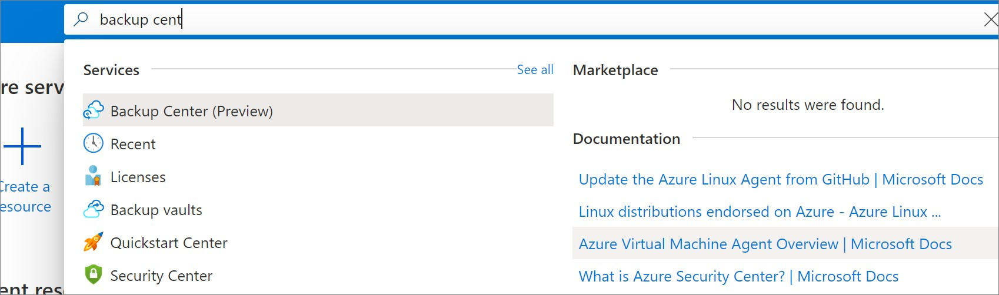
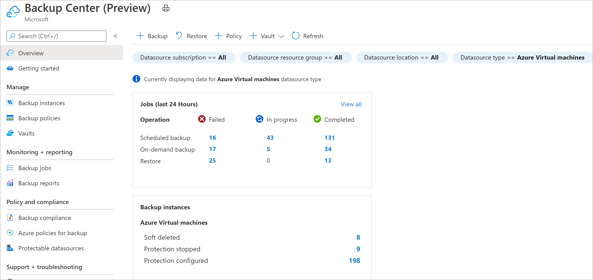

# Overview of Backup center

Backup Center provides a **single unified management experience** in Azure for enterprises to govern, monitor, operate, and analyze backups at scale. As such, it's consistent with Azure’s native management experiences.

Some of the key benefits of Backup center include:

* **Single pane of glass to manage backups** – Backup center is designed to function well across a large and distributed Azure environment. You can use Backup center to efficiently manage backups spanning multiple workload types, vaults, subscriptions, regions, and [Azure Lighthouse](../lighthouse/overview.md) tenants.
* **Datasource-centric management** – Backup center provides views and filters that are centered on the datasources that you're backing up (for example, VMs and databases). This allows a resource owner or a backup admin to monitor and operate backups of items without needing to focus on which vault an item is backed up to. A key feature of this design is the ability to filter views by datasource-specific properties, such as datasource subscription, datasource resource group, and datasource tags. For example, if your organization follows a practice of assigning different tags to VMs belonging to different departments, you can use Backup center to filter backup information based on the tags of the underlying VMs being backed up without needing to focus on the tag of the vault.
* **Connected experiences** – Backup center provides native integrations to existing Azure services that enable management at scale. For example, Backup center uses the [Azure Policy](../governance/policy/overview.md) experience to help you govern your backups. It also leverages [Azure workbooks](../azure-monitor/visualize/workbooks-overview.md) and [Azure Monitor Logs](../azure-monitor/logs/data-platform-logs.md) to help you view detailed reports on backups. So you don't need to learn any new principles to use the varied features that Backup center offers. You can also discover community resources from the Backup center.

## Supported scenarios

* Backup center is currently supported for Azure VM backup, SQL in Azure VM backup, SAP HANA in Azure VM backup, Azure Files backup, Azure Blobs backup, Azure Managed Disks backup, and Azure Database for PostgreSQL Server backup.
* Refer to the [support matrix](backup-center-support-matrix.md) for a detailed list of supported and unsupported scenarios.

## Get started

To get started with using Backup center, search for **Backup center** in the Azure portal and navigate to the **Backup center** dashboard.

The first screen that you see is the **Overview**. It contains two tiles – **Jobs** and **Backup instances**.

In the **Jobs** tile, you get a summarized view of all backup and restore related jobs that were triggered across your backup estate in the last 24 hours. You can view information on the number of jobs that have completed, failed, and are in-progress. Selecting any of the numbers in this tile allows you to view more information on jobs for a particular datasource type, operation type, and status.

In the **Backup Instances** tile, you get a summarized view of all backup instances across your backup estate. For example, you can see the number of backup instances that are in soft-deleted state compared to the number of instances that are still configured for protection. Selecting any of the numbers in this tile allows you to view more information on backup instances for a particular datasource type and protection state. You can also view all backup instances whose underlying datasource is not found (the datasource might be deleted, or you may not have access to the datasource).

Watch the following video to understand the capabilities of Backup center:

> [!VIDEO https://www.youtube.com/embed/pFRMBSXZcUk?t=497]

Follow the [next steps](#next-steps) to understand the different capabilities that Backup center provides, and how you can use these capabilities to manage your backup estate efficiently.

## Next steps

* [Monitor and Operate backups](backup-center-monitor-operate.md)
* [Govern your backup estate](backup-center-govern-environment.md)
* [Obtain insights on your backups](backup-center-obtain-insights.md)
* [Perform actions using Backup center](backup-center-actions.md)