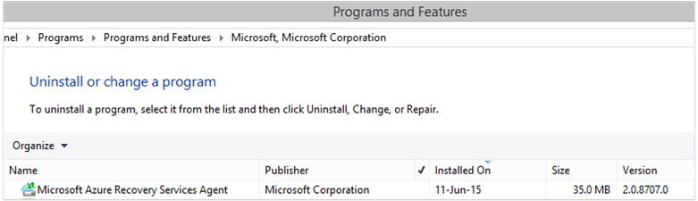

# Deploy and manage backup to Azure for Windows Server/Windows Client using PowerShell

This article shows you how to use PowerShell to set up Azure Backup on Windows Server or a Windows client, and manage backup and recovery.

## Install Azure PowerShell

[!INCLUDE [updated-for-az](../../includes/updated-for-az.md)]

To get started, [install the latest PowerShell release](/powershell/azure/install-azure-powershell).

## Create a Recovery Services vault

The following steps lead you through creating a Recovery Services vault. A Recovery Services vault is different than a Backup vault.

1. If you're using Azure Backup for the first time, you must use the **Register-AzResourceProvider** cmdlet to register the Azure Recovery Service provider with your subscription.

    ```powershell
    Register-AzResourceProvider -ProviderNamespace "Microsoft.RecoveryServices"
    ```

2. The Recovery Services vault is an Azure Resource Manager resource, so you need to place it within a Resource Group. You can use an existing resource group, or create a new one. When creating a new resource group, specify the name and location for the resource group.

    ```powershell
    New-AzResourceGroup –Name "test-rg" –Location "WestUS"
    ```

3. Use the **New-AzRecoveryServicesVault** cmdlet to create the new vault. Be sure to specify the same location for the vault as was used for the resource group.

    ```powershell
    New-AzRecoveryServicesVault -Name "testvault" -ResourceGroupName " test-rg" -Location "WestUS"
    ```

4. Specify the type of storage redundancy to use. You can use [Locally Redundant Storage (LRS)](../storage/common/storage-redundancy.md#locally-redundant-storage), [Geo-redundant Storage (GRS)](../storage/common/storage-redundancy.md#geo-redundant-storage) or [Zone-redundant storage (ZRS)](../storage/common/storage-redundancy.md#zone-redundant-storage). The following example shows the **-BackupStorageRedundancy** option for *testVault* set to **GeoRedundant**.

   > [!TIP]
   > Many Azure Backup cmdlets require the Recovery Services vault object as an input. For this reason, it's convenient to store the Backup Recovery Services vault object in a variable.
   >
   >

    ```powershell
    $Vault1 = Get-AzRecoveryServicesVault –Name "testVault"
    Set-AzRecoveryServicesBackupProperties -Vault $Vault1 -BackupStorageRedundancy GeoRedundant
    ```

## View the vaults in a subscription

Use **Get-AzRecoveryServicesVault** to view the list of all vaults in the current subscription. You can use this command to check that a new vault was created, or to see which vaults are available in the subscription.

Run the command, **Get-AzRecoveryServicesVault**, and all vaults in the subscription are listed.

```powershell
Get-AzRecoveryServicesVault
```

```output
Name              : Contoso-vault
ID                : /subscriptions/1234
Type              : Microsoft.RecoveryServices/vaults
Location          : WestUS
ResourceGroupName : Contoso-docs-rg
SubscriptionId    : 1234-567f-8910-abc
Properties        : Microsoft.Azure.Commands.RecoveryServices.ARSVaultProperties
```

[!INCLUDE [backup-upgrade-mars-agent.md](../../includes/backup-upgrade-mars-agent.md)]

## Installing the Azure Backup agent

Before you install the Azure Backup agent, you need to have the installer downloaded and present on the Windows Server. You can get the latest version of the installer from the [Microsoft Download Center](https://aka.ms/azurebackup_agent) or from the Recovery Services vault's Dashboard page. Save the installer to an easily accessible location like `C:\Downloads\*`.

Alternatively, use PowerShell to get the downloader:

```powershell
$MarsAURL = 'https://aka.ms/Azurebackup_Agent'
$WC = New-Object System.Net.WebClient
$WC.DownloadFile($MarsAURL,'C:\downloads\MARSAgentInstaller.exe')
C:\Downloads\MARSAgentInstaller.exe /q
```

To install the agent, run the following command in an elevated PowerShell console:

```powershell
MARSAgentInstaller.exe /q
```

This installs the agent with all the default options. The installation takes a few minutes in the background. If you don't specify the */nu* option, then the **Windows Update** window will open at the end of the installation to check for any updates. Once installed, the agent will show in the list of installed programs.

To see the list of installed programs, go to **Control Panel** > **Programs** > **Programs and Features**.



### Installation options

To see all the options available via the command line, use the following command:

```powershell
MARSAgentInstaller.exe /?
```

The available options include:

| Option | Details | Default |
| --- | --- | --- |
| /q |Quiet installation |- |
| /p:"location" |Path to the installation folder for the Azure Backup agent. |C:\Program Files\Microsoft Azure Recovery Services Agent |
| /s:"location" |Path to the cache folder for the Azure Backup agent. |C:\Program Files\Microsoft Azure Recovery Services Agent\Scratch |
| /m |Opt-in to Microsoft Update |- |
| /nu |Don't Check for updates after installation is complete |- |
| /d |Uninstalls Microsoft Azure Recovery Services Agent |- |
| /ph |Proxy Host Address |- |
| /po |Proxy Host Port Number |- |
| /pu |Proxy Host UserName |- |
| /pw |Proxy Password |- |

## Registering Windows Server or Windows client machine to a Recovery Services vault

After you created the Recovery Services vault, download the latest agent and the vault credentials and store it in a convenient location like C:\Downloads.

```powershell
$CredsPath = "C:\downloads"
$CredsFilename = Get-AzRecoveryServicesVaultSettingsFile -Backup -Vault $Vault1 -Path $CredsPath
```

### Register using the PowerShell Az module

> [!NOTE]
> A bug with generation of vault certificate is fixed in Az 3.5.0 release. Use Az 3.5.0 release version or greater to download a vault certificate.

In the latest Az module of PowerShell, because of underlying platform limitations, downloading the vault credentials requires a self-signed certificate. The following example shows how to provide a self-signed certificate and download the vault credentials.

```powershell
$dt = $(Get-Date).ToString("M-d-yyyy")
$cert = New-SelfSignedCertificate -CertStoreLocation Cert:\CurrentUser\My -FriendlyName 'test-vaultcredentials' -subject "Windows Azure Tools" -KeyExportPolicy Exportable -NotAfter $(Get-Date).AddHours(48) -NotBefore $(Get-Date).AddHours(-24) -KeyProtection None -KeyUsage None -TextExtension @("2.5.29.37={text}1.3.6.1.5.5.7.3.2") -Provider "Microsoft Enhanced Cryptographic Provider v1.0"
$certficate = [convert]::ToBase64String($cert.Export([System.Security.Cryptography.X509Certificates.X509ContentType]::Pfx))
$CredsFilename = Get-AzRecoveryServicesVaultSettingsFile -Backup -Vault $Vault -Path $CredsPath -Certificate $certficate
```

On the Windows Server or Windows client machine, run the [Start-OBRegistration](/powershell/module/msonlinebackup/start-obregistration) cmdlet to register the machine with the vault.
This, and other cmdlets used for backup, are from the MSONLINE module, which the MARS AgentInstaller added as part of the installation process.

The Agent installer doesn't update the $Env:PSModulePath variable. This means module auto-load fails. To resolve this, you can do the following:

```powershell
$Env:PSModulePath += ';C:\Program Files\Microsoft Azure Recovery Services Agent\bin\Modules'
```

Alternatively, you can manually load the module in your script as follows:

```powershell
Import-Module -Name 'C:\Program Files\Microsoft Azure Recovery Services Agent\bin\Modules\MSOnlineBackup'
```

Once you load the Online Backup cmdlets, you register the vault credentials:

```powershell
Start-OBRegistration -VaultCredentials $CredsFilename.FilePath -Confirm:$false
```

```output
CertThumbprint      : 7a2ef2caa2e74b6ed1222a5e89288ddad438df2
SubscriptionID      : ef4ab577-c2c0-43e4-af80-af49f485f3d1
ServiceResourceName : testvault
Region              : WestUS
Machine registration succeeded.
```

> [!IMPORTANT]
> Don't use relative paths to specify the vault credentials file. You must provide an absolute path as an input to the cmdlet.

## Networking settings

When the connectivity of the Windows machine to the internet is through a proxy server, the proxy settings can also be provided to the agent. In this example, there's no proxy server, so we're explicitly clearing any proxy-related information.

Bandwidth usage can also be controlled with the options of `work hour bandwidth` and `non-work hour bandwidth` for a given set of days of the week.

Setting the proxy and bandwidth details is done using the [Set-OBMachineSetting](/powershell/module/msonlinebackup/set-obmachinesetting) cmdlet:

```powershell
Set-OBMachineSetting -NoProxy
```

```output
Server properties updated successfully.
```

```powershell
Set-OBMachineSetting -NoThrottle
```

```output
Server properties updated successfully.
```

## Encryption settings

The backup data sent to Azure Backup is encrypted to protect the confidentiality of the data. The encryption passphrase is the "password" to decrypt the data at the time of restore.

You must generate a security pin by selecting **Generate**, under **Settings** > **Properties** > **Security PIN** in the **Recovery Services vault** section of the Azure portal.

> [!NOTE]
> The security PIN can only be generated via the Azure portal.

Then, use this as the `generatedPIN` in the command:

```powershell
$PassPhrase = ConvertTo-SecureString -String "Complex!123_STRING" -AsPlainText -Force
Set-OBMachineSetting -EncryptionPassPhrase $PassPhrase -SecurityPin "<generatedPIN>"
```

```output
Server properties updated successfully
```

> [!IMPORTANT]
> Keep the passphrase information safe and secure once it's set. You can't restore data from Azure without this passphrase.

## Back up files and folders

All backups from Windows Servers and clients to Azure Backup are governed by a policy. The policy includes three parts:

- A **backup schedule** that specifies when backups need to be taken and synchronized with the service.
- A **retention schedule** that specifies how long to retain the recovery points in Azure.
- A **file inclusion/exclusion specification** that dictates what should be backed up.

In this document, since we're automating backup, we'll assume nothing has been configured. We begin by creating a new backup policy using the [New-OBPolicy](/powershell/module/msonlinebackup/new-obpolicy) cmdlet.

```powershell
$NewPolicy = New-OBPolicy
```

At this time, the policy is empty and other cmdlets are needed to define what items will be included or excluded, when backups will run, and where the backups will be stored.

### Configuring the backup schedule

The first of the three parts of a policy is the backup schedule, which is created using the [New-OBSchedule](/powershell/module/msonlinebackup/new-obschedule) cmdlet. The backup schedule defines when backups need to be taken. When creating a schedule, you need to specify two input parameters:

* **Days of the week** that the backup should run. You can run the backup job on just one day, or every day of the week, or any combination in between.
* **Times of the day** when the backup should run. You can define up to three different times of the day when the backup will be triggered.

For instance, you could configure a backup policy that runs at 4PM every Saturday and Sunday.

```powershell
$Schedule = New-OBSchedule -DaysOfWeek Saturday, Sunday -TimesOfDay 16:00
```

The backup schedule needs to be associated with a policy, and this can be achieved by using the [Set-OBSchedule](/powershell/module/msonlinebackup/set-obschedule) cmdlet.

```powershell
Set-OBSchedule -Policy $NewPolicy -Schedule $Schedule
```

```output
BackupSchedule : 4:00 PM Saturday, Sunday, Every 1 week(s) DsList : PolicyName : RetentionPolicy : State : New PolicyState : Valid
```

### Configuring a retention policy

The retention policy defines how long recovery points created from backup jobs are retained. When creating a new retention policy using the [New-OBRetentionPolicy](/powershell/module/msonlinebackup/new-obretentionpolicy) cmdlet, you can specify the number of days that the backup recovery points will be retained with Azure Backup. The example below sets a retention policy of seven days.

```powershell
$RetentionPolicy = New-OBRetentionPolicy -RetentionDays 7
```

The retention policy must be associated with the main policy using the cmdlet [Set-OBRetentionPolicy](/powershell/module/msonlinebackup/set-obretentionpolicy):

```powershell
Set-OBRetentionPolicy -Policy $NewPolicy -RetentionPolicy $RetentionPolicy
```

```output
BackupSchedule  : 4:00 PM
                  Saturday, Sunday,
                  Every 1 week(s)
DsList          :
PolicyName      :
RetentionPolicy : Retention Days : 7

                  WeeklyLTRSchedule :
                  Weekly schedule is not set

                  MonthlyLTRSchedule :
                  Monthly schedule is not set

                  YearlyLTRSchedule :
                  Yearly schedule is not set

State           : New
PolicyState     : Valid
```

### Including and excluding files to be backed up

An `OBFileSpec` object defines the files to be included and excluded in a backup. This is a set of rules that scope out the protected files and folders on a machine. You can have as many file inclusion or exclusion rules as required, and associate them with a policy. When creating a new OBFileSpec object, you can:

* Specify the files and folders to be included
* Specify the files and folders to be excluded
* Specify recursive backup of data in a folder (or) whether only the top-level files in the specified folder should be backed up.

The latter is achieved by using the -NonRecursive flag in the New-OBFileSpec command.

In the example below, we'll back up volume C: and D: and exclude the OS binaries in the Windows folder and any temporary folders. To do so, we'll create two file specifications using the [New-OBFileSpec](/powershell/module/msonlinebackup/new-obfilespec) cmdlet - one for inclusion and one for exclusion. Once the file specifications have been created, they're associated with the policy using the [Add-OBFileSpec](/powershell/module/msonlinebackup/add-obfilespec) cmdlet.

```powershell
$Inclusions = New-OBFileSpec -FileSpec @("C:\", "D:\")
$Exclusions = New-OBFileSpec -FileSpec @("C:\windows", "C:\temp") -Exclude
Add-OBFileSpec -Policy $NewPolicy -FileSpec $Inclusions
```

```output
BackupSchedule  : 4:00 PM
                  Saturday, Sunday,
                  Every 1 week(s)
DsList          : {DataSource
                  DatasourceId:0
                  Name:C:\
                  FileSpec:FileSpec
                  FileSpec:C:\
                  IsExclude:False
                  IsRecursive:True

                  , DataSource
                  DatasourceId:0
                  Name:D:\
                  FileSpec:FileSpec
                  FileSpec:D:\
                  IsExclude:False
                  IsRecursive:True

                  }
PolicyName      :
RetentionPolicy : Retention Days : 7

                  WeeklyLTRSchedule :
                  Weekly schedule is not set

                  MonthlyLTRSchedule :
                  Monthly schedule is not set

                  YearlyLTRSchedule :
                  Yearly schedule is not set

State           : New
PolicyState     : Valid
```

```powershell
Add-OBFileSpec -Policy $NewPolicy -FileSpec $Exclusions
```

```output
BackupSchedule  : 4:00 PM
                  Saturday, Sunday,
                  Every 1 week(s)
DsList          : {DataSource
                  DatasourceId:0
                  Name:C:\
                  FileSpec:FileSpec
                  FileSpec:C:\
                  IsExclude:False
                  IsRecursive:True
                  ,FileSpec
                  FileSpec:C:\windows
                  IsExclude:True
                  IsRecursive:True
                  ,FileSpec
                  FileSpec:C:\temp
                  IsExclude:True
                  IsRecursive:True

                  , DataSource
                  DatasourceId:0
                  Name:D:\
                  FileSpec:FileSpec
                  FileSpec:D:\
                  IsExclude:False
                  IsRecursive:True

                  }
PolicyName      :
RetentionPolicy : Retention Days : 7

                  WeeklyLTRSchedule :
                  Weekly schedule is not set

                  MonthlyLTRSchedule :
                  Monthly schedule is not set

                  YearlyLTRSchedule :
                  Yearly schedule is not set

State           : New
PolicyState     : Valid
```

### Applying the policy

Now the policy object is complete and has an associated backup schedule, retention policy, and an inclusion/exclusion list of files. This policy can now be committed for Azure Backup to use. Before you apply the newly created policy, ensure that there are no existing backup policies associated with the server by using the [Remove-OBPolicy](/powershell/module/msonlinebackup/remove-obpolicy) cmdlet. Removing the policy will prompt for confirmation. To skip the confirmation, use the `-Confirm:$false` flag with the cmdlet.

>[!Note]
>While running the cmdlet if it prompts to set a Security PIN, see the [Method 1 section](./backup-azure-delete-vault.md#method-1).

```powershell
Get-OBPolicy | Remove-OBPolicy
```

```output
Microsoft Azure Backup Are you sure you want to remove this backup policy? This will delete all the backed up data. [Y] Yes [A] Yes to All [N] No [L] No to All [S] Suspend [?] Help (default is "Y"):
```

Committing the policy object is done using the [Set-OBPolicy](/powershell/module/msonlinebackup/set-obpolicy) cmdlet. This will also ask for confirmation. To skip the confirmation, use the `-Confirm:$false` flag with the cmdlet.

```powershell
Set-OBPolicy -Policy $NewPolicy
```

```output
Microsoft Azure Backup Do you want to save this backup policy ? [Y] Yes [A] Yes to All [N] No [L] No to All [S] Suspend [?] Help (default is "Y"):
BackupSchedule : 4:00 PM Saturday, Sunday, Every 1 week(s)
DsList : {DataSource
         DatasourceId:4508156004108672185
         Name:C:\
         FileSpec:FileSpec
         FileSpec:C:\
         IsExclude:False
         IsRecursive:True,

         FileSpec
         FileSpec:C:\windows
         IsExclude:True
         IsRecursive:True,

         FileSpec
         FileSpec:C:\temp
         IsExclude:True
         IsRecursive:True,

         DataSource
         DatasourceId:4508156005178868542
         Name:D:\
         FileSpec:FileSpec
         FileSpec:D:\
         IsExclude:False
         IsRecursive:True
    }
PolicyName : c2eb6568-8a06-49f4-a20e-3019ae411bac
RetentionPolicy : Retention Days : 7
              WeeklyLTRSchedule :
              Weekly schedule is not set

              MonthlyLTRSchedule :
              Monthly schedule is not set

              YearlyLTRSchedule :
              Yearly schedule is not set
State : Existing PolicyState : Valid
```

You can view the details of the existing backup policy using the [Get-OBPolicy](/powershell/module/msonlinebackup/get-obpolicy) cmdlet. You can drill down further using the [Get-OBSchedule](/powershell/module/msonlinebackup/get-obschedule) cmdlet for the backup schedule and the [Get-OBRetentionPolicy](/powershell/module/msonlinebackup/get-obretentionpolicy) cmdlet for the retention policies

```powershell
Get-OBPolicy | Get-OBSchedule
```

```output
SchedulePolicyName : 71944081-9950-4f7e-841d-32f0a0a1359a
ScheduleRunDays : {Saturday, Sunday}
ScheduleRunTimes : {16:00:00}
State : Existing
```

```powershell
Get-OBPolicy | Get-OBRetentionPolicy
```

```output
RetentionDays : 7
RetentionPolicyName : ca3574ec-8331-46fd-a605-c01743a5265e
State : Existing
```

```powershell
Get-OBPolicy | Get-OBFileSpec
```

```output
FileName : *
FilePath : \?\Volume{b835d359-a1dd-11e2-be72-2016d8d89f0f}\
FileSpec : D:\
IsExclude : False
IsRecursive : True

FileName : *
FilePath : \?\Volume{cdd41007-a22f-11e2-be6c-806e6f6e6963}\
FileSpec : C:\
IsExclude : False
IsRecursive : True

FileName : *
FilePath : \?\Volume{cdd41007-a22f-11e2-be6c-806e6f6e6963}\windows
FileSpec : C:\windows
IsExclude : True
IsRecursive : True

FileName : *
FilePath : \?\Volume{cdd41007-a22f-11e2-be6c-806e6f6e6963}\temp
FileSpec : C:\temp
IsExclude : True
IsRecursive : True
```

### Performing an on-demand backup

Once a backup policy has been set, the backups will occur per the schedule. Triggering an on-demand backup is also possible using the [Start-OBBackup](/powershell/module/msonlinebackup/start-obbackup) cmdlet:

```powershell
Get-OBPolicy | Start-OBBackup
```

```output
Initializing
Taking snapshot of volumes...
Preparing storage...
Generating backup metadata information and preparing the metadata VHD...
Data transfer is in progress. It might take longer since it is the first backup and all data needs to be transferred...
Data transfer completed and all backed up data is in the cloud. Verifying data integrity...
Data transfer completed
In progress...
Job completed.
The backup operation completed successfully.
```

## Back up Windows Server System State in MARS agent

This section covers the PowerShell command to set up System State in the MARS agent

### Schedule

```powershell
$sched = New-OBSchedule -DaysOfWeek Sunday,Monday,Tuesday,Wednesday,Thursday,Friday,Saturday -TimesOfDay 2:00
```

### Retention

```powershell
$rtn = New-OBRetentionPolicy -RetentionDays 32 -RetentionWeeklyPolicy -RetentionWeeks 13 -WeekDaysOfWeek Sunday -WeekTimesOfDay 2:00  -RetentionMonthlyPolicy -RetentionMonths 13 -MonthDaysOfMonth 1 -MonthTimesOfDay 2:00
```

### Configuring schedule and retention

```powershell
New-OBPolicy | Add-OBSystemState |  Set-OBRetentionPolicy -RetentionPolicy $rtn | Set-OBSchedule -Schedule $sched | Set-OBSystemStatePolicy
```

### Verifying the policy

```powershell
Get-OBSystemStatePolicy
```

## Restore data from Azure Backup

This section will guide you through the steps for automating recovery of data from Azure Backup. Doing so involves the following steps:

1. Pick the source volume
2. Choose a backup point to restore
3. Specify an item to restore
4. Trigger the restore process

### Picking the source volume

To restore an item from Azure Backup, you first need to identify the source of the item. Since we're executing the commands in the context of a Windows Server or a Windows client, the machine is already identified. The next step in identifying the source is to identify the volume containing it. A list of volumes or sources being backed up from this machine can be retrieved by executing the [Get-OBRecoverableSource](/powershell/module/msonlinebackup/get-obrecoverablesource) cmdlet. This command returns an array of all the sources backed up from this server/client.

```powershell
$Source = Get-OBRecoverableSource
$Source
```

```output
FriendlyName : C:\
RecoverySourceName : C:\
ServerName : myserver.microsoft.com

FriendlyName : D:\
RecoverySourceName : D:\
ServerName : myserver.microsoft.com
```

### Choosing a backup point from which to restore

You retrieve a list of backup points by executing the [Get-OBRecoverableItem](/powershell/module/msonlinebackup/get-obrecoverableitem) cmdlet with appropriate parameters. In our example, we'll choose the latest backup point for the source volume *C:* and use it to recover a specific file.

```powershell
$Rps = Get-OBRecoverableItem $Source[0]
$Rps
```

```output

IsDir                : False
ItemNameFriendly     : C:\
ItemNameGuid         : \\?\Volume{297cbf7a-0000-0000-0000-401f00000000}\
LocalMountPoint      : C:\
MountPointName       : C:\
Name                 : C:\
PointInTime          : 10/17/2019 7:52:13 PM
ServerName           : myserver.microsoft.com
ItemSize             :
ItemLastModifiedTime :

IsDir                : False
ItemNameFriendly     : C:\
ItemNameGuid         : \\?\Volume{297cbf7a-0000-0000-0000-401f00000000}\
LocalMountPoint      : C:\
MountPointName       : C:\
Name                 : C:\
PointInTime          : 10/16/2019 7:00:19 PM
ServerName           : myserver.microsoft.com
ItemSize             :
ItemLastModifiedTime :
```

The object `$Rps` is an array of backup points. The first element is the latest point and the Nth element is the oldest point. To choose the latest point, we'll use `$Rps[0]`.

### Specifying an item to restore

To restore a specific file, specify the file name relative to the root volume. For example, to retrieve C:\Test\Cat.job, execute the following command.

```powershell
$Item = New-OBRecoverableItem $Rps[0] "Test\cat.jpg" $FALSE
$Item
```

```output
IsDir                : False
ItemNameFriendly     : C:\Test\cat.jpg
ItemNameGuid         :
LocalMountPoint      : C:\
MountPointName       : C:\
Name                 : cat.jpg
PointInTime          : 10/17/2019 7:52:13 PM
ServerName           : myserver.microsoft.com
ItemSize             :
ItemLastModifiedTime : 21-Jun-14 6:43:02 AM
```

### Triggering the restore process

To trigger the restore process, we first need to specify the recovery options. This can be done by using the [New-OBRecoveryOption](/powershell/module/msonlinebackup/new-obrecoveryoption) cmdlet. For this example, let's assume we want to restore the files to *C:\temp*. Let's also assume we want to skip files that already exist on the destination folder *C:\temp*. To create such a recovery option, use the following command:

```powershell
$RecoveryOption = New-OBRecoveryOption -DestinationPath "C:\temp" -OverwriteType Skip
```

Now trigger the restore process by using the [Start-OBRecovery](/powershell/module/msonlinebackup/start-obrecovery) command on the selected `$Item` from the output of the `Get-OBRecoverableItem` cmdlet:

```powershell
Start-OBRecovery -RecoverableItem $Item -RecoveryOption $RecoveryOption
```

```output
Estimating size of backup items...
Estimating size of backup items...
Estimating size of backup items...
Estimating size of backup items...
Job completed.
The recovery operation completed successfully.
```

## Cross Region Restore

Cross Region Restore (CRR) allows you to restore MARS backup data from a secondary region, which is an Azure paired region. This enables you to conduct drills for audit and compliance, and recover data during the unavailability of the primary region in Azure in the case of a disaster.

### Original server restore

If you're performing restore for the original server from the secondary region (Cross Region Restore), use the flag `UseSecondaryRegion` while getting the `OBRecoverableSource` object. 

```azurepowershell
$sources = Get-OBRecoverableSource -UseSecondaryRegion
$RP = Get-OBRecoverableItem -Source $sources[0]
$RO = New-OBRecoveryOption -DestinationPath $RecoveryPath -OverwriteType Overwrite
Start-OBRecovery -RecoverableItem $RP -RecoveryOption $RO -Async | ConvertTo-Json

```

### Alternate server restore

If you're performing restore for an alternate server from the secondary region (Cross Region Restore), download the *secondary region vault credential file* from the Azure portal and pass the secondary region vault credential for restore.

```azurepowershell
$serverName = ‘myserver.mycompany.com’
$secVaultCred = “C:\Users\myuser\Downloads\myvault_Mon Jul 17 2023.VaultCredentials”
$passphrase = ‘Default Passphrase’
$alternateServers = Get-OBAlternateBackupServer -VaultCredentials $secVaultCred
$altServer = $alternateServers[2] | Where-Object {$_.ServerName -Like $serverName}
$pwd = ConvertTo-SecureString -String $passphrase -AsPlainText -Force
$sources = Get-OBRecoverableSource $altServer
$RP = Get-OBRecoverableItem -Source $sources[0]
$RO = New-OBRecoveryOption
Start-OBRecoveryMount -RecoverableItem $RP -RecoveryOption $RO -EncryptionPassphrase $pwd  -Async | ConvertTo-Json 

```

## Uninstall the Azure Backup agent

Uninstalling the Azure Backup agent can be done by using the following command:

```powershell
.\MARSAgentInstaller.exe /d /q
```

Uninstalling the agent binaries from the machine has some consequences to consider:

* It removes the file-filter from the machine, and tracking of changes is stopped.
* All policy information is removed from the machine, but the policy information continues to be stored in the service.
* All backup schedules are removed, and no further backups are taken.

However, the data stored in Azure remains and is retained according to the retention policy setup by you. Older points are automatically aged out.

## Remote management

All the management around the Azure Backup agent, policies, and data sources can be done remotely through PowerShell. The machine that will be managed remotely needs to be prepared correctly.

By default, the WinRM service is configured for manual startup. The startup type must be set to *Automatic* and the service should be started. To verify that the WinRM service is running, the value of the Status property should be *Running*.

```powershell
Get-Service -Name WinRM
```

```output
Status   Name               DisplayName
------   ----               -----------
Running  winrm              Windows Remote Management (WS-Manag...
```

PowerShell should be configured for remoting.

```powershell
Enable-PSRemoting -Force
```

```output
WinRM is already set up to receive requests on this computer.
WinRM has been updated for remote management.
WinRM firewall exception enabled.
```

```powershell
Set-ExecutionPolicy -ExecutionPolicy Unrestricted -Force
```

The machine can now be managed remotely - starting from the installation of the agent. For example, the following script copies the agent to the remote machine and installs it.

```powershell
$DLoc = "\\REMOTESERVER01\c$\Windows\Temp"
$Agent = "\\REMOTESERVER01\c$\Windows\Temp\MARSAgentInstaller.exe"
$Args = "/q"
Copy-Item "C:\Downloads\MARSAgentInstaller.exe" -Destination $DLoc -Force

$Session = New-PSSession -ComputerName REMOTESERVER01
Invoke-Command -Session $Session -Script { param($D, $A) Start-Process -FilePath $D $A -Wait } -ArgumentList $Agent, $Args
```

## Next steps

For more information about Azure Backup for Windows Server/Client:

* [Introduction to Azure Backup](./backup-overview.md)
* [Back up Windows Servers](backup-windows-with-mars-agent.md)
