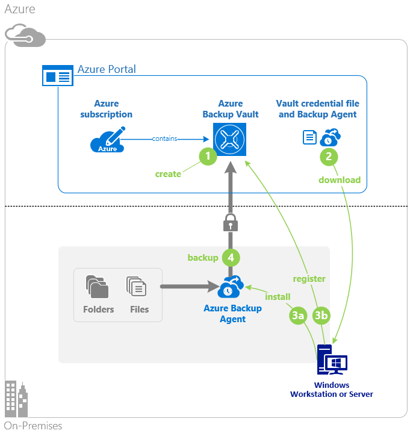
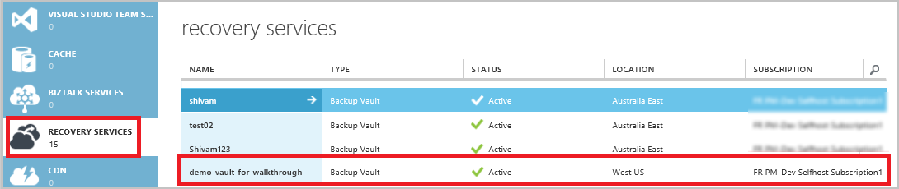
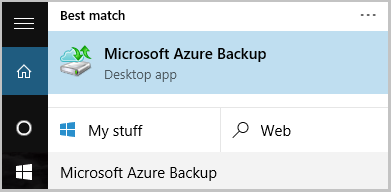
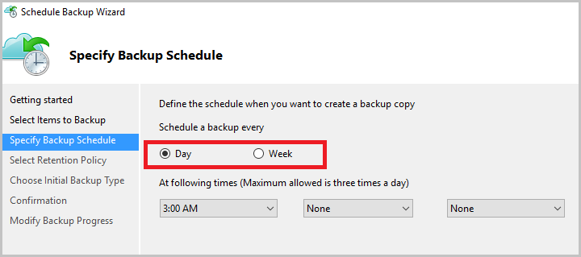
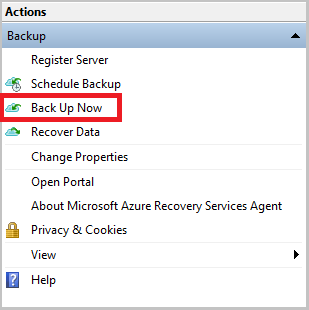

<properties
	pageTitle="Back up a Windows server or client to Azure using the classic deployment model | Microsoft Azure"
	description="Backup Windows servers or clients to Azure by creating a backup vault, downloading credentials, installing the backup agent, and completing an initial backup of your files and folders."
	services="backup"
	documentationCenter=""
	authors="Jim-Parker"
	manager="jwhit"
	editor=""
	keywords="backup vault; back up a Windows server; backup windows;"/>

<tags
	ms.service="backup"
	ms.workload="storage-backup-recovery"
	ms.tgt_pltfrm="na"
	ms.devlang="na"
	ms.topic="article"
	ms.date="05/09/2016"
	ms.author="jimpark; trinadhk; markgal"/>

# Back up a Windows server or client to Azure using the classic deployment model

> [AZURE.SELECTOR]
- [Classic portal](backup-configure-vault-classic.md)
- [Azure portal](backup-configure-vault.md)

This article covers the procedures that you need to follow to prepare your environment and back up a Windows server (or client) to Azure. It also covers considerations for deploying your backup solution. If you're interested in trying Azure Backup for the first time, this article quickly walks you through the process.

>[AZURE.IMPORTANT] Azure has two different deployment models for creating and working with resources: Resource Manager and classic. This article covers using the classic deployment model. Microsoft recommends that most new deployments use the Resource Manager model.

## Before you start
To back up a server or client to Azure, you need an Azure account. If you don't have one, you can create a [free account](https://azure.microsoft.com/free/) in just a couple of minutes.

## Step 1: Create a backup vault
To back up files and folders from a server or client, you need to create a backup vault in the geographic region where you want to store the data.

### To create a backup vault

1. Sign in to [the classic portal](https://manage.windowsazure.com/).

2. Click **New** > **Data Services** > **Recovery Services** > **Backup Vault**, and then choose **Quick Create**.

3. For the **Name** parameter, enter a friendly name for the backup vault. Type a name that contains between 2 and 50 characters. It must start with a letter, and can contain only letters, numbers, and hyphens. This name needs to be unique for each subscription.

4. For the **Region** parameter, select the geographic region for the backup vault. This choice determines the geographic region where your backup data is sent. By choosing a geographic region that's close to your location, you can reduce network latency when backing up to Azure.

5. Click **Create Vault**.

    

    It can take a while for the backup vault to be created. To check the status, monitor the notifications at the bottom of the classic portal.

    After the backup vault has been created, you'll see a message saying that the vault has been successfully created. It also appears as **Active** in the **Recovery Services** resource list.

    

4. Select the storage redundancy option by following the steps described here.

    >[AZURE.IMPORTANT] The best time to identify your storage redundancy option is right after vault creation and before any machines are registered to the vault. After an item has been registered to the vault, the storage redundancy option is locked and cannot be modified.

    If you are using Azure as a primary backup storage endpoint (for example, you are backing up to Azure from a Windows server), consider picking (the default) [geo-redundant storage](../storage/storage-redundancy.md#geo-redundant-storage) option.

    If you are using Azure as a tertiary backup storage endpoint (for example, you are using System Center Data Protection Manager to store a local backup copy on-premises and using Azure for long-term retention needs), consider choosing [locally redundant storage](../storage/storage-redundancy.md#locally-redundant-storage). This brings down the cost of storing data in Azure, while providing a lower level of durability for your data that might be acceptable for tertiary copies.

    **To select the storage redundancy option:**

    a. Click the vault you just created.

    b. On the Quick Start page, select **Configure**.

    

    c. Choose the appropriate storage redundancy option.

    If you select **Locally Redundant**, you need to click **Save** (because **Geo-Redundant** is the default option).

    d. In the left navigation pane, click **Recovery Services** to return to the list of resources for Recovery Services.

## Step 2: Download the vault credential file
The on-premises machine needs to be authenticated with a backup vault before it can back up data to Azure. The authentication is achieved through *vault credentials*. The vault credential file is downloaded through a secure channel from the classic portal. The certificate private key does not persist in the portal or the service.

Learn more about [using vault credentials to authenticate with the Backup service](backup-introduction-to-azure-backup.md#what-is-the-vault-credential-file).

### To download the vault credential file to a local machine

1. In the left navigation pane, click **Recovery Services**, and then select the backup vault that you created.

    

2.  On the Quick Start page, click **Download vault credentials**.

    The classic portal generates a vault credential by using a combination of the vault name and the current date. The vault credentials file is used only during the registration workflow and expires after 48 hours.

    The vault credential file can be downloaded from the portal.

3. Click **Save** to download the vault credential file to the Downloads folder of the local account. You can also select **Save As** from the **Save** menu to specify a location for the vault credential file.

    >[AZURE.NOTE] Make sure the vault credential file is saved in a location that can be accessed from your machine. If it is stored in a file share or server message block, verify that you have the permissions to access it.

## Step 3: Download, install, and register the Backup agent
After you create the backup vault and download the vault credential file, an agent must be installed on each of your Windows machines.

### To download, install, and register the agent

1. Click **Recovery Services**, and then select the backup vault that you want to register with a server.

2. On the Quick Start page, click the agent **Agent for Windows Server or System Center Data Protection Manager or Windows client**. Then click **Save**.

    

3. After the MARSagentinstaller.exe file has downloaded, click **Run** (or double-click **MARSAgentInstaller.exe** from the saved location).

4. Choose the installation folder and cache folder that are required for the agent, and then click **Next**. The cache location you specify must have free space equal to at least 5 percent of the backup data.

5. You can continue to connect to the Internet through the default proxy settings. 			If you use a proxy server to connect to the Internet, on the Proxy Configuration page, select the **Use custom proxy settings** check box, and then enter the proxy server details. If you use an authenticated proxy, enter the user name and password details, and then click **Next**.

7. Click **Install** to begin the agent installation. The Backup agent installs .NET Framework 4.5 and Windows PowerShell (if it’s not already installed) to complete the installation.

8. After the agent is installed, click **Proceed to Registration** to continue with the workflow.

9. On the Vault Identification page, browse to and select the vault credential file that you previously downloaded.

    The vault credential file is valid for only 48 hours after it’s downloaded from the portal. If you encounter an error on this page (such as “Vault credentials file provided has expired”), sign in to the portal and download the vault credential file again.

    Ensure that the vault credential file is available in a location that can be accessed by the setup application. If you encounter access-related errors, copy the vault credential file to a temporary location on the same machine and retry the operation.

    If you encounter a vault credential error such as “Invalid vault credentials provided," the file is damaged or does not have the latest credentials associated with the recovery service. Retry the operation after downloading a new vault credential file from the portal. This error can also occur if a user clicks the **Download vault credential** option several times in quick succession. In this case, only the last vault credential file is valid.

9. On the Encryption Setting page, you can either generate a passphrase or provide a passphrase (with a minimum of 16 characters). Remember to save the passphrase in a secure location.

10. Click **Finish**. The Register Server Wizard registers the server with Backup.

    >[AZURE.WARNING] If you lose or forget the passphrase, Microsoft cannot help you recover the backup data. You own the encryption passphrase, and Microsoft does not have visibility into the passphrase that you use. Save the file in a secure location because it will be required during a recovery operation.

11. After the encryption key is set, leave the **Launch Microsoft Azure Recovery Services Agent** check box selected, and then click **Close**.

## Step 4: Complete the initial backup

The initial backup includes two key tasks:

- Creating the backup schedule
- Backing up files and folders for the first time

After the backup policy completes the initial backup, it creates backup points that you can use if you need to recover the data. The backup policy does this based on the schedule that you define.

### To schedule the backup

1. Open the Microsoft Azure Backup agent. (It will open automatically if you left the **Launch Microsoft Azure Recovery Services Agent** check box selected when you closed the Register Server Wizard.) You can find it by searching your machine for **Microsoft Azure Backup**.

    

2. In the Backup agent, click **Schedule Backup**.

    

3. On the Getting started page of the Schedule Backup Wizard, click **Next**.

4. On the Select Items to Backup page, click **Add Items**.

5. Select the files and folders that you want to back up, and then click **Okay**.

6. Click **Next**.

7. On the **Specify Backup Schedule** page, specify the **backup schedule** and click **Next**.

    You can schedule daily (at a maximum rate of three times per day) or weekly backups.

    

    >[AZURE.NOTE] For more information about how to specify the backup schedule, see the article [Use Azure Backup to replace your tape infrastructure](backup-azure-backup-cloud-as-tape.md).

8. On the **Select Retention Policy** page, select the **Retention Policy** for the backup copy.

    The retention policy specifies the duration for which the backup will be stored. Rather than just specifying a “flat policy” for all backup points, you can specify different retention policies based on when the backup occurs. You can modify the daily, weekly, monthly, and yearly retention policies to meet your needs.

9. On the Choose Initial Backup Type page, choose the initial backup type. Leave the option **Automatically over the network** selected, and then click **Next**.

    You can back up automatically over the network, or you can back up offline. The remainder of this article describes the process for backing up automatically. If you prefer to do an offline backup, review the article [Offline backup workflow in Azure Backup](backup-azure-backup-import-export.md) for additional information.

10. On the Confirmation page, review the information, and then click **Finish**.

11. After the wizard finishes creating the backup schedule, click **Close**.

### Enable network throttling (optional)

The Backup agent provides network throttling. Throttling controls how network bandwidth is used during data transfer. This control can be helpful if you need to back up data during work hours but do not want the backup process to interfere with other Internet traffic. Throttling applies to back up and restore activities.

**To enable network throttling**

1. In the Backup agent, click **Change Properties**.

    

2. On the **Throttling** tab, select the **Enable internet bandwidth usage throttling for backup operations** check box.

    

3. After you have enabled throttling, specify the allowed bandwidth for backup data transfer during **Work hours** and **Non-work hours**.

    The bandwidth values begin at 512 kilobits per second (Kbps) and can go up to 1,023 megabytes per second (MBps). You can also designate the start and finish for **Work hours**, and which days of the week are considered work days. Hours outside of designated work hours are considered non-work hours.

4. Click **OK**.

### To back up now

1. In the Backup agent, click **Back Up Now** to complete the initial seeding over the network.

    

2. On the Confirmation page, review the settings that the Back Up Now Wizard will use to back up the machine. Then click **Back Up**.

3. Click **Close** to close the wizard. If you do this before the backup process finishes, the wizard continues to run in the background.

After the initial backup is completed, the **Job completed** status appears in the Backup console.

## Next steps
- Sign up for a [free Azure account](https://azure.microsoft.com/free/).

For additional information about backing up VMs or other workloads, see:

- [Back up IaaS VMs](backup-azure-vms-prepare.md)
- [Back up workloads to Azure with Microsoft Azure Backup Server](backup-azure-microsoft-azure-backup.md)
- [Back up workloads to Azure with DPM](backup-azure-dpm-introduction.md)
