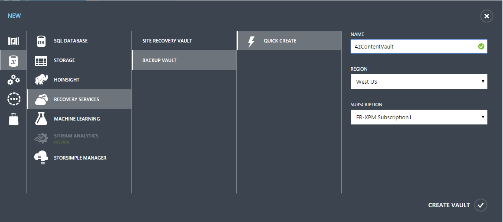
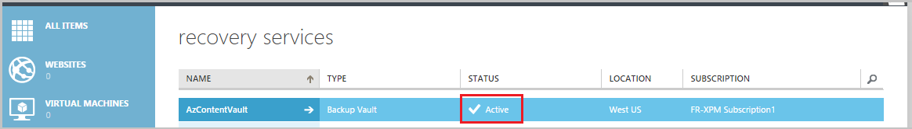
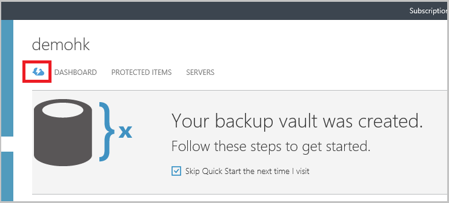
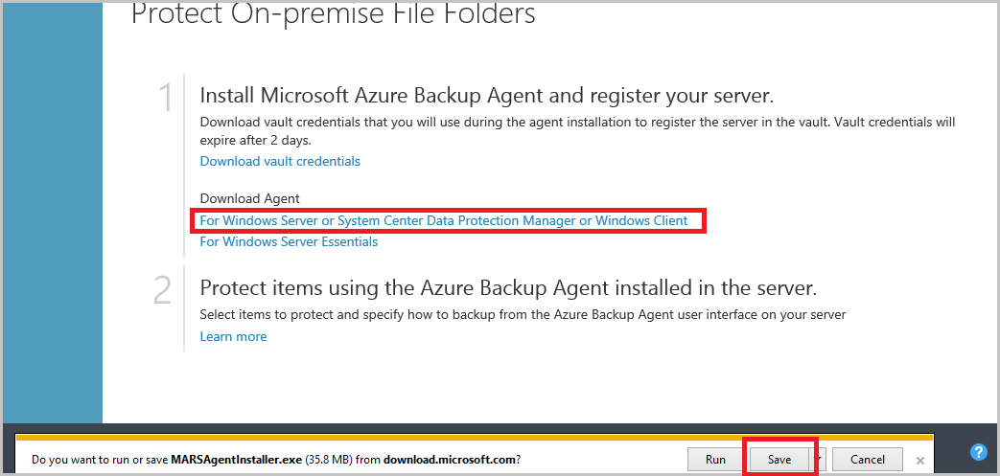
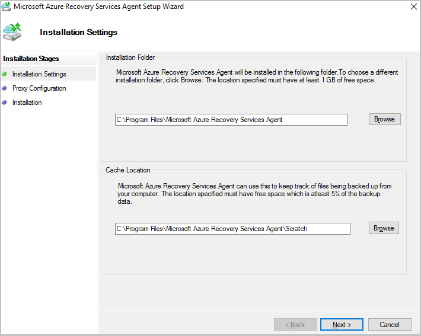
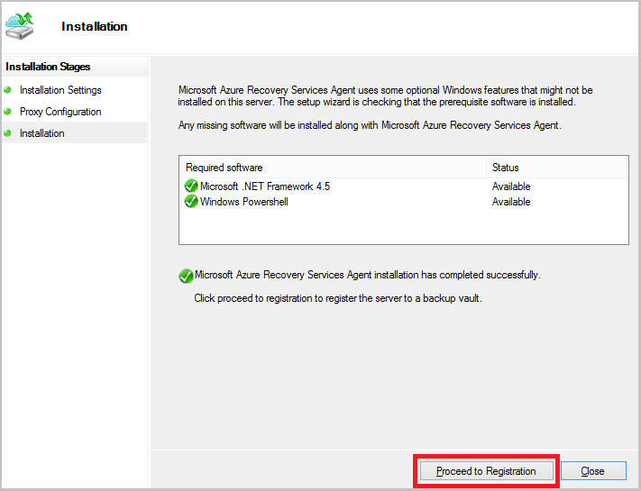
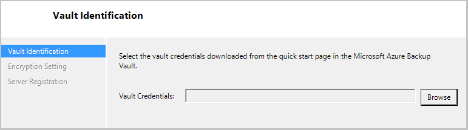
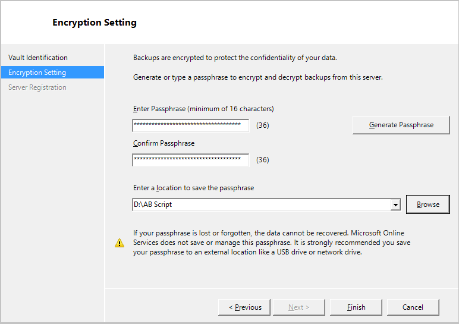

<properties
	pageTitle="Prepare your environment for backing up a Windows server or client machine | Microsoft Azure"
	description="Prepare your environment to backup windows by creating a backup vault, downloading credentials, and installing the backup agent."
	services="backup"
	documentationCenter=""
	authors="Jim-Parker"
	manager="jwhit"
	editor=""
	keywords="backup vault; backup agent; backup windows;"/>

<tags
	ms.service="backup"
	ms.workload="storage-backup-recovery"
	ms.tgt_pltfrm="na"
	ms.devlang="na"
	ms.topic="article"
	ms.date="02/23/2016"
	ms.author="trinadhk; jimpark; markgal"/>

# Prepare your environment for backing up Windows machines to Azure
This article lists the things you need to do to prepare your environment to back up a Windows machine to Azure.

| Step | Name | Details |
| :------: | ---- | ------- |
| 1 | [Create a vault](#create-a-backup-vault) | Create a vault in the [Azure Backup management portal](http://manage.windowsazure.com) |
| 2 | [Download the vault credentials](#download-the-vault-credential-file) | Download the vault credentials that will be used to register the Windows machine with the backup vault |
| 3 | [Install the Azure Backup Agent ](#download-install-and-register-the-azure-backup-agent) | Install the agent and register the server to the backup vault using the vault credentials |

If you've already done all of the high-level steps above, you can start [backing up your Windows machines](backup-azure-backup-windows-server.md). Otherwise, continue through the detailed steps below to make sure your environment is ready.

## Before you start
To prepare your environment for backing up Windows machines, you need an Azure account. If you don't have one, you can create a [free account](https://azure.microsoft.com/free/) in just a couple of minutes.

## Create a Backup Vault
To back up files and data from a Windows machine or Data Protection Manager (DPM) to Azure or when backing up IaaS VMs to Azure, you need to create a backup vault in the geographic region where you want to store the data.

**To create a Backup vault:**

1. Sign in to the [Management Portal](https://manage.windowsazure.com/)

2. Click **New** > **Data Services** > **Recovery Services** > **Backup Vault** and choose **Quick Create**.

    

3. For the **Name** parameter, enter a friendly name to identify the backup vault. This needs to be unique for each subscription.

    For the **Region** parameter, select the geographic region for the backup vault. The choice determines the geographic region where your backup data is sent. By choosing a geographic region close to your location, you can reduce the network latency when backing up to Azure.

    Click **Create Vault** to complete the workflow.

    It can take a while for the backup vault to be created. To check the status, you can monitor the notifications at the bottom of the portal.

    

    After the backup vault has been created, you'll see a message saying the vault has been successfully created. The vault is also listed in the resources for Recovery Services as **Active**.

    

    >[AZURE.IMPORTANT] The best time to identify your storage redundancy option is right after vault creation and before any machines are registered to the vault. Once an item has been registered to the vault, the storage redundancy option is locked and cannot be modified.

4. Select **storage redundancy** options.

    If you are using Azure as a primary backup storage endpoint (e.g. you are backing up to Azure from a Windows Server), you should consider picking (the default) [geo-redundant storage](../storage/storage-redundancy.md#geo-redundant-storage) option.

    If you are using Azure as a tertiary backup storage endpoint (e.g. you are using SCDPM to have a local backup copy on-premises & using Azure for your long term retention needs), you should consider choosing [locally redundant Storage](../storage/storage-redundancy.md#locally-redundant-storage). This brings down the cost of storing data in Azure, while providing a lower level of durability for your data that might be acceptable for tertiary copies.

    Read more about [geo-redundant](../storage/storage-redundancy.md#geo-redundant-storage) and [locally redundant](../storage/storage-redundancy.md#locally-redundant-storage) storage options in this [overview](../storage/storage-redundancy.md).

    a. Click on the vault you just created.

    b. On the Quick Start page, select **Configure**.

    

    c. Choose the appropriate storage redundancy option.

    You will need to click **Save** if you've selected **Locally Redundant**, since **Geo Redundant** is the default option.

    

    d. Click **Recovery Services**, in the left navigation pane to return to the list of resources for **Recovery Services**.

    

## Download the vault credential file
The on-premises server (Windows client or Windows Server or Data Protection Manager server) needs to be authenticated with a backup vault before it can back up data to Azure. The authentication is achieved using “vault credentials”. The vault credential file is downloaded through a secure channel from the Azure portal and the Azure Backup service is unaware of the private key of the certificate, which does not persist in the portal or the service.

To learn more about [using vault credentials to authenticate with the Azure Backup service](backup-introduction-to-azure-backup.md#what-is-the-vault-credential-file).

**To download the vault credential file to a local machine:**

1. Sign in to the [Management Portal](https://manage.windowsazure.com/)

2. Click **Recovery Services** in the left navigation pane and select the backup vault that you created.

3.  Click the cloud icon to get to the *Quick Start* view of the backup vault.

    

4. On the **Quick Start** page, click **Download vault credentials**.

    

    The portal will generate a vault credential using a combination of the vault name and the current date. The vault credentials file is used only during the registration workflow and expires after 48hrs.

    The vault credentials file can be downloaded from the portal.

5. Click **Save** to download the vault credentials to the local account's downloads folder, or select **Save As** from the *Save* menu to specify a location for the vault credentials.

    You don't need to open the vault credentials at this time.

    Ensure that the vault credentials are saved in a location that can be accessed from your machine. If it is stored in a file share/SMB, check for the access permissions.

## Download, install, and register the Azure Backup agent
After creating the Azure Backup vault, an agent should be installed on each of your Windows machines (Windows Server, Windows client, System Center Data Protection Manager server, or Azure Backup Server machine) that enables back up of data and applications to Azure.

**To download, install, and register the agent:**

1. Sign in to the [Management Portal](https://manage.windowsazure.com/)

2. Click **Recovery Services**, then select the backup vault that you want to register with a server.

3. On the Quick Start page, click **Agent for Windows Server or System Center Data Protection Manager or Windows Client > Save**.

    

4. After the *MARSagentinstaller.exe* download is completed, click **Run** (or double click **MARSAgentInstaller.exe** from the saved location). Choose the *installation folder* and *cache folder* required for the agent and click **Next**.

    The cache location you specify must have free space equal to at least 5% of the backup data.

    

5. If you use a proxy server to connect to the internet, in the **Proxy configuration** screen, enter the proxy server details. If you use an authenticated proxy, enter the user name and password details and click **Next**.

    The Azure Backup agent installs .NET Framework 4.5 and Windows PowerShell (if it’s not already installed) to complete the installation.

6. Once the agent is installed, click **Proceed to Registration** to continue with the workflow.

    

7. In the **Vault Identification** screen, browse to and select the *vault credentials file* you previously downloaded.

    

    The vault credentials file is only valid for 48 hours (after it’s downloaded from the portal). If you encounter any error in this screen (e.g. “Vault credentials file provided has expired”), login to the Azure portal and download the vault credentials file again.

    Ensure that the vault credentials file is available in a location that can be accessed by the setup application. If you encounter access related errors, copy the vault credentials file to a temporary location in this machine and retry the operation.

    If you encounter an invalid vault credential error (e.g. “Invalid vault credentials provided") the file is either corrupted or does not have the latest credentials associated with the recovery service. Retry the operation after downloading a new vault credential file from the portal. This error is typically seen if the user clicks the *Download vault credential* option in quick succession. In this case, only the last vault credential file is valid.

8. In the **Encryption setting** screen, you can either *generate* a passphrase or *provide* a passphrase (minimum of 16 characters). Remember to save the passphrase in a secure location.

    

    > [AZURE.WARNING] If the passphrase is lost or forgotten Microsoft cannot help in recovering the backup data. The end user owns the encryption passphrase and Microsoft does not have visibility into the passphrase used by the end user. Please save the file in a secure location as it is required during a recovery operation.

9. Click **Finish**.

    The machine is now registered successfully to the vault and you are ready to start backing up to Microsoft Azure.

## Next steps
- Sign up for a [free Azure account](https://azure.microsoft.com/free/)
- [Back up a Windows server or client machine](backup-azure-backup-windows-server.md).
- If you still have unanswered questions, take a look at the [Azure Backup FAQ](backup-azure-backup-faq.md).
- Visit the [Azure Backup forum](http://go.microsoft.com/fwlink/p/?LinkId=290933)
