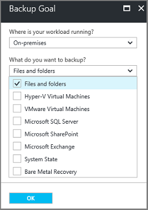
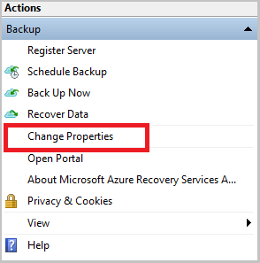
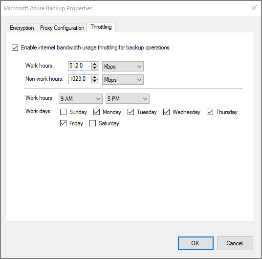
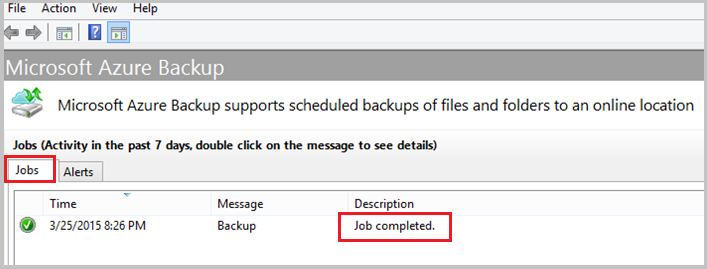

# Back up a Windows Server or client to Azure using the Resource Manager deployment model
This article explains how to back up your Windows Server (or Windows client) files and folders to Azure with Azure Backup using the Resource Manager deployment model.

## Before you start
To back up a server or client to Azure, you need an Azure account. If you don't have one, you can create a [free account](https://azure.microsoft.com/free/) in just a couple of minutes.

## Create a Recovery Services vault
A Recovery Services vault is an entity that stores all the backups and recovery points you create over time. The Recovery Services vault also contains the backup policy applied to the protected files and folders. When you create a Recovery Services vault, you should also select the appropriate storage redundancy option.

### To create a Recovery Services vault
1. If you haven't already done so, sign in to the [Azure Portal](https://portal.azure.com/) using your Azure subscription.
2. On the Hub menu, click **All services** and in the list of resources, type **Recovery Services** and click **Recovery Services vaults**.

      

    If there are recovery services vaults in the subscription, the vaults are listed.

3. On the **Recovery Services vaults** menu, click **Add**.

    

    The Recovery Services vault blade opens, prompting you to provide a **Name**, **Subscription**, **Resource group**, and **Location**.

    

4. For **Name**, enter a friendly name to identify the vault. The name needs to be unique for the Azure subscription. Type a name that contains between 2 and 50 characters. It must start with a letter, and can contain only letters, numbers, and hyphens.

5. In the **Subscription** section, use the drop-down menu to choose the Azure subscription. If you use only one subscription, that subscription appears and you can skip to the next step. If you are not sure which subscription to use, use the default (or suggested) subscription. There are multiple choices only if your organizational account is associated with multiple Azure subscriptions.

6. In the **Resource group** section:

    * select **Create new** if you want to create a new Resource group.
    Or
    * select **Use existing** and click the drop-down menu to see the available list of Resource groups.

  For complete information on Resource groups, see the [Azure Resource Manager overview](../azure-resource-manager/resource-group-overview.md).

7. Click **Location** to select the geographic region for the vault. This choice determines the geographic region where your backup data is sent.

8. At the bottom of the Recovery Services vault blade, click **Create**.

  It can take several minutes for the Recovery Services vault to be created. Monitor the status notifications in the upper right-hand area of the portal. Once your vault is created, it appears in the list of Recovery Services vaults. If after several minutes you don't see your vault, click **Refresh**.

   

  Once you see your vault in the list of Recovery Services vaults, you are ready to set the storage redundancy.

### Set storage redundancy
When you first create a Recovery Services vault you determine how storage is replicated.

1. From the **Recovery Services vaults** blade, click the new vault.

    

    When you select the vault, the **Recovery Services vault** blade narrows, and the Settings blade (*which has the name of the vault at the top*) and the vault details blade open.

    

2. In the new vault's Settings blade, use the vertical slide to scroll down to the Manage section, and click **Backup Infrastructure**.

  The Backup Infrastructure blade opens.

3. In the Backup Infrastructure blade, click **Backup Configuration** to open the **Backup Configuration** blade.

  

4. Choose the appropriate storage replication option for your vault.

  

  By default, your vault has geo-redundant storage. If you use Azure as a primary backup storage endpoint, continue to use **Geo-redundant**. If you don't use Azure as a primary backup storage endpoint, then choose **Locally-redundant**, which reduces the Azure storage costs. Read more about [geo-redundant](../storage/common/storage-redundancy-grs.md) and [locally redundant](../storage/common/storage-redundancy-lrs.md) storage options in this [Storage redundancy overview](../storage/common/storage-redundancy.md).

Now that you've created a vault, prepare your infrastructure to back up files and folders by downloading and installing the Microsoft Azure Recovery Services agent, downloading vault credentials, and then using those credentials to register the agent with the vault.

## Configure the vault

1. On the Recovery Services vault blade (for the vault you just created), in the Getting Started section, click **Backup**, then on the **Getting Started with Backup** blade, select **Backup goal**.

  

  The **Backup Goal** blade opens. If the Recovery Services vault has been previously configured, then the **Backup Goal** blades opens when you click **Backup** on the Recovery Services vault blade.

  

2. From the **Where is your workload running?** drop-down menu, select **On-premises**.

  You choose **On-premises** because your Windows Server or Windows computer is a physical machine that is not in Azure.

3. From the **What do you want to backup?** menu, select **Files and folders**, and click **OK**.

  

  After clicking OK, a checkmark appears next to **Backup goal**, and the **Prepare infrastructure** blade opens.

  

4. On the **Prepare infrastructure** blade, click **Download Agent for Windows Server or Windows Client**.

  

  If you are using Windows Server Essential, then choose to download the agent for Windows Server Essential. A pop-up menu prompts you to run or save MARSAgentInstaller.exe.

  

5. In the download pop-up menu, click **Save**.

  By default, the **MARSagentinstaller.exe** file is saved to your Downloads folder. When the installer completes, you will see a pop-up asking if you want to run the installer, or open the folder.

  

  You don't need to install the agent yet. You can install the agent after you have downloaded the vault credentials.

6. On the **Prepare infrastructure** blade, click **Download**.

  

  The vault credentials download to your Downloads folder. After the vault credentials finish downloading, you see a pop-up asking if you want to open or save the credentials. Click **Save**. If you accidentally click **Open**, let the dialog that attempts to open the vault credentials, fail. You cannot open the vault credentials. Proceed to the next step. The vault credentials are in the Downloads folder.   

  

[!INCLUDE [backup-upgrade-mars-agent.md](../../includes/backup-upgrade-mars-agent.md)]

## Install and register the agent

> [!NOTE]
> Enabling backup through the Azure portal is not available, yet. Use the Microsoft Azure Recovery Services Agent to back up your files and folders.
>

1. Locate and double-click the **MARSagentinstaller.exe** from the Downloads folder (or other saved location).

  The installer provides a series of messages as it extracts, installs, and registers the Recovery Services agent.

  

2. Complete the Microsoft Azure Recovery Services Agent Setup Wizard. To complete the wizard, you need to:

  * Choose a location for the installation and cache folder.
  * Provide your proxy server info if you use a proxy server to connect to the internet.
  * Provide your user name and password details if you use an authenticated proxy.
  * Provide the downloaded vault credentials
  * Save the encryption passphrase in a secure location.

  > [!NOTE]
  > If you lose or forget the passphrase, Microsoft cannot help recover the backup data. Save the file in a secure location. It is required to restore a backup.
  >
  >

The agent is now installed and your machine is registered to the vault. You're ready to configure and schedule your backup.

## Network and Connectivity Requirements

If your machine/proxy has limited internet access, ensure that firewall settings on the machine/proxy are configured to allow the following URLs:  
    1. www.msftncsi.com
    2. *.Microsoft.com
    3. *.WindowsAzure.com
    4. *.microsoftonline.com
    5. *.windows.net

## Create the backup policy
The backup policy is the schedule when recovery points are taken, and the length of time the recovery points are retained. Use the Microsoft Azure Backup agent to create the backup policy for files and folders.

### To create a backup schedule
1. Open the Microsoft Azure Backup agent. You can find it by searching your machine for **Microsoft Azure Backup**.

    
2. In the Backup agent's **Actions** pane, click **Schedule Backup** to launch the Schedule Backup Wizard.

    

3. On the **Getting started** page of the Schedule Backup Wizard, click **Next**.
4. On the **Select Items to Backup** page, click **Add Items**.

  The Select Items dialog opens.

5. Select the files and folders that you want to protect, and then click **OK**.
6. In the **Select Items to Backup** page, click **Next**.
7. On the **Specify Backup Schedule** page, specify the backup schedule and click **Next**.

    You can schedule daily (at a maximum rate of three times per day) or weekly backups.

    

   > [!NOTE]
   > For more information about how to specify the backup schedule, see the article [Use Azure Backup to replace your tape infrastructure](backup-azure-backup-cloud-as-tape.md).
   >
   >

8. On the **Select Retention Policy** page, choose the specific retention policies the for the backup copy and click **Next**.

    The retention policy specifies the duration which the backup is stored. Rather than just specifying a “flat policy” for all backup points, you can specify different retention policies based on when the backup occurs. You can modify the daily, weekly, monthly, and yearly retention policies to meet your needs.
9. On the Choose Initial Backup Type page, choose the initial backup type. Leave the option **Automatically over the network** selected, and then click **Next**.

    You can back up automatically over the network, or you can back up offline. The remainder of this article describes the process for backing up automatically. If you prefer to do an offline backup, review the article [Offline backup workflow in Azure Backup](backup-azure-backup-import-export.md) for additional information.
10. On the Confirmation page, review the information, and then click **Finish**.
11. After the wizard finishes creating the backup schedule, click **Close**.

### Enable network throttling
The Microsoft Azure Backup agent provides network throttling. Throttling controls how network bandwidth is used during data transfer. This control can be helpful if you need to back up data during work hours but do not want the backup process to interfere with other Internet traffic. Throttling applies to back up and restore activities.

> [!NOTE]
> Network throttling is not available on Windows Server 2008 R2 SP1, Windows Server 2008 SP2, or Windows 7 (with service packs). The Azure Backup network throttling feature engages Quality of Service (QoS) on the local operating system. Though Azure Backup can protect these operating systems, the version of QoS available on these platforms doesn't work with Azure Backup network throttling. Network throttling can be used on all other [supported operating systems](backup-azure-backup-faq.md).
>
>

**To enable network throttling**

1. In the Microsoft Azure Backup agent, click **Change Properties**.

    
2. On the **Throttling** tab, select the **Enable internet bandwidth usage throttling for backup operations** check box.

    
3. After you have enabled throttling, specify the allowed bandwidth for backup data transfer during **Work hours** and **Non-work hours**.

    The bandwidth values begin at 512 kilobits per second (Kbps) and can go up to 1,023 megabytes per second (MBps). You can also designate the start and finish for **Work hours**, and which days of the week are considered work days. Hours outside of designated work hours are considered non-work hours.
4. Click **OK**.

### To back up files and folders for the first time
1. In the backup agent, click **Back Up Now** to complete the initial seeding over the network.

    
2. On the Confirmation page, review the settings that the Back Up Now Wizard will use to back up the machine. Then click **Back Up**.
3. Click **Close** to close the wizard. If you do this before the backup process finishes, the wizard continues to run in the background.

After the initial backup is completed, the **Job completed** status appears in the Backup console.

## Questions?
If you have questions, or if there is any feature that you would like to see included, [send us feedback](http://aka.ms/azurebackup_feedback).

## Next steps
For additional information about backing up VMs or other workloads, see:

* Now that you've backed up your files and folders, you can [manage your vaults and servers](backup-azure-manage-windows-server.md).
* If you need to restore a backup, use this article to [restore files to a Windows machine](backup-azure-restore-windows-server.md).
