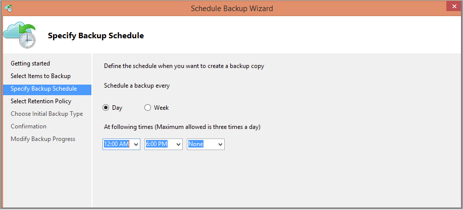
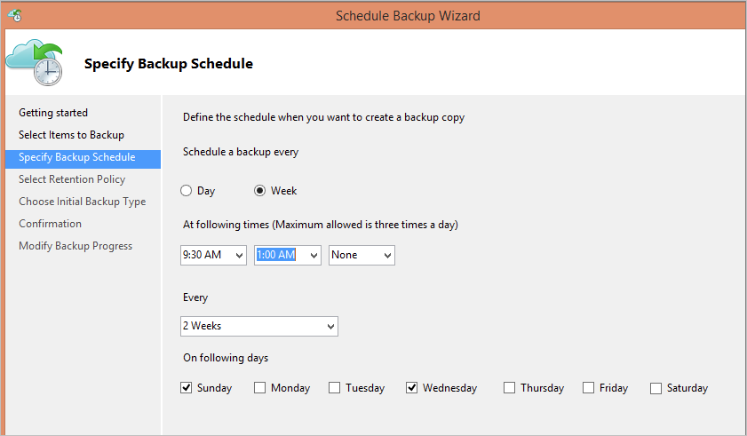
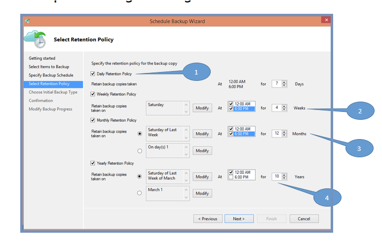

# Back up Windows machines with the Azure Backup MARS agent

This article explains how to back up Windows machines using the [Azure Backup](backup-overview.md) service and the Microsoft Azure Recovery Services (MARS) agent, also known as the Azure Backup agent.

In this article you learn how to:

> [!div class="checklist"]
> * Verify the prerequisites and create a Recovery Services vault.
> * Download and set up the MARS Agent
> * Create a backup policy and schedule.
> * Perform an ad-hoc back up.

## About the MARS agent

The MARS agent is used by Azure Backup to back up files, folders, and system state from on-premises machines and Azure VMs to a backup Recovery Services vault in Azure. You can run the agent as follows:

- Run the agent directly on on-premises Windows machines so that they can back up directly to a backup Recovery Services vault in Azure.
- Run the agent Azure VMs running Windows (side-by-side with the Azure VM backup extension) to back up specific files and folders on the VM.
- Run the agent on a Microsoft Azure Backup Server (MABS) or a System Center Data Protection - Manager (DPM) server. In this scenario, machines and workloads back up to MABS/DPM, and then MABS/DPM backs up to a vault in Azure using the MARS agent.
What you can back up depends on where the agent is installed.

> [!NOTE]
> The primary method for backing up Azure VMs is by using an Azure Backup extension on the VM. This backs up the entire VM. You might want to install and use the MARS agent alongside the extension if you want to back up specific files and folders on the VM. [Learn more](backup-architecture.md#architecture-direct-backup-of-azure-vms).

## Before you start

- [Learn how](backup-architecture.md#architecture-direct-backup-of-on-premises-windows-server-machines-or-azure-vm-files-or-folders) Azure Backup backs up Windows machines with the MARS agent.
- [Learn about](backup-architecture.md#architecture-back-up-to-dpmmabs) the backup architecture running the MARS agent on a secondary MABS or DPM server.
- [Review](backup-support-matrix-mars-agent.md) what's supported and what can be backed up with the MARS agent.
- Verify internet access on the machines you want to back up.
- To back up a server or client to Azure, you need an Azure account. If you don't have one, you can create a [free account](https://azure.microsoft.com/free/) in just a couple of minutes.

### Verify internet access

If your machine has limited internet access, ensure that firewall settings on the machine or proxy allow these URLs and IP address:

**URLs**

- www\.msftncsi.com
- *.Microsoft.com
- *.WindowsAzure.com
- *.microsoftonline.com
- *.windows.net

**IP address**

- 20.190.128.0/18
- 40.126.0.0/18

## Create a Recovery Services vault

A Recovery Services vault stores all the backups and recovery points you create over time, and contains the backup policy applied to backed up machines. Create a vault as follows:

1. Sign in to the [Azure portal](https://portal.azure.com/) using your Azure subscription.
2. In search, type **Recovery Services** and click **Recovery Services vaults**.

    

3. On the **Recovery Services vaults** menu, click **+Add**.

    

4. For **Name**, enter a friendly name to identify the vault.

   - The name needs to be unique for the Azure subscription.
   - It can contain 2 to 50 characters.
   - It must start with a letter, and it can contain only letters, numbers, and hyphens.

5. Select the Azure subscription, resource group, and geographic region in which the vault should be created. Backup data is sent to the vault. Then click **Create**.

    

   - It can take a while for the vault to be created.
   - Monitor the status notifications in the upper-right area of the portal. If after several minutes you don't see the vault, click **Refresh**.

     

### Set storage redundancy

Azure Backup automatically handles storage for the vault. You need to specify how that storage is replicated.

1. From the **Recovery Services vaults** blade, click the new vault. Under the **Settings** section, click  **Properties**.
2. In **Properties**, under **Backup Configuration**, click **Update**.

3. Select the storage replication type, and click **Save**.

      

- We recommend that if you're using Azure as a primary backup storage endpoint, continue to use the default **Geo-redundant** setting.
- If you don't use Azure as a primary backup storage endpoint, then choose **Locally-redundant**, which reduces the Azure storage costs.
- Learn more about [geo](../storage/common/storage-redundancy-grs.md) and [local](../storage/common/storage-redundancy-lrs.md) redundancy.

## Download the MARS agent

Download the MARS agent for installation on machines you want to back up.

- If you've already installed the agent on any machines, make sure you're running the latest version.
- The latest version is available in the portal, or using a [direct download](https://aka.ms/azurebackup_agent)

1. In the vault, under **Getting Started**, click **Backup**.

    

2. In **Where is your workload running?**, select **On-premises**. You should select this option even if you want to install the MARS agent on an Azure VM.
3. In **What do you want to backup?**, select **Files and folders** and/or **System State**. There are a number of other options available, but these are only supported if you're running a secondary backup server. Click **Prepare Infrastructure**.

      

4. On the **Prepare infrastructure**, under **Install Recovery Services agent**, download the MARS agent.

    

5. In the download pop-up menu, click **Save**. By default, the **MARSagentinstaller.exe** file is saved to your Downloads folder.

6. Now, check **Already download or using the latest Recovery Services Agent**, and then download the vault credentials.

    

7. Click **Save**. The file is downloaded to your Download folder. You can't open the vault credentials file.

## Install and register the agent

1. Run the **MARSagentinstaller.exe** file on machines you want to back up.
2. In the MARS Agent Setup Wizard > **Installation Settings**, specify where you want to install the agent, and a location to use for the cache. Then click **Next**.
   - Azure Backup uses the cache to store data snapshots before sending them to Azure.
   - The cache location should have free space equal to at least 5% of the size of the data you'll back up.

     

2. In **Proxy Configuration**, specify how the agent running on the Windows machine will connect to the internet. Then click **Next**.

   - If you're using a custom proxy specify the proxy settings, and credentials if needed.
   - Remember that the agent needs access to [these URLs](#verify-internet-access).

     

3. In **Installation** review the prerequisites check, and click **Install**.
4. After the agent is installed, click **Proceed to Registration**.
5. In the **Register Server Wizard** > **Vault Identification**, browse and select the credentials file you downloaded. Then click **Next**.

    

6. In **Encryption Setting**, specify a passphrase that will be used to encrypt and decrypt backups for the machine.

    - Save the encryption passphrase in a secure location.
    - If you lose or forget the passphrase, Microsoft can't help recover the backup data. Save the file in a secure location. You need it to restore a backup.

7. Click **Finish**. The agent is now installed and your machine is registered to the vault. You're ready to configure and schedule your backup.

## Create a backup policy

The backup policy specifies when to take snapshots of the data to create recovery points, and how long to retain recovery points.

- You configure a backup policy using the MARS agent.
- Azure Backup doesn't automatically take daylight savings time (DST) into account. This could cause some discrepancy between the actual time and scheduled backup time.

Create a policy as follows:

1. On each machine, open the MARS agent. You can find it by searching your machine for **Microsoft Azure Backup**.
2. In **Actions**, click **Schedule Backup**.

    

3. In the Schedule Backup Wizard >  **Getting started**, click **Next**.
4. In **Select Items to Backup**, click **Add Items**.
5. In **Select Items**, select what you want to back up. Then click **OK**.
6. In **Select Items to Backup** page, click **Next**.
7. In **Specify Backup Schedule** page, specify when you want to take daily or weekly backups. Then click **Next**.

    - A recovery point is created when a backup is taken.
    - The number of recovery points created in your environment is dependent upon your backup schedule.

1. You can schedule daily backups, up to three times a day. For example, the screenshot shows two daily backups, one at midnight and one at 6pm.

    

9. You can run weekly backups too. For example, the screenshot shows backups taken every alternate Sunday & Wednesday at 9:30AM and 1:00AM.

    

8. On the **Select Retention Policy** page, specify how you store historical copies of your data. Then click **Next**.

   - Retention settings specify which recovery points should be stored, and how long they should be stored for.
   - For example, when you set a daily retention setting, you indicate that at the time specified for the daily retention, the latest recovery point will be retained for the specified number of days. Or, as another example, you could specify a monthly retention policy to indicate that the recovery point created on the 30th of every month should be stored for 12 months.
   - Daily and weekly recovery point retention usually coincides with the backup schedule. Meaning that when the backup is triggered according to schedule, the recovery point created by the backup is stored for the duration indicated in the daily or weekly retention policy.
   - As an example, in the following screenshot:
     - Daily backups at midnight and 6 PM are kept for seven days.
     - Backups taken on a Saturday at midnight and 6 PM are kept for 4 weeks.
     - Backups taken on Saturday on the last week of the month at midnight and 6 PM are kept for 12 months. - Backups taken on a Saturday in the last week of March are kept for 10 years.

   

11. In **Choose Initial Backup Type** specify how to take the initial backup, over the network or offline. Then click **Next**.

10. In **Confirmation**, review the information, and then click **Finish**.
11. After the wizard finishes creating the backup schedule, click **Close**.

### Perform the initial backup offline

You can run an initial back up automatically over the network, or offline. Offline seeding for an initial backup is useful if you have large amounts of data that will require lots of network bandwidth to transfer. You do an offline transfer as follows:

1. You write the backup data to a staging location.
2. You use the AzureOfflineBackupDiskPrep tool to copy the data from the staging location to one or more SATA disks.
3. The tool creates an Azure Import job. [Learn more](https://docs.microsoft.com/azure/storage/common/storage-import-export-service) about Azure import and export.
4. You send the SATA disks to an Azure datacenter.
5. At the datacenter, the disk data is copied to an Azure storage account.
6. Azure Backup copies the data from the storage account to the vault, and incremental backups are scheduled.

[Learn more](backup-azure-backup-import-export.md) about offline seeding.

### Enable network throttling

You can control how network bandwidth is used by the MARS agent by enabling network throttling. Throttling is helpful if you need to back up data during work hours but want to control how much bandwidth is used for backup and restore activity.

- Azure Backup network throttling uses [Quality of Service (QoS)](https://docs.microsoft.com/windows-server/networking/technologies/qos/qos-policy-top) on the local operating system.
- Network throttling for backup is available on Windows Server 2008 R2 onwards, and Windows 7 onwards. Operating systems should be running the latest service packs.

Enable network throttling as follows:

1. In the MARS agent, click **Change Properties**.
2. On the **Throttling** tab, check **Enable internet bandwidth usage throttling for backup operations**.

    
3. Specify the allowed bandwidth during work and outside work hours. Bandwidth values begin at 512 Kbps and go up to 1,023 MBps. Then click **OK**.

## Run an ad hoc backup

1. In the MARS agent, click **Back Up Now**. This kicks off the initial replication over the network.

    

2. In **Confirmation**, review the settings, and click **Back Up**.
3. Click **Close** to close the wizard. If you do this before the backup finishes, the wizard continues to run in the background.

After the initial backup is completed, the **Job completed** status appears in the Backup console.

## Ad hoc backup policy retention behavior

* For more information, refer step 8 of [Create a backup policy](backup-configure-vault.md#create-a-backup-policy)

| Backup Schedule option | How long will the backed-up data be retained?
| -- | --
| Schedule a backup every: *Day | **Default Retention**: Equivalent to the “retention in days for daily backups”    **Exception**: If a daily scheduled backup set for long term retention (Weeks, Months, Years) fails, then an adhoc backup triggered right after this failed scheduled backup is considered for long-term retention. Otherwise, the next scheduled backup is considered for long-term retention.   **Example**: If (say) the scheduled backup taken on Thursday 8:00 am fails and the same backup was to be considered for Weekly/Monthly/Yearly retention, then the first adhoc backup triggered before the next scheduled backup (say) Friday, 8:00 am would be automatically tagged for Weekly/Monthly/Yearly retention as applicable to the Thursday 8:00 am backup.
| Schedule a backup every: *Weekly | **Default Retention**: 1 day   Adhoc Backups taken for a data source with weekly Backup policy are deleted the very next day, even if they are the most recent Backups for the data source.    **Exception**: If a weekly scheduled backup set for long term retention (Weeks, Months, Years) fails, then an adhoc backup triggered right after this failed scheduled backup is considered for long-term retention. Otherwise, the next scheduled backup is considered for long-term retention.    **Example**: If (say) the scheduled backup taken on Thursday 8:00 am fails and the same backup was to be considered for Monthly/Yearly retention, then the first adhoc backup triggered before the next scheduled backup (say) Thursday, 8:00 am would be automatically tagged for Monthly/Yearly retention as applicable to the Thursday 8:00 am backup

## Next steps

[Learn how to restore files](backup-azure-restore-windows-server.md).
