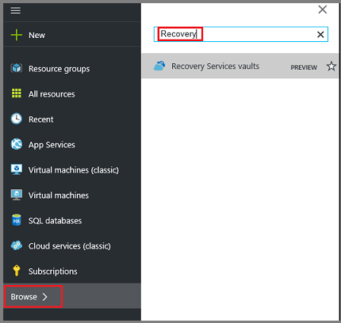
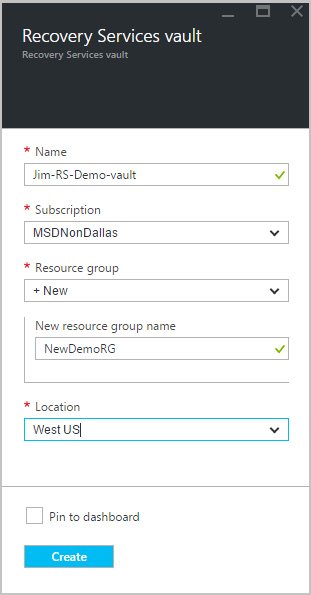
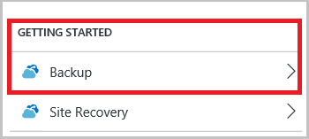
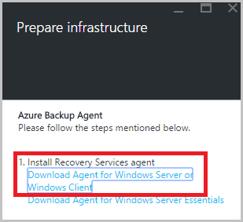

<properties
	pageTitle="Back up a Windows Server or client to Azure with Azure Backup using the Resource Manager deployment model | Microsoft Azure"
	description="Backup Windows servers or clients to Azure by creating a backup vault, downloading credentials, installing the backup agent, and completing an initial backup of your files and folders."
	services="backup"
	documentationCenter=""
	authors="Jim-Parker"
	manager="jwhit"
	editor=""
	keywords="backup vault; back up a Windows server; backup windows;"/>

<tags
	ms.service="backup"
	ms.workload="storage-backup-recovery"
	ms.tgt_pltfrm="na"
	ms.devlang="na"
	ms.topic="article"
	ms.date="05/10/2016"
	ms.author="jimpark; trinadhk; markgal"/>

# Back up a Windows Server or client to Azure with Azure Backup using the Resource Manager deployment model

> [AZURE.SELECTOR]
- [Azure portal](backup-configure-vault.md)
- [Classic portal](backup-configure-vault-classic.md)

This article explains how to back up your Windows Server (or Windows client) files and folders to Azure with Azure Backup using the Resource Manager deployment model.

[AZURE.INCLUDE [learn-about-deployment-models](../../includes/learn-about-deployment-models-rm-include.md)] classic deployment model.

## Before you start
To back up a server or client to Azure, you need an Azure account. If you don't have one, you can create a [free account](https://azure.microsoft.com/free/) in just a couple of minutes.

## Step 1: Create a Recovery Services vault

A Recovery Services vault is an entity that stores all the backups and recovery points you create over time. The Recovery Services vault also contains the backup policy applied to the protected files and folders. When you create a Recovery Services vault, you should also select the appropriate storage redundancy option.

### To create a Recovery Services vault

1. If you haven't already done so, sign in to the [Azure Portal](https://portal.azure.com/) using your Azure subscription.

2. On the Hub menu, click **Browse** and in the list of resources, type **Recovery Services**. As you begin typing, the list will filter based on your input. Click **Recovery Services vaults**.

      

    The list of Recovery Services vaults is displayed.

3. On the **Recovery Services vaults** menu, click **Add**.

    

    The Recovery Services vault blade opens, prompting you to provide a **Name**, **Subscription**, **Resource group**, and **Location**.

    

4. For **Name**, enter a friendly name to identify the vault. The name needs to be unique for the Azure subscription. Type a name that contains between 2 and 50 characters. It must start with a letter, and can contain only letters, numbers, and hyphens.

5. Click **Subscription** to see the available list of subscriptions. If you are not sure which subscription to use, use the default (or suggested) subscription. There will be multiple choices only if your organizational account is associated with multiple Azure subscriptions.

6. Click **Resource group** to see the available list of Resource groups, or click **New** to create a new Resource group. For complete information on Resource groups, see [Azure Resource Manager overview](../resource-group-overview.md)

7. Click **Location** to select the geographic region for the vault. This choice determines the geographic region where your backup data is sent. By choosing a geographic region that's close to your location, you can reduce network latency when backing up to Azure.

8. Click **Create**. It can take a while for the Recovery Services vault to be created. Monitor the status notifications in the upper right-hand area in the portal. Once your vault is created, it should open in the portal. If you don't see your vault listed after it has been completed, click **Refresh**. When the list refreshes, click the name of the vault.

### To determine storage redundancy
When you first create a Recovery Services vault you determine how storage is replicated.

1. In the **Settings** blade, which opens automatically with your vault dashboard, click **Backup Infrastructure**.

2. In the Backup Infrastructure blade, click **Backup Configuration** to view the **Storage replication type**.

    

3. Choose the storage replication option for your vault.

    

    By default, your vault has geo-redundant storage. If you are using Azure as a primary backup storage endpoint, continue using geo-redundant storage. If you are using Azure as a non-primary backup storage endpoint, then choose locally redundant storage, which will reduce the cost of storing data in Azure. Read more about [geo-redundant](../storage/storage-redundancy.md#geo-redundant-storage) and [locally redundant](../storage/storage-redundancy.md#locally-redundant-storage) storage options in this [overview](../storage/storage-redundancy.md).

    After choosing the storage option for your vault, you are ready to associate your files and folders with the vault.

Now that you've created a vault, you prepare your infrastructure to back up files and folders by downloading and installing the Microsoft Azure Recovery Services agent, downloading vault credentials, and then using those credentials to register the agent with the vault.

## Step 2 - Download files

>[AZURE.NOTE] Enabling backup through the Azure portal is coming soon. At this time, you use the Microsoft Azure Recovery Services Agent on-premises to back up your files and folders.

1. Click **Settings** on the Recovery Services vault dashboard.

    

2. Click **Getting Started > Backup** on the Settings blade.

    

3. Click **Backup goal** on the Backup blade.

    

4. Select **On-premises** from the Where is your workload running? menu.

5. Select **Files and folders** from the What do you want to backup? menu, and click **OK**.

#### Download the Recovery Services agent

1. Click **Download Agent for Windows Server or Windows Client** in the **Prepare infrastructure** blade.

    

2. Click **Save** in the download pop-up. By default, the **MARSagentinstaller.exe** file is saved to your Downloads folder.

#### Download vault credentials

1. Click **Download > Save** on the Prepare infrastructure blade.

    

## Step 3 -Install and register the agent

1. Locate and double click the **MARSagentinstaller.exe** from the Downloads folder (or other saved location).

2. Complete the Microsoft Azure Recovery Services Agent Setup Wizard. To complete the wizard, you need to:

    - Choose a location for the installation and cache folder.
    - Provide your proxy server info if you use a proxy server to connect to the internet.
    - Provide your user name and password details if you use an authenticated proxy.
    - Provide the downloaded vault credentials
    - Save the encryption passphrase in a secure location.

    >[AZURE.NOTE] If you lose or forget the passphrase, Microsoft cannot help recover the backup data. Please save the file in a secure location. It is required to restore a backup.

The agent is now installed and your machine is registered to the vault. You're ready to configure and schedule your backup.

## Step 4: Complete the initial backup

The initial backup includes two key tasks:

- Schedule the backup
- Back up files and folders for the first time

To complete the initial backup, you use the Microsoft Azure backup agent.

### To schedule the backup

1. Open the Microsoft Azure Backup agent. You can find it by searching your machine for **Microsoft Azure Backup**.

    

2. In the Backup agent, click **Schedule Backup**.

    

3. On the Getting started page of the Schedule Backup Wizard, click **Next**.

4. On the Select Items to Backup page, click **Add Items**.

5. Select the files and folders that you want to back up, and then click **Okay**.

6. Click **Next**.

7. On the **Specify Backup Schedule** page, specify the **backup schedule** and click **Next**.

    You can schedule daily (at a maximum rate of three times per day) or weekly backups.

    

    >[AZURE.NOTE] For more information about how to specify the backup schedule, see the article [Use Azure Backup to replace your tape infrastructure](backup-azure-backup-cloud-as-tape.md).

8. On the **Select Retention Policy** page, select the **Retention Policy** for the backup copy.

    The retention policy specifies the duration for which the backup will be stored. Rather than just specifying a “flat policy” for all backup points, you can specify different retention policies based on when the backup occurs. You can modify the daily, weekly, monthly, and yearly retention policies to meet your needs.

9. On the Choose Initial Backup Type page, choose the initial backup type. Leave the option **Automatically over the network** selected, and then click **Next**.

    You can back up automatically over the network, or you can back up offline. The remainder of this article describes the process for backing up automatically. If you prefer to do an offline backup, review the article [Offline backup workflow in Azure Backup](backup-azure-backup-import-export.md) for additional information.

10. On the Confirmation page, review the information, and then click **Finish**.

11. After the wizard finishes creating the backup schedule, click **Close**.

### Enable network throttling (optional)

The backup agent provides network throttling. Throttling controls how network bandwidth is used during data transfer. This control can be helpful if you need to back up data during work hours but do not want the backup process to interfere with other Internet traffic. Throttling applies to back up and restore activities.

>[AZURE.NOTE] Network throttling is not available on Windows Server 2008 R2 SP1, Windows Server 2008 SP2, or Windows 7 (with service packs). The Azure Backup network throttling feature engages Quality of Service (QoS) on the local operating system. Though Azure Backup can protect these operating systems, the version of QoS available on these platforms doesn't work with Azure Backup network throttling. Network throttling can be used on all other [supported operating systems](backup-azure-backup-faq.md#installation-amp-configuration).

**To enable network throttling**

1. In the backup agent, click **Change Properties**.

    

2. On the **Throttling** tab, select the **Enable internet bandwidth usage throttling for backup operations** check box.

    

3. After you have enabled throttling, specify the allowed bandwidth for backup data transfer during **Work hours** and **Non-work hours**.

    The bandwidth values begin at 512 kilobits per second (Kbps) and can go up to 1,023 megabytes per second (MBps). You can also designate the start and finish for **Work hours**, and which days of the week are considered work days. Hours outside of designated work hours are considered non-work hours.

4. Click **OK**.

### To back up files and folders for the first time

1. In the backup agent, click **Back Up Now** to complete the initial seeding over the network.

    

2. On the Confirmation page, review the settings that the Back Up Now Wizard will use to back up the machine. Then click **Back Up**.

3. Click **Close** to close the wizard. If you do this before the backup process finishes, the wizard continues to run in the background.

After the initial backup is completed, the **Job completed** status appears in the Backup console.

## Questions?
If you have questions, or if there is any feature that you would like to see included, [send us feedback](http://aka.ms/azurebackup_feedback).

## Next steps
For additional information about backing up VMs or other workloads, see:

- Now that you've backed up your files and folders, you can [manage your vaults and servers](backup-azure-manage-windows-server.md).
- If you need to restore a backup, use this article to [restore files to a Windows machine](backup-azure-restore-windows-server.md).
