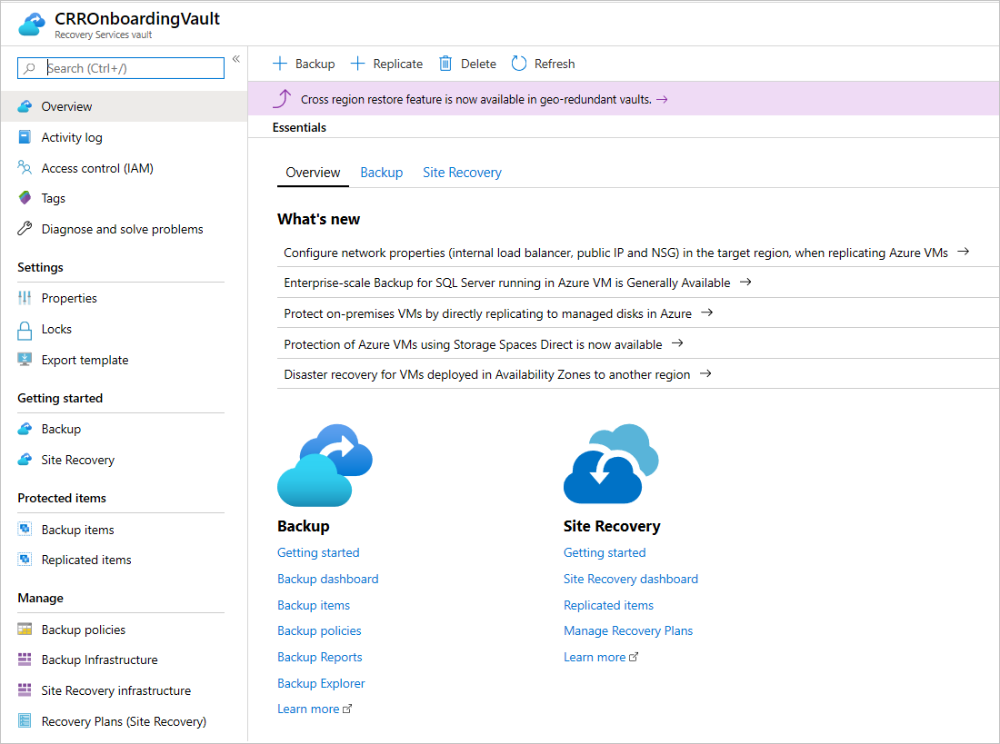
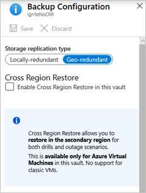

# Create and configure a Recovery Services vault

This article describes how to create and configure an Azure Backup Recovery Services vault that stores backups and recovery points. You can also use Cross Region Restore to restore in a secondary region.

[!INCLUDE [How to create a Recovery Services vault](../../includes/backup-create-rs-vault.md)]

## Set storage redundancy

Azure Backup automatically handles storage for the vault. You need to specify how that storage is replicated.

> [!NOTE]
> Be sure to change the storage replication type for a Recovery Services vault before you configure a backup in the vault. After you configure a backup, the option to modify is disabled.
>
> If you haven't yet configured the backup, complete the following steps to review and modify the settings. If you've already configured the backup and must change the storage replication type, [review these workarounds](#modify-default-settings).

1. From the **Recovery Services vaults** pane, select the new vault. In the **Settings** section, select  **Properties**.
1. In **Properties**, under **Backup Configuration**, select **Update**.

1. For **Storage replication type**, select **Geo-redundant**, **Locally-redundant**, or **Zone-redundant**. Then select **Save**.

   :::image type="content" source="./media/backup-create-rs-vault/recovery-services-vault-backup-configuration.png" alt-text="Screenshot shows how to set the storage configuration for a new vault." lightbox="./media/backup-create-rs-vault/recovery-services-vault-backup-configuration.png":::

   Here are our recommendations for choosing a storage replication type:
   
   - If you're using Azure as a primary backup storage endpoint, continue to use the default [geo-redundant storage (GRS)](../storage/common/storage-redundancy.md#geo-redundant-storage).
   
   - If you don't use Azure as a primary backup storage endpoint, choose [locally redundant storage (LRS)](../storage/common/storage-redundancy.md#locally-redundant-storage) to reduce storage costs.
   
   - If you need data availability without downtime in a region, guaranteeing data residency, choose [zone-redundant storage (ZRS)](../storage/common/storage-redundancy.md#zone-redundant-storage).

>[!NOTE]
>The storage replication settings for the vault aren't relevant for Azure file share backup, because the current solution is snapshot based and no data is transferred to the vault. Snapshots are stored in the same storage account as the backed-up file share.

## Set Cross Region Restore

The Cross Region Restore option allows you to restore data in a secondary, [Azure paired region](../availability-zones/cross-region-replication-azure.md). You can use Cross Region Restore to conduct drills when there's an audit or compliance requirement. You can also use it to restore the data if there's a disaster in the primary region.

Before you begin, consider the following information:

- Cross Region Restore is supported only for a Recovery Services vault that uses the [GRS replication type](#set-storage-redundancy).
- Virtual machines (VMs) created through Azure Resource Manager and encrypted Azure VMs are supported. VMs created through the classic deployment model aren't supported. You can restore the VM or its disk.  
- SQL Server or SAP HANA databases hosted on Azure VMs are supported. You can restore databases or their files.
- MARS Agent is supported for vaults without private endpoint (preview).
- Review the [support matrix](backup-support-matrix.md#cross-region-restore) for a list of supported managed types and regions.
- Using Cross Region Restore will incur additional charges. Once you enable Cross Region restore, it might take up to 48 hours for the backup items to be available in secondary regions. [Learn more about pricing](https://azure.microsoft.com/pricing/details/backup/).
- Cross Region Restore currently can't be reverted to GRS or LRS after the protection starts for the first time.
- Currently, secondary region RPO is 36 hours. This is because the RPO in the primary region is 24 hours and can take up to 12 hours to replicate the backup data from the primary to the secondary region.
- Review the [permissions required to use Cross Region Restore](backup-rbac-rs-vault.md#minimum-role-requirements-for-azure-vm-backup).

A vault created with GRS redundancy includes the option to configure the Cross Region Restore feature. Every GRS vault has a banner that links to the documentation. 

>[!Note]
>Cross-region restore is currently not supported for machines running on Ultra disks. [Learn more about Ultra disk backup supportability](backup-support-matrix-iaas.md#ultra-disk-backup).

To configure Cross Region Restore for the vault:

1. From the portal, go to your Recovery Services vault, and then select **Properties** (under **Settings**).
1. Under **Backup Configuration**, select **Update**.
1. Under **Cross Region Restore**, select **Enable**.

   

> [!NOTE]
> If you have access to restricted paired regions and still can't view Cross Region Restore settings on the **Backup Configuration** pane, re-register the Recovery Services resource provider. To re-register the provider, go to your subscription in the Azure portal, go to **Resource provider** on the left pane, and then select **Microsoft.RecoveryServices** > **Re-register**.

For more information about backup and restore with Cross Region Restore, see these articles:

- [Cross Region Restore for Azure VMs](backup-azure-arm-restore-vms.md#cross-region-restore)
- [Cross Region Restore for SQL Server databases](restore-sql-database-azure-vm.md#cross-region-restore)
- [Cross Region Restore for SAP HANA databases](sap-hana-db-restore.md#cross-region-restore)
- [Cross Region Restore for MARS (Preview)](about-restore-microsoft-azure-recovery-services.md#cross-region-restore-preview)

## Set encryption settings

By default, the data in the Recovery Services vault is encrypted through platform-managed keys. You don't need to take any explicit actions to enable this encryption. It applies to all workloads that are backed up to your Recovery Services vault. 

You can choose to bring your own key (a *customer-managed key*) to encrypt the backup data in this vault. If you want to encrypt backup data by using your own key, you must specify the encryption key before any item is added to this vault. After you enable encryption with your key, it can't be reversed.

To configure your vault to encrypt with customer-managed keys:

1. Enable managed identity for your Recovery Services vault.
1. Assign permissions to the vault to access the encryption key in Azure Key Vault.
1. Enable soft delete and purge protection in Azure Key Vault.
1. Assign the encryption key to the Recovery Services vault.

You can find instructions for each of these steps in [this article](encryption-at-rest-with-cmk.md#configure-a-vault-to-encrypt-using-customer-managed-keys).

## Modify default settings

We highly recommend that you review the default settings for storage replication type and security before you configure backups in the vault.

By default, **Soft delete** is set to **Enabled** on newly created vaults to help protect backup data from accidental or malicious deletions. To review and modify the settings, [follow these steps](./backup-azure-security-feature-cloud.md#enabling-and-disabling-soft-delete).

Before you decide to move from GRS to LRS, review the trade-offs between lower cost and higher data durability that fit your scenario. If you must move from GRS to LRS after you configure backup, you have the following two choices. Your choice will depend on your business requirements to retain the backup data.

### Don't need to preserve previous backed-up data

To help protect workloads in a new LRS vault, you need to delete the current protection and data in the GRS vault and reconfigure backups.

> [!WARNING]
> The following operation is destructive and can't be undone. All backup data and backup items associated with the protected server will be permanently deleted. Proceed with caution.

To stop and delete current protection on the GRS vault:

1. Follow [these steps](backup-azure-security-feature-cloud.md#disabling-soft-delete-using-azure-portal) to disable soft delete in the GRS vault's properties.

1. Stop protection and delete backups from the existing GRS vault. On the vault dashboard menu, select **Backup Items**. If you need to move items that are listed here to the LRS vault, you must remove them and their backup data. See [Delete protected items in the cloud](backup-azure-delete-vault.md#delete-protected-items-in-the-cloud) and [Delete protected items on-premises](backup-azure-delete-vault.md#delete-protected-items-on-premises).

1. If you're planning to move Azure file shares, SQL Server instances, or SAP HANA servers, you'll also need to unregister them. On the vault dashboard menu, select **Backup Infrastructure**. For steps beyond that, see [Unregister a storage account associated with Azure file shares](manage-afs-backup.md#unregister-a-storage-account), [Unregister a SQL Server instance](manage-monitor-sql-database-backup.md#unregister-a-sql-server-instance), or [Unregister an SAP HANA instance](sap-hana-db-manage.md#unregister-an-sap-hana-instance).

1. After you remove Azure file shares, SQL Server instances, or SAP HANA servers from the GRS vault, continue to configure the backups for your workload in the new LRS vault.

### Must preserve previous backed-up data

If you need to keep the current protected data in the GRS vault and continue the protection in a new LRS vault, there are limited options for some of the workloads:

- For Microsoft Azure Recovery Services (MARS), you can [stop protection with retained data](backup-azure-manage-mars.md#stop-protecting-files-and-folder-backup) and register the agent in the new LRS vault. Be aware that:

  - The Azure Backup service will continue to retain all the existing recovery points of the GRS vault.
  - You'll need to pay to keep the recovery points in the GRS vault.
  - You'll be able to restore the backed-up data only for unexpired recovery points in the GRS vault.
  - You'll need to create an initial replica of the data on the LRS vault.

- For an Azure VM, you can [stop protection with retained data](backup-azure-manage-vms.md#stop-protecting-a-vm) for the VM in the GRS vault, move the VM to another resource group, and then help protect the VM in the LRS vault. For information about moving a VM to another resource group, see the [guidance and limitations](../azure-resource-manager/management/move-limitations/virtual-machines-move-limitations.md).

  You can add a VM to only one vault at a time. However, the VM in the new resource group can be added to the LRS vault because it's considered a different VM. Be aware that:

  - The Azure Backup service will retain the recovery points that have been backed up on the GRS vault.
  - You'll need to pay to keep the recovery points in the GRS vault. See [Azure Backup pricing](azure-backup-pricing.md) for details.
  - You'll be able to restore the VM, if needed, from the GRS vault.
  - The first backup on the LRS vault of the VM in the new resource will be an initial replica.

## Next steps

- [Learn more about Recovery Services vaults](backup-azure-recovery-services-vault-overview.md)
- [Delete Recovery Services vaults](backup-azure-delete-vault.md)
