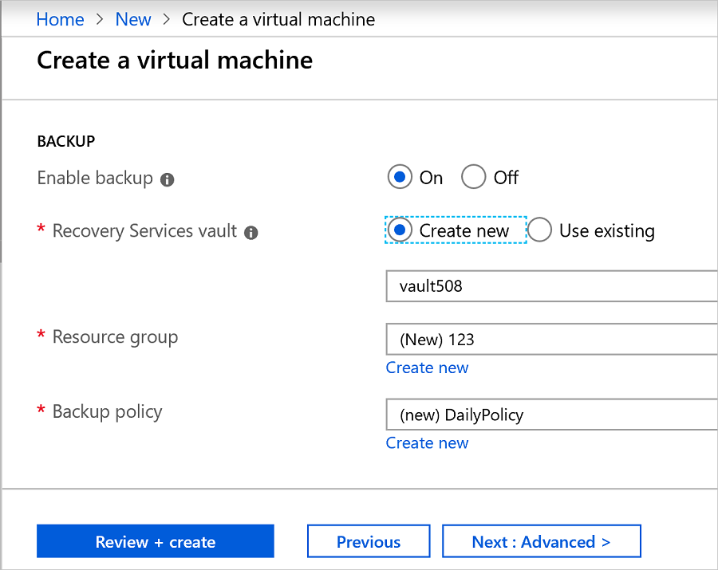
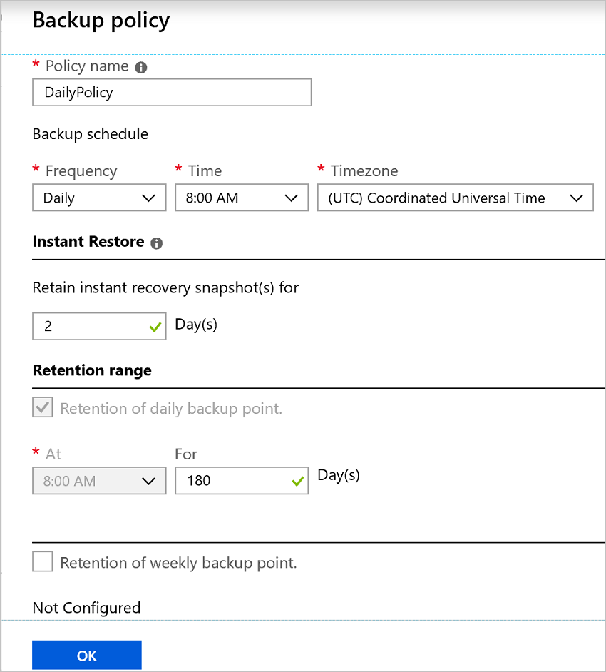
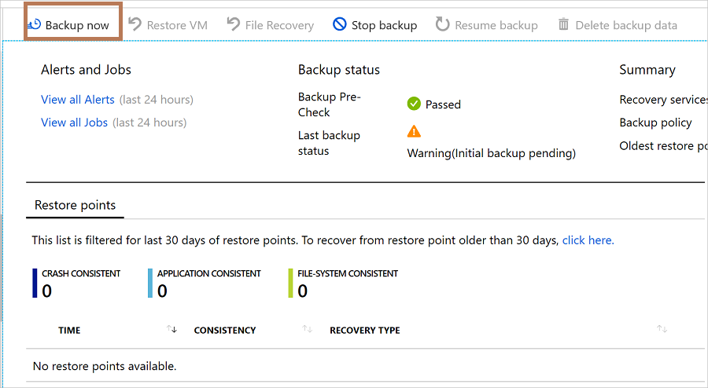

# Enable backup when you create an Azure VM

Use the Azure Backup service to back up Azure virtual machines (VMs). VMs are backed up according to a schedule specified in a backup policy, and recovery points are created from backups. Recovery points are stored in Recovery Services vaults.

This article details how to enable backup when you create a virtual machine (VM) in the Azure portal.  

## Before you start

- [Check](backup-support-matrix-iaas.md#supported-backup-actions) which operating systems are supported if you enable backup when you create a VM.

## Sign in to Azure

If you aren't already signed in to your account, sign in to the [Azure portal](https://portal.azure.com).

## Create a VM with Backup configured

1. In Azure portal, click **Create a resource**.

2. In the Azure Marketplace, click **Compute**, and then select a VM image.

3. Set up the VM in accordance with the [Windows](https://docs.microsoft.com/azure/virtual-machines/windows/quick-create-portal) or [Linux](https://docs.microsoft.com/azure/virtual-machines/linux/quick-create-portal) instructions.

4. On the **Management** tab, in **Enable backup**, click **On**.
5. Azure Backup backups to a Recovery Services vault. Click **Create New** if you don't have an existing vault.
6. Accept the suggested vault name or specify your own.
7. Specify or create a resource group in which the vault will be located. The resource group vault can be different from the VM resource group.

    

8. Accept the default backup policy, or modify the settings.
    - A backup policy specifies how frequently to take backup snapshots of the VM, and how long to keep those backup copies.
    - The default policy backs up the VM once a day.
    - You can customize your own backup policy for an Azure VM to take backups daily or weekly.
    - [Learn more](backup-azure-vms-introduction.md#backup-and-restore-considerations) about backup considerations for Azure VMs.
    - [Learn more](backup-instant-restore-capability.md) about the instant restore functionality.

      

> [!NOTE]
> Azure Backup service creates a separate resource group (other than the VM resource group) to store snapshot, with the naming format **AzureBackupRG_geography_number** (example: AzureBackupRG_northeurope_1). The data in this resource group will be retained for the duration in days as specified in *Retain instant recovery snapshot* section of the Azure Virtual Machine Backup policy.  Applying a lock to this resource group can cause backup failures. 
This resource group should also be excluded from any name/tag restrictions as a restriction policy would block creation of Resource Point collections in it again causing backup failures.

## Start a backup after creating the VM

Your VM backup will run in accordance with your backup policy. However, we recommend that you run an initial backup.

After the VM is created, do the following:

1. In the VM properties, click **Backup**. The VM status is Initial Backup Pending until the initial backup runs
2. Click **Back up now** to run an on-demand backup.

    

## Use a Resource Manager template to deploy a protected VM

The previous steps explain how to use the Azure portal to create a virtual machine and protect it in a Recovery Services vault. To quickly deploy one or more VMs and protect them in a Recovery Services vault, see the template [Deploy a Windows VM and enable backup](https://azure.microsoft.com/resources/templates/101-recovery-services-create-vm-and-configure-backup/).

## Next steps

Now that you've protected your VM, learn how to manage and restore them.

- [Manage and monitor VMs](backup-azure-manage-vms.md)
- [Restore VM](backup-azure-arm-restore-vms.md)

If you encounter any issues, [review](backup-azure-vms-troubleshoot.md) the troubleshooting guide.
