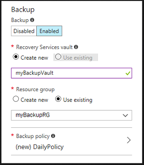

---
title: Enable Azure VM backup during creation
description: See the steps to enable Azure virtual machine backup during the creation process.
services: backup, virtual-machines
author: markgalioto
manager: carmonm
tags: azure-resource-manager, virtual-machine-backup
ms.service: backup, virtual-machines
ms.topic: conceptual
ms.date: 01/08/2018
ms.author: trinadhk
--- 

# Enable backup during Azure virtual machine creation 

The Azure Backup service provides an interface to create and configure backups to the cloud. Protect your data by taking backups, called recovery points, at regular intervals. Azure Backup creates recovery points that can be stored in geo-redundant recovery vaults. This article details how to enable backup while creating a virtual machine (VM) in the Azure portal.  

## Log in to Azure 

If you are not already in signed in to your account, sign in to the [Azure portal](http://portal.azure.com).
 
## Create virtual machine with backup configured 

1. In the upper left-hand corner of the Azure portal, click **New**. 

2. Select **Compute**, and then select an image of the virtual machine.   

3. Enter the virtual machine information. The user name and password provided is used to sign in to the virtual machine. When complete, click **OK**. 

4. Select a size for the VM.  

5. Under **Settings > Backup**, click **Enabled** to bring up backup configuration settings. You can accept default values and click **OK** on the settings page to proceed to Summary page to create the VM. If you want to change the values, follow next steps.  

6. Create or select a Recovery Services vault, which holds the backups of the virtual machine. If you are creating a recovery services vault, you can choose a resource group for the vault.  

     

    > [!NOTE] 
    > The resource group for the Recovery Services vault can be different than the resource group for the virtual machine.  
    > 
    > 

7. By default, a backup policy is selected for you to quickly protect the VM. A backup policy specifies how frequently to take backup snapshots, and how long to retain those backup copies. You can accept the default policy, or you can create or select a different backup policy. To edit the backup policy, select **Backup Policy** and change the values of the policy.  

8. When you are happy with the backup configuration values, in the Setting page, click **OK**.  

9. On the summary page, once validation has passed, click **Create** to create a virtual machine that uses the configured backup settings. 

## Initiate a backup after creating the VM 

Though the Backup policy has been created, it is good practice to create an initial backup. To view the backup details for the virtual machine once the VM creation template finishes, from the **Operations** setting on the left-hand menu, click **Backup**. You can use this to trigger an on-demand backup, restore a full VM or all disks, restore files from VM backup, or change the backup policy associated with the virtual machine.  

## Using a Resource Manager template to deploy a protected VM

The previous steps explain how to use the Azure portal to create a virtual machine, and protect it to a Recovery Services vault. If you want to quickly deploy one or more virtual machines, and protect them to a Recovery Services vault, see the template, [Deploy a Windows VM and enable backup](https://azure.microsoft.com/resources/templates/101-recovery-services-create-vm-and-configure-backup/).

## Frequently asked questions 

### Which VM images enable backup at the time of VM creation? 

The following list of core images published by Microsoft are supported for enabling backup during VM creation. For other VMs, you can enable backup once the VM is created. Learn more [Enable backup after VM is created](quick-backup-vm-portal.md) 

- **Windows** - Windows Server 2016 Data center, Windows Server 2016 Data Center core, Windows Server 2012 DataCenter, Windows Server 2012 R2 DataCenter, Windows Server 2008 R2 SP1 
- **Ubuntu** - Ubuntu Server 1710, Ubuntu Server 1704, UUbuntu Server 1604(LTS), Ubuntu Server 1404(LTS) 
- **Red Hat** - RHEL 6.7, 6.8, 6.9, 7.2, 7.3, 7.4 
- **SUSE** - SUSE Linux Enterprise Server 11 SP4, 12 SP2, 12 SP3 
- **Debian** - Debian 8, Debian 9 
- **CentOS** - CentOS 6.9, CentOS 7.3 
- **Oracle Linux** - Oracle Linux 6.7, 6.8, 6.9, 7.2, 7.3 
 
### Is backup cost included in the VM cost? 

No, backup costs are separate, or distinct, from virtual machines costs. For more information on backup pricing, see the [Backup Pricing site](https://azure.microsoft.com/pricing/details/backup/).
 
### Which permissions are required to enable backup on a VM? 

If you are a virtual machine contributor, you can enable backup on the VM. If you are using a custom role, you need the following permissions to successfully enable backup on the VM. 

- Microsoft.RecoveryServices/Vaults/write 
- Microsoft.RecoveryServices/Vaults/read 
- Microsoft.RecoveryServices/locations/* 
- Microsoft.RecoveryServices/Vaults/backupFabrics/protectionContainers/protectedItems/*/read 
- Microsoft.RecoveryServices/Vaults/backupFabrics/protectionContainers/protectedItems/read 
- Microsoft.RecoveryServices/Vaults/backupFabrics/protectionContainers/protectedItems/write 
- Microsoft.RecoveryServices/Vaults/backupFabrics/backupProtectionIntent/write 
- Microsoft.RecoveryServices/Vaults/backupPolicies/read 
- Microsoft.RecoveryServices/Vaults/backupPolicies/write 
 
If your recovery services vault and virtual machine have different resource groups, be sure you have write permissions in the recovery services vault resource group.  

## Next steps 

Now that you have protected your VM, see the following articles to learn about VM management tasks, and how to restore VMs. 

- [Manage and monitor your virtual machines](backup-azure-manage-vms.md) 
- [Restore virtual machines](backup-azure-arm-restore-vms.md) 
