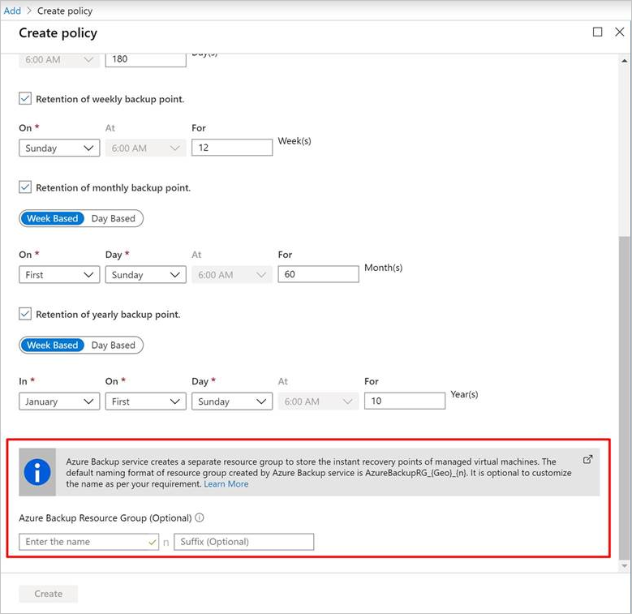
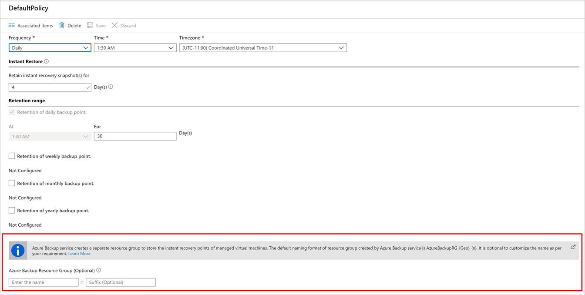

# Enable backup when you create an Azure VM

Use the Azure Backup service to back up Azure virtual machines (VMs). VMs are backed up according to a schedule specified in a backup policy, and recovery points are created from backups. Recovery points are stored in Recovery Services vaults.

This article details how to enable backup when you create a virtual machine (VM) in the Azure portal.  

## Before you start

- [Check](backup-support-matrix-iaas.md#supported-backup-actions) which operating systems are supported if you enable backup when you create a VM.

## Sign in to Azure

If you aren't already signed in to your account, sign in to the [Azure portal](https://portal.azure.com).

## Create a VM with Backup configured

1. In the Azure portal, select **Create a resource**.

2. In Azure Marketplace, select **Compute**, and then select a VM image.

   >[!Note]
   >To create a VM from a non-Marketplace image or swap the OS disk of a VM with a non-Marketplace image, remove the plan information from the VM. This helps in seamless VM restore.

3. Set up the VM in accordance with the [Windows](../virtual-machines/windows/quick-create-portal.md) or [Linux](../virtual-machines/linux/quick-create-portal.md) instructions.

4. On the **Management** tab, in **Enable backup**, select **On**.
5. Azure Backup backups to a Recovery Services vault. Select **Create New** if you don't have an existing vault.
6. Accept the suggested vault name or specify your own.
7. Specify or create a resource group in which the vault will be located. The resource group vault can be different from the VM resource group.

    

8. Accept the default backup policy, or modify the settings.
    - A backup policy specifies how frequently to take backup snapshots of the VM, and how long to keep those backup copies.
    - The default policy backs up the VM once a day.
    - You can customize your own backup policy for an Azure VM to take backups daily or weekly.
    - [Learn more](backup-azure-vms-introduction.md#backup-and-restore-considerations) about backup considerations for Azure VMs.
    - [Learn more](backup-instant-restore-capability.md) about the instant restore functionality.

      

>[!NOTE]
> [SSE and PMK are the default encryption methods](backup-encryption.md) for Azure VMs. Azure Backup supports backup and restore of these Azure VMs.

## Azure Backup resource group for Virtual Machines

The Backup service creates a separate resource group (RG), different than the resource group of the VM to store the restore point collection (RPC). The RPC houses the instant recovery points of managed VMs. The default naming format of the resource group created by the Backup service is: `AzureBackupRG_<Geo>_<number>`. For example: *AzureBackupRG_northeurope_1*. You now can customize the Resource group name created by Azure Backup.

Points to note:

1. You can use default name of RG or customize the name according to organizational requirements.

   >[!Note]
   >When Azure Backup creates an RG, a numeric is appended to the name of RG and used for restore point collection.

1. You provide the RG name pattern as input during VM backup policy creation. The RG name should be of the following format:
              `<alpha-numeric string>* n <alpha-numeric string>`. 'n' is replaced with an integer (starting from 1) and is used for scaling out if the first RG is full. One RG can have a maximum of 600 RPCs today.
              
1. The pattern should follow the RG naming rules below and the total length shouldn't exceed the maximum allowed RG name length.
    1. Resource group names only allow alphanumeric characters, periods, underscores, hyphens, and parenthesis. They can't end in a period.
    2. Resource group names can contain up to 74 characters, including the name of the RG and the suffix.
1. The first `<alpha-numeric-string>` is mandatory while the second one after 'n' is optional. This applies only if you give a customized name. If you don't enter anything in either of the textboxes, the default name is used.
1. You can edit the name of the RG by modifying the policy if and when required. If the name pattern is changed, new RPs will be created in the new RG. However, the old RPs will still reside in the old RG and won't be moved, as RP Collection doesn't support resource move. Eventually the RPs will get garbage collected as the points expire.

1. It's advised not to lock the resource group created for use by the Backup service.

To configure the Azure Backup resource group for Virtual Machines using PowerShell, refer to [Creating Azure Backup resource group during snapshot retention](backup-azure-vms-automation.md#creating-azure-backup-resource-group-during-snapshot-retention).

## Start a backup after creating the VM

Your VM backup will run in accordance with your backup policy. However, we recommend that you run an initial backup.

After the VM is created, do the following:

1. In the VM properties, select **Backup**. The VM status is Initial Backup Pending until the initial backup runs.
2. Select **Back up now** to run an on-demand backup.

    

## Use a Resource Manager template to deploy a protected VM

The previous steps explain how to use the Azure portal to create a virtual machine and protect it in a Recovery Services vault. To quickly deploy one or more VMs and protect them in a Recovery Services vault, see the template [Deploy a Windows VM and enable backup](https://azure.microsoft.com/resources/templates/recovery-services-create-vm-and-configure-backup/).

## Next steps

Now that you've protected your VM, learn how to manage and restore them.

- [Manage and monitor VMs](backup-azure-manage-vms.md)
- [Restore VM](backup-azure-arm-restore-vms.md)

If you encounter any issues, [review](backup-azure-vms-troubleshoot.md) the troubleshooting guide.
