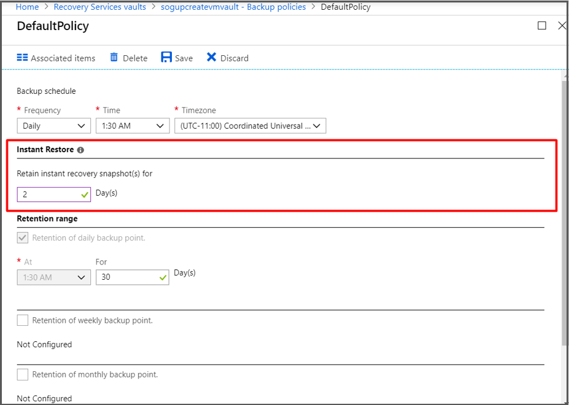

# Get improved backup and restore performance with Azure Backup Instant Restore capability

> [!NOTE]
> Based on feedback from users, we've renamed **VM backup stack V2** to **Instant Restore** to reduce confusion with Azure Stack functionality.
> All Azure Backup users have now been upgraded to **Instant Restore**.

The new model for Instant Restore provides the following feature enhancements:

* Ability to use snapshots taken as part of a backup job that's available for recovery without waiting for data transfer to the vault to finish. It reduces the wait time for snapshots to copy to the vault before triggering restore.
* Reduces backup and restore times by retaining snapshots locally, for two days by default. This default snapshot retention value is configurable to any value between 1 to 5 days.
* Supports disk sizes up to 32 TB. Resizing of disks isn't recommended by Azure Backup.
* Supports Standard SSD disks along with Standard HDD disks and Premium SSD disks.
* Ability to use an unmanaged VMs original storage accounts (per disk), when restoring. This ability exists even when the VM has disks that are distributed across storage accounts. It speeds up restore operations for a wide variety of VM configurations.
* For backup of VMs that are using unmanaged premium disks in storage accounts, with Instant Restore, we recommend allocating *50%* free space of the total allocated storage space, which is required **only** for the first backup. The 50% free space isn't a requirement for backups after the first backup is complete.

## What's new in this feature

Currently, the backup job consists of two phases:

1. Taking a VM snapshot.
2. Transferring a VM snapshot to the Azure Recovery Services vault.

A recovery point is considered created only after phases 1 and 2 are completed. As a part of this upgrade, a recovery point is created as soon as the snapshot is finished and this recovery point of snapshot type can be used to perform a restore using the same restore flow. You can identify this recovery point in the Azure portal by using “snapshot” as the recovery point type, and after the snapshot is transferred to the vault, the recovery point type changes to “snapshot and vault”.


By default, snapshots are retained for two days. This feature allows restore operation from these snapshots there by cutting down the restore times. It reduces the time required to transform and copy data back from the vault.

## Feature considerations

* Snapshots are stored along with the disks to boost recovery point creation and to speed up restore operations. As a result, you'll see storage costs that correspond to snapshots taken during this period.
* Incremental snapshots are stored as page blobs. All the users using unmanaged disks are charged for the snapshots stored in their local storage account. Since the restore point collections used by Managed VM backups use blob snapshots at the underlying storage level, for managed disks you'll see costs corresponding to blob snapshot pricing and they're incremental.
* For premium storage accounts, the snapshots taken for instant recovery points count towards the 10-TB limit of allocated space.
* You get an ability to configure the snapshot retention based on the restore needs. Depending on the requirement, you can set the snapshot retention to a minimum of one day in the backup policy pane as explained below. This will help you save cost for snapshot retention if you don’t perform restores frequently.
* It's a one directional upgrade. Once upgraded to Instant restore, you can't go back.
* When you use an Instant Restore recovery point, you must restore the VM or disks to a subscription and resource group that don't require CMK-encrypted disks via Azure Policy. 

>[!NOTE]
>With this instant restore upgrade, the snapshot retention duration of all the customers (**new and existing both included**) will be set to a default value of two days. However, you can set the duration according to your requirement to any value between 1 to 5 days.

## Cost impact

The incremental snapshots are stored in the VM's storage account, which is used for instant recovery. Incremental snapshot means the space occupied by a snapshot is equal to the space occupied by pages that are written after the snapshot was created. Billing is still for the per GB used space occupied by the snapshot, and the price per GB is same as mentioned on the [pricing page](https://azure.microsoft.com/pricing/details/managed-disks/). For VMs that use unmanaged disks, the snapshots can be seen in the menu for the VHD file of each disk. For managed disks, snapshots are stored in a restore point collection resource in a designated resource group, and the snapshots themselves aren't directly visible.

>[!NOTE]
> Snapshot retention is fixed to 5 days for weekly policies.

## Configure snapshot retention

### Using Azure portal

[!INCLUDE [backup-center.md](../../includes/backup-center.md)]

In the Azure portal, you can see a field added in the **VM Backup Policy** pane under the **Instant Restore** section. You can change the snapshot retention duration from the **VM Backup Policy** pane for all the VMs associated with the specific backup policy.



### Using PowerShell

>[!NOTE]
> From Az PowerShell version 1.6.0 onwards, you can update the instant restore snapshot retention period in policy using PowerShell

```powershell
$bkpPol = Get-AzRecoveryServicesBackupProtectionPolicy -WorkloadType "AzureVM"
$bkpPol.SnapshotRetentionInDays=5
Set-AzRecoveryServicesBackupProtectionPolicy -policy $bkpPol
```

The default snapshot retention for each policy is set to two days. You can change the value to a minimum of 1 and a maximum of five days. For weekly policies, the snapshot retention is fixed to five days.

## Frequently asked questions

### What are the cost implications of Instant restore?

Snapshots are stored along with the disks to speed up recovery point creation and restore operations. As a result, you'll see storage costs that correspond to the snapshot retention selected as a part of VM backup policy.

### In Premium Storage accounts, do the snapshots taken for instant recovery point occupy the 10-TB snapshot limit?

Yes, for premium storage accounts the snapshots taken for instant recovery point occupy 10 TB of allocated snapshot space.

### How does the snapshot retention work during the five-day period?

Each day a new snapshot is taken, then there are five individual incremental snapshots. The size of the snapshot depends on the data churn, which are in most cases around 2%-7%.

### Is an instant restore snapshot an incremental snapshot or full snapshot?

Snapshots taken as a part of instant restore capability are incremental snapshots.

### How can I calculate the approximate cost increase due to instant restore feature?

It depends on the churn of the VM. In a steady state, you can assume the increase in cost is = Snapshot retention period daily churn per VM storage cost per GB.

### If the recovery type for a restore point is “Snapshot and vault” and I perform a restore operation, which recovery type will be used?

If the recovery type is “snapshot and vault”, restore will be automatically done from the local snapshot, which will be much faster compared to the restore done from the vault.

### What happens if I select retention period of restore point (Tier 2) less than the snapshot (Tier1) retention period?

The new model doesn't allow deleting the restore point (Tier2) unless the snapshot (Tier1) is deleted. We recommend scheduling restore point (Tier2) retention period greater than the snapshot retention period.

### Why does my snapshot still exist, even after the set retention period in backup policy?

If the recovery point has a snapshot and it's the latest recovery point available, it's retained until the next successful backup. This is according to the designated "garbage collection" (GC) policy. It mandates that at least one latest recovery point always be present, in case all subsequent backups fail due to an issue in the VM. In normal scenarios, recovery points are cleaned up at most 24 hours after they expire. In rare scenarios, there might be one or two additional snapshots based on the heavier load on the garbage collector (GC).

### Why do I see more snapshots than my retention policy?

In a scenario where a retention policy is set as “1”, you can find two snapshots. This mandates that at least one latest recovery point always be present, in case all subsequent backups fail due to an issue in the VM. This can cause the presence of two snapshots.<br></br>So, if the policy is for "n" snapshots, you can find “n+1” snapshots at times. Further, you can even find “n+1+2” snapshots if there is a delay in garbage collection. This can happen at rare times when:
- You clean up snapshots, which are past retention.
- The garbage collector (GC) in the backend is under heavy load.

> [!NOTE]
> Azure Backup manages backups in automatic way. Azure Backup retains old snapshop as these are needed to mantain this backup for consistency purpose. If you delete snapshot manually, you might encounter problem in backup consistency.
> If there are errors in your backup history, you need to stop backup with retain data option and resume the backup.
> Consider creating a **backup strategy** if you've a particular scenario (for example, a virtual machine with multiple disks and requires oversize space). You need to separately create a backup for **VM with OS Disk** and create a different backup for **the other disks**.

### I don’t need Instant Restore functionality. Can it be disabled?

Instant restore feature is enabled for everyone and can't be disabled. You can reduce the snapshot retention to a minimum of one day.

### Is it safe to restart the VM during the transfer process (which can take many hours)? Will restarting the VM interrupt or slow down the transfer?

Yes it's safe, and there is absolutely no impact in data transfer speed.

