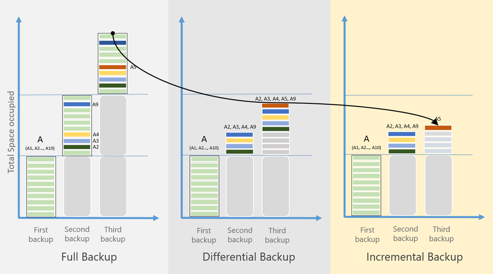

# Overview of the features in Azure Backup
Azure Backup is the Azure-based service you can use to back up (or protect) and restore your data in the Microsoft cloud. Azure Backup replaces your existing on-premises or off-site backup solution with a cloud-based solution that is reliable, secure, and cost-competitive. Azure Backup offers multiple components that you download and deploy on the appropriate computer, server, or in the cloud. The component, or agent, that you deploy depends on what you want to protect. All Azure Backup components (no matter whether you're protecting data on-premises or in the cloud) can be used to back up data to a Recovery Services vault in Azure. See the [Azure Backup components table](backup-introduction-to-azure-backup.md#which-azure-backup-components-should-i-use) (later in this article) for information about which component to use to protect specific data, applications, or workloads.

[Watch a video overview of Azure Backup](https://azure.microsoft.com/documentation/videos/what-is-azure-backup/)

## Why use Azure Backup?
Traditional backup solutions have evolved to treat the cloud as an endpoint, or static storage destination, similar to disks or tape. While this approach is simple, it is limited and doesn't take full advantage of an underlying cloud platform, which translates to an expensive, inefficient solution. Other solutions are expensive because you end up paying for the wrong type of storage, or storage that you don't need. Other solutions are often inefficient because they don't offer you the type or amount of storage you need, or administrative tasks require too much time. In contrast, Azure Backup delivers these key benefits:

**Automatic storage management** - Hybrid environments often require heterogeneous storage - some on-premises and some in the cloud. With Azure Backup, there is no cost for using on-premises storage devices. Azure Backup automatically allocates and manages backup storage, and it uses a pay-as-you-use model. Pay-as-you-use means that you only pay for the storage that you consume. For more information, see the [Azure pricing article](https://azure.microsoft.com/pricing/details/backup).

**Unlimited scaling** - Azure Backup uses the underlying power and unlimited scale of the Azure cloud to deliver high-availability - with no maintenance or monitoring overhead. You can set up alerts to provide information about events, but you don't need to worry about high-availability for your data in the cloud.

**Multiple storage options** - An aspect of high-availability is storage replication. Azure Backup offers two types of replication: [locally redundant storage](../storage/storage-redundancy.md#locally-redundant-storage) and [geo-redundant storage](../storage/storage-redundancy.md#geo-redundant-storage). Choose the backup storage option based on need:

* Locally redundant storage (LRS) replicates your data three times (it creates three copies of your data) in a paired datacenter in the same region. LRS is a low-cost option for protecting your data from local hardware failures.

* Geo-redundant storage (GRS) replicates your data to a secondary region (hundreds of miles away from the primary location of the source data). GRS costs more than LRS, but GRS provides a higher level of durability for your data, even if there is a regional outage.

**Unlimited data transfer** - Azure Backup does not limit the amount of inbound or outbound data you transfer. Azure Backup also does not charge for the data that is transferred. However, if you use the Azure Import/Export service to import large amounts of data, there is a cost associated with inbound data. For more information about this cost, see [Offline-backup workflow in Azure Backup](backup-azure-backup-import-export.md). Outbound data refers to data transferred from a Recovery Services vault during a restore operation.

**Data encryption** - Data encryption allows for secure transmission and storage of your data in the public cloud. You store the encryption passphrase locally, and it is never transmitted or stored in Azure. If it is necessary to restore any of the data, only you have encryption passphrase, or key.

**Application-consistent backup** - Whether backing up a file server, virtual machine, or SQL database, you need to know that a recovery point has all required data to restore the backup copy. Azure Backup provides application-consistent backups, which ensured additional fixes are not needed to restore the data. Restoring application consistent data reduces the restoration time, allowing you to quickly return to a running state.

**Long-term retention** - Instead of switching backup copies from disk to tape and moving the tape to an off-site location, you can use Azure for short-term and long-term retention. Azure doesn't limit the length of time data remains in a Backup or Recovery Services vault. You can keep data in a vault for as long as you like. Azure Backup has a limit of 9999 recovery points per protected instance. See the [Backup and retention](backup-introduction-to-azure-backup.md#backup-and-retention) section in this article for an explanation of how this limit may impact your backup needs.  

## Which Azure Backup components should I use?
If you aren't sure which Azure Backup component works for your needs, see the following table for information about what you can protect with each component. The Azure portal provides a wizard, which is built into the portal, to guide you through choosing the component to download and deploy. The wizard, which is part of the Recovery Services vault creation, leads you through the steps for selecting a backup goal, and choosing the data or application to protect.

| Component | Benefits | Limits | What is protected? | Where are backups stored? |
| --- | --- | --- | --- | --- |
| Azure Backup (MARS) agent |<li>Back up files and folders on physical or virtual Windows OS (VMs can be on-premises or in Azure)<li>No separate backup server required. |<li>Backup 3x per day <li>Not application aware; file, folder, and volume-level restore only, <li>  No support for Linux. |<li>Files, <li>Folders |Recovery Services vault |
| System Center DPM |<li>Application-aware snapshots (VSS)<li>Full flexibility for when to take backups<li>Recovery granularity (all)<li>Can use Recovery Services vault<li>Linux support on Hyper-V and VMware VMs <li>Back up and restore VMware VMs using DPM 2012 R2 |Cannot back up Oracle workload.|<li>Files, <li>Folders,<li> Volumes, <li>VMs,<li> Applications,<li> Workloads |<li>Recovery Services vault,<li> Locally attached disk,<li>  Tape (on-premises only) |
| Azure Backup Server |<li>App aware snapshots (VSS)<li>Full flexibility for when to take backups<li>Recovery granularity (all)<li>Can use Recovery Services vault<li>Linux support on Hyper-V and VMware VMs<li>Back up and restore VMware VMs <li>Does not require a System Center license |<li>Cannot back up Oracle workload.<li>Always requires live Azure subscription<li>No support for tape backup |<li>Files, <li>Folders,<li> Volumes, <li>VMs,<li> Applications,<li> Workloads |<li>Recovery Services vault,<li> Locally attached disk |
| Azure IaaS VM Backup |<li>Native backups for Windows/Linux<li>No specific agent installation required<li>Fabric-level backup with no backup infrastructure needed |<li>Back up VMs once-a-day <li>Restore VMs only at disk level<li>Cannot back up on-premises |<li>VMs, <li>All disks (using PowerShell) |
Recovery Services vault
 |

## What are the deployment scenarios for each component?
| Component | Can be deployed in Azure? | Can be deployed on-premises? | Target storage supported |
| --- | --- | --- | --- |
| Azure Backup (MARS) agent |
**Yes**
 
The Azure Backup agent can be deployed on any Windows Server VM that runs in Azure.
 |
**Yes**
 
The Backup agent can be deployed on any Windows Server VM or physical machine.
 |
Recovery Services vault
 |
| System Center DPM |
**Yes**

Learn more about [how to protect workloads in Azure by using System Center DPM](backup-azure-dpm-introduction.md).
 |
**Yes**
 
Learn more about [how to protect workloads and VMs in your datacenter](https://technet.microsoft.com/system-center-docs/dpm/data-protection-manager).
 |
Locally attached disk,
 
Recovery Services vault,
 
tape (on-premises only)
 |
| Azure Backup Server |
**Yes**

Learn more about [how to protect workloads in Azure by using Azure Backup Server](backup-azure-microsoft-azure-backup.md).
 |
**Yes**
 
Learn more about [how to protect workloads in Azure by using Azure Backup Server](backup-azure-microsoft-azure-backup.md).
 |
Locally attached disk,
 
Recovery Services vault
 |
| Azure IaaS VM Backup |
**Yes**

Part of Azure fabric

Specialized for [backup of Azure infrastructure as a service (IaaS) virtual machines](backup-azure-vms-introduction.md).
 |
**No**
 
Use System Center DPM to back up virtual machines in your datacenter.
 |
Recovery Services vault
 |

## Which applications and workloads can be backed up?
The following table provides a matrix of the data and workloads that can be protected using Azure Backup. The Azure Backup solution column has links to the deployment documentation for that solution. Each Azure Backup component can be deployed in a Classic (Service Manager-deployment) or Resource Manager-deployment model environment.

[!INCLUDE [learn-about-deployment-models](../../includes/learn-about-deployment-models-include.md)]

| Data or Workload | Source environment | Azure Backup solution |
| --- | --- | --- |
| Files and folders |Windows Server |
[Azure Backup agent](backup-configure-vault.md),
 
[System Center DPM](backup-azure-dpm-introduction.md) (+ the Azure Backup agent),
 
[Azure Backup Server](backup-azure-microsoft-azure-backup.md) (includes the Azure Backup agent)
 |
| Files and folders |Windows computer |
[Azure Backup agent](backup-configure-vault.md),
 
[System Center DPM](backup-azure-dpm-introduction.md) (+ the Azure Backup agent),
 
[Azure Backup Server](backup-azure-microsoft-azure-backup.md) (includes the Azure Backup agent)
 |
| Hyper-V virtual machine (Windows) |Windows Server |
[System Center DPM](backup-azure-backup-sql.md) (+ the Azure Backup agent),
 
[Azure Backup Server](backup-azure-microsoft-azure-backup.md) (includes the Azure Backup agent)
 |
| Hyper-V virtual machine (Linux) |Windows Server |
[System Center DPM](backup-azure-backup-sql.md) (+ the Azure Backup agent),
 
[Azure Backup Server](backup-azure-microsoft-azure-backup.md) (includes the Azure Backup agent)
 |
| Microsoft SQL Server |Windows Server |
[System Center DPM](backup-azure-backup-sql.md) (+ the Azure Backup agent),
 
[Azure Backup Server](backup-azure-microsoft-azure-backup.md) (includes the Azure Backup agent)
 |
| Microsoft SharePoint |Windows Server |
[System Center DPM](backup-azure-backup-sql.md) (+ the Azure Backup agent),
 
[Azure Backup Server](backup-azure-microsoft-azure-backup.md) (includes the Azure Backup agent)
 |
| Microsoft Exchange |Windows Server |
[System Center DPM](backup-azure-backup-sql.md) (+ the Azure Backup agent),
 
[Azure Backup Server](backup-azure-microsoft-azure-backup.md) (includes the Azure Backup agent)
 |
| Azure IaaS VMs (Windows) |running in Azure |[Azure Backup (VM extension)](backup-azure-vms-introduction.md) |
| Azure IaaS VMs (Linux) |running in Azure |[Azure Backup (VM extension)](backup-azure-vms-introduction.md) |

## Linux support
The following table shows the Azure Backup components that have support for Linux.  

| Component | Linux (Azure endorsed) Support |
| --- | --- |
| Azure Backup (MARS) agent |No (Only Windows based agent) |
| System Center DPM |<li> File-consistent backup of Linux Guest VMs on Hyper-V and VMWare  <li> VM restore of Hyper-V and VMWare Linux Guest VMs      *File-consistent backup not available for Azure VM*   |
| Azure Backup Server |<li>File-consistent backup of Linux Guest VMs on Hyper-V and VMWare  <li> VM restore of Hyper-V and VMWare Linux Guest VMs    *File-consistent backup not available for Azure VM*  |
| Azure IaaS VM Backup |Application-consistent backup using [pre-script and post-script framework](backup-azure-linux-app-consistent.md)  [Granular file recovery](backup-azure-restore-files-from-vm.md)  [Restore all VM disks](backup-azure-arm-restore-vms.md#restore-backed-up-disks)  [VM restore](backup-azure-arm-restore-vms.md#create-a-new-vm-from-restore-point) |

## Using Premium Storage VMs with Azure Backup
Azure Backup protects Premium Storage VMs. Azure Premium Storage is solid-state drive (SSD)-based storage designed to support I/O-intensive workloads. Premium Storage is attractive for virtual machine (VM) workloads. For more information about Premium Storage, see the article, [Premium Storage: High-Performance Storage for Azure Virtual Machine Workloads](../storage/storage-premium-storage.md).

### Back up Premium Storage VMs
While backing up Premium Storage VMs, the Backup service creates a temporary staging location, named "AzureBackup-", in the Premium Storage account. The size of the staging location is equal to the size of the recovery point snapshot. Be sure the Premium Storage account has adequate free space to accommodate the temporary staging location. For more information, see the article, [premium storage limitations](../storage/storage-premium-storage.md#scalability-and-performance-targets). Once the backup job finishes, the staging location is deleted. The price of storage used for the staging location is consistent with all [Premium storage pricing](../storage/storage-premium-storage.md#pricing-and-billing).

> [!NOTE]
> Do not modify or edit the staging location.
>
>

### Restore Premium Storage VMs
Premium Storage VMs can be restored to either Premium Storage or to normal storage. Restoring a Premium Storage VM recovery point back to Premium Storage is the typical process of restoration. However, it can be cost effective to restore a Premium Storage VM recovery point to standard storage. This type of restoration can be used if you need a subset of files from the VM.

## Using managed disk VMs with Azure Backup
Azure Backup protects managed disk VMs. Managed disks free you from managing storage accounts of virtual machines and greatly simplify VM provisioning.

### Back up managed disk VMs
Backing up VMs on managed disks is no different than backing up Resource Manager VMs. In the Azure portal, you can configure the backup job directly from the Virtual Machine view or from the Recovery Services vault view. You can back up VMs on managed disks through RestorePoint collections built on top of managed disks. Azure Backup also supports backing up managed disk VMs encrypted using Azure Disk encryption(ADE).

### Restore managed disk VMs
Azure Backup allows you to restore a complete VM with managed disks, or restore managed disks to a storage account. Azure manages the managed disks during the restore process. You (the customer) manage the storage account created as part of the restore process. When restoring managed encrypted VMs, the VM's keys and secrets should exist in the key vault prior to starting the restore operation.

## What are the features of each Backup component?
The following sections provide tables that summarize the availability or support of various features in each Azure Backup component. See the information following each table for additional support or details.

### Storage
| Feature | Azure Backup agent | System Center DPM | Azure Backup Server | Azure IaaS VM Backup |
| --- | --- | --- | --- | --- |
| Recovery Services vault |![Yes][green] |![Yes][green] |![Yes][green] |![Yes][green] |
| Disk storage | |![Yes][green] |![Yes][green] | |
| Tape storage | |![Yes][green] | | |
| Compression  (in Recovery Services vault) |![Yes][green] |![Yes][green] |![Yes][green] | |
| Incremental backup |![Yes][green] |![Yes][green] |![Yes][green] |![Yes][green] |
| Disk deduplication | |![Partially][yellow] |![Partially][yellow] | | |

The Recovery Services vault is the preferred storage target across all components. System Center DPM and Azure Backup Server also provide the option to have a local disk copy. However, only System Center DPM provides the option to write data to a tape storage device.

#### Compression
Backups are compressed to reduce the required storage space. The only component that does not use compression is the VM extension. The VM extension copies all backup data from your storage account to the Recovery Services vault in the same region. No compression is used when transferring the data. Transferring the data without compression slightly inflates the storage used. However, storing the data without compression allows for faster restoration, should you need that recovery point.

#### Disk Deduplication
You can take advantage of deduplication when you deploy System Center DPM or Azure Backup Server [on a Hyper-V virtual machine](http://blogs.technet.com/b/dpm/archive/2015/01/06/deduplication-of-dpm-storage-reduce-dpm-storage-consumption.aspx). Windows Server performs data deduplication (at the host level) on virtual hard disks (VHDs) that are attached to the virtual machine as backup storage.

> [!NOTE]
> Deduplication is not available in Azure for any Backup component. When System Center DPM and Backup Server are deployed in Azure, the storage disks attached to the VM cannot be deduplicated.
>
>

### Incremental backup explained
Every Azure Backup component supports incremental backup regardless of the target storage (disk, tape, Recovery Services vault). Incremental backup ensures that backups are storage and time efficient, by transferring only those changes made since the last backup.

#### Comparing Full, Differential and Incremental backup

Storage consumption, recovery time objective (RTO), and network consumption varies for each type of backup method. To keep the backup total cost of ownership (TCO) down, you need to understand how to choose the best backup solution. The following image compares Full Backup, Differential Backup, and Incremental Backup. In the image, data source A is composed of 10 storage blocks A1-A10, which are backed up monthly. Blocks A2, A3, A4, and A9 change in the first month, and block A5 changes in the next month.

With **Full Backup**, each backup copy contains the entire data source. Full backup consumes a large amount of network bandwidth and storage, each time a backup copy is transferred.

**Differential backup** stores only the blocks that changed since the initial full backup, which results in a smaller amount of network and storage consumption. Differential backups don't retain redundant copies of unchanged data. However, because the data blocks that remain unchanged between subsequent backups are transferred and stored, differential backups are inefficient. In the second month, changed blocks A2, A3, A4, and A9 are backed up. In the third month, these same blocks are backed up again, along with changed block A5. The changed blocks continue to be backed up until the next full backup happens.

**Incremental Backup** achieves high storage and network efficiency by storing only the blocks of data that changed since the previous backup. With incremental backup, there is no need to take regular full backups. In the example, after the full backup is taken for the first month, changed blocks A2, A3, A4, and A9 are marked as changed and transferred for the second month. In the third month, only changed block A5 is marked and transferred. Moving less data saves storage and network resources, which decreases TCO.   

### Security
| Feature | Azure Backup agent | System Center DPM | Azure Backup Server | Azure IaaS VM Backup |
| --- | --- | --- | --- | --- |
| Network security  (to Azure) |![Yes][green] |![Yes][green] |![Yes][green] |![Partially][yellow] |
| Data security  (in Azure) |![Yes][green] |![Yes][green] |![Yes][green] |![Partially][yellow] |

#### Network security
All backup traffic from your servers to the Recovery Services vault is encrypted using Advanced Encryption Standard 256. The backup data is sent over a secure HTTPS link. The backup data is also stored in the Recovery Services vault in encrypted form. Only you, the Azure customer, have the passphrase to unlock this data. Microsoft cannot decrypt the backup data at any point.

> [!WARNING]
> Once you establish the Recovery Services vault, only you have access to the encryption key. Microsoft never maintains a copy of your encryption key, and does not have access to the key. If the key is misplaced, Microsoft cannot recover the backup data.
>
>

#### Data security
Backing up Azure VMs requires setting up encryption *within* the virtual machine. Use BitLocker on Windows virtual machines and **dm-crypt** on Linux virtual machines. Azure Backup does not automatically encrypt backup data that comes through this path.

### Network
| Feature | Azure Backup agent | System Center DPM | Azure Backup Server | Azure IaaS VM Backup |
| --- | --- | --- | --- | --- |
| Network compression  (to **backup server**) | |![Yes][green] |![Yes][green] | |
| Network compression  (to **Recovery Services vault**) |![Yes][green] |![Yes][green] |![Yes][green] | |
| Network protocol  (to **backup server**) | |TCP |TCP | |
| Network protocol  (to **Recovery Services vault**) |HTTPS |HTTPS |HTTPS |HTTPS |

The VM extension (on the IaaS VM) reads the data directly from the Azure storage account over the storage network, so it is not necessary to compress this traffic.

If you use a System Center DPM server or Azure Backup Server as a secondary backup server, compress the data going from the primary server to the backup server. Compressing data before backing it up to DPM or Azure Backup Server, saves bandwidth.

#### Network Throttling
The Azure Backup agent offers network throttling, which allows you to control how network bandwidth is used during data transfer. Throttling can be helpful if you need to back up data during work hours but do not want the backup process to interfere with other internet traffic. Throttling for data transfer applies to back up and restore activities.

## Backup and retention

Azure Backup has a limit of 9999 recovery points, also known as backup copies or snapshots, per *protected instance*. A protected instance is a computer, server (physical or virtual), or workload configured to back up data to Azure. For more information, see the section, [What is a protected instance](backup-introduction-to-azure-backup.md#what-is-a-protected-instance). An instance is protected once a backup copy of data has been saved. The backup copy of data is the protection. If the source data was lost or became corrupt, the backup copy could restore the source data. The following table shows the maximum backup frequency for each component. Your backup policy configuration determines how quickly you consume the recovery points. For example, if you create a recovery point each day, then you can retain recovery points for 27 years before you run out. If you take a monthly recovery point, you can retain recovery points for 833 years before you run out. The Backup service does not set an expiration time limit on a recovery point.

|  | Azure Backup agent | System Center DPM | Azure Backup Server | Azure IaaS VM Backup |
| --- | --- | --- | --- | --- |
| Backup frequency  (to Recovery Services vault) |Three backups per day |Two backups per day |Two backups per day |One backup per day |
| Backup frequency  (to disk) |Not applicable |<li>Every 15 minutes for SQL Server <li>Every hour for other workloads |<li>Every 15 minutes for SQL Server <li>Every hour for other workloads
 |Not applicable |
| Retention options |Daily, weekly, monthly, yearly |Daily, weekly, monthly, yearly |Daily, weekly, monthly, yearly |Daily, weekly, monthly, yearly |
| Maximum recovery points per protected instance |9999|9999|9999|9999|
| Maximum retention period |Depends on backup frequency |Depends on backup frequency |Depends on backup frequency |Depends on backup frequency |
| Recovery points on local disk |Not applicable |<li>64 for File Servers,<li>448 for Application Servers |<li>64 for File Servers,<li>448 for Application Servers |Not applicable |
| Recovery points on tape |Not applicable |Unlimited |Not applicable |Not applicable |

## What is a protected instance
A protected instance is a generic reference to a Windows computer, a server (physical or virtual), or SQL database that has been configured to back up to Azure. An instance is protected once you configure a backup policy for the computer, server, or database, and create a backup copy of the data. Subsequent copies of the backup data for that protected instance (which are called recovery points), increase the amount of storage consumed. You can create up to 9999 recovery points for a protected instance. If you delete a recovery point from storage, it does not count against the 9999 recovery point total.
Some common examples of protected instances are virtual machines, application servers, databases, and personal computers running the Windows operating system. For example:

* A virtual machine running the Hyper-V or Azure IaaS hypervisor fabric. The guest operating systems for the virtual machine can be Windows Server or Linux.
* An application server: The application server can be a physical or virtual machine running Windows Server and workloads with data that needs to be backed up. Common workloads are Microsoft SQL Server, Microsoft Exchange server, Microsoft SharePoint server, and the File Server role on Windows Server. To back up these workloads you need System Center Data Protection Manager (DPM) or Azure Backup Server.
* A personal computer, workstation, or laptop running the Windows operating system.

## What is a Recovery Services vault?
A Recovery Services vault is an online storage entity in Azure used to hold data such as backup copies, recovery points, and backup policies. You can use Recovery Services vaults to hold backup data for Azure services and on-premises servers and workstations. Recovery Services vaults make it easy to organize your backup data, while minimizing management overhead. You can create as many Recovery Services vaults as you like, within a subscription.

Backup vaults, which are based on Azure Service Manager, were the first version of the vault. Recovery Services vaults, which add the Azure Resource Manager model features, are the second version of the vault. See the [Recovery Services vault overview article](backup-azure-recovery-services-vault-overview.md) for a full description of the feature differences. You can no longer create Backup vaults in the Azure portal, but Backup vaults are still supported.

> [!IMPORTANT]
> You can now upgrade your Backup vaults to Recovery Services vaults. For details, see the article [Upgrade a Backup vault to a Recovery Services vault](backup-azure-upgrade-backup-to-recovery-services.md). Microsoft encourages you to upgrade your Backup vaults to Recovery Services vaults.  **Starting November 1, 2017**:
>- Any remaining Backup vaults will be automatically upgraded to Recovery Services vaults.
>- You won't be able to access your backup data in the classic portal. Instead, use the Azure portal to access your backup data in Recovery Services vaults.
>

## How does Azure Backup differ from Azure Site Recovery?
Azure Backup and Azure Site Recovery are related in that both services back up data and can restore that data. However, these services serve different purposes in providing business continuity and disaster recovery in your business. Use Azure Backup to protect and restore data at a more granular level. For example, if a presentation on a laptop became corrupted, you would use Azure Backup to restore the presentation. If you wanted to replicate the configuration and data on a VM across another datacenter, use Azure Site Recovery.

Azure Backup protects data on-premises and in the cloud. Azure Site Recovery coordinates virtual-machine and physical-server replication, failover, and failback. Both services are important because your disaster recovery solution needs to keep your data safe and recoverable (Backup) *and* keep your workloads available (Site Recovery) when outages occur.

The following concepts can help you make important decisions around backup and disaster recovery.

| Concept | Details | Backup | Disaster recovery (DR) |
| --- | --- | --- | --- |
| Recovery point objective (RPO) |The amount of acceptable data loss if a recovery needs to be done. |Backup solutions have wide variability in their acceptable RPO. Virtual machine backups usually have an RPO of one day, while database backups have RPOs as low as 15 minutes. |Disaster recovery solutions have low RPOs. The DR copy can be behind by a few seconds or a few minutes. |
| Recovery time objective (RTO) |The amount of time that it takes to complete a recovery or restore. |Because of the larger RPO, the amount of data that a backup solution needs to process is typically much higher, which leads to longer RTOs. For example, it can take days to restore data from tapes, depending on the time it takes to transport the tape from an off-site location. |Disaster recovery solutions have smaller RTOs because they are more in sync with the source. Fewer changes need to be processed. |
| Retention |How long data needs to be stored |For scenarios that require operational recovery (data corruption, inadvertent file deletion, OS failure), backup data is typically retained for 30 days or less. From a compliance standpoint, data might need to be stored for months or even years. Backup data is ideally suited for archiving in such cases. |Disaster recovery needs only operational recovery data, which typically takes a few hours or up to a day. Because of the fine-grained data capture used in DR solutions, using DR data for long-term retention is not recommended. |

## Next steps
Use one of the following tutorials for detailed, step-by-step, instructions for protecting data on Windows Server, or protecting a virtual machine (VM) in Azure:

* [Back up Files and Folders](backup-try-azure-backup-in-10-mins.md)
* [Backup Azure Virtual Machines](backup-azure-vms-first-look-arm.md)

For details about protecting other workloads, try one of these articles:

* [Back up your Windows Server](backup-configure-vault.md)
* [Back up application workloads](backup-azure-microsoft-azure-backup.md)
* [Backup Azure IaaS VMs](backup-azure-vms-prepare.md)

[green]: ./media/backup-introduction-to-azure-backup/green.png
[yellow]: ./media/backup-introduction-to-azure-backup/yellow.png
[red]: ./media/backup-introduction-to-azure-backup/red.png
