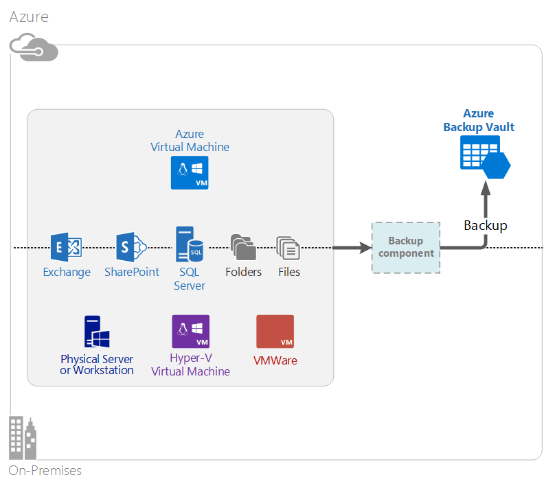

<properties
	pageTitle="What is Azure Backup? | Microsoft Azure"
	description="By using Azure Backup and Recovery Services, you can back up and restore data and applications from Windows Servers, Windows client machines, System Center DPM servers and Azure virtual machines."
	services="backup"
	documentationCenter=""
	authors="Jim-Parker"
	manager="jwhit"
	editor="tysonn"
	keywords="backup and restore; recovery services; backup solutions"/>

<tags
	ms.service="backup"
	ms.workload="storage-backup-recovery"
	ms.tgt_pltfrm="na"
	ms.devlang="na"
	ms.topic="get-started-article"
	ms.date="07/21/2016"
	ms.author="jimpark; trinadhk"/>

# What is Azure Backup?
Azure Backup is the service that you use to back up and restore your data in the Microsoft cloud. It replaces your existing on-premises or off-site backup solution with a cloud-based solution that is reliable, secure, and cost-competitive. It also helps protect assets that run in the cloud. Azure Backup provides recovery services built on a world-class infrastructure that is scalable, durable, and highly available.

[Watch a video overview of Azure Backup](https://azure.microsoft.com/documentation/videos/what-is-azure-backup/)

## Why use Azure Backup?
Traditional backup solutions have evolved to treat the cloud as an endpoint similar to disks or tape. While this approach is simple, it is also limited. It does not take full advantage of an underlying cloud platform and translates to an inefficient, expensive solution.
In contrast, Azure Backup delivers all the advantages of a powerful and affordable cloud backup solution. Here are some of the key benefits that Azure Backup provides.

| Feature | Benefit |
| ------- | ------- |
| Automatic storage management | No capital expenditure is needed for on-premises storage devices. Azure Backup automatically allocates and manages backup storage, and it uses a pay-as-you-use consumption model. |
| Unlimited scaling | Take advantage of high availability guarantees without the overhead of maintenance and monitoring. Azure Backup uses the underlying power and scale of the Azure cloud, with its nonintrusive autoscaling capabilities. |
| Multiple storage options | Choose your backup storage based on need:<li>A locally redundant storage block blob is ideal for price-conscious customers, and it still helps protect data against local hardware failures. <li>A geo-replication storage block blob provides three more copies in a paired datacenter. These extra copies help ensure that your backup data is highly available even if an Azure site-level disaster occurs. |
| Unlimited data transfer | There is no charge for any egress (outbound) data transfer during a restore operation from the Backup vault. Data inbound to Azure is also free. Works with the import service where it is available. |
| Data encryption | Data encryption allows for secure transmission and storage of customer data in the public cloud. The encryption passphrase is stored at the source, and it is never transmitted or stored in Azure. The encryption key is required to restore any of the data, and only the customer has full access to the data in the service. |  
| Application-consistent backup | Application-consistent backups on Windows help ensure that fixes are not needed at the time of restore, which reduces the recovery time objective. This allows customers to return to a running state more quickly. |
| Long-term retention | Rather than pay for off-site tape backup solutions, customers can back up to Azure, which provides a compelling tape-like solution at a low cost. |

## Azure Backup components
Because Backup is a hybrid backup solution, it consists of multiple components that work together to enable end-to-end backup and restore workflows.

### Deployment scenarios

| Component | Can be deployed in Azure? | Can be deployed on-premises? | Target storage supported|
| --- | --- | --- | --- |
| Azure Backup agent | 
**Yes**
 
The Azure Backup agent can be deployed on any Windows Server VM that runs in Azure.
 | 
**Yes**
 
The Backup agent can be deployed on any Windows Server VM or physical machine.
 | 
Azure Backup vault
 |
| System Center Data Protection Manager (DPM) | 
**Yes**

Learn more about [how to protect workloads in Azure by using System Center DPM](http://blogs.technet.com/b/dpm/archive/2014/09/02/azure-iaas-workload-protection-using-data-protection-manager.aspx).
 | 
**Yes**
 
Learn more about [how to protect workloads and VMs in your datacenter](https://technet.microsoft.com/library/hh758173.aspx).
 | 
Locally attached disk,
 
Azure Backup vault,
 
tape (on-premises only)
 |
| Azure Backup Server | 
**Yes**

Learn more about [how to protect workloads in Azure by using Azure Backup Server](backup-azure-microsoft-azure-backup.md).
 | 
**Yes**
 
Learn more about [how to protect workloads in Azure by using Azure Backup Server](backup-azure-microsoft-azure-backup.md).
 | 
Locally attached disk,
 
Azure Backup vault
 |
| Azure Backup (VM extension) | 
**Yes**

Part of Azure fabric

Specialized for [backup of Azure infrastructure as a service (IaaS) virtual machines](backup-azure-vms-introduction.md).
 | 
**No**
 
Use System Center DPM to back up virtual machines in your datacenter.
 | 
Azure Backup vault
 |

### Component level benefits and limitations

| Component | Benefits | Limitations | Recovery granularity |
| --- | --- | --- | --- |
| Azure Backup (MARS) agent | <li>Can backup files and folders on a Windows OS machine, be it physical or virtual (VMs can be anywhere on-premises or Azure)<li>No separate backup server required<li>Uses Azure Backup Vault | <li>Three times a day backup/file level restore<li>File/folder/volume level restore only, not application aware<li>No support for Linux | files/folders/volumes |
| System Center Data Protection Manager | <li>App aware snapshots (VSS)<li>Full flexibility for when to take backups<li>Recovery granularity (all)<li>Can use Azure Backup vault<li>Linux support (if hosted on Hyper-V) | <li>Lack of heterogeneous support (VMware VM back up, Oracle workload back up).  | files/folders/volumes /VMs/applications |
| Microsoft Azure Backup Server | <li>App aware snapshots (VSS)<li>Full flexibility for when to take backups<li>Recovery granularity (all)<li>Can use Azure Backup vault<li>Linux support (if hosted on Hyper-V)<li>Does not require a System Center license | <li>Lack of heterogeneous support (VMware VM back up, Oracle workload back up).<li>Always requires live Azure subscription<li>No support for tape backup | files/folders/volumes /VMs/applications |
| Azure IaaS VM Backup | <li>Native backups for Windows/Linux<li>No specific agent installation required<li>Fabric level backup with no backup infrastructure needed | <li>Once a day back up/disk level restore<li>Cannot back up on-premises | VMs All disks(using PowerShell) |

## Which applications and workloads can be backed up?

| Workload | Source machine | Azure Backup solution |
| --- | --- |---|
| Files and folders | Windows Server | 
[Azure Backup agent](backup-configure-vault.md),
 
[System Center DPM](backup-azure-dpm-introduction.md) (+ the Azure Backup agent),
 
[Azure Backup Server](backup-azure-microsoft-azure-backup.md) (includes the Azure Backup agent)
  |
| Files and folders | Windows client | 
[Azure Backup agent](backup-configure-vault.md),
 
[System Center DPM](backup-azure-dpm-introduction.md) (+ the Azure Backup agent),
 
[Azure Backup Server](backup-azure-microsoft-azure-backup.md) (includes the Azure Backup agent)
  |
| Hyper-V virtual machine (Windows) | Windows Server | 
[System Center DPM](backup-azure-backup-sql.md) (+ the Azure Backup agent),
 
[Azure Backup Server](backup-azure-microsoft-azure-backup.md) (includes the Azure Backup agent)
 |
| Hyper-V virtual machine (Linux) | Windows Server | 
[System Center DPM](backup-azure-backup-sql.md) (+ the Azure Backup agent),
 
[Azure Backup Server](backup-azure-microsoft-azure-backup.md) (includes the Azure Backup agent)
  |
| Microsoft SQL Server | Windows Server | 
[System Center DPM](backup-azure-backup-sql.md) (+ the Azure Backup agent),
 
[Azure Backup Server](backup-azure-microsoft-azure-backup.md) (includes the Azure Backup agent)
  |
| Microsoft SharePoint | Windows Server | 
[System Center DPM](backup-azure-backup-sql.md) (+ the Azure Backup agent),
 
[Azure Backup Server](backup-azure-microsoft-azure-backup.md) (includes the Azure Backup agent)
   |
| Microsoft Exchange |  Windows Server | 
[System Center DPM](backup-azure-backup-sql.md) (+ the Azure Backup agent),
 
[Azure Backup Server](backup-azure-microsoft-azure-backup.md) (includes the Azure Backup agent)
   |
| Azure IaaS VMs (Windows) | - | [Azure Backup (VM extension)](backup-azure-vms-introduction.md) |
| Azure IaaS VMs (Linux) | - | [Azure Backup (VM extension)](backup-azure-vms-introduction.md) |

## ARM and Linux support

| Component | ARM Support | Linux (Azure endorsed) Support |
| --- | --- | --- |
| Azure Backup (MARS) agent | Yes | No (Only Windows based agent) |
| System Center Data Protection Manager | Yes (Agent in guest) | Only Hyper-V (Not Azure VM) Only file-consistent backup is possible |
| Azure Backup Server (MABS) | Yes (Agent in guest) | Only Hyper-V (Not Azure VM) Only file-consistent backup is possible (Same as DPM) |
| Azure IaaS VM Backup | Yes | Yes |

[AZURE.INCLUDE [learn-about-deployment-models](../../includes/learn-about-deployment-models-include.md)]

## Back up and Restore Premium Storage VMs

The Azure Backup service now protects Premium Storage VMs.

### Back up Premium Storage VMs

While backing up Premium Storage VMs, the Backup service creates a temporary staging location in the Premium Storage account. The staging location, named "AzureBackup-", is equal to the total data size of the premium disks attached to the VM.

>[AZURE.NOTE] Do not modify or edit the staging location.

Once the backup job finishes, the staging location is deleted. The price of storage used for the staging location is consistent with all [Premium storage pricing](../storage/storage-premium-storage.md#pricing-and-billing).

### Restore Premium Storage VMs

Premium Storage VM can be restored to either Premium Storage or to normal storage. Restoring a Premium Storage VM recovery point back to Premium Storage is the typical process of restoration. However, it can be cost effective to restore a Premium Storage VM recovery point to standard storage. This type of restoration can be used if you need a subset of files from the VM.

## Functionality
These five tables summarize how backup functionality is handled in each component.

### Storage

| Feature | Azure Backup agent | System Center DPM | Azure Backup Server | Azure Backup (VM extension) |
| ------- | --- | --- | --- | ---- |
| Azure Backup vault | ![Yes][green] | ![Yes][green] | ![Yes][green] | ![Yes][green] |
| Disk storage | | ![Yes][green] | ![Yes][green] |  |
| Tape storage | | ![Yes][green] |  | |
| Compression (in backup vault) | ![Yes][green] | ![Yes][green]| ![Yes][green] | |
| Incremental backup | ![Yes][green] | ![Yes][green] | ![Yes][green] | ![Yes][green] |
| Disk deduplication | | ![Partially][yellow] | ![Partially][yellow]| | |

The Backup vault is the preferred storage target across all components. System Center DPM and Backup Server also provide the option to have a local disk copy. However, only System Center DPM provides the option to write data to a tape storage device.

#### Incremental backup
Every component supports incremental backup regardless of the target storage (disk, tape, backup vault). Incremental backup ensures that backups are storage and time efficient, by transferring only those changes made since the last backup.

#### Compression
Backups are compressed to reduce the required storage space. The only component that does not use compression is the VM extension. With VM extension, all backup data is copied from the customer storage account to the backup vault in the same region without compressing it. While going without compression slightly inflates the storage used, storing the data without compression allows for faster restore times.

#### Deduplication
Deduplication is supported for System Center DPM and Backup Server when it is [deployed in a Hyper-V virtual machine](http://blogs.technet.com/b/dpm/archive/2015/01/06/deduplication-of-dpm-storage-reduce-dpm-storage-consumption.aspx). Deduplication is performed at the host level by using Windows Server deduplication on virtual hard disks (VHDs) that are attached to the virtual machine as backup storage.

>[AZURE.WARNING] Deduplication is not available in Azure for any of the Backup components. When System Center DPM and Backup Server are deployed in Azure, the storage disks attached to the VM cannot be deduplicated.

### Security

| Feature | Azure Backup agent | System Center DPM | Azure Backup Server | Azure Backup (VM extension) |
| ------- | --- | --- | --- | ---- |
| Network security (to Azure) | ![Yes][green] |![Yes][green] | ![Yes][green] | ![Partially][yellow]|
| Data security (in Azure) | ![Yes][green] |![Yes][green] | ![Yes][green] | ![Partially][yellow]|

All backup traffic from your servers to the Backup vault is encrypted by using Advanced Encryption Standard 256. The data is sent over a secure HTTPS link. The backup data is also stored in the Backup vault in encrypted form. Only the customer holds the passphrase to unlock this data. Microsoft cannot decrypt the backup data at any point.

>[AZURE.WARNING] The key used to encrypt the backup data is present only with the customer. Microsoft does not maintain a copy in Azure and does not have any access to the key. If the key is misplaced, Microsoft cannot recover the backup data.

Backing up Azure VMs requires setting up encryption *within* the virtual machine. Use BitLocker on Windows virtual machines and **dm-crypt** on Linux virtual machines. Azure Backup does not automatically encrypt backup data that comes through this path.

### Supported workloads

| Feature | Azure Backup agent | System Center DPM | Azure Backup Server | Azure Backup (VM extension) |
| ------- | --- | --- | --- | ---- |
| Windows Server machine--files and folders | ![Yes][green] | ![Yes][green] | ![Yes][green] | |
| Windows client machine--files and folders | ![Yes][green] | ![Yes][green] | ![Yes][green] | |
| Hyper-V virtual machine (Windows) | | ![Yes][green] | ![Yes][green] | |
| Hyper-V virtual machine (Linux) | | ![Yes][green] | ![Yes][green] | |
| Microsoft SQL Server | | ![Yes][green] | ![Yes][green] | |
| Microsoft SharePoint | | ![Yes][green] | ![Yes][green] | |
| Microsoft Exchange  | | ![Yes][green] | ![Yes][green] | |
| Azure virtual machine (Windows) | | | | ![Yes][green] |
| Azure virtual machine (Linux) | | | | ![Yes][green] |

### Network

| Feature | Azure Backup agent | System Center DPM | Azure Backup Server | Azure Backup (VM extension) |
| ------- | --- | --- | --- | ---- |
| Network compression (to the backup server) | | ![Yes][green] | ![Yes][green] | |
| Network compression (to the backup vault) | ![Yes][green] | ![Yes][green] | ![Yes][green] | |
| Network protocol (to the backup server) | | TCP | TCP | |
| Network protocol (to the backup vault) | HTTPS | HTTPS | HTTPS | HTTPS |

Because the VM extension reads the data directly from the Azure storage account over the storage network, it is not necessary to optimize this traffic. The traffic is over the local storage network in the Azure datacenter, so there is little need for compression because of bandwidth considerations.

If you are backing up your data to a backup server (DPM or Backup Server), traffic from the primary server to the backup server can be compressed to save on bandwidth.

#### Network Throttling
The Azure Backup agent provides throttling capability, which allows you to control how network bandwidth is used during data transfer. Throttling can be helpful if you need to back up data during work hours but do not want the backup process to interfere with other internet traffic. Throttling for data transfer applies to back up and restore activities.

### Backup and retention

|  | Azure Backup agent | System Center DPM | Azure Backup Server | Azure Backup (VM extension) |
| --- | --- | --- | --- | --- |
| Backup frequency (to the backup vault) | Three backups per day | Two backups per day |Two backups per day | One backup per day |
| Backup frequency (to disk) | Not applicable | 
Every 15 minutes for SQL Server
 
Every hour for other workloads
 | 
Every 15 minutes for SQL Server
 
Every hour for other workloads
 |Not applicable |
| Retention options | Daily, weekly, monthly, yearly | Daily, weekly, monthly, yearly | Daily, weekly, monthly, yearly |Daily, weekly, monthly, yearly |
| Retention period | Up to 99 years | Up to 99 years | Up to 99 years | Up to 99 years |
| Recovery points in Backup vault | Unlimited | Unlimited | Unlimited | Unlimited |
| Recovery points on local disk | Not applicable | 64 for File Servers,  448 for Application Servers | 64 for File Servers,  448 for Application Servers |Not applicable |
| Recovery points on tape | Not applicable | Unlimited | Not applicable | Not applicable |

## What is the vault credential file?

The vault credentials file is a certificate generated by the portal for each backup vault. The portal then uploads the public key to the Access Control Service (ACS). The private key is provided to the user when downloading the credentials and then entered during the machine registration. The private key authenticates the machine to send backup data to an identified vault in the Azure Backup service.

The vault credential is used only during the registration workflow. It is your responsibility to ensure that the vault credentials file is not compromised. If it falls in the hands of any rogue-user, the vault credentials file can be used to register other machines against the same vault. However, since the backup data is encrypted using a passphrase belonging only to the customer, existing backup data cannot be compromised. To mitigate this concern, vault credentials are set to expire in 48 hours. While you can download the vault credentials of a backup vault any number of times, only the latest file is applicable during the registration workflow.

## How does Azure Backup differ from Azure Site Recovery?
Many customers confuse backup recovery and disaster recovery. Both capture data and provide restore semantics, but their core value propositions are different.

Azure Backup backs up data on-premises and in the cloud. Azure Site Recovery coordinates virtual-machine and physical-server replication, failover, and failback. Both services are important because your disaster recovery solution needs to keep your data safe and recoverable (Backup) *and* keep your workloads available (Site Recovery) when outages occur.

The following concepts help you make important decisions around backup and disaster recovery.

| Concept | Details | Backup | Disaster recovery (DR) |
| ------- | ------- | ------ | ----------------- |
| Recovery point objective (RPO) | The amount of acceptable data loss if a recovery needs to be done. | Backup solutions have wide variability in their acceptable RPO. Virtual machine backups usually have an RPO of one day, while database backups have RPOs as low as 15 minutes. | Disaster recovery solutions have low RPOs. The DR copy can be behind by a few seconds or a few minutes. |
| Recovery time objective (RTO) | The amount of time that it takes to complete a recovery or restore. | Because of the larger RPO, the amount of data that a backup solution needs to process is typically much higher, which leads to longer RTOs. For example, it can take days to restore data from tapes, depending on the time it takes to transport the tape from an off-site location. | Disaster recovery solutions have smaller RTOs because they are more in sync with the source. Fewer changes need to be processed. |
| Retention | How long data needs to be stored | For scenarios that require operational recovery (data corruption, inadvertent file deletion, OS failure), backup data is typically retained for 30 days or less. From a compliance standpoint, data might need to be stored for months or even years. Backup data is ideally suited for archiving in such cases. | Disaster recovery needs only operational recovery data, which typically takes a few hours or up to a day. Because of the fine-grained data capture used in DR solutions, using DR data for long-term retention is not recommended. |

## Next steps

Try out a simple Azure Backup. For instructions, see one of these tutorials:

- [Try Azure Backup](backup-try-azure-backup-in-10-mins.md)
- [Try Azure VM Backup](backup-azure-vms-first-look.md)

Because those tutorials help you back up quickly, they show you only the most direct path for backing up your data. For additional information about the type of back up you want to do, see:

- [Back up Windows machine](backup-configure-vault.md)
- [Back up application workloads](backup-azure-microsoft-azure-backup.md)
- [Backup Azure IaaS VMs](backup-azure-vms-prepare.md)

[green]: ./media/backup-introduction-to-azure-backup/green.png
[yellow]: ./media/backup-introduction-to-azure-backup/yellow.png
[red]: ./media/backup-introduction-to-azure-backup/red.png
