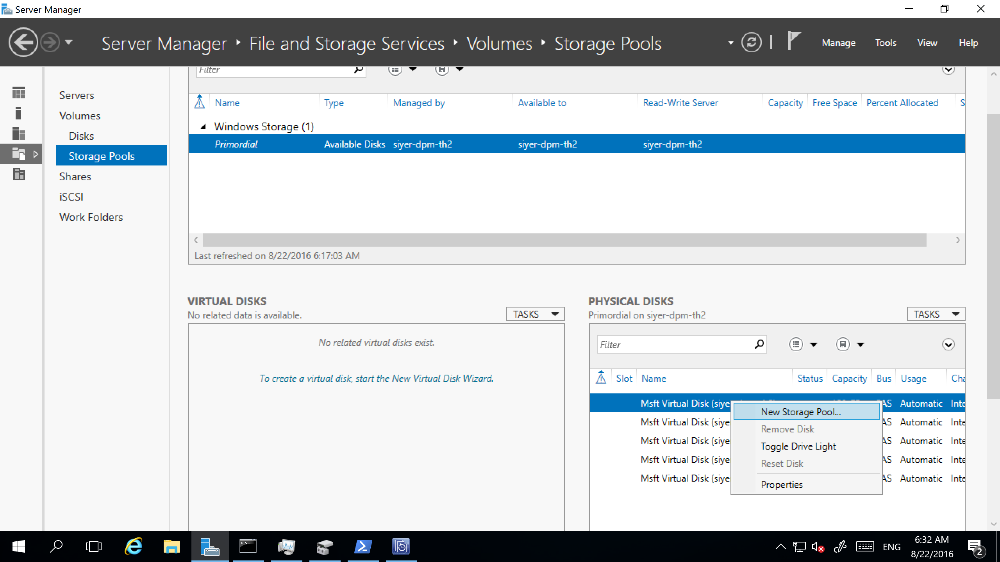
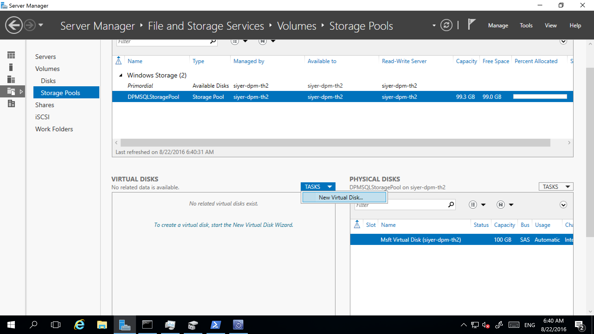
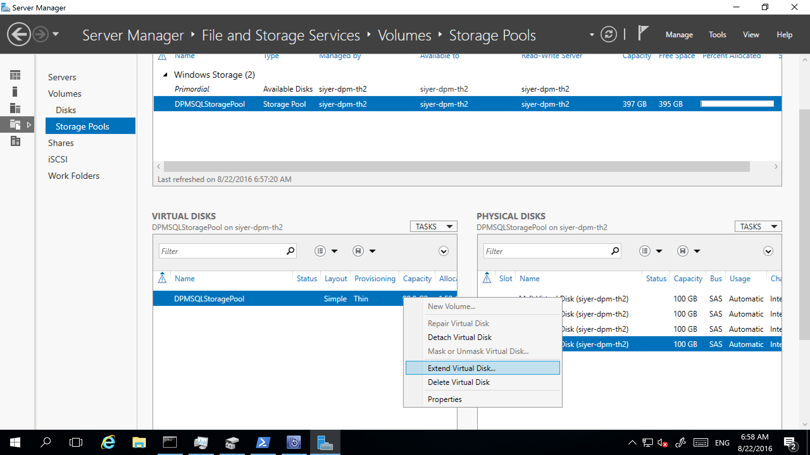
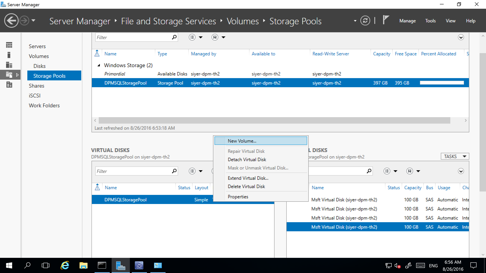
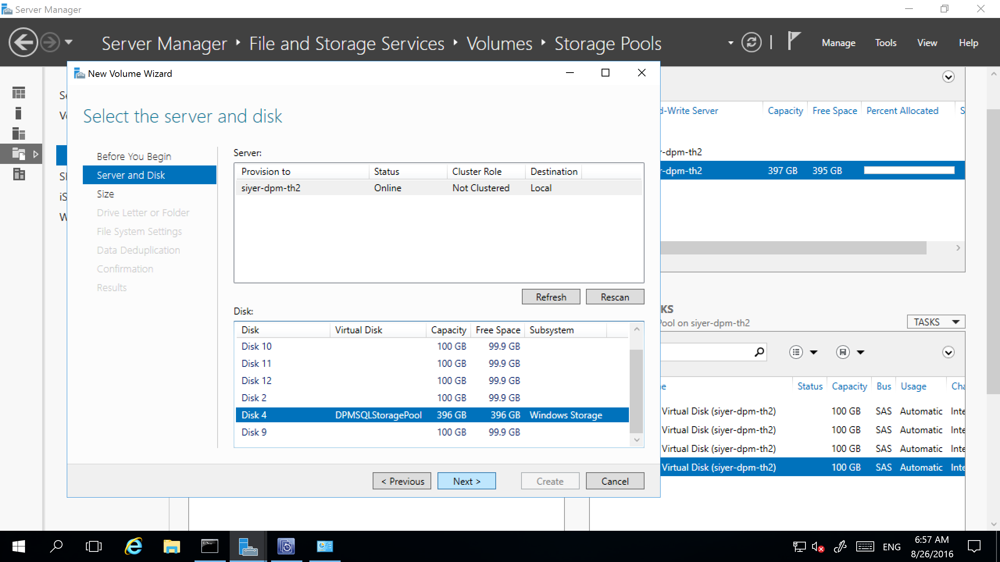
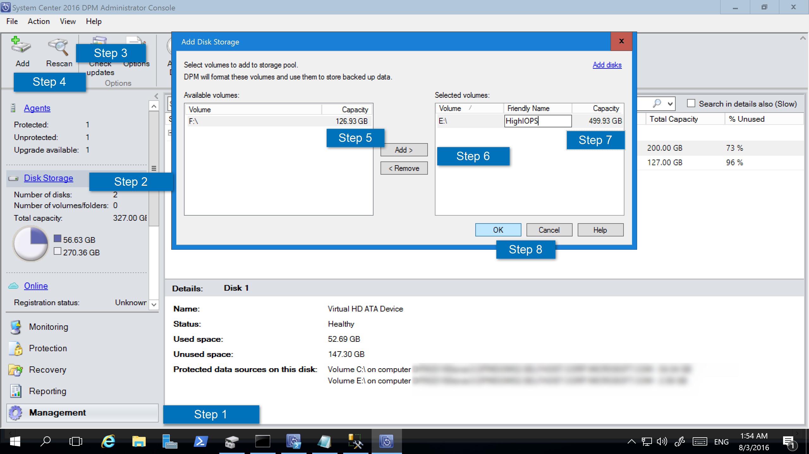
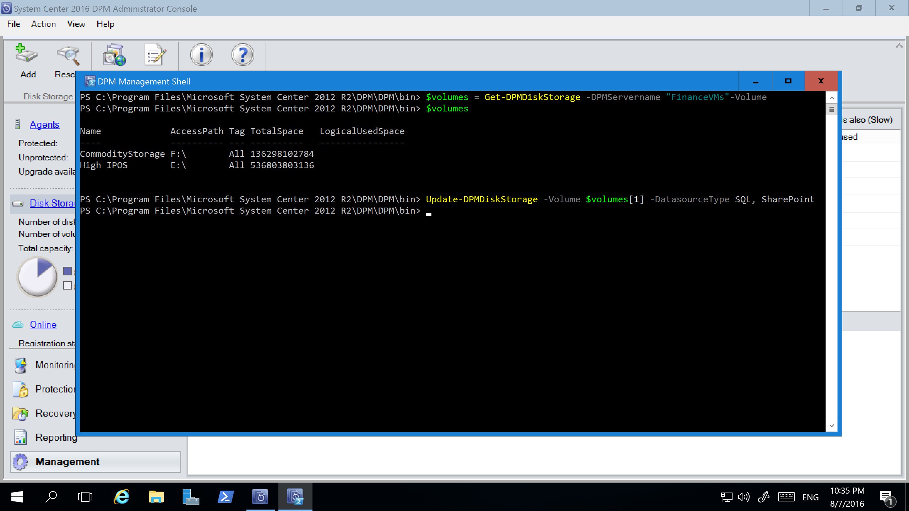
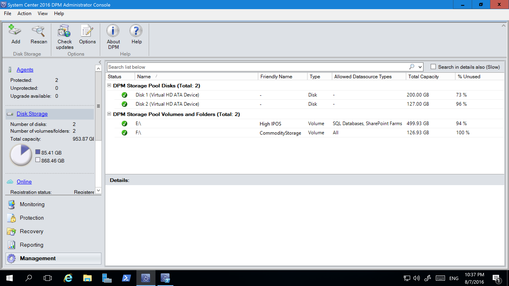

# Add storage to Azure Backup Server

Azure Backup Server V2 and later supports Modern Backup Storage that offers storage savings of 50 percent, backups that are three times faster, and more efficient storage. It also offers workload-aware storage.

> [!NOTE]
> To use Modern Backup Storage, you must run Backup Server V2 or V3 on Windows Server 2016 or V3 on Windows Server 2019.
> If you run Backup Server V2 on an earlier version of Windows Server, Azure Backup Server can't take advantage of Modern Backup Storage. Instead, it protects workloads as it does with Backup Server V1. For more information, see the Backup Server version [protection matrix](backup-mabs-protection-matrix.md).

## Volumes in Backup Server

Backup Server V2 or later accepts storage volumes. When you add a volume, Backup Server formats the volume to Resilient File System (ReFS), which Modern Backup Storage requires. To add a volume, and to expand it later if you need to, we suggest that you use this workflow:

1.	Set up Backup Server on a VM.
2.	Create a volume on a virtual disk in a storage pool:
    1.  Add a disk to a storage pool and create a virtual disk with simple layout.
    2.  Add any additional disks, and extend the virtual disk.
    3.  Create volumes on the virtual disk.
3.	Add the volumes to Backup Server.
4.	Configure workload-aware storage.

## Create a volume for Modern Backup Storage

Using Backup Server V2 or later with volumes as disk storage can help you maintain control over storage. A volume can be a single disk. However, if you want to extend storage in the future, create a volume out of a disk created by using storage spaces. This can help if you want to expand the volume for backup storage. This section offers best practices for creating a volume with this setup.

1. In Server Manager, select **File and Storage Services** > **Volumes** > **Storage Pools**. Under **PHYSICAL DISKS**, select **New Storage Pool**.

    

2. In the **TASKS** drop-down box, select **New Virtual Disk**.

    

3. Select the storage pool, and then select **Add Physical Disk**.

    

4. Select the physical disk, and then select **Extend Virtual Disk**.

    

5. Select the virtual disk, and then select **New Volume**.

    

6. In the **Select the server and disk** dialog, select the server and the new disk. Then, select **Next**.

    

## Add volumes to Backup Server disk storage

To add a volume to Backup Server, in the **Management** pane, rescan the storage, and then select **Add**. A list of all the volumes available to be added for Backup Server Storage appears. After available volumes are added to the list of selected volumes, you can give them a friendly name to help you manage them. To format these volumes to ReFS so Backup Server can use the benefits of Modern Backup Storage, select **OK**.



## Set up workload-aware storage

With workload-aware storage, you can select the volumes that preferentially store certain kinds of workloads. For example, you can set expensive volumes that support a high number of input/output operations per second (IOPS) to store only the workloads that require frequent, high-volume backups. An example is SQL Server with transaction logs. Other workloads that are backed up less frequently, like VMs, can be backed up to low-cost volumes.

### Update-DPMDiskStorage

You can set up workload-aware storage by using the PowerShell cmdlet Update-DPMDiskStorage, which updates the properties of a volume in the storage pool on an Azure Backup Server. 

Syntax:

`Parameter Set: Volume`

```
Update-DPMDiskStorage [-Volume] <Volume> [[-FriendlyName] <String> ] [[-DatasourceType] <VolumeTag[]> ] [-Confirm] [-WhatIf] [ <CommonParameters>]
```
The following screenshot shows the Update-DPMDiskStorage cmdlet in the PowerShell window.



The changes you make by using PowerShell are reflected in the Backup Server Administrator Console.




## Migrate legacy storage to Modern Backup Storage
After you upgrade to or install Backup Server V2 and upgrade the operating system to Windows Server 2016, update your protection groups to use Modern Backup Storage. By default, protection groups are not changed. They continue to function as they were initially set up.

Updating protection groups to use Modern Backup Storage is optional. To update the protection group, stop protection of all data sources by using the retain data option. Then, add the data sources to a new protection group.

1. In the Administrator Console, select the **Protection** feature. In the **Protection Group Member** list, right-click the member, and then select **Stop protection of member**.

   

2. In the **Remove from Group** dialog box, review the used disk space and the available free space for the storage pool. The default is to leave the recovery points on the disk and allow them to expire per their associated retention policy. Click **OK**.

   If you want to immediately return the used disk space to the free storage pool, select the **Delete replica on disk** check box to delete the backup data (and recovery points) associated with that member.

   

3. Create a protection group that uses Modern Backup Storage. Include the unprotected data sources.

## Add disks to increase legacy storage

If you want to use legacy storage with Backup Server, you might need to add disks to increase legacy storage.

To add disk storage:

1. In the Administrator Console, select **Management** > **Disk Storage** > **Add**.

    

4. In the **Add Disk Storage** dialog, select **Add disks**.

5. In the list of available disks, select the disks you want to add, select **Add**, and then select **OK**.

## Next steps
After you install Backup Server, learn how to prepare your server, or begin protecting a workload.

- [Prepare Backup Server workloads](backup-azure-microsoft-azure-backup.md)
- [Use Backup Server to back up a VMware server](backup-azure-backup-server-vmware.md)
- [Use Backup Server to back up SQL Server](backup-azure-sql-mabs.md)
