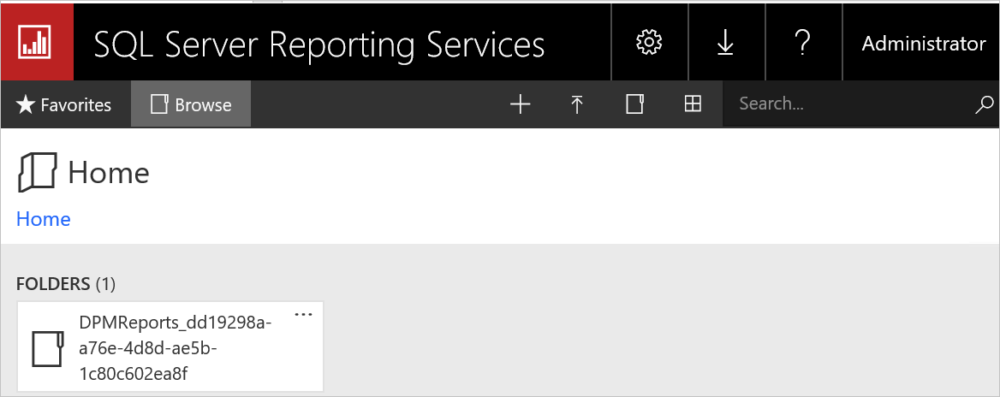
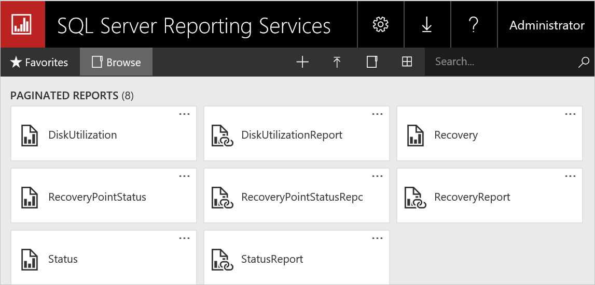
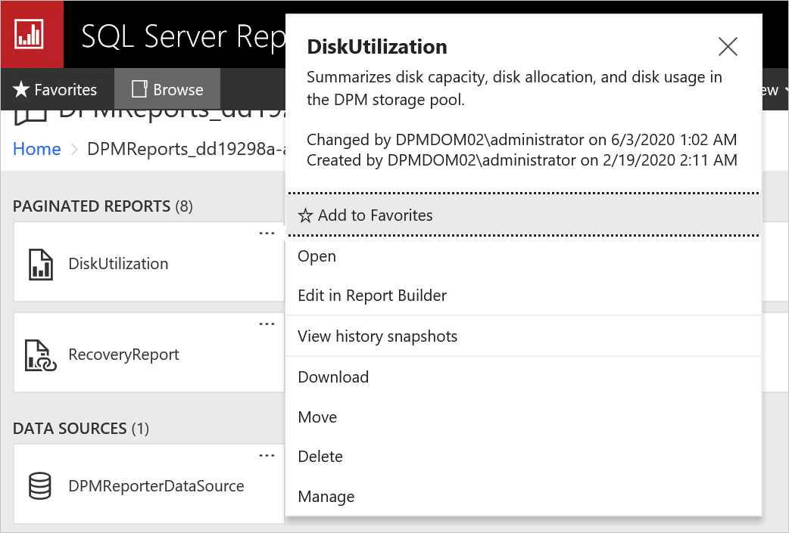
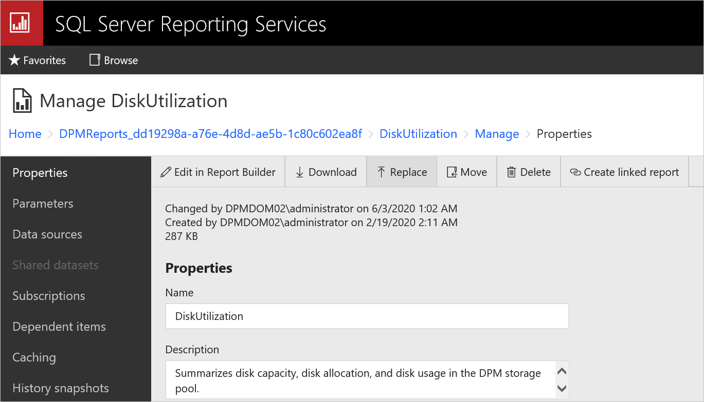

# Release notes for Microsoft Azure Backup Server

This article provides the known issues and workarounds for Microsoft Azure Backup Server (MABS) V3.

## Backup and recovery fails for clustered workloads

**Description:** Backup/restore fails for clustered data sources such as Hyper-V cluster or SQL cluster (SQL Always On) or Exchange in database availability group (DAG) after upgrading MABS V2 to MABS V3.

**Work around:** To prevent this, open SQL Server Management Studio (SSMS)) and run the following SQL script on the DPM DB:

```sql
    IF EXISTS (SELECT * FROM dbo.sysobjects
        WHERE id = OBJECT_ID(N'[dbo].[tbl_PRM_DatasourceLastActiveServerMap]')
        AND OBJECTPROPERTY(id, N'IsUserTable') = 1)
        DROP TABLE [dbo].[tbl_PRM_DatasourceLastActiveServerMap]
        GO

        CREATE TABLE [dbo].[tbl_PRM_DatasourceLastActiveServerMap] (
            [DatasourceId]          [GUID]          NOT NULL,
            [ActiveNode]            [nvarchar](256) NULL,
            [IsGCed]                [bit]           NOT NULL
            ) ON [PRIMARY]
        GO

        ALTER TABLE [dbo].[tbl_PRM_DatasourceLastActiveServerMap] ADD
    CONSTRAINT [pk__tbl_PRM_DatasourceLastActiveServerMap__DatasourceId] PRIMARY KEY NONCLUSTERED
        (
            [DatasourceId]
        )  ON [PRIMARY],

    CONSTRAINT [DF_tbl_PRM_DatasourceLastActiveServerMap_IsGCed] DEFAULT
        (
            0
        ) FOR [IsGCed]
    GO
```

## Upgrade to MABS V3 fails in Russian locale

**Description:** Upgrade from MABS V2 to MABS V3 in Russian locale fails with an error code **4387**.

**Work around:** Do the following steps to upgrade to MABS V3 using Russian install package:

1. [Backup](https://docs.microsoft.com/sql/relational-databases/backup-restore/create-a-full-database-backup-sql-server?view=sql-server-2017#SSMSProcedure) your SQL database and uninstall MABS V2 (choose to retain the protected data during uninstall).
2. Upgrade to SQL 2017 (Enterprise) and uninstall reporting as part of upgrade.
3. [Install](https://docs.microsoft.com/sql/reporting-services/install-windows/install-reporting-services?view=sql-server-2017#install-your-report-server) SQL Server Reporting Services (SSRS).
4. [Install](https://docs.microsoft.com/sql/ssms/download-sql-server-management-studio-ssms) SQL Server Management Studio (SSMS).
5. Configure Reporting using the parameters as documented in [SSRS configuration with SQL 2017](https://docs.microsoft.com/azure/backup/backup-azure-microsoft-azure-backup#upgrade-mabs).
6. [Install](backup-azure-microsoft-azure-backup.md) MABS V3.
7. [Restore](https://docs.microsoft.com/sql/relational-databases/backup-restore/restore-a-database-backup-using-ssms?view=sql-server-2017) SQL using SSMS and run DPM-Sync tool as described [here](https://docs.microsoft.com/system-center/dpm/back-up-the-dpm-server?view=sc-dpm-2019#using-dpmsync).
8. Update the ‘DataBaseVersion’ property in dbo.tbl_DLS_GlobalSetting table using the following command:

    ```sql
            UPDATE dbo.tbl_DLS_GlobalSetting
            set PropertyValue = '13.0.415.0'
            where PropertyName = 'DatabaseVersion'
    ```

9. Start MSDPM service.

## After installing UR1 the MABS reports aren't updated with new RDL files

**Description**: With UR1, the MABS report formatting issue is fixed with updated RDL files. The new RDL files aren't automatically replaced with existing files.

**Workaround**: To replace the RDL files, follow the steps below:

1. On the MABS machine, open SQL Reporting Services Web Portal URL.
1. On Web Portal URL, the DPMReports Folder is present in the format of **`DPMReports_<GUID>`**

    >[!NOTE]
    >There is always only one folder with this naming convention. If MABS is upgraded from a previous version, there might be another older folder as well, but you will not be able to open it.

    

1. Select and open the **`DPMReports_<GUID>`** folder. The individual report files will be listed as shown below.

    

1. Select the report files that don't end with **Report**, right-click on **Option** and select **Manage**.

    

1. In the new page, select the **Replace** option to replace the files with latest report files.

    The latest report files can be found in the path `<MABS Installation Directory>\Program Files\Microsoft Azure Backup Server\DPM\DPM\bin\DpmReports`

    For example: `C:\Program Files\Microsoft Azure Backup Server\DPM\DPM\bin\DpmReports`

    

    After the files are replaced, ensure that the **Name** and **Description** are intact and aren't empty.

1. After the files are replaced, restart the MABS services and use the report files.

## Next steps

[What's new in MABS](backup-mabs-whats-new-mabs.md)
