# Install Azure Backup Server v2

Azure Backup Server helps protect your virtual machines (VMs), workloads, files and folders, and more. Azure Backup Server v2 builds on Azure Backup Server v1, and gives you new features that are not available in v1. For a comparison of features between v1 and v2, see [Azure Backup Server protection matrix](backup-mabs-protection-matrix.md). 

The additional features in Backup Server v2 are an upgrade from Backup Server v1. However, Backup Server v1 is not a prerequisite for installing Backup Server v2. If you want to upgrade from Backup Server v1 to Backup Server v2, install Backup Server v2 on the Backup Server protection server. Your existing Backup Server settings remain intact.

You can install Backup Server v2 on Windows Server 2012 R2 or Windows Server 2016. To take advantage of new features like System Center 2016 Data Protection Manager Modern Backup Storage, you must install Backup Server v2 on Windows Server 2016. Before you upgrade to or install Backup Server v2, read about the [installation prerequisites](https://docs.microsoft.com/system-center/dpm/install-dpm#setup-prerequisites).

> [!NOTE]
> Azure Backup Server has the same code base as System Center Data Protection Manager. Backup Server v1 is equivalent to Data Protection Manager 2012 R2, and Backup Server v2 is equivalent to Data Protection Manager 2016. This article occasionally references the Data Protection Manager documentation.
>
>

## Upgrade Backup Server to v2
To upgrade from Backup Server v1 to Backup Server v2, make sure your installation has the required updates:

- [Update the protection agents](backup-mabs-upgrade-to-v2.md#update-the-dpm-protection-agent) on the protected servers.
- Upgrade Windows Server 2012 R2 to Windows Server 2016.
- Upgrade Azure Backup Server Remote Administrator on all production servers.
- Ensure that backups are set to continue without restarting your production server.


### Upgrade steps for Backup Server v2

1. In the Download Center, [download the upgrade installer](https://go.microsoft.com/fwlink/?LinkId=626082).

2. After you extract the setup wizard, make sure that **Execute setup.exe** is selected, and then select **Finish**.

  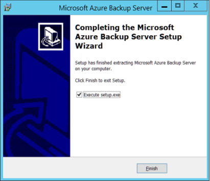

3. In the Microsoft Azure Backup Server wizard, under **Install**, select **Microsoft Azure Backup Server**.

  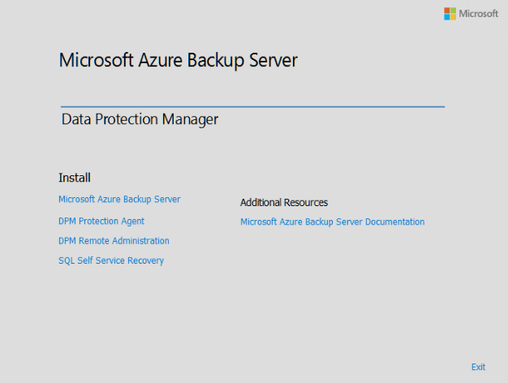

4. On the **Welcome** page, review the warnings, and then select **Next**.

  

5. The setup wizard performs prerequisite checks to make sure your environment can upgrade. On the **Prerequisite Checks** page, select **Check**.

  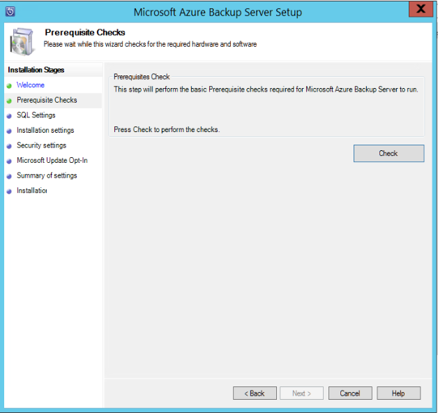

6. Your environment must pass the prerequisite checks. If your environment doesn't pass the checks, note the issues and fix them. Then, select **Check Again**. After you pass the prerequisite checks, select **Next**.

  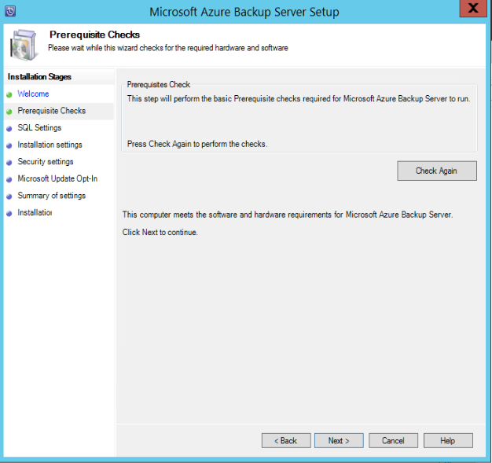

7. On the **SQL Settings** page, select the relevant option for your SQL installation, and then select **Check and Install**.

  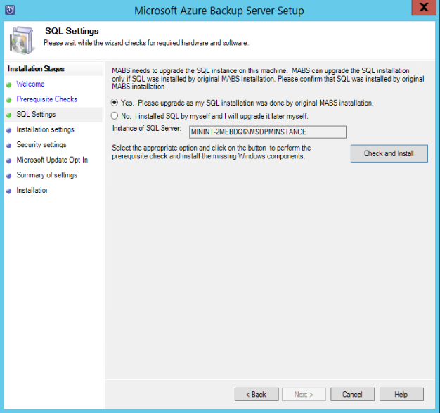

  The checks might take a few minutes. When the checks are finished, select **Next**.

  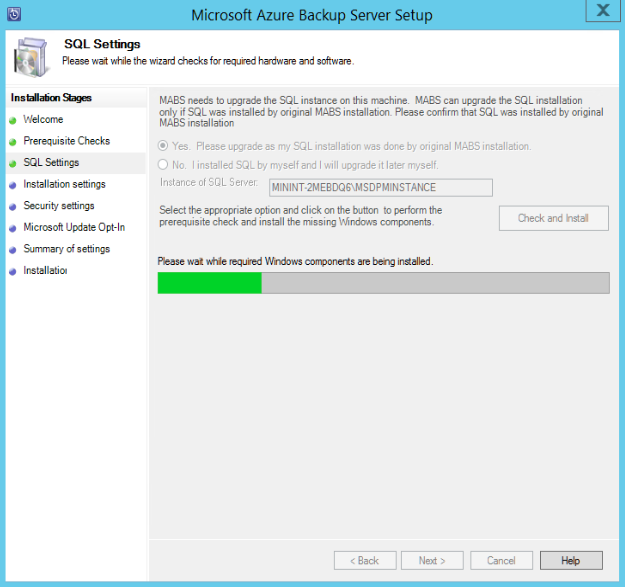

8. On the **Installation Settings** page, make any changes to the location where Backup Server is installed, or to the Scratch Location. Select **Next**.

  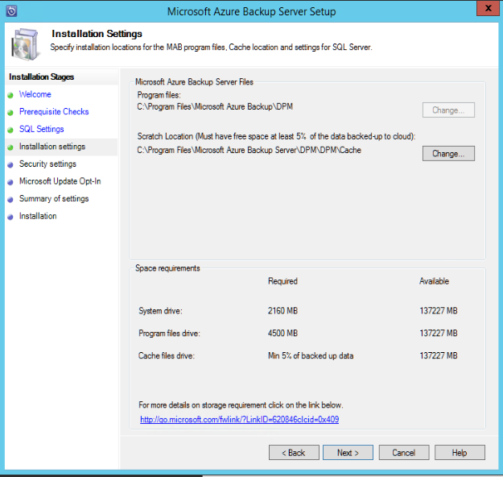

9. To finish the setup wizard, select **Finish**.

  


## Add storage for Modern Backup Storage

To improve backup storage efficiency, Backup Server v2 adds support for volumes. Like Backup Server v1, Backup Server v2 supports disks.

### Add volumes and disks
If you run Backup Server v2 on Windows Server 2016, you can use volumes to store backup data. Volumes offer storage savings and faster backups. Because volumes are new to Backup Server, you must add them. 

When you add a volume to Backup Server, you can give the volume a friendly name. Click the **Friendly Name** column of the volume you want to name. You can change the name later, if necessary. You also can use PowerShell to add or change friendly names for volumes.

To add a volume in the Administrator Console:

1. In the Azure Backup Server Administrator Console, select **Management** > **Disk Storage** > **Add**.

    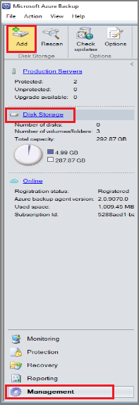

    This opens the Add Disk Storage wizard.

2. On the **Add Disk Storage** page, in the **Available volumes** box, select a volume, and then select **Add**.
3. In the **Selected volumes** box, enter a friendly name for the volume, and then select **OK**.

      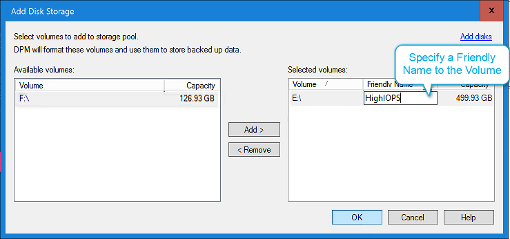

  If you want to add a disk, the disk must belong to a protection group that has legacy storage. These disks can only be used for these protection groups. If Backup Server doesn't have sources that have legacy protection, the disk isn't listed.

  For more information about adding disks, see [Adding disks to increase legacy storage](http://docs.microsoft.com/system-center/dpm/upgrade-to-dpm-2016#adding-disks-to-increase-legacy-storage). You can't give a disk a friendly name.


### Assign workloads to volumes

In Backup Server, you specify which workloads are assigned to which volumes. For example, you can set expensive volumes that support a high number of input/output operations per second (IOPS) to store only workloads that require frequent, high-volume backups. An example is SQL Server with transaction logs.

#### Update-DPMDiskStorage

To update the properties of a volume in the storage pool in Backup Server, use the PowerShell cmdlet Update-DPMDiskStorage.

Syntax:

`Parameter Set: Volume`

```
Update-DPMDiskStorage [-Volume] <Volume> [[-FriendlyName] <String> ] [[-DatasourceType] <VolumeTag[]> ] [-Confirm] [-WhatIf] [ <CommonParameters>]
```

All changes that you make by using PowerShell are reflected in the UI.


## Protect data sources
To begin protecting data sources, create a protection group. The following steps highlight changes or additions to the New Protection Group wizard.

To create a protection group:

1. In the Backup Server Administrator Console, select **Protection**.

2. On the tool ribbon, select **New**.

    This opens the Create New Protection Group wizard.

  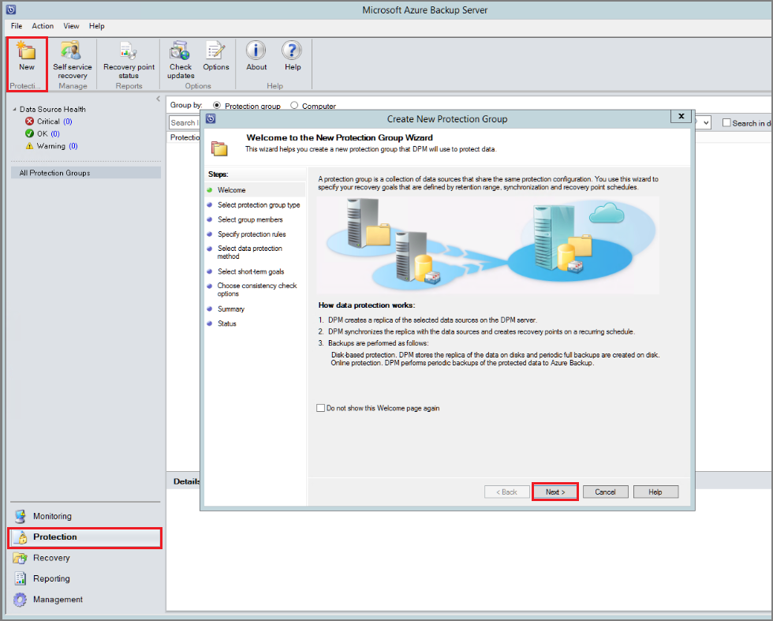

3. On the **Welcome** page, select **Next**.
4. On the **Select Protection Group Type** page, select the type of protection group you want to create, and then select **Next**.

  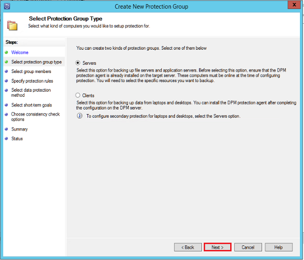

5. On the **Select Group Members** page, in the **Available members** pane, the members with protection agents are listed. For this example, select volume D:\ and E:\ and add them to the **Selected members** pane. Select **Next**.

  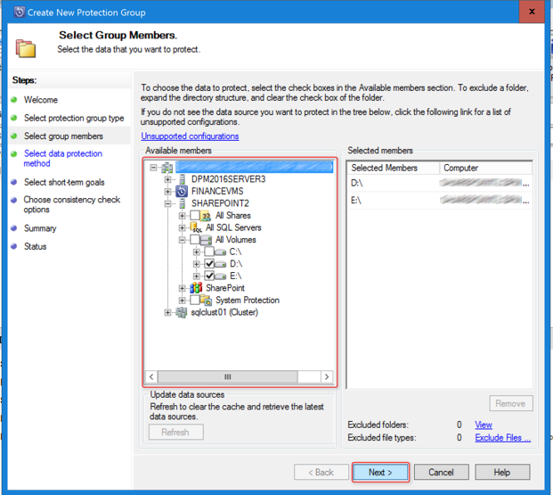

6. On the **Select Data Protection Method** page, enter a **Protection group name**, select the protection method, and then select **Next**. If you want short-term protection, you must select the **Disk** backup method.

  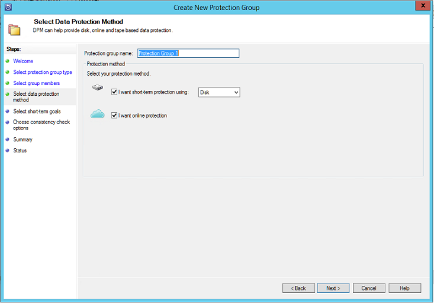

7. On the **Specify Short-Term Goals** page, select the details for **Retention range** and **Synchronization frequency**. Then, select **Next**. Optionally, to change the schedule for when recovery points are taken, select **Modify**.

  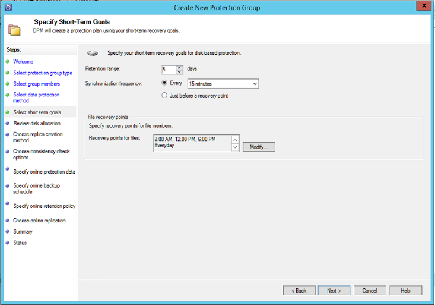

8. On the **Review Disk Storage Allocation** page, review details about the data sources you selected, their size, and  values for the space to be provisioned and the target storage volume.

  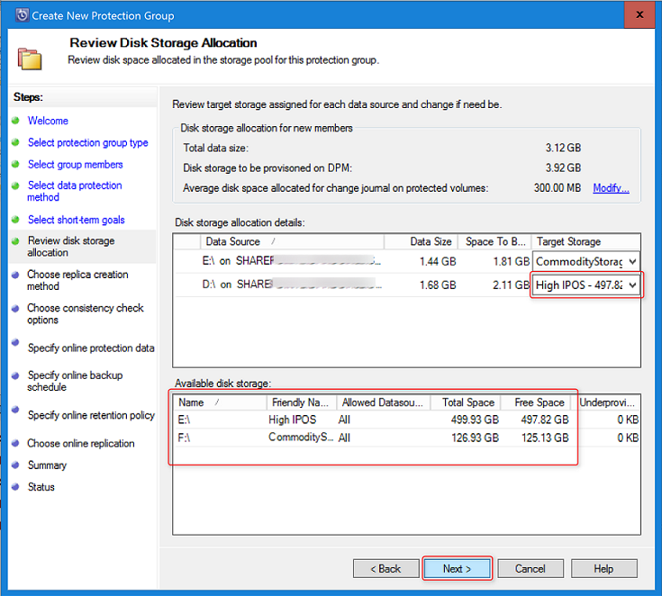

  Storage volumes are based on the workload volume allocation (set by using PowerShell) and the available storage. You can change the storage volumes by selecting other volumes in the drop-down menu. If you change the value for **Target Storage**, the value for **Available disk storage** dynamically changes to reflect values under **Free Space** and **Underprovisioned Space**.

  If the data sources grow as planned, the value for the **Underprovisioned Space** column in **Available disk storage** reflects the amount of additional storage that's needed. Use this value to help plan your storage needs for smooth backups. If the value is zero, there are no potential problems with storage in the foreseeable future. If the value is a number other than zero, you do not have sufficient storage allocated  (based on your protection policy and the data size of your protected members).

  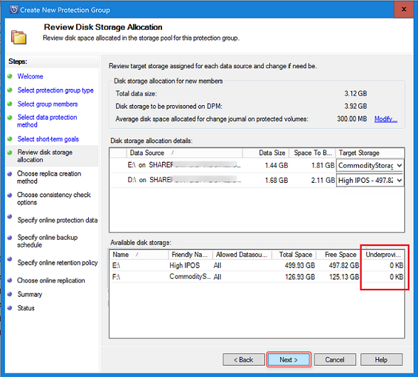

   To finish creating your protection group, complete the wizard.

## Migrate legacy storage to Modern Backup Storage
After you upgrade to or install Backup Server v2 and upgrade the operating system to Windows Server 2016, update your protection groups to use Modern Backup Storage. By default, protection groups are not changed. They continue to function as they were initially set up. 

Updating protection groups to use Modern Backup Storage is optional. To update the protection group, stop protection of all data sources by using the retain data option. Then, add the data sources to a new protection group.

1. In the Administrator Console, select the **Protection** feature. In the **Protection Group Member** list, right-click the member, and then select **Stop protection of member**.

  

2. In the **Remove from Group** dialog box, review the used disk space and the available free space for the storage pool. The default is to leave the recovery points on the disk and allow them to expire per their associated retention policy. Click **OK**.

  If you want to immediately return the used disk space to the free storage pool, select the **Delete replica on disk** check box to delete the backup data (and recovery points) associated with that member.

  

3. Create a protection group that uses Modern Backup Storage. Include the unprotected data sources.


## Add disks to increase legacy storage

If you want to use legacy storage with Backup Server, you might need to add disks to increase legacy storage. 

To add disk storage:

1. In the Administrator Console, select **Management** > **Disk Storage** > **Add**.

    

4. In the **Add Disk Storage** dialog, select **Add disks**.

5. In the list of available disks, select the disks you want to add, select **Add**, and then select **OK**.

## Update the Data Protection Manager protection agent

Backup Server uses the System Center Data Protection Manager protection agent for updates. If you are upgrading a protection agent that is not connected to the network, you cannot use the Data Protection Manager Administrator Console to complete a connected agent upgrade. You must upgrade the protection agent in a nonactive domain environment. Until the client computer is connected to the network, the Data Protection Manager Administrator Console shows that the protection agent update is pending.

The following sections describe how to update protection agents for client computers that are connected and client computers that are not connected.

### Update a protection agent for a connected client computer

1. In the Backup Server Administrator Console, select **Management** > **Agents**.

2. In the display pane, select the client computers for which you want to update the protection agent.

  > [!NOTE]
  > The **Agent Updates** column indicates when a protection agent update is available for each protected computer. In the **Actions** pane, the **Update** action is available only when a protected computer is selected and updates are available.
  >
  >

3. To install updated protection agents on the selected computers, in the **Actions** pane, select **Update**.

### Update a protection agent on a client computer that is not connected

1. In the Backup Server Administrator Console, select **Management** > **Agents**.

2. In the display pane, select the client computers for which you want to update the protection agent.

  > [!NOTE]
   > The **Agent Updates** column indicates when a protection agent update is available for each protected computer. In the **Actions** pane, the **Update** action is not available when a protected computer is selected unless updates are available.
  >
  >

3. To install updated protection agents on the selected computers, select **Update**.

4. For a client computer that is not connected to the network, until the computer is connected to the network, the **Agent Status** column shows a status of **Update Pending**.

  After a client computer is connected to the network, the **Agent Updates** column for the client computer shows a status of **Updating**.

## New PowerShell cmdlets in v2

When you install Azure Backup Server v2, two new cmdlets are available: 
* [Mount-DPMRecoveryPoint](https://technet.microsoft.com/library/mt787159.aspx)
* [Dismount-DPMRecoveryPoint](https://technet.microsoft.com/library/mt787158.aspx)

## Next steps

Learn how to prepare your server or begin protecting a workload:
- [Prepare Backup Server workloads](backup-azure-microsoft-azure-backup.md)
- [Use Backup Server to back up a VMware server](backup-azure-backup-server-vmware.md)
- [Use Backup Server to back up SQL Server](backup-azure-sql-mabs.md)
- [Use Modern Backup Storage with Backup Server](backup-mabs-add-storage.md)

