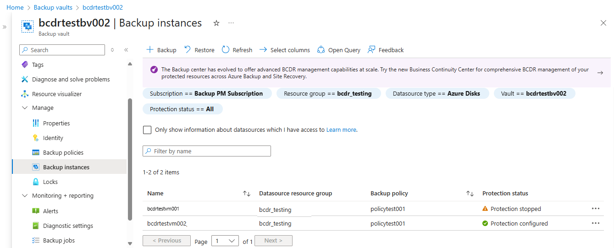

# Back up Azure Managed Disks

This article explains how to back up [Azure Managed Disk](../virtual-machines/managed-disks-overview.md) from the Azure portal.

In this article, you'll learn how to:

- Create a Backup vault

- Create a backup policy

- Configure a backup of an Azure Disk

- Run an on-demand backup job

For information on the Azure Disk backup region availability, supported scenarios and limitations, see the [support matrix](disk-backup-support-matrix.md).

## Create a Backup vault

A Backup vault is a storage entity in Azure that holds backup data for various newer workloads that Azure Backup supports, such as Azure Database for PostgreSQL servers and Azure Disks. Backup vaults make it easy to organize your backup data, while minimizing management overhead. Backup vaults are based on the Azure Resource Manager model of Azure, which provides enhanced capabilities to help secure backup data.

1. Sign in to the Azure portal at [https://portal.azure.com](https://portal.azure.com/).
1. Type **Backup center** in the search box.
1. Under **Services**, select **Backup center**.
1. In the **Backup center** page, select **Vault**.

   

1. In the **Initiate: Create Vault** screen, select **Backup vault**, and **Proceed**.

   

1. In the **Basics** tab, provide subscription, resource group, backup vault name, region, and backup storage redundancy. Continue by selecting **Review + create**. Learn more about [creating a Backup vault](./create-manage-backup-vault.md#create-a-backup-vault).

   

## Create Backup policy

1. In the *DemoVault* **Backup vault** created in the previous step, go to **Backup policies** and select **Add**.

   

1. In the **Basics** tab, provide policy name, select **Datasource type** as **Azure Disk**. The vault is already prepopulated and the selected vault properties are presented.

   >[!NOTE]
   > Although the selected vault may have the global-redundancy setting, currently Azure Disk Backup supports snapshot datastore only. All backups are stored in a resource group in your subscription and aren't copied to backup vault storage.

   

1. In the **Backup policy** tab, select the backup schedule frequency.

   

   Azure Disk Backup offers multiple backups per day. If you require more frequent backups, choose the **Hourly** backup frequency with the ability to take backups with intervals of every *1*, *2*, *4*, *6*, *8*, or *12* hours. The backups are scheduled based on the **Time** interval selected. For example, if you select **Every 4 hours**, then the backups are taken at approximately in the interval of every 4 hours so the backups are distributed equally across the day. If a once a day backup is sufficient, then choose the **Daily** backup frequency. In the daily backup frequency, you can specify the time of the day when your backups are taken. It's important to note that the time of the day indicates the backup start time and not the time when the backup completes. The time required for completing the backup operation is dependent on various factors including size of the disk, and churn rate between consecutive backups. However, Azure Disk backup is an agentless backup that uses [incremental snapshots](../virtual-machines/disks-incremental-snapshots.md), which doesn't impact the production application performance.

1. In the **Backup policy** tab, select retention settings that meet the recovery point objective (RPO) requirement.

   The default retention rule applies if no other retention rule is specified. The default retention rule can be modified to change the retention duration, but it cannot be deleted. You can add a new retention rule by selecting **Add retention rule**.

   

   You can pick **first successful backup** taken daily or weekly, and provide the retention duration that the specific backups are to be retained before they're deleted. This option is useful to retain specific backups of the day or week for a longer duration of time. All other frequent backups can be retained for a shorter duration.

   

   >[!NOTE]
   >Azure Backup for Managed Disks uses incremental snapshots which are limited to 500 snapshots per disk. To allow you to take on-demand backups aside from scheduled backups, backup policy limits the total backups to 450. Learn more about [incremental snapshots](../virtual-machines/disks-incremental-snapshots.md#restrictions) for managed disk.

1. Complete the backup policy creation by selecting **Review + create**.

## Configure backup

- Azure Disk backup supports only the operational tier backup. Copying of backups to the vault storage tier is currently not supported. The Backup vault storage redundancy setting (LRS/GRS) doesn’t apply to the backups stored in the operational tier.                        Incremental snapshots are stored in a Standard HDD storage, irrespective of the selected storage type of the parent disk. For additional reliability, incremental snapshots are stored on [Zone Redundant Storage](../storage/common/storage-redundancy.md) (ZRS) by default in ZRS supported regions.

- Azure Disk backup supports cross-subscription (backup vault in one subscription and the source disk in another) backup and restore. Currently, cross-region backup and restore aren't supported by Azure Disk backup, that is, the backup vault and disk to back up are in different regions.               So, to use Azure Disk backup, ensure that the backup vault and disk to back up are in the same region.

- Once you configure the disk backup, you can’t change the Snapshot Resource Group that’s assigned to a backup instance.

To configure disk backup, follow these steps:

1. Go to **Backup center** -> **Overview** and click **+ Backup** to start configuring backup of the disk.

   :::image type="content" source="./media/backup-managed-disks/start-configuring-backup-of-disk-inline.png" alt-text="Screenshot showing the option to start Azure Disk backup." lightbox="./media/backup-managed-disks/start-configuring-backup-of-disk-expanded.png":::

1. Select **Azure Disks** in the **Datasource type** drop-down list, and then click **Continue**.

   :::image type="content" source="./media/backup-managed-disks/select-azure-disks-as-datasource-type-inline.png" alt-text="Screenshot showing the process to select Azure Disks as Data protection type." lightbox="./media/backup-managed-disks/select-azure-disks-as-datasource-type-expanded.png":::

1. Select a Backup vault and click **Next** to proceed.

   >[!Note]
   >- Ensure that both the backup vault and the disk to be backed up are in same location.
   >- Azure Backup uses [_incremental snapshots_](../virtual-machines/disks-incremental-snapshots.md#restrictions) of managed disks, which store only the delta changes to the disk as the last snapshot on Standard HDD storage, regardless of the storage type of the parent disk. For additional reliability, incremental snapshots are stored on Zone Redundant Storage (ZRS) by default in the ZRS supported regions. Currently, Azure Disk Backup supports operational backup of managed disks that doesn't copy backups to the Backup vault storage. So, the backup storage redundancy setting of the Backup vault doesn’t apply to the recovery points.

   :::image type="content" source="./media/backup-managed-disks/select-backup-vault-inline.png" alt-text="Screenshot showing the process to select a Backup vault." lightbox="./media/backup-managed-disks/select-backup-vault-expanded.png":::

1. On the **Backup Policy** tab, choose a Backup policy.

   :::image type="content" source="./media/backup-managed-disks/choose-backup-policy-inline.png" alt-text="Screenshot showing the process to choose a Backup policy." lightbox="./media/backup-managed-disks/choose-backup-policy-expanded.png":::

1. On the **Datasources** tab, click **+ Add/Edit** to choose one or more Azure Managed Disks for which you want to configure backup.

   :::image type="content" source="./media/backup-managed-disks/choose-azure-managed-disks-inline.png" alt-text="Screenshot showing the process to choose Azure Managed Disks." lightbox="./media/backup-managed-disks/choose-azure-managed-disks-expanded.png":::

   >[!Note]
   >While the portal allows you to select multiple disks and configure backup, each disk is an individual backup instance. Currently, Azure Disk Backup only supports backup of individual disks. Point-in-time backup of multiple disks attached to a virtual machine isn't supported.
   >
   >In the Azure portal, you can only select disks within the same subscription. If you have several disks to be backed up or if the disks reside in different subscriptions, you can use scripts ([PowerShell](./backup-managed-disks-ps.md)/[CLI](./backup-managed-disks-cli.md)) to automate. 
   >
   >See the [support matrix](./disk-backup-support-matrix.md) for more information on the Azure Disk backup region availability, supported scenarios, and limitations.

1. Select **Snapshot resource group** and click **Validate** to initiate prerequisites checks.

   Choosing resource group for storing and managing snapshots:

   - Don't select the same resource group as that of the source disk.
   
   - As a guideline, it's recommended to create a dedicated resource group as a snapshot datastore to be used by the Azure Backup service. Having a dedicated resource group allows restricting access permissions on the resource group, providing safety and ease of management of the backup data.

   - You can use this resource group for storing snapshots across multiple disks that are being (or planned to be) backed up.

   - You can't create an incremental snapshot for a particular disk outside of that disk's subscription. So, choose the resource group within the same subscription where the disk needs to be backed up. [Learn more](../virtual-machines/disks-incremental-snapshots.md#restrictions) about incremental snapshot for managed disks.

   - Once you configure the backup of a disk, you can’t change the Snapshot Resource Group that’s assigned to a backup instance.   

   :::image type="content" source="./media/backup-managed-disks/validate-snapshot-resource-group-inline.png" alt-text="Screenshot showing the process to initiate prerequisites checks." lightbox="./media/backup-managed-disks/validate-snapshot-resource-group-expanded.png":::

1. Once the validation is complete, check if there are any errors reported in the Backup readiness column.

   >[!Note]
   >Validation might take few minutes to complete. Validation may fail if:
   >
   >- A disk is unsupported. See the [support matrix](./disk-backup-support-matrix.md) for unsupported scenarios.
   >- The Backup vault managed identity does not have valid role assignments on the _disk_ to be backed up or on the _snapshot resource group_ where incremental snapshots are stored.

   If the _Role assignment not done_ error message displays in the **Backup readiness** column, the Backup vault managed identity needs role permissions on the selected disk(s) and/or   on the Snapshot resource group. 

   :::image type="content" source="./media/backup-managed-disks/role-assignment-not-done-error-inline.png" alt-text="Screenshot showing the Role assignment not done error message." lightbox="./media/backup-managed-disks/role-assignment-not-done-error-expanded.png":::

   To configure backup of managed disks, the following prerequisites are required:

   >[!Note]
   >Backup vault uses managed identity to access other Azure resources. To configure a backup of managed disks, Backup Vault’s managed identity requires a set of permissions on the source disks and resource groups where snapshots are created and managed.

   A system-assigned managed identity is restricted to one per resource and is tied to the lifecycle of this resource. To grant permissions to the managed identity, use Azure role-based access control (Azure RBAC). Managed identity is a service principal of a special type that may only be used with Azure resources. Learn more about [managed identities](../active-directory/managed-identities-azure-resources/overview.md).

   - Assign the **Disk Backup Reader** role to Backup Vault’s managed identity on the Source disk that needs to be backed up.
   - Assign the Disk Snapshot Contributor role to the Backup vault’s managed identity on the Resource group where backups are created and managed by the Azure Backup service. The disk snapshots are stored in a resource group within your subscription. To allow Azure Backup service to create, store, and manage snapshots, you need to provide permissions to the backup vault.

   >[!Note]
   >The Configure Backup flow using Azure portal helps you in granting required role permissions to the above resources. 

1. Select the checkbox next to each row with the _Role assignment not done_ error message status in the Backup readiness column and click **Add missing roles** to automatically grant required role permissions for the Backup vault managed identity on selected resources.

   :::image type="content" source="./media/backup-managed-disks/add-missing-roles-inline.png" alt-text="Screenshot showing the process to add missing roles." lightbox="./media/backup-managed-disks/add-missing-roles-expanded.png":::

1. Click **Confirm** to provide consent. Azure Backup will automatically propagate role assignment changes on your behalf and try to revalidate.

   If you want to grand permission for the Backup vault managed identity to the selected disk(s) and snapshot resource group, select **Resource** in the **Scope** drop-down list. 

   :::image type="content" source="./media/backup-managed-disks/confirm-role-propagation-inline.png" alt-text="Screenshot showing the option to provide consent to Azure Backup for automatic role assignment." lightbox="./media/backup-managed-disks/confirm-role-propagation-expanded.png":::

   >[!Tip]
   >If you plan to configure backup for other disks in the same resource group/subscription in future, you can choose to provide permission at the scope of resource group or subscription.

   :::image type="content" source="./media/backup-managed-disks/permission-deployment-in-progress-inline.png" alt-text="Screenshot showing the permission deployment." lightbox="./media/backup-managed-disks/permission-deployment-in-progress-expanded.png":::

   :::image type="content" source="./media/backup-managed-disks/permission-waiting-to-propagate-inline.png" alt-text="Screenshot showing the permission waiting to propagate to the resource group." lightbox="./media/backup-managed-disks/permission-waiting-to-propagate-expanded.png":::

   :::image type="content" source="./media/backup-managed-disks/revalidating-permission-propagation-inline.png" alt-text="Screenshot showing the attempts to revalidate permission propagate for failed scenarios." lightbox="./media/backup-managed-disks/revalidating-permission-propagation-expanded.png":::

   >[!Note]
   >- In some cases, it can take up to 30 minutes for the role assignments to propagate, causing revalidation failure. In this scenario, retry after some time.
   >- If the **Add missing roles** action fails  to assign permissions with the error ‘Insufficient permission for role assignment’ in Backup readiness column, it indicates that you don’t have the privilege to assign role permissions. Choose Download role assignment template to download role assignments as scripts and seek support from your IT Administrator to run the scripts to complete the prerequisites. 

   :::image type="content" source="./media/backup-managed-disks/permission-propagation-taking-long-time-inline.png" alt-text="Screenshot showing the permission propagate instances taking longer time, upto 30 seconds." lightbox="./media/backup-managed-disks/permission-propagation-taking-long-time-expanded.png":::

1. After a successful validation, click **Next** to move to the **Review and configure** tab, and then click **Configure backup** to configure backup of selected disks.

   :::image type="content" source="./media/backup-managed-disks/configure-backup-of-selected-disks-inline.png" alt-text="Screenshot showing the process to configure backup of selected disks." lightbox="./media/backup-managed-disks/configure-backup-of-selected-disks-expanded.png":::

## Run an on-demand backup

1. In the *DemoVault* **Backup vault** created in the previous step, go to **Backup instances** and select a backup instance.

   

1. In the **Backup instances** screen, you'll find:

   - **essential** information including source disk name, the snapshot resource group where incremental snapshots are stored, backup vault, and backup policy.
   - **Job status** showing summary of backup and restore operations and their status in the last seven days.
   - A list of **restore points** for the selected time period.

1. Select **Backup** to initiate an on-demand backup.

   

1. Select one of the retention rules associated with the backup policy. This retention rule will determine the retention duration of this on-demand  backup. Select **Backup now** to start the backup.

   

## Track a backup operation

The Azure Backup service creates a job for scheduled backups or if you trigger on-demand backup operation for tracking. To view the backup job status:

1. Go to the **Backup instance** screen. It shows the jobs dashboard with operation and status for the past seven days.

   

1. To view the status of the backup operation, select **View all** to show ongoing and past jobs of this backup instance.

   

1. Review the list of backup and restore jobs and their status. Select a job from the list of jobs to view job details.

   

## Next steps

- [Restore Azure Managed Disks](restore-managed-disks.md)