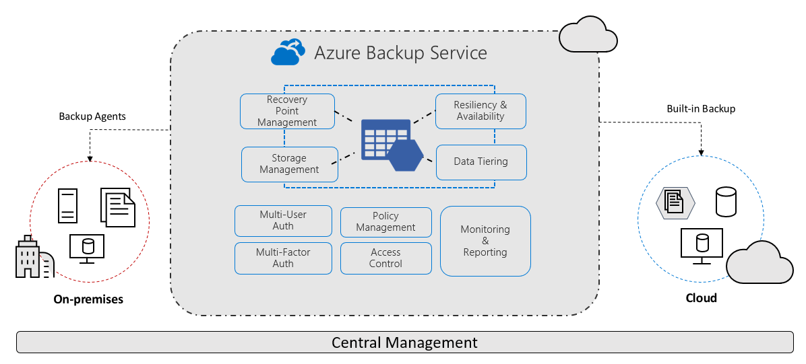

# What is the Azure Backup service?

The Azure Backup service provides simple, secure, and cost-effective solutions to back up your data and recover it from the Microsoft Azure cloud.

> [!VIDEO https://www.youtube.com/embed/elODShatt-c]

## What can I back up?

- **On-premises** - Back up files, folders, system state using the [Microsoft Azure Recovery Services (MARS) agent](backup-support-matrix-mars-agent.md). Or use the DPM or Azure Backup Server (MABS) agent to protect on-premises VMs ([Hyper-V](back-up-hyper-v-virtual-machines-mabs.md) and [VMware](backup-azure-backup-server-vmware.md)) and other [on-premises workloads](backup-mabs-protection-matrix.md)
- **Azure VMs** - [Back up entire Windows/Linux VMs](backup-azure-vms-introduction.md) (using backup extensions) or back up files, folders, and system state using the [MARS agent](backup-azure-manage-mars.md).
- **Azure Managed Disks** - [Back up Azure Managed Disks](backup-managed-disks.md)
- **Azure Files shares** - [Back up Azure File shares to a storage account](backup-afs.md)
- **SQL Server in Azure VMs** -  [Back up SQL Server databases running on Azure VMs](backup-azure-sql-database.md)
- **SAP HANA databases in Azure VMs** - [Backup SAP HANA databases running on Azure VMs](backup-azure-sap-hana-database.md)
- **Azure Database for PostgreSQL servers** -  [Back up Azure PostgreSQL databases and retain the backups for up to 10 years](backup-azure-database-postgresql.md)
- **Azure Blobs** - [Overview of operational backup for Azure Blobs](blob-backup-overview.md)

## Why use Azure Backup?

Azure Backup delivers these key benefits:

- **Offload on-premises backup**: Azure Backup offers a simple solution for backing up your on-premises resources to the cloud. Get short and long-term backup without the need to deploy complex on-premises backup solutions.
- **Back up Azure IaaS VMs**: Azure Backup provides independent and isolated backups to guard against accidental destruction of original data. Backups are stored in a Recovery Services vault with built-in management of recovery points. Configuration and scalability are simple, backups are optimized, and you can easily restore as needed.
- **Scale easily** - Azure Backup uses the underlying power and unlimited scale of the Azure cloud to deliver high-availability with no maintenance or monitoring overhead.
- **Get unlimited data transfer**: Azure Backup doesn't limit the amount of inbound or outbound data you transfer, or charge for the data that's transferred.
  - Outbound data refers to data transferred from a Recovery Services vault during a restore operation.
  - If you perform an offline initial backup using the Azure Import/Export service to import large amounts of data, there's a cost associated with inbound data.  [Learn more](backup-azure-backup-import-export.md).
- **Keep data secure**: Azure Backup provides solutions for securing data [in transit](backup-azure-security-feature.md) and [at rest](backup-azure-security-feature-cloud.md).
- **Centralized monitoring and management**: Azure Backup provides [built-in monitoring and alerting capabilities](backup-azure-monitoring-built-in-monitor.md) in a Recovery Services vault. These capabilities are available without any additional management infrastructure. You can also increase the scale of your monitoring and reporting by [using Azure Monitor](backup-azure-monitoring-use-azuremonitor.md).
- **Get app-consistent backups**: An application-consistent backup means a recovery point has all required data to restore the backup copy. Azure Backup provides application-consistent backups, which ensure additional fixes aren't required to restore the data. Restoring application-consistent data reduces the restoration time, allowing you to quickly return to a running state.
- **Retain short and long-term data**: You can use [Recovery Services vaults](backup-azure-recovery-services-vault-overview.md) for short-term and long-term data retention.
- **Automatic storage management** - Hybrid environments often require heterogeneous storage - some on-premises and some in the cloud. With Azure Backup, there's no cost for using on-premises storage devices. Azure Backup automatically allocates and manages backup storage, and it uses a pay-as-you-use model. So you only pay for the storage you consume. [Learn more](https://azure.microsoft.com/pricing/details/backup) about pricing.
- **Multiple storage options** - Azure Backup offers three types of replication to keep your storage/data highly available.
  - [Locally redundant storage (LRS)](../storage/common/storage-redundancy.md#locally-redundant-storage) replicates your data three times (it creates three copies of your data) in a storage scale unit in a datacenter. All copies of the data exist within the same region. LRS is a low-cost option for protecting your data from local hardware failures.
  - [Geo-redundant storage (GRS)](../storage/common/storage-redundancy.md#geo-redundant-storage) is the default and recommended replication option. GRS replicates your data to a secondary region (hundreds of miles away from the primary location of the source data). GRS costs more than LRS, but GRS provides a higher level of durability for your data, even if there's a regional outage.
  - [Zone-redundant storage (ZRS)](../storage/common/storage-redundancy.md#zone-redundant-storage) replicates your data in [availability zones](../availability-zones/az-overview.md#availability-zones), guaranteeing data residency and resiliency in the same region. ZRS has no downtime. So your critical workloads that require [data residency](https://azure.microsoft.com/resources/achieving-compliant-data-residency-and-security-with-azure/), and must have no downtime, can be backed up in ZRS.

## How Azure Backup protects from ransomware?

Azure Backup helps protect your critical business systems and backup data against a ransomware attack by implementing preventive measures and providing tools that protect your organization from every step that attackers take to infiltrate your systems. It provides security to your backup environment, both when your data is in transit and at rest. 

In addition to various security features offered by default, you can also leverage several enhanced features that can provide you with highest levels of security for your backed-up data. Learn more about [security in Azure Backup](security-overview.md). Also, [learn](../security/fundamentals/backup-plan-to-protect-against-ransomware.md) about how backups can help you protect backups against ransomware better and how Azure helps you ensure rapid recovery.

## Next steps

- [Review](backup-architecture.md) the architecture and components for different backup scenarios.
- [Verify](backup-support-matrix.md) support requirements and limitations for backup, and for [Azure VM backup](backup-support-matrix-iaas.md).