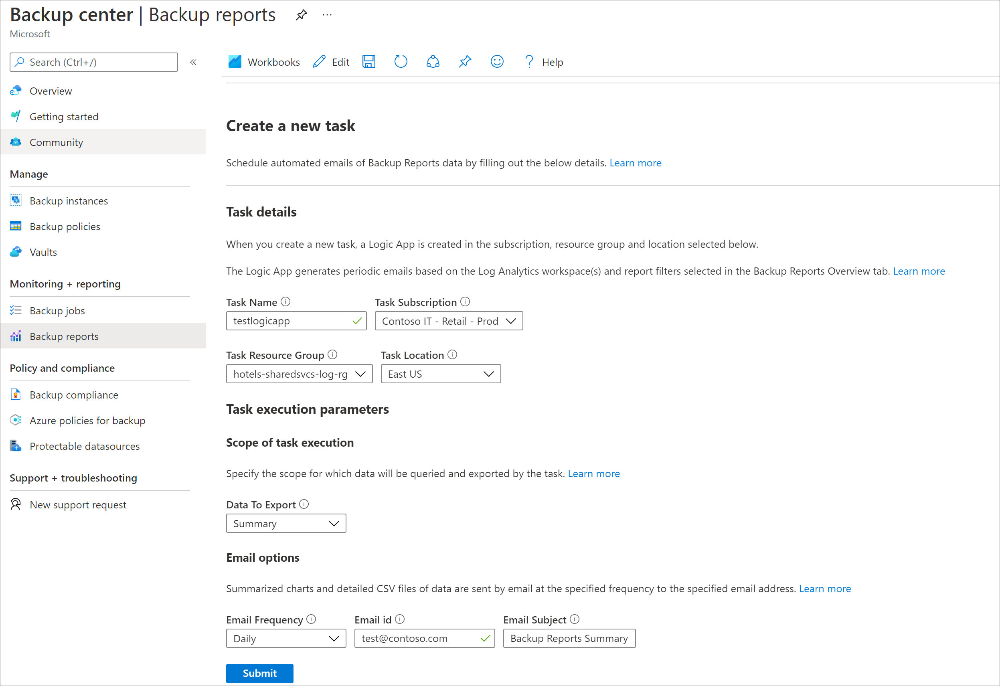
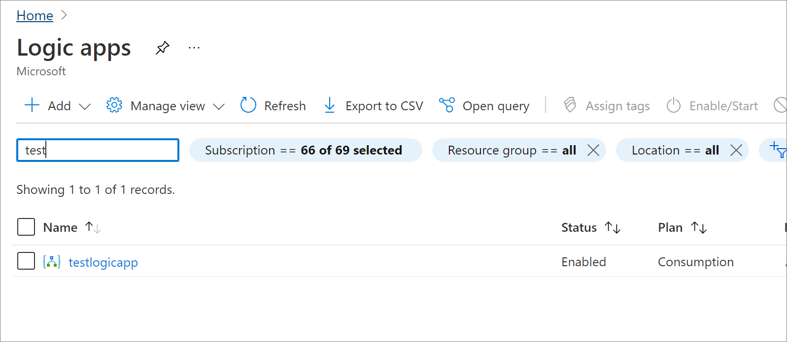
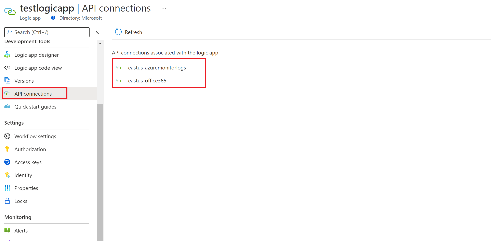
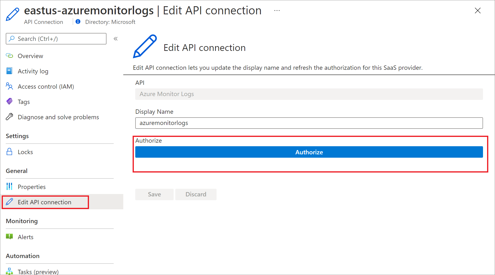

# Email Azure Backup Reports

Using the **Email Report** feature available in Backup Reports, you can create automated tasks to receive periodic reports via email. This feature works by deploying a logic app in your Azure environment that queries data from your selected Log Analytics (LA) workspaces, based on the inputs that you provide. [Learn more about Logic apps and their pricing](https://azure.microsoft.com/pricing/details/logic-apps/).

## Getting Started

To configure email tasks via Backup Reports, perform the following steps:

1.	Go to **Backup Center** > **Backup Reports** and click on the **Email Report** tab.
2.	Create a task by specifying the following information:
    * **Task Details** - The name of the logic app to be created, and the subscription, resource group, and location in which it should be created. Note that the logic app can query data across multiple subscriptions, resource groups, and locations (as selected in the Report Filters section), but is created in the context of a single subscription, resource group and location.
    * **Data To Export** - The tab which you wish to export. You can either create a single task app per tab, or email all tabs using a single task, by selecting the **All Tabs** option.
    * **Email options**: The email frequency, recipient email ID(s), and the email subject.

    

3.	After you click **Submit** and **Confirm**, the logic app will get created. The logic app and the associated API connections are created with the tag **UsedByBackupReports: true** for easy discoverability. You'll need to perform a one-time authorization step for the logic app to run successfully, as described in the section below.

> [!NOTE]
> Support for Backup vault workloads (Azure Database for PostgreSQL Server, Azure Blobs, Azure Disks) is added to the logic app templates in April 2023. So, if you've deployed these logic apps on an earlier date, you'll have to redeploy these using the above steps if you want to see data for Backup vault workloads in your email reports.

## Authorize connections to Azure Monitor Logs and Office 365

The logic app uses the [azuremonitorlogs](/connectors/azuremonitorlogs/) connector for querying the LA workspace(s) and uses the [Office365 Outlook](/connectors/office365connector/) connector for sending emails. You'll need to perform a one-time authorization for these two connectors. 
 
To perform the authorization, follow the steps below:

1.	Go to **Logic Apps** in the Azure portal.
2.	Search for the name of the logic app you've created and go to the resource.

    

3.	Click on the **API connections** menu item.

    

4.	You'll see two connections with the format `<location>-azuremonitorlogs` and `<location>-office365` - that is, _eastus-azuremonitorlogs_ and _eastus-office365_.
5.	Go to each of these connections and select the **Edit API connection** menu item. In the screen that appears, select **Authorize**, and save the connection once authorization is complete.

    

6.	To test whether the logic app works after authorization, you can go back to the logic app, open **Overview** and select **Run Trigger** in the top pane, to test whether an email is being generated successfully.

>[!Note]
>The *sender* account associated with the email is the same as the account that is used to authorize the Office 365 connection during configuration of the email report. To change the sender, you need to use a different account to authorize the connection.

## Contents of the email

* All the charts and graphs shown in the portal are available as inline content in the email. [Learn more](configure-reports.md) about the information shown in Backup Reports.
* The grids shown in the portal are available as *.csv attachments in the email.
* The data shown in the email uses all the report-level filters selected by the user in the report, at the time of creating the email task.
* Tab-level filters such as **Backup Instance Name**, **Policy Name** and so on, aren't applied. The only exception to this is the **Retention Optimizations** grid in the **Optimize** tab, where the filters for **Daily**, **Weekly**, **Monthly** and **Yearly** RP retention are applied.
* The time range and aggregation type (for charts) are based on the user’s time range selection in the reports. For example, if the time range selection is last 60 days (translating to weekly aggregation type), and email frequency is daily, the recipient will receive an email every day with charts spanning data taken over the last 60-day period, with data aggregated at a weekly level.

## Troubleshooting issues

If you aren't receiving emails as expected even after successful deployment of the logic app, you can follow the steps below to troubleshoot the configuration:

### Scenario 1: Receiving neither a successful email nor an error email

* This issue could be occurring because the Outlook API connector isn't authorized. To authorize the connection, follow the authorization steps provided above.

* This issue could also be occurring if you've specified an incorrect email recipient while creating the logic app. To verify that the email recipient has been specified correctly, you can go to the logic app in the Azure portal, open the Logic App designer and select email step to see whether the correct email IDs are being used.

### Scenario 2: Receiving an error email that says that the logic app failed to execute to completion

To troubleshoot this issue:
1.	Go to the logic app in the Azure portal.
2.	At the bottom of the **Overview** screen, you'll see a **Runs History** section. You can open on the latest run and view which steps in the workflow failed. Some possible causes could be:
    * **Azure Monitor Logs Connector has not been not authorized**: To fix this issue, follow the authorization steps as provided above.
    * **Error in the LA query**: In case you have customized the logic app with your own queries, an error in any of the LA queries might be causing the logic app to fail. You can select the relevant step and view the error which is causing the query to run incorrectly.

### Scenario 3: Error in authorizing Microsoft 365 API connection

When attempting to authorize the Microsoft 365 API connection, you might see an error of the form _Test connection failed. Error 'REST API is not yet supported for this mailbox. This error can occur for sandbox (test) accounts or for accounts that are on a dedicated (on-premises) mail server._ 

This error can occur if the mailbox is on a dedicated Microsoft Exchange Server and isn't a valid Office 365 mailbox. [Learn more](/connectors/office365/#common-errors)

To get a valid Office 365 mailbox, submit a request to your Exchange or Global administrator to migrate the mailbox account. Users who don't have administrator permissions can't migrate accounts. For information on how to migrate the mailbox account, see [How to migrate mailbox data by using the Exchange Admin Center in Office 365](/exchange/troubleshoot/move-or-migrate-mailboxes/migrate-data-with-admin-center).

### Scenario 4: Error in authorizing Azure Monitor Logs connection

When attempting to authorize the Azure Monitor logs connection, you might see an _InvalidAuthenticationTokenTenant_ error. This generally happens when you're logged in to a different tenant at the time of authorizing the connection to Azure Monitor logs. You need to log in to the same tenant as the tenant where the Log Analytics workspace exists to complete the authorization successfully.

To ensure you're logged in to the right tenant, you can open _portal.azure.com/< tenant-id-of-workspace >_ in the browser and perform the authorization. To find the tenant ID, go to **Azure Activity Directory** -> **Overview** -> **Manage Tenants**.

If the issues persist, contact Microsoft support.

## Guidance for GCC High users

If you're a user in Azure Government environment using an [Office365 GCC High account](/office365/servicedescriptions/office-365-platform-service-description/office-365-us-government/gcc-high-and-dod), ensure that the email configuration is set correctly. This is because a different endpoint used for authorizing this connection for GCC High users that needs to be explicitly specified. Perform one of the following methods to verify the configuration and set up the logic app to work in GCC High.

**Choose a client:**

# [Azure portal](#tab/portal)

To update the authentication type for the Office 365 connection via the Azure portal, follow these steps:

1. Deploy the logic app task for the required tabs. See the steps in [Getting started](#getting-started). 

   Learn about [how to authorize the Azure Monitor Logs connection](#authorize-connections-to-azure-monitor-logs-and-office-365).

1. Once deployed, go to the logic app in the Azure portal and click **Logic app designer** from the menu.

   :::image type="content" source="./media/backup-azure-configure-backup-reports/logic-app-designer-inline.png" alt-text="Screenshot showing to click Logic app designer." lightbox="./media/backup-azure-configure-backup-reports/logic-app-designer-expanded.png":::

1. Locate the places where the Office 365 action is used.

   You'll find two Office 365 actions used, both at the bottom of the flow.

   :::image type="content" source="./media/backup-azure-configure-backup-reports/office-365-change-connection.png" alt-text="Screenshot showing Office 365 change connection.":::

1. Click **Change connection** and click the *information icon*.

   :::image type="content" source="./media/backup-azure-configure-backup-reports/email-information-icon.png" alt-text="Screenshot showing to click information icon.":::
   
1. A popup opens where you can select the authentication type for GCC High.

Once you select the correct authentication type in all the places where the Office 365 connection is used, the connection should work as expected.

# [Azure Resource Manager (ARM) template](#tab/arm)

You can also directly update the ARM template, which is used for deploying the logic app, to ensure that the GCC High endpoint is used for authorization. Follow these steps:

1. Go to the **Email Report** tab, provide the required inputs, and then click **Submit**.

   :::image type="content" source="./media/backup-azure-configure-backup-reports/view-template-inline.png" alt-text="View email template." lightbox="./media/backup-azure-configure-backup-reports/view-template-expanded.png":::

1. Click **View template**.

   This opens up the ARM template json which you can download and edit.
   
   :::image type="content" source="./media/backup-azure-configure-backup-reports/edit-template-inline.png" alt-text="Screenshot showing to edit template." lightbox="./media/backup-azure-configure-backup-reports/edit-template-expanded.png":::
   
1. Locate the *resources* block in the JSON file (specifically the section where a resource of `Microsoft.Web/connections` is deployed with the Office 365 parameters).

   To modify the template to support *GCCHigh*, add the subsection *parameterValueSet* to the properties section of this resource. 
   
   The updated block would look like the below:

    ```json
    {
        "type": "Microsoft.Web/connections",
        "apiVersion": "2018-07-01-preview",
        "name": "[variables('office365ConnectionName')]",
        "location": "[parameters('location')]",
        "tags": "[parameters('resourceTags')]",
        "properties": {
            "api": {
                "id": "[subscriptionResourceId('Microsoft.Web/locations/managedApis', parameters('location'), 'office365')]"
            },
            "parameterValueSet": {
                "name": "oauthGccHigh",
                "values": {
                    "token": {
                        "value": "[concat('https://logic-apis-', parameters('location'), '.consent.azure-apihub.us/redirect')]"
                    }
                }
            },
            "displayName": "office365"
        }
    }
    ```
1. Once you have the edited template, [deploy this template](../azure-resource-manager/templates/quickstart-create-templates-use-the-portal.md#edit-and-deploy-the-template). 

1. Once deployed, [authorize the Azure Monitor Logs and Office 365 connections](#authorize-connections-to-azure-monitor-logs-and-office-365).

---

## Next steps
[Learn more about Backup Reports](./configure-reports.md)
