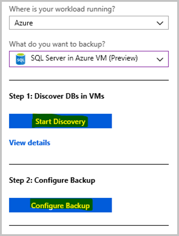
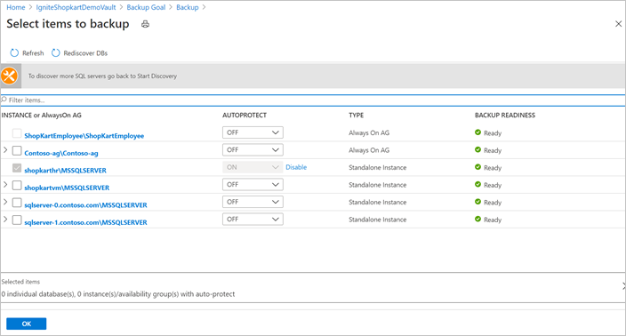
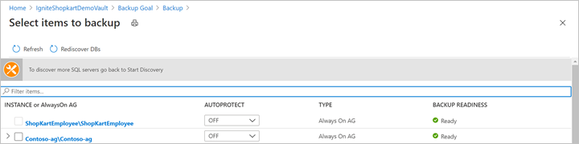
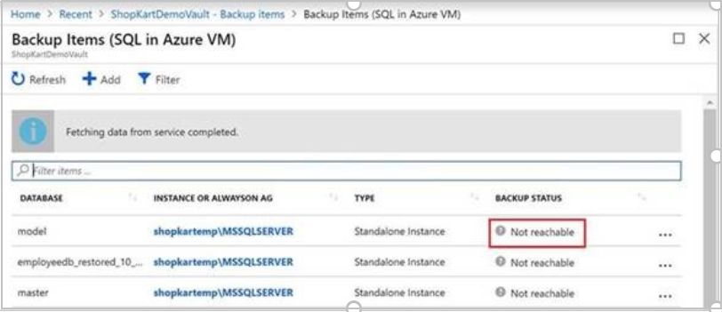

# Troubleshoot SQL Server database backup by using Azure Backup

This article provides troubleshooting information for SQL Server databases running on Azure virtual machines.

For more information about the backup process and limitations, see [About SQL Server backup in Azure VMs](sql-support-matrix.md#feature-considerations-and-limitations).

## SQL Server permissions

To configure protection for a SQL Server database on a virtual machine, you must install the **AzureBackupWindowsWorkload** extension on that virtual machine. If you get the error **UserErrorSQLNoSysadminMembership**, it means your SQL Server instance doesn't have the required backup permissions. To fix this error, follow the steps in [Set VM permissions](backup-azure-sql-database.md#set-vm-permissions).

## Troubleshoot discover and configure issues

When the creation and configuration of a Recovery Services vault is complete, discovering databases and configuring backup is a two-step process.<br>



During the backup configuration, if the SQL VM and its instances aren't visible in the **Discovery DBs in VMs** and **Configure Backup** (refer to above image) ensure that:

### Step 1: Discovery DBs in VMs

- If the VM isn't listed in the discovered VM list and also not registered for SQL backup in another vault, then follow the [Discovery SQL Server backup](./backup-sql-server-database-azure-vms.md#discover-sql-server-databases) steps.

### Step 2: Configure Backup

- If the vault in which the SQL VM is registered in the same vault used to protect the databases, then follow the [Configure Backup](./backup-sql-server-database-azure-vms.md#configure-backup) steps.

If the SQL VM needs to be registered in the new vault, then it must be unregistered from the old vault.  Unregistration of a SQL VM from the vault requires all the protected data sources to be stop protected and then you can delete the backed-up data. Deleting backed up data is a destructive operation.  After you've reviewed and taken all the precautions to unregister the SQL VM, then register this same VM with a new vault and retry the backup operation.

## Troubleshoot Backup and Recovery issues  

At times, either random failures may happen in backup and restore operations or those operations might get stuck. This may be because of antivirus programs on your VM. As a best practice, we suggest the following steps:

1. Exclude the following folders from antivirus scanning:

    `C:\Program Files\Azure Workload Backup`
    `C:\WindowsAzure\Logs\Plugins\Microsoft.Azure.RecoveryServices.WorkloadBackup.AzureBackupWindowsWorkload`

    Replace `C:\` with the letter of your *SystemDrive*.

1. Exclude the following three processes running within a VM from antivirus scanning:

    - IaasWLPluginSvc.exe
    - IaaSWorkloadCoordinatorService.exe
    - TriggerExtensionJob.exe

1. SQL also offers some guidelines about to work with antivirus programs. See [this article](https://support.microsoft.com/help/309422/choosing-antivirus-software-for-computers-that-run-sql-server) for details.

## Faulty instance in a VM with multiple SQL Server instances

You can restore to a SQL VM only if all the SQL instances running within the VM are reported healthy. If one or more instances are "faulty", the VM won't appear as a restore target. So this could be a possible reason why a multi-instance VM may not appear in the "server" dropdown during the restore operation.

You can validate the "Backup Readiness" of all the SQL instances in the VM, under **Configure backup**:



If you'd like to trigger a restore on the healthy SQL instances, do the following steps:

1. Sign in to the SQL VM and go to `C:\Program Files\Azure Workload Backup\bin`.
1. Create a JSON file named `ExtensionSettingsOverrides.json` (if it's not already present). If this file is already present on the VM, continue using it.
1. Add the following content in the JSON file and save the file:

    ```json
    {
                  "<ExistingKey1>":"<ExistingValue1>",
                    …………………………………………………… ,
              "whitelistedInstancesForInquiry": "FaultyInstance_1,FaultyInstance_2"
            }
            
            Sample content:        
            { 
              "whitelistedInstancesForInquiry": "CRPPA,CRPPB "
            }

    ```

1. Trigger the **Rediscover DBs** operation on the impacted server from the Azure portal (the same place where backup readiness can be seen). The VM will start appearing as target for restore operations.

    

1. Remove the *whitelistedInstancesForInquiry* entry from the ExtensionSettingsOverrides.json file once the restore operation is complete.

## Error messages

### Backup type unsupported

| Severity | Description | Possible causes | Recommended action |
|---|---|---|---|
| Warning | Current settings for this database don't support certain backup types present in the associated policy. | <li>Only a full database backup operation can be performed on the master database. Differential backup and transaction log backup aren't possible. </li> <li>Any database in the simple recovery model doesn't allow for the backup of transaction logs.</li> | Modify the database settings so all the backup types in the policy are supported. Or change the current policy to include only the supported backup types. Otherwise, the unsupported backup types will be skipped during scheduled backup or the backup job will fail for on-demand backup.

### UserErrorSQLPODoesNotSupportBackupType

| Error message | Possible causes | Recommended action |
|---|---|---|
| This SQL database does not support the requested backup type. | Occurs when the database recovery model doesn't allow the requested backup type. The error can happen in the following situations: <br/><ul><li>A database that's using a simple recovery model doesn't allow log backup.</li><li>Differential and log backups aren't allowed for a master database.</li></ul>For more detail, see the [SQL Server recovery models](/sql/relational-databases/backup-restore/recovery-models-sql-server) documentation. | If the log backup fails for the database in the simple recovery model, try one of these options:<ul><li>If the database is in simple recovery mode, disable log backups.</li><li>Use the [SQL Server documentation](/sql/relational-databases/backup-restore/view-or-change-the-recovery-model-of-a-database-sql-server) to change the database recovery model to full or bulk logged. </li><li> If you don't want to change the recovery model, and you have a standard policy to back up multiple databases that can't be changed, ignore the error. Your full and differential backups will work per schedule. The log backups will be skipped, which is expected in this case.</li></ul>If it's a master database and you've configured differential or log backup, use either of the following steps:<ul><li>Use the portal to change the backup policy schedule for the master database, to full.</li><li>If you have a standard policy to back up multiple databases that can't be changed, ignore the error. Your full backup will work per schedule. Differential or log backups won't happen, which is expected in this case.</li></ul> |

### OperationCancelledBecauseConflictingOperationRunningUserError

| Error message | Possible causes | Recommended action |
|---|---|---|
| Operation canceled as a conflicting operation was already running on the same database. | You may get this error when the triggered on-demand, or the scheduled backup job has conflicts with an already running backup operation triggered by Azure Backup extension on the same database.<br> The following are the scenarios when this error code might display:<br><ul><li>Full backup is running on the database and another Full backup is triggered.</li><li>Diff backup is running on the database and another Diff backup is triggered.</li><li>Log backup is running on the database and another Log backup is triggered.</li></ul>| After the conflicting operation fails, restart the operation.


### UserErrorFileManipulationIsNotAllowedDuringBackup

| Error message | Possible causes | Recommended actions |
|---|---|---|
| Backup, file manipulation operations (such as ALTER DATABASE ADD FILE) and encryption changes on a database must be serialized. | The following are the cases where this error code might surface:<br><ul><li>Adding or dropping files to a database while a backup is happening.</li><li>Shrinking files while database backups are happening.</li><li>A database backup by another backup product configured for the database is in progress and a backup job is triggered by Azure Backup extension.</li></ul>| Disable the other backup product to resolve the issue.


### UserErrorSQLPODoesNotExist

| Error message | Possible causes | Recommended actions |
|---|---|---|
| SQL database does not exist. | The database was either deleted or renamed. | Check if the database was accidentally deleted or renamed.<br/><br/> If the database was accidentally deleted, to continue backups, restore the database to the original location.<br/><br/> If you deleted the database and don't need future backups, then in the Recovery Services vault, select **Stop backup** with **Retain Backup Data** or **Delete Backup Data**. For more information, see [Manage and monitor backed-up SQL Server databases](manage-monitor-sql-database-backup.md).

### UserErrorSQLLSNValidationFailure

| Error message | Possible causes | Recommended actions |
|---|---|---|
| Log chain is broken. | The database or the VM is backed up through another backup solution, which truncates the log chain.|<ul><li>Check if another backup solution or script is in use. If so, stop the other backup solution. </li><li>If the backup was an on-demand log backup, trigger a full backup to start a new log chain. For scheduled log backups, no action is needed because the Azure Backup service will automatically trigger a full backup to fix this issue.</li>|

### UserErrorOpeningSQLConnection

| Error message | Possible causes | Recommended actions |
|---|---|---|
| Azure Backup is not able to connect to the SQL instance. | Azure Backup can't connect to the SQL Server instance. | Use the additional details on the Azure portal error menu to narrow down the root causes. Refer to [SQL backup troubleshooting](/sql/database-engine/configure-windows/troubleshoot-connecting-to-the-sql-server-database-engine) to fix the error.<br/><ul><li>If the default SQL settings don't allow remote connections, change the settings. See the following articles for information about changing the settings:<ul><li>[MSSQLSERVER_-1](/sql/relational-databases/errors-events/mssqlserver-1-database-engine-error)</li><li>[MSSQLSERVER_2](/sql/relational-databases/errors-events/mssqlserver-2-database-engine-error)</li><li>[MSSQLSERVER_53](/sql/relational-databases/errors-events/mssqlserver-53-database-engine-error)</li></ul></li></ul><ul><li>If there are login issues, use these links to fix them:<ul><li>[MSSQLSERVER_18456](/sql/relational-databases/errors-events/mssqlserver-18456-database-engine-error)</li><li>[MSSQLSERVER_18452](/sql/relational-databases/errors-events/mssqlserver-18452-database-engine-error)</li></ul></li></ul> |

### UserErrorParentFullBackupMissing

| Error message | Possible causes | Recommended actions |
|---|---|---|
| First full backup is missing for this data source. | Full backup is missing for the database. Log and differential backups are parents to a full backup, so be sure to take full backups before triggering differential or log backups. | Trigger an on-demand full backup.   |

### UserErrorBackupFailedAsTransactionLogIsFull

| Error message | Possible causes | Recommended actions |
|---|---|---|
| Cannot take backup as transaction log for the data source is full. | The database transactional log space is full. | To fix this issue, refer to the [SQL Server documentation](/sql/relational-databases/errors-events/mssqlserver-9002-database-engine-error). |

### UserErrorCannotRestoreExistingDBWithoutForceOverwrite

| Error message | Possible causes | Recommended actions |
|---|---|---|
| Database with same name already exists at the target location | The target restore destination already has a database with the same name.  | <ul><li>Change the target database name.</li><li>Or, use the force overwrite option on the restore page.</li> |

### UserErrorRestoreFailedDatabaseCannotBeOfflined

| Error message | Possible causes | Recommended actions |
|---|---|---|
| Restore failed as the database could not be brought offline. | While you're doing a restore, the target database needs to be brought offline. Azure Backup can't bring this data offline. | Use the additional details on the Azure portal error menu to narrow down the root causes. For more information, see the [SQL Server documentation](/sql/relational-databases/backup-restore/restore-a-database-backup-using-ssms). |

### WlExtGenericIOFaultUserError

|Error Message |Possible causes  |Recommended Actions  |
|---------|---------|---------|
|An input/output error occurred during the operation. Please check for the common IO errors on the virtual machine.   |   Access permissions or space constraints on the target.       |  Check for the common IO errors on the virtual machine. Ensure that the target drive / network share on the machine: <li> has read/write permission for the account NT AUTHORITY\SYSTEM on the machine. <li> has enough space for the operation to complete successfully.<br> For more information, see [Restore as files](restore-sql-database-azure-vm.md#restore-as-files).
       |

### UserErrorCannotFindServerCertificateWithThumbprint

| Error message | Possible causes | Recommended actions |
|---|---|---|
| Cannot find the server certificate with thumbprint on the target. | The master database on the destination instance doesn't have a valid encryption thumbprint. | Import the valid certificate thumbprint used on the source instance, to the target instance. |

### UserErrorRestoreNotPossibleBecauseLogBackupContainsBulkLoggedChanges

| Error message | Possible causes | Recommended actions |
|---|---|---|
| The log backup used for recovery contains bulk-logged changes. It cannot be used to stop at an arbitrary point in time according to the SQL guidelines. | When a database is in bulk-logged recovery mode, the data between a bulk-logged transaction and the next log transaction can't be recovered. | Choose a different point in time for recovery. [Learn more](/sql/relational-databases/backup-restore/recovery-models-sql-server).

### FabricSvcBackupPreferenceCheckFailedUserError

| Error message | Possible causes | Recommended actions |
|---|---|---|
| Backup preference for SQL Always On Availability Group cannot be met as some nodes of the Availability Group are not registered. | Nodes required to perform backups aren't registered or are unreachable. | <ul><li>Ensure that all the nodes required to perform backups of this database are registered and healthy, and then retry the operation.</li><li>Change the backup preference for the SQL Server Always On availability group.</li></ul> |

### VMNotInRunningStateUserError

| Error message | Possible causes | Recommended actions |
|---|---|---|
| SQL server VM is either shutdown and not accessible to Azure Backup service. | The VM is shut down. | Ensure that the SQL Server instance is running. |

### GuestAgentStatusUnavailableUserError

| Error message | Possible causes | Recommended actions |
|---|---|---|
| Azure Backup service uses Azure VM guest agent for doing backup but guest agent is not available on the target server. | The guest agent isn't enabled or is unhealthy. | [Install the VM guest agent](../virtual-machines/extensions/agent-windows.md) manually. |

### AutoProtectionCancelledOrNotValid

| Error message | Possible causes | Recommended actions |
|---|---|---|
| Auto-protection Intent was either removed or is no more valid. | When you enable auto-protection on a SQL Server instance, **Configure Backup** jobs run for all the databases in that instance. If you disable auto-protection while the jobs are running, then the **In-Progress** jobs are canceled with this error code. | Enable auto-protection once again to help protect all the remaining databases. |

### CloudDosAbsoluteLimitReached

| Error message | Possible causes | Recommended actions |
|---|---|---|
Operation is blocked as you have reached the limit on number of operations permitted in 24 hours. | When you've reached the maximum permissible limit for an operation in a span of 24 hours, this error appears. <br> For example: If you've hit the limit for the number of configure backup jobs that can be triggered per day, and you try to configure backup on a new item, you'll see this error. | Typically, retrying the operation after 24 hours resolves this issue. However, if the issue persists, you can contact Microsoft support for help.

### CloudDosAbsoluteLimitReachedWithRetry

| Error message | Possible causes | Recommended actions |
|---|---|---|
Operation is blocked as the vault has reached its maximum limit for such operations permitted in a span of 24 hours. | When you've reached the maximum permissible limit for an operation in a span of 24 hours, this error appears. This error usually appears when there are at-scale operations such as modify policy or auto-protection. Unlike the case of CloudDosAbsoluteLimitReached, there isn't much you can do to resolve this state. In fact, Azure Backup service will retry the operations internally for all the items in question.<br> For example: If you have a large number of datasources protected with a policy and you try to modify that policy, it will trigger configure protection jobs for each of the protected items and sometimes may hit the maximum limit permissible for such operations per day.| Azure Backup service will automatically retry this operation after 24 hours.

### WorkloadExtensionNotReachable

| Error message | Possible causes | Recommended actions |
|---|---|---|
AzureBackup workload extension operation failed. | The VM is shut down, or the VM can't contact the Azure Backup service because of internet connectivity issues.| <li> Ensure the VM is up and running and has internet connectivity.<li> [Re-register extension on the SQL Server VM](manage-monitor-sql-database-backup.md#re-register-extension-on-the-sql-server-vm).


### UserErrorVMInternetConnectivityIssue

| Error message | Possible causes | Recommended actions |
|---|---|---|
The VM is not able to contact Azure Backup service due to internet connectivity issues. | The VM needs outbound connectivity to Azure Backup Service, Azure Storage, or Azure Active Directory services.| <li> If you use NSG to restrict connectivity, then you should use the *AzureBackup* service tag to allows outbound access to Azure Backup Service, and similarly for the Azure AD (*AzureActiveDirectory*) and Azure Storage(*Storage*) services. Follow these [steps](./backup-sql-server-database-azure-vms.md#nsg-tags) to grant access. <li> Ensure DNS is resolving Azure endpoints. <li> Check if the VM is behind a load balancer blocking internet access. By assigning public IP to the VMs, discovery will work. <li> Verify there's no firewall/antivirus/proxy that are blocking calls to the above three target services.

### UserErrorOperationNotAllowedDatabaseMirroringEnabled

| Error message | Possible cause | Recommended action |
| --- | --- | --- |
| Backup of databases participating in a database mirroring session is not supported by AzureWorkloadBackup. | When you've the mirrioring operation enabled on a SQL database, this error appears. Currently, Azure Backup doesn't support databases with this feature enabled.       |      You can remove the database mirroring session of the database for the operation to complete successfully. Alternatively, if the database is already protected, do *Stop backup* operation on the database. |

### UserErrorWindowsWLExtFailedToStartPluginService

| Error message | Possible cause | Recommendation |
| --- | --- | --- |
| Operation failing with `UserErrorWindowsWLExtFailedToStartPluginService` error. | Azure Backup workload extension is unable to start the workload backup plugin service on the Azure Virtual Machine due to service account misconfiguration. | **Step 1** <br><br> Verify if **NT Service\AzureWLBackupPluginSvc** user has **Read** permissions on: <br> - C:\windows\Microsoft.NET \assembly\GAC_32 <br> - C:\windows\Microsoft.NET \assembly\GAC_64 <br> - C:\Windows\Microsoft.NET\Framework64\v4.0.30319\Config\machine.config.        <br><br>   If the permissions are missing, assign **Read** permissions on these directories.                 <br><br>   **Step 2**    <br><br> Verify if **NT Service\AzureWLBackupPluginSvc** has the **Bypass traverse chekcing** rights by going to **Local Security Policy** > **User Right Assignment** > **Bypass traverse checking**. **Everyone** must be selected by default.       <br><br> If **Everyone** and **NT Service\AzureWLBackupPluginSvc** are missing, add **NT Service\AzureWLBackupPluginSvc** user, and then try to restart the service or trigger a backup or restore operation for a datasource. |


## Re-registration failures

Check for one or more of the following symptoms before you trigger the re-register operation:

- All operations (such as backup, restore, and configure backup) are failing on the VM with one of the following error codes: **[WorkloadExtensionNotReachable](#workloadextensionnotreachable)**, **UserErrorWorkloadExtensionNotInstalled**, **WorkloadExtensionNotPresent**, **WorkloadExtensionDidntDequeueMsg**.
- If the **Backup Status** area for the backup item is showing **Not reachable**, rule out all the other causes that might result in the same status:

  - Lack of permission to perform backup-related operations on the VM.
  - Shutdown of the VM, so backups can't take place.
  - [Network issues](#usererrorvminternetconnectivityissue)

   

- In the case of an Always On availability group, the backups started failing after you changed the backup preference or after a failover.

These symptoms may arise for one or more of the following reasons:

- An extension was deleted or uninstalled from the portal.
- An extension was uninstalled from **Control Panel** on the VM under **Uninstall or Change a Program**.
- The VM was restored back in time through in-place disk restore.
- The VM was shut down for an extended period, so the extension configuration on it expired.
- The VM was deleted, and another VM was created with the same name and in the same resource group as the deleted VM.
- One of the availability group nodes didn't receive the complete backup configuration. This can happen when the availability group is registered to the vault or when a new node is added.

In the preceding scenarios, we recommend that you trigger a re-register operation on the VM. See [here](./backup-azure-sql-automation.md#enable-backup) for instructions on how to perform this task in PowerShell.

## Size limit for files

The total string size of files depends not only on the number of files but also on their names and paths. For each database file, get the logical file name and physical path. You can use this SQL query:

```sql
SELECT mf.name AS LogicalName, Physical_Name AS Location FROM sys.master_files mf
               INNER JOIN sys.databases db ON db.database_id = mf.database_id
               WHERE db.name = N'<Database Name>'"
```

Now arrange them in the following format:

```json
[{"path":"<Location>","logicalName":"<LogicalName>","isDir":false},{"path":"<Location>","logicalName":"<LogicalName>","isDir":false}]}
```

Here's an example:

```json
[{"path":"F:\\Data\\TestDB12.mdf","logicalName":"TestDB12","isDir":false},{"path":"F:\\Log\\TestDB12_log.ldf","logicalName":"TestDB12_log","isDir":false}]}
```

If the string size of the content exceeds 20,000 bytes, the database files are stored differently. During recovery, you won't be able to set the target file path for restore. The files will be restored to the default SQL path provided by SQL Server.

### Override the default target restore file path

You can override the target restore file path during the restore operation by placing a JSON file that contains the mapping of the database file to the target restore path. Create a `database_name.json` file and place it in the location `C:\Program Files\Azure Workload Backup\bin\plugins\SQL*`.

The content of the file should be in this format:

```json
[
  {
    "Path": "<Restore_Path>",
    "LogicalName": "<LogicalName>",
    "IsDir": "false"
  },
  {
    "Path": "<Restore_Path>",
    "LogicalName": "LogicalName",
    "IsDir": "false"
  },  
]
```

Here's an example:

```json
[
  {
   "Path": "F:\\Data\\testdb2_1546408741449456.mdf",
   "LogicalName": "testdb7",
   "IsDir": "false"
  },
  {
    "Path": "F:\\Log\\testdb2_log_1546408741449456.ldf",
    "LogicalName": "testdb7_log",
    "IsDir": "false"
  },  
]
```

In the preceding content, you can get the logical name of the database file by using the following SQL query:

```sql
SELECT mf.name AS LogicalName FROM sys.master_files mf
                INNER JOIN sys.databases db ON db.database_id = mf.database_id
                WHERE db.name = N'<Database Name>'"
```

This file should be placed before you trigger the restore operation.

## Next steps

For more information about [Azure Backup for SQL VMs](/azure/azure-sql/virtual-machines/windows/backup-restore#azbackup).
