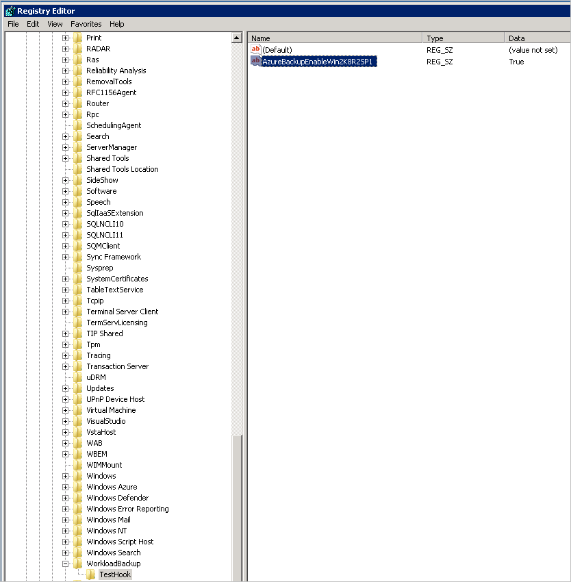
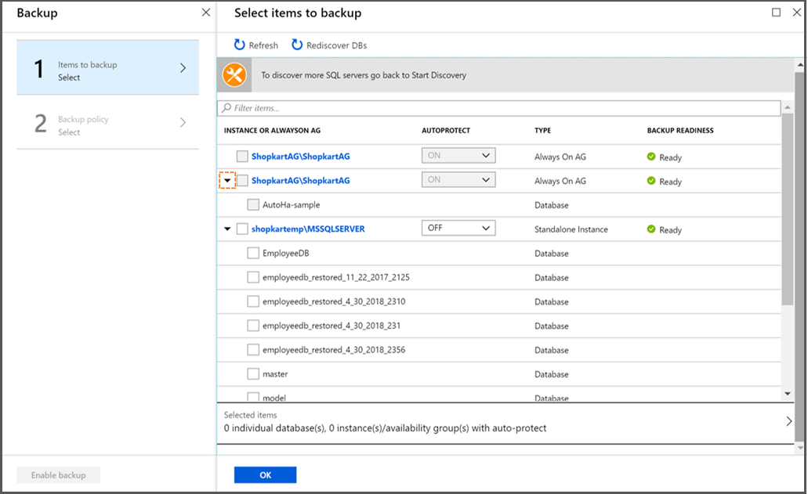

# Back up SQL Server databases in Azure VMs

SQL Server databases are critical workloads that require a low recovery-point objective (RPO) and long-term retention. You can back up SQL Server databases running on Azure virtual machines (VMs) by using [Azure Backup](backup-overview.md).

This article shows how to back up a SQL Server database that's running on an Azure VM to an Azure Backup Recovery Services vault.

In this article, you'll learn how to:

> [!div class="checklist"]
> * Create and configure a vault.
> * Discover databases and set up backups.
> * Set up auto-protection for databases.


## Prerequisites

Before you back up a SQL Server database, check the following criteria:

1. Identify or create a [Recovery Services vault](backup-sql-server-database-azure-vms.md#create-a-recovery-services-vault) in the same region or locale as the VM hosting the SQL Server instance.
2. Verify that the VM has [network connectivity](backup-sql-server-database-azure-vms.md#establish-network-connectivity).
3. Make sure that the SQL Server databases follow the [database naming guidelines for Azure Backup](#database-naming-guidelines-for-azure-backup).
4. Specifically for SQL 2008 and 2008 R2, [add registry key](#add-registry-key-to-enable-registration) to enable server registration. This step will be not be required when the feature is generally available.
5. Check that you don't have any other backup solutions enabled for the database. Disable all other SQL Server backups before you back up the database.

> [!NOTE]
> You can enable Azure Backup for an Azure VM and also for a SQL Server database running on the VM without conflict.


### Establish network connectivity

For all operations, a SQL Server VM requires connectivity to Azure public IP addresses. VM operations (database discovery, configure backups, schedule backups, restore recovery points, and so on) fail without connectivity to Azure public IP addresses.

Establish connectivity by using one of the following options:

- **Allow the Azure datacenter IP ranges**. This option allows [IP ranges](https://www.microsoft.com/download/details.aspx?id=41653) in the download. To access a network security group (NSG), use the Set-AzureNetworkSecurityRule cmdlet. If you're safe recipients list only region-specific IPs, you'll also need to update the safe recipients list the Azure Active Directory (Azure AD) service tag to enable authentication.

- **Allow access using NSG tags**. If you use NSGs to restrict connectivity, this option adds a rule to your NSG that allows outbound access to Azure Backup by using the AzureBackup tag. In addition to this tag, you'll also need corresponding [rules](https://docs.microsoft.com/azure/virtual-network/security-overview#service-tags) for Azure AD and Azure Storage to allow connectivity for authentication and data transfer. The AzureBackup tag is currently available on PowerShell only. To create a rule by using the AzureBackup tag:

    - Add Azure account credentials and update the national clouds<br/>
    `Add-AzureRmAccount`

    - Select the NSG subscription<br/>
    `Select-AzureRmSubscription "<Subscription Id>"`

     - Select the NSG<br/>
    `$nsg = Get-AzureRmNetworkSecurityGroup -Name "<NSG name>" -ResourceGroupName "<NSG resource group name>"`

    - Add allow outbound rule for Azure Backup service tag<br/>
    `Add-AzureRmNetworkSecurityRuleConfig -NetworkSecurityGroup $nsg -Name "AzureBackupAllowOutbound" -Access Allow -Protocol * -Direction Outbound -Priority <priority> -SourceAddressPrefix * -SourcePortRange * -DestinationAddressPrefix "AzureBackup" -DestinationPortRange 443 -Description "Allow outbound traffic to Azure Backup service"`

  - Save the NSG<br/>
    `Set-AzureRmNetworkSecurityGroup -NetworkSecurityGroup $nsg`
- **Allow access by using Azure Firewall tags**. If you're using Azure Firewall, create an application rule by using the AzureBackup [FQDN tag](https://docs.microsoft.com/azure/firewall/fqdn-tags). This allows outbound access to Azure Backup.
- **Deploy an HTTP proxy server to route traffic**. When you back up a SQL Server database on an Azure VM, the backup extension on the VM uses the HTTPS APIs to send management commands to Azure Backup and data to Azure Storage. The backup extension also uses Azure AD for authentication. Route the backup extension traffic for these three services through the HTTP proxy. The extensions are the only component that's configured for access to the public internet.

Connectivity options include the following advantages and disadvantages:

**Option** | **Advantages** | **Disadvantages**
--- | --- | ---
Allow IP ranges | No additional costs | Complex to manage because the IP address ranges change over time <br/><br/> Provides access to the whole of Azure, not just Azure Storage
Use NSG service tags | Easier to manage as range changes are automatically merged <br/><br/> No additional costs <br/><br/> | Can be used with NSGs only <br/><br/> Provides access to the entire service
Use Azure Firewall FQDN tags | Easier to manage as the required FQDNs are automatically managed | Can be used with Azure Firewall only
Use an HTTP proxy | Granular control in the proxy over the storage URLs is allowed <br/><br/> Single point of internet access to VMs <br/><br/> Not subject to Azure IP address changes | Additional costs to run a VM with the proxy software

### Database naming guidelines for Azure Backup

Avoid using the following elements in database names:

  * Trailing and leading spaces
  * Trailing exclamation marks (!)
  * Closing square brackets (])
  * Semicolon ';'
  * Forward slash '/'

Aliasing is available for unsupported characters, but we recommend avoiding them. For more information, see [Understanding the Table Service Data Model](https://docs.microsoft.com/rest/api/storageservices/Understanding-the-Table-Service-Data-Model?redirectedfrom=MSDN).

### Add registry key to enable registration

1. Open Regedit
2. Create the Registry Directory Path: HKEY_LOCAL_MACHINE\SOFTWARE\Microsoft\WorkloadBackup\TestHook (you will need to create the 'Key' TestHook under WorkloadBackup which in turn needs to be created under Microsoft).
3. Under the Registry Directory Path, create a new 'string value' with the string name **AzureBackupEnableWin2K8R2SP1** and value: **True**

    

Alternatively, you can automate this step by running .reg file with the following command:

```csharp
Windows Registry Editor Version 5.00

[HKEY_LOCAL_MACHINE\SOFTWARE\Microsoft\WorkloadBackup\TestHook]
"AzureBackupEnableWin2K8R2SP1"="True"
```

[!INCLUDE [How to create a Recovery Services vault](../../includes/backup-create-rs-vault.md)]

## Discover SQL Server databases

How to discover databases running on a VM:

1. In the [Azure portal](https://portal.azure.com), open the Recovery Services vault you use to back up the database.

2. In the **Recovery Services vault** dashboard, select **Backup**.

   

3. In **Backup Goal**, set **Where is your workload running?** to **Azure**.

4. In **What do you want to backup**, select **SQL Server in Azure VM**.

    

5. In **Backup Goal** > **Discover DBs in VMs**, select **Start Discovery** to search for unprotected VMs in the subscription. This search can take a while, depending on the number of unprotected VMs in the subscription.

   - Unprotected VMs should appear in the list after discovery, listed by name and resource group.
   - If a VM isn't listed as you expect, see whether it's already backed up in a vault.
   - Multiple VMs can have the same name, but they'll belong to different resource groups.

     

6. In the VM list, select the VM running the SQL Server database > **Discover DBs**.

7. Track database discovery in **Notifications**. The time required for this action depends on the number of VM databases. When the selected databases are discovered, a success message appears.

    

8. Azure Backup discovers all SQL Server databases on the VM. During discovery, the following elements occur in the background:

    - Azure Backup registers the VM with the vault for workload backup. All databases on the registered VM can be backed up to this vault only.
    - Azure Backup installs the AzureBackupWindowsWorkload extension on the VM. No agent is installed on a SQL database.
    - Azure Backup creates the service account NT Service\AzureWLBackupPluginSvc on the VM.
      - All backup and restore operations use the service account.
      - NT Service\AzureWLBackupPluginSvc requires SQL sysadmin permissions. All SQL Server VMs created in the Marketplace come with the SqlIaaSExtension installed. The AzureBackupWindowsWorkload extension uses the SQLIaaSExtension to automatically get the required permissions.
    - If you didn't create the VM from the Marketplace or if you are on SQL 2008 and 2008 R2, the VM may not have the SqlIaaSExtension installed, and the discovery operation fails with the error message UserErrorSQLNoSysAdminMembership. To fix this issue, follow the instructions under [Set VM permissions](backup-azure-sql-database.md#set-vm-permissions).

        

## Configure backup  

1. In **Backup Goal** > **Step 2: Configure Backup**, select **Configure Backup**.

   

2. In **Select items to backup**, you see all the registered availability groups and standalone SQL Server instances. Select the arrow to the left of a row to expand the list of all the unprotected databases in that instance or Always On availability group.  

    

3. Choose all the databases you want to protect, and then select **OK**.

   

   To optimize backup loads, Azure Backup sets a maximum number of databases in one backup job to 50.

     * To protect more than 50 databases, configure multiple backups.
     * To enable [](#enable-auto-protection) the entire instance or the Always On availability group. In the **AUTOPROTECT** drop-down list, select  **ON**, and then select **OK**.

    > [!NOTE]
    > The [auto-protection](#enable-auto-protection) feature not only enables protection on all the existing databases at once, but also automatically protects any new databases added to that instance or the availability group.  

4. Select **OK** to open **Backup policy**.

    

5. In **Backup policy**, choose a policy and then select **OK**.

   - Select the default policy as HourlyLogBackup.
   - Choose an existing backup policy previously created for SQL.
   - Define a new policy based on your RPO and retention range.

     

6. In **Backup**, select **Enable backup**.

    

7. Track the configuration progress in the **Notifications** area of the portal.

    

### Create a backup policy

A backup policy defines when backups are taken and how long they're retained.

- A policy is created at the vault level.
- Multiple vaults can use the same backup policy, but you must apply the backup policy to each vault.
- When you create a backup policy, a daily full backup is the default.
- You can add a differential backup, but only if you configure full backups to occur weekly.
- Learn about [different types of backup policies](backup-architecture.md#sql-server-backup-types).

To create a backup policy:

1. In the vault, select **Backup policies** > **Add**.
2. In **Add**, select **SQL Server in Azure VM** to define the policy type.

   

3. In **Policy name**, enter a name for the new policy.
4. In **Full Backup policy**, select a **Backup Frequency**. Choose either **Daily** or **Weekly**.

   - For **Daily**, select the hour and time zone when the backup job begins.
   - For **Weekly**, select the day of the week, hour, and time zone when the backup job begins.
   - Run a full backup, because you can't turn off the **Full Backup** option.
   - Select **Full Backup** to view the policy.
   - You can't create differential backups for daily full backups.

       

5. In **RETENTION RANGE**, all options are selected by default. Clear any retention range limits that you don't want, and then set the intervals to use.

    - Minimum retention period for any type of backup (full, differential, and log) is seven days.
    - Recovery points are tagged for retention based on their retention range. For example, if you select a daily full backup, only one full backup is triggered each day.
    - The backup for a specific day is tagged and retained based on the weekly retention range and the weekly retention setting.
    - Monthly and yearly retention ranges behave in a similar way.

       

6. In the **Full Backup policy** menu, select **OK** to accept the settings.
7. To add a differential backup policy, select **Differential Backup**.

   
   

8. In **Differential Backup policy**, select **Enable** to open the frequency and retention controls.

    - You can trigger only one differential backup per day.
    - Differential backups can be retained for a maximum of 180 days. For longer retention, use full backups.

9. Select **OK** to save the policy and return to the main **Backup policy** menu.

10. To add a transactional log backup policy, select **Log Backup**.
11. In **Log Backup**, select **Enable**, and then set the frequency and retention controls. Log backups can occur as often as every 15 minutes and can be retained for up to 35 days.
12. Select **OK** to save the policy and return to the main **Backup policy** menu.

    

13. On the **Backup policy** menu, choose whether to enable **SQL Backup Compression**.
    - Compression is disabled by default.
    - On the back end, Azure Backup uses SQL native backup compression.

14. After you complete the edits to the backup policy, select **OK**.


### Modify policy
Modify policy to change backup frequency or retention range.

> [!NOTE]
> Any change in the retention period will be applied retrospectively to all the older recovery points besides the new ones.

In the vault dashboard, go to **Manage** > **Backup Policies** and choose the policy you want to edit.

  


## Enable auto-protection  

You can enable auto-protection to automatically back up all existing and future databases to a standalone SQL Server instance or to an Always On availability group.

- There's no limit on the number of databases you can select for auto-protection at one time.
- You can't selectively protect or exclude databases from protection in an instance at the time you enable auto-protection.
- If your instance already includes some protected databases, they'll remain protected under their respective policies even after you turn on auto-protection. All unprotected databases added later will have only a single policy that you define at the time of enabling auto-protection, listed under **Configure Backup**. However, you can change the policy associated with an auto-protected database later.  

To enable auto-protection:

  1. In **Items to backup**, select the instance for which you want to enable auto-protection.
  2. Select the drop-down list under **AUTOPROTECT**, choose **ON**, and then select **OK**.

      

  3. Backup is configured for all the databases together and can be tracked in **Backup Jobs**.

If you need to disable auto-protection, select the instance name under **Configure Backup**, and then select **Disable Autoprotect** for the instance. All databases will continue to be backed up, but future databases won't be automatically protected.


 
## Next steps

Learn how to:

- [Restore backed-up SQL Server databases](restore-sql-database-azure-vm.md)
- [Manage backed-up SQL Server databases](manage-monitor-sql-database-backup.md)
